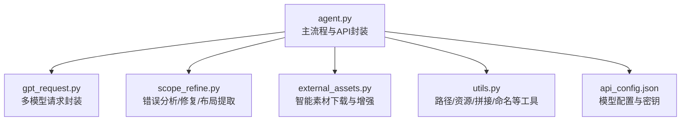
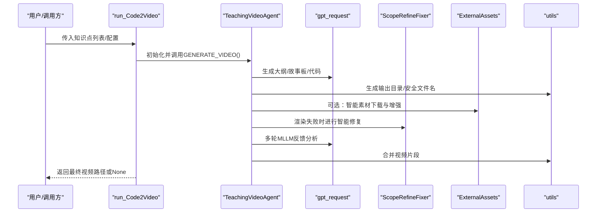
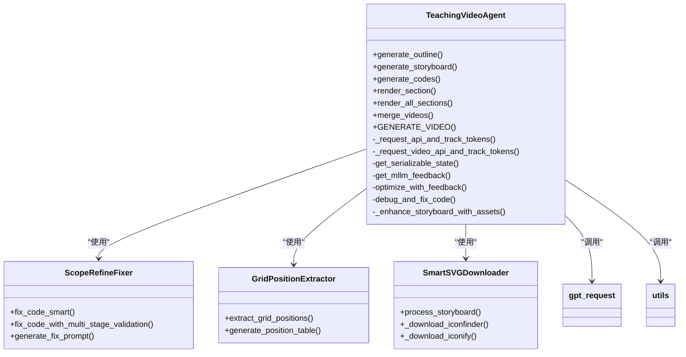

# API参考

<cite>
**本文引用的文件**
- [agent.py](file://src/agent.py)
- [utils.py](file://src/utils.py)
- [gpt_request.py](file://src/gpt_request.py)
- [scope_refine.py](file://src/scope_refine.py)
- [external_assets.py](file://src/external_assets.py)
- [api_config.json](file://src/api_config.json)
</cite>

## 目录
1. [简介](#简介)
2. [项目结构](#项目结构)
3. [核心组件](#核心组件)
4. [架构总览](#架构总览)
5. [详细组件分析](#详细组件分析)
6. [依赖关系分析](#依赖关系分析)
7. [性能与并发特性](#性能与并发特性)
8. [故障排查指南](#故障排查指南)
9. [结论](#结论)
10. [附录：API调用示例与最佳实践](#附录api调用示例与最佳实践)

## 简介
本参考文档面向希望将Code2Video集成到自身系统中的开发者，聚焦于公共编程接口的权威说明。重点覆盖以下内容：
- TeachingVideoAgent类的构造函数、run_Code2Video方法及其他公共接口的参数、返回值与异常处理机制
- RunConfig数据类的全部可配置字段及默认值
- utils.py中关键工具函数的功能与使用方式（文件路径处理、日志记录、状态管理等）
- 每个API的调用示例（同步与异步使用模式）
- 类之间的依赖关系与调用时序
- 接口稳定性说明、版本兼容性信息与未来变更预期
- 集成指导建议

## 项目结构
该项目采用“功能模块化”组织方式，核心流程由agent.py驱动，通过外部请求封装（gpt_request.py）、代码修复与布局提取（scope_refine.py）、资源下载与增强（external_assets.py）以及通用工具函数（utils.py）协同完成。

图表来源
- [agent.py](file://src/agent.py#L1-L120)
- [gpt_request.py](file://src/gpt_request.py#L1-L120)
- [scope_refine.py](file://src/scope_refine.py#L1-L120)
- [external_assets.py](file://src/external_assets.py#L1-L60)
- [utils.py](file://src/utils.py#L1-L60)
- [api_config.json](file://src/api_config.json#L1-L40)

章节来源
- [agent.py](file://src/agent.py#L1-L120)
- [gpt_request.py](file://src/gpt_request.py#L1-L120)
- [scope_refine.py](file://src/scope_refine.py#L1-L120)
- [external_assets.py](file://src/external_assets.py#L1-L60)
- [utils.py](file://src/utils.py#L1-L60)
- [api_config.json](file://src/api_config.json#L1-L40)

## 核心组件
- TeachingVideoAgent：视频生成流水线的核心执行器，负责大纲生成、故事板生成、代码生成、渲染、反馈优化与视频合并。
- RunConfig：运行期配置数据类，集中定义所有可调参数与默认值。
- 工具函数（utils.py）：路径安全转换、输出目录生成、资源监控、ffmpeg拼接、文件名安全化等。
- 请求封装（gpt_request.py）：统一的多模型请求接口，支持重试、令牌用量统计与日志追踪。
- 代码修复与布局（scope_refine.py）：基于错误分析与提示的智能修复、网格位置提取与修改。
- 资源下载与增强（external_assets.py）：基于LLM的素材需求分析与下载，并对动画描述进行增强。

章节来源
- [agent.py](file://src/agent.py#L43-L115)
- [utils.py](file://src/utils.py#L1-L120)
- [gpt_request.py](file://src/gpt_request.py#L1-L120)
- [scope_refine.py](file://src/scope_refine.py#L250-L360)
- [external_assets.py](file://src/external_assets.py#L1-L60)

## 架构总览
下图展示了从高层API到内部组件的调用关系与时序要点。

图表来源
- [agent.py](file://src/agent.py#L703-L740)
- [gpt_request.py](file://src/gpt_request.py#L420-L480)
- [scope_refine.py](file://src/scope_refine.py#L483-L573)
- [external_assets.py](file://src/external_assets.py#L194-L219)
- [utils.py](file://src/utils.py#L176-L206)

## 详细组件分析

### TeachingVideoAgent 类
TeachingVideoAgent是视频生成流水线的核心类，提供从“知识主题”到“完整视频”的端到端能力。其公共接口包括：

- 构造函数
  - 参数
    - idx: int，知识主题索引
    - knowledge_point: str，学习主题名称
    - folder: str，默认"CASES"，输出根目录前缀
    - cfg: RunConfig，运行配置对象
  - 行为
    - 初始化运行参数（反馈开关、资产开关、API回调、最大尝试次数等）
    - 创建输出目录与资源目录
    - 初始化ScopeRefineFixer与GridPositionExtractor
    - 加载知识映射与参考图
    - 初始化数据结构（大纲、故事板、分段代码、视频路径、反馈等）
    - 统计令牌用量
  - 异常
    - 若未按顺序生成大纲/故事板即调用后续步骤，会抛出明确的错误提示
    - API请求失败达到最大重试次数后抛出异常
    - 合并视频阶段若无可用视频文件则抛出异常

- 公共方法
  - generate_outline() -> TeachingOutline
    - 功能：根据主题生成教学大纲
    - 返回：TeachingOutline对象
    - 异常：多次格式校验失败时抛出异常
  - generate_storyboard() -> List[Section]
    - 功能：基于大纲生成故事板；可选启用资产增强
    - 返回：Section对象列表
    - 异常：未先生成大纲时报错
  - generate_codes() -> Dict[str, str]
    - 功能：并行生成各分段的Manim代码
    - 返回：分段ID到代码字符串的映射
    - 异常：部分分段生成失败时记录错误但不中断整体流程
  - render_section(section: Section) -> bool
    - 功能：单分段渲染与调试修复；可选MLLM反馈优化
    - 返回：是否成功渲染
    - 异常：渲染过程异常时记录并返回False
  - render_all_sections(max_workers: int = 6) -> Dict[str, str]
    - 功能：并行渲染所有分段；使用进程池隔离渲染环境
    - 返回：分段ID到视频路径的映射
    - 异常：进程提交/执行异常时记录并继续
  - merge_videos(output_filename: str = None) -> str
    - 功能：拼接所有分段视频
    - 返回：最终视频文件路径
    - 异常：ffmpeg失败或无视频文件时返回None
  - GENERATE_VIDEO() -> str
    - 功能：串联全流程（大纲→故事板→代码→渲染→合并），并打印成功/失败信息
    - 返回：最终视频路径或None
    - 异常：流程中任一步骤异常时捕获并返回None

- 内部辅助
  - _request_api_and_track_tokens(prompt, max_tokens=10000)
    - 功能：封装API请求并累计令牌用量
  - _request_video_api_and_track_tokens(prompt, video_path)
    - 功能：封装视频+图片+文本的多模态请求并累计令牌用量
  - get_serializable_state() -> Dict
    - 功能：返回可序列化的Agent状态，用于子进程渲染
  - get_mllm_feedback(section, video_path, round_number) -> VideoFeedback
    - 功能：基于网格布局提取与多模态分析生成反馈
  - optimize_with_feedback(section, feedback) -> bool
    - 功能：根据反馈重新生成代码并再次渲染
  - debug_and_fix_code(section_id, max_fix_attempts) -> bool
    - 功能：本地渲染失败时，使用ScopeRefineFixer进行智能修复
  - _enhance_storyboard_with_assets(storyboard_data) -> dict
    - 功能：调用外部资产增强逻辑

- 异常处理机制
  - 大量try/except包裹关键步骤，避免单点崩溃
  - 对API请求设置最大重试次数与指数退避
  - 对ffmpeg、子进程、文件系统操作进行显式检查与错误回退
  - 对JSON解析失败提供降级策略（如关键字匹配）

章节来源
- [agent.py](file://src/agent.py#L57-L115)
- [agent.py](file://src/agent.py#L138-L188)
- [agent.py](file://src/agent.py#L190-L272)
- [agent.py](file://src/agent.py#L274-L355)
- [agent.py](file://src/agent.py#L356-L401)
- [agent.py](file://src/agent.py#L402-L460)
- [agent.py](file://src/agent.py#L461-L506)
- [agent.py](file://src/agent.py#L507-L581)
- [agent.py](file://src/agent.py#L582-L666)
- [agent.py](file://src/agent.py#L667-L702)
- [agent.py](file://src/agent.py#L703-L719)

### RunConfig 数据类
RunConfig集中定义了TeachingVideoAgent的可配置项与默认值，便于在不同场景下灵活切换。

- 字段与默认值
  - use_feedback: bool = True
  - use_assets: bool = True
  - api: Callable = None
  - feedback_rounds: int = 2
  - iconfinder_api_key: str = ""
  - max_code_token_length: int = 10000
  - max_fix_bug_tries: int = 10
  - max_regenerate_tries: int = 10
  - max_feedback_gen_code_tries: int = 3
  - max_mllm_fix_bugs_tries: int = 3

- 使用建议
  - 在批量任务中，可通过调整max_regenerate_tries与max_fix_bug_tries平衡质量与耗时
  - 开启use_feedback可提升视频布局合理性，但会增加API调用与时间成本
  - use_assets开启时需提供iconfinder_api_key以启用素材下载

章节来源
- [agent.py](file://src/agent.py#L43-L56)

### utils.py 关键工具函数
- extract_json_from_markdown(text) -> str
  - 功能：从Markdown代码块中抽取JSON字符串
- extract_answer_from_response(response) -> str
  - 功能：统一从不同模型响应中抽取文本内容
- fix_png_path(code_str, assets_dir) -> str
  - 功能：修正相对PNG路径，确保资源位于assets目录内
- get_optimal_workers() -> int
  - 功能：根据CPU核数自适应计算最优并行渲染进程数
- monitor_system_resources()
  - 功能：监控CPU与内存使用率，打印告警
- replace_base_class(code: str, new_class_def: str) -> str
  - 功能：替换或插入TeachingScene基类定义
- save_code_to_file(code: str, filename: str = "scene.py") -> None
  - 功能：保存代码到文件
- run_manim_script(filename: str, scene_name: str, output_dir: str = "videos") -> str
  - 功能：调用manim渲染视频，失败抛出异常
- stitch_videos(video_files: List[str], output_path: str = "final_output.mp4") -> None
  - 功能：使用ffmpeg拼接多个视频
- topic_to_safe_name(knowledge_point) -> str
  - 功能：将主题名转换为安全文件名
- get_output_dir(idx, knowledge_point, base_dir, get_safe_name=False) -> Path
  - 功能：生成输出目录路径
- eva_video_list(knowledge_points, base_dir) -> List[Dict]
  - 功能：生成视频清单（路径与主题）

章节来源
- [utils.py](file://src/utils.py#L11-L28)
- [utils.py](file://src/utils.py#L19-L28)
- [utils.py](file://src/utils.py#L31-L51)
- [utils.py](file://src/utils.py#L53-L71)
- [utils.py](file://src/utils.py#L73-L89)
- [utils.py](file://src/utils.py#L91-L129)
- [utils.py](file://src/utils.py#L132-L161)
- [utils.py](file://src/utils.py#L163-L174)
- [utils.py](file://src/utils.py#L176-L183)
- [utils.py](file://src/utils.py#L185-L193)
- [utils.py](file://src/utils.py#L195-L206)

### gpt_request.py 请求封装
- 提供多种模型请求函数（Gemini、Claude、GPT-4o、GPT-o4mini、GPT-5等）
- 统一支持：
  - 日志追踪ID（X-TT-LOGID）
  - 最大重试次数与指数退避
  - 令牌用量统计（*_token系列）
- 常见异常
  - 网络/服务端错误触发重试直至阈值
  - 文件不存在（视频/图片）抛出异常

章节来源
- [gpt_request.py](file://src/gpt_request.py#L1-L120)
- [gpt_request.py](file://src/gpt_request.py#L124-L274)
- [gpt_request.py](file://src/gpt_request.py#L276-L366)
- [gpt_request.py](file://src/gpt_request.py#L368-L480)
- [gpt_request.py](file://src/gpt_request.py#L482-L614)
- [gpt_request.py](file://src/gpt_request.py#L616-L740)
- [gpt_request.py](file://src/gpt_request.py#L742-L803)

### scope_refine.py 错误分析与修复
- ManimCodeErrorAnalyzer：解析错误类型、定位行号、提取上下文、给出修复建议
- ScopeRefineFixer：多阶段修复策略（聚焦修复→全面审查→完全重写），结合LLM生成修复代码
- GridPositionExtractor：从代码中提取place_at_grid/place_in_area调用，生成表格供MLLM分析
- GridCodeModifier：根据MLLM反馈精准修改指定行的网格布局调用

章节来源
- [scope_refine.py](file://src/scope_refine.py#L1-L120)
- [scope_refine.py](file://src/scope_refine.py#L250-L360)
- [scope_refine.py](file://src/scope_refine.py#L360-L573)
- [scope_refine.py](file://src/scope_refine.py#L671-L751)
- [scope_refine.py](file://src/scope_refine.py#L753-L803)

### external_assets.py 资源下载与增强
- SmartSVGDownloader：分析所需元素→本地缓存命中→缺失元素下载→构建增强提示→调用LLM更新动画描述
- process_storyboard_with_assets：对外暴露的增强入口

章节来源
- [external_assets.py](file://src/external_assets.py#L1-L120)
- [external_assets.py](file://src/external_assets.py#L120-L200)
- [external_assets.py](file://src/external_assets.py#L194-L219)

## 依赖关系分析
- TeachingVideoAgent依赖
  - gpt_request：文本/多模态请求
  - scope_refine：错误分析与修复
  - external_assets：素材下载与增强
  - utils：路径/资源/拼接/命名
- run_Code2Video依赖TeachingVideoAgent并负责批处理与并行调度
- gpt_request依赖api_config.json读取模型配置

图表来源
- [agent.py](file://src/agent.py#L57-L115)
- [scope_refine.py](file://src/scope_refine.py#L250-L360)
- [scope_refine.py](file://src/scope_refine.py#L671-L751)
- [external_assets.py](file://src/external_assets.py#L1-L120)
- [gpt_request.py](file://src/gpt_request.py#L1-L120)
- [utils.py](file://src/utils.py#L176-L206)

## 性能与并发特性
- 并发策略
  - 代码生成：ThreadPoolExecutor（线程池）并行生成各分段代码
  - 分段渲染：ProcessPoolExecutor（进程池）并行渲染，隔离渲染环境
  - 最优工作进程数：get_optimal_workers()根据CPU核数动态计算，上限16
- 资源监控
  - monitor_system_resources()周期性打印CPU/内存使用率，高负载时发出告警
- 令牌用量统计
  - TeachingVideoAgent维护prompt_tokens/completion_tokens/total_tokens累加
- I/O与外部依赖
  - ffmpeg拼接视频；manim渲染视频；网络请求（iconfinder、多模型API）
- 性能建议
  - 批量任务中合理设置batch_size与max_workers，避免资源争用
  - 在高并发场景下适当降低max_regenerate_tries与max_fix_bug_tries以控制成本
  - 启用use_assets时确保iconfinder_api_key有效，减少下载失败导致的回退

章节来源
- [agent.py](file://src/agent.py#L507-L581)
- [agent.py](file://src/agent.py#L582-L666)
- [utils.py](file://src/utils.py#L53-L71)
- [utils.py](file://src/utils.py#L73-L89)

## 故障排查指南
- 常见问题与定位
  - API请求失败：检查api_config.json配置、网络连通性与重试日志
  - 视频渲染失败：查看debug_and_fix_code的错误信息；必要时启用ScopeRefineFixer自动修复
  - ffmpeg拼接失败：确认video_list.txt与输入视频路径正确
  - 资源下载失败：检查iconfinder_api_key与网络权限
- 建议排查步骤
  - 打开use_feedback与use_assets观察效果与成本变化
  - 逐步降低max_regenerate_tries/max_fix_bug_tries验证稳定性
  - 使用monitor_system_resources监控系统负载
  - 查看TeachingVideoAgent的token_usage统计评估成本

章节来源
- [agent.py](file://src/agent.py#L356-L401)
- [agent.py](file://src/agent.py#L667-L702)
- [gpt_request.py](file://src/gpt_request.py#L124-L274)
- [external_assets.py](file://src/external_assets.py#L138-L183)
- [utils.py](file://src/utils.py#L73-L89)

## 结论
TeachingVideoAgent提供了从“主题到视频”的完整自动化流水线，具备良好的扩展性与容错能力。通过RunConfig与utils.py提供的工具函数，开发者可以灵活地在不同部署环境下进行参数调优与集成。建议在生产环境中：
- 明确API模型与令牌用量预算
- 合理设置反馈与资产增强策略
- 使用并行与资源监控保障稳定性
- 建立日志与告警体系，持续观测性能与成本

## 附录：API调用示例与最佳实践

### run_Code2Video 公共接口
- 函数签名与参数
  - knowledge_points: List[str]，知识主题列表
  - folder_path: Path，输出根目录
  - parallel: bool，默认True，是否并行批处理
  - batch_size: int，默认3，每批知识点数量
  - max_workers: int，默认8，批处理并发度
  - cfg: RunConfig，默认RunConfig()，运行配置
- 返回值
  - 批处理结果列表，包含(主题, 视频路径, 耗时分钟, 令牌用量)
- 异常处理
  - 单个知识点处理异常会被捕获并记录，不影响其他批次
- 使用模式
  - 同步：设置parallel=False，逐个处理
  - 异步：设置parallel=True，使用批处理与进程池并行

章节来源
- [agent.py](file://src/agent.py#L760-L800)
- [agent.py](file://src/agent.py#L800-L913)

### TeachingVideoAgent 公共接口
- 构造函数 TeachingVideoAgent(idx, knowledge_point, folder="CASES", cfg: RunConfig)
- 公共方法
  - generate_outline() -> TeachingOutline
  - generate_storyboard() -> List[Section]
  - generate_codes() -> Dict[str, str]
  - render_section(section: Section) -> bool
  - render_all_sections(max_workers: int = 6) -> Dict[str, str]
  - merge_videos(output_filename: str = None) -> str
  - GENERATE_VIDEO() -> str

章节来源
- [agent.py](file://src/agent.py#L57-L115)
- [agent.py](file://src/agent.py#L138-L188)
- [agent.py](file://src/agent.py#L190-L272)
- [agent.py](file://src/agent.py#L507-L581)
- [agent.py](file://src/agent.py#L582-L666)
- [agent.py](file://src/agent.py#L667-L702)
- [agent.py](file://src/agent.py#L703-L719)

### RunConfig 字段说明
- use_feedback: 是否启用MLLM反馈优化
- use_assets: 是否启用智能素材下载与增强
- api: API回调函数（如request_gpt41_token等）
- feedback_rounds: MLLM反馈轮次
- iconfinder_api_key: 素材下载API密钥
- max_code_token_length: 代码生成最大token长度
- max_fix_bug_tries: ScopeRefine修复最大尝试次数
- max_regenerate_tries: 代码/大纲/故事板再生最大尝试次数
- max_feedback_gen_code_tries: 基于反馈重新生成代码的最大尝试次数
- max_mllm_fix_bugs_tries: MLLM反馈优化后修复的最大尝试次数

章节来源
- [agent.py](file://src/agent.py#L43-L56)

### utils.py 工具函数使用建议
- 路径与命名
  - 使用topic_to_safe_name与get_output_dir生成安全且一致的文件名与目录
- 渲染与拼接
  - run_manim_script用于快速验证；stitch_videos用于批量拼接
- 资源与并发
  - get_optimal_workers与monitor_system_resources帮助在高负载下稳定运行
- 安全与兼容
  - fix_png_path确保资源路径正确；replace_base_class保证基类定义一致

章节来源
- [utils.py](file://src/utils.py#L176-L206)
- [utils.py](file://src/utils.py#L132-L161)
- [utils.py](file://src/utils.py#L163-L174)
- [utils.py](file://src/utils.py#L31-L51)
- [utils.py](file://src/utils.py#L91-L129)
- [utils.py](file://src/utils.py#L53-L71)
- [utils.py](file://src/utils.py#L73-L89)

### 版本兼容性与稳定性说明
- 模型兼容
  - gpt_request.py支持多模型接口，具体兼容性取决于各平台SDK与API版本
- Manim版本
  - ScopeRefineFixer固定提及Manim Community Edition v0.19.0，建议在相同版本环境中运行以获得最佳兼容性
- 配置文件
  - api_config.json为外部配置，建议在部署时注入真实密钥与endpoint
- 未来变更预期
  - 反馈优化与智能修复策略可能随模型能力演进而调整
  - 并发与资源监控策略可根据硬件条件动态优化

章节来源
- [scope_refine.py](file://src/scope_refine.py#L483-L573)
- [gpt_request.py](file://src/gpt_request.py#L1-L120)
- [api_config.json](file://src/api_config.json#L1-L40)

### 集成指导建议
- 快速集成步骤
  - 准备api_config.json并注入各模型密钥
  - 构造RunConfig并选择合适的API回调函数
  - 调用run_Code2Video传入知识主题列表与输出目录
  - 如需自定义流程，直接实例化TeachingVideoAgent并按需调用各步骤
- 生产部署建议
  - 使用进程池并行渲染，合理设置max_workers
  - 启用use_feedback与use_assets以提升质量，同时关注成本
  - 建立日志与告警，监控系统资源与令牌用量
  - 对外暴露HTTP接口时，将TeachingVideoAgent封装为服务，支持异步任务队列

章节来源
- [agent.py](file://src/agent.py#L760-L800)
- [agent.py](file://src/agent.py#L800-L913)
- [gpt_request.py](file://src/gpt_request.py#L1-L120)
- [utils.py](file://src/utils.py#L53-L71)