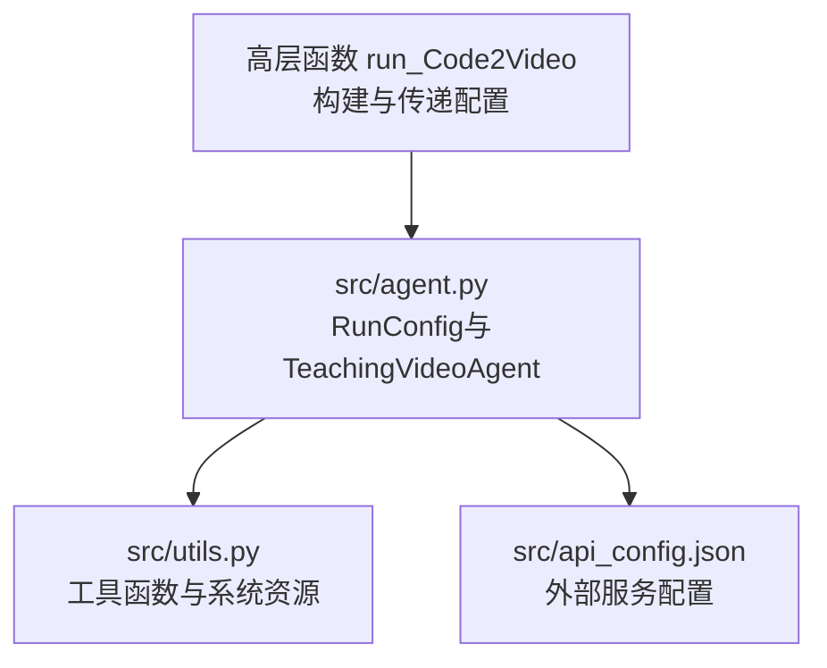
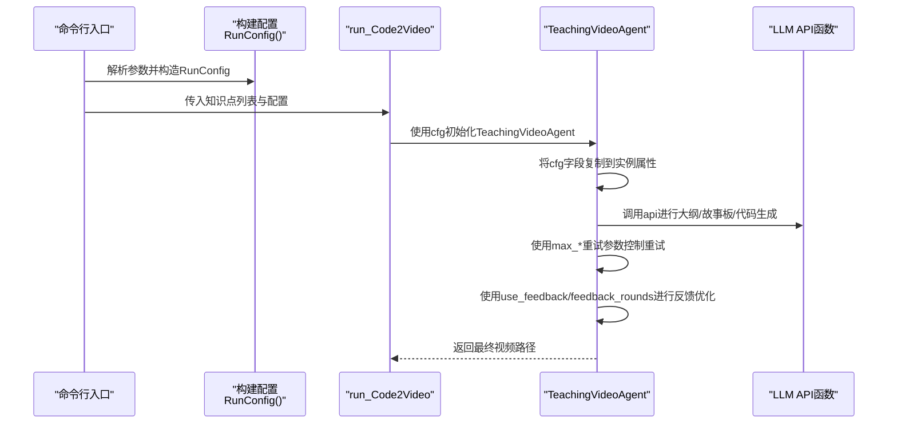
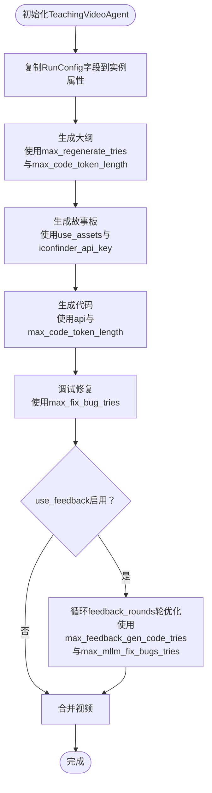
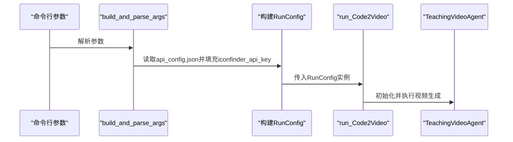
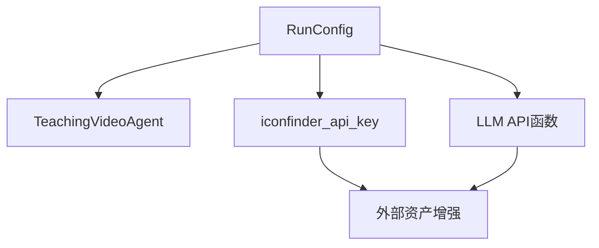

# RunConfig配置类

<cite>
**本文引用的文件**
- [src/agent.py](file://src/agent.py)
- [src/utils.py](file://src/utils.py)
- [src/api_config.json](file://src/api_config.json)
</cite>

## 目录
1. [简介](#简介)
2. [项目结构](#项目结构)
3. [核心组件](#核心组件)
4. [架构总览](#架构总览)
5. [详细组件分析](#详细组件分析)
6. [依赖关系分析](#依赖关系分析)
7. [性能考量](#性能考量)
8. [故障排查指南](#故障排查指南)
9. [结论](#结论)
10. [附录](#附录)

## 简介
本文件为Code2Video项目中的运行时配置类RunConfig提供完整数据模型文档。RunConfig采用Python dataclass实现，作为控制视频生成流程的核心配置中心，集中管理与API调用、资源增强、反馈优化、重试策略等相关的参数。本文将逐项说明所有可配置字段的数据类型、默认值、作用范围及对系统行为的影响，并阐述其在TeachingVideoAgent中的使用方式，以及在高层函数run_Code2Video中的自定义配置方法。最后给出配置最佳实践，帮助用户在API成本与生成质量之间取得平衡。

## 项目结构
- 核心配置类位于src/agent.py中，包含RunConfig数据类及其在TeachingVideoAgent中的使用。
- 工具函数与系统资源监控位于src/utils.py中，用于支撑渲染、拼接、路径处理等辅助能力。
- 外部服务密钥与配置位于src/api_config.json中，包括图标服务等第三方服务的密钥来源。

图表来源
- [src/agent.py](file://src/agent.py#L43-L55)
- [src/agent.py](file://src/agent.py#L722-L913)
- [src/utils.py](file://src/utils.py#L1-L210)
- [src/api_config.json](file://src/api_config.json#L1-L40)

章节来源
- [src/agent.py](file://src/agent.py#L43-L55)
- [src/agent.py](file://src/agent.py#L722-L913)
- [src/utils.py](file://src/utils.py#L1-L210)
- [src/api_config.json](file://src/api_config.json#L1-L40)

## 核心组件
RunConfig是控制视频生成全流程的关键配置对象，字段如下：
- use_feedback: 布尔型，默认True；控制是否启用多模态反馈优化流程（MLLM布局分析与代码优化）。
- use_assets: 布尔型，默认True；控制是否启用外部资源增强（如图标下载与资产注入）。
- api: 可调用对象，默认None；LLM API调用函数，TeachingVideoAgent通过该函数发起各类提示词请求。
- feedback_rounds: 整数，默认2；多模态反馈优化轮次，决定MLLM分析与优化的迭代次数上限。
- iconfinder_api_key: 字符串，默认空；图标服务API密钥，用于外部资产增强。
- max_code_token_length: 整数，默认10000；生成代码时允许的最大token长度，影响生成稳定性与上下文窗口。
- max_fix_bug_tries: 整数，默认10；代码调试与修复的最大尝试次数，用于ScopeRefine修复与Manim渲染失败后的重试。
- max_regenerate_tries: 整数，默认10；内容重生成的最大尝试次数，覆盖大纲、故事板、代码生成等阶段的格式校验与重试。
- max_feedback_gen_code_tries: 整数，默认3；基于MLLM反馈重新生成代码的最大尝试次数。
- max_mllm_fix_bugs_tries: 整数，默认3；多模态大模型修复bug的最大尝试次数，配合反馈优化流程。

这些字段在TeachingVideoAgent初始化时被复制到实例属性中，并贯穿于生成大纲、故事板、代码生成、调试修复、MLLM反馈优化与视频合并等全流程。

章节来源
- [src/agent.py](file://src/agent.py#L43-L55)
- [src/agent.py](file://src/agent.py#L57-L114)
- [src/agent.py](file://src/agent.py#L156-L181)
- [src/agent.py](file://src/agent.py#L223-L259)
- [src/agent.py](file://src/agent.py#L330-L354)
- [src/agent.py](file://src/agent.py#L356-L400)
- [src/agent.py](file://src/agent.py#L461-L506)
- [src/agent.py](file://src/agent.py#L527-L581)
- [src/agent.py](file://src/agent.py#L596-L666)
- [src/agent.py](file://src/agent.py#L667-L702)

## 架构总览
下图展示了RunConfig在高层函数与Agent之间的传递关系，以及在Agent内部的使用位置。

图表来源
- [src/agent.py](file://src/agent.py#L825-L913)
- [src/agent.py](file://src/agent.py#L722-L739)
- [src/agent.py](file://src/agent.py#L57-L114)

## 详细组件分析

### 数据模型定义与字段说明
RunConfig采用dataclass定义，字段与默认值如下：
- use_feedback: 是否启用多模态反馈优化。影响TeachingVideoAgent在渲染后是否进行MLLM布局分析与代码优化。
- use_assets: 是否启用外部资源增强。影响故事板增强阶段是否调用图标服务与资产下载。
- api: LLM API调用函数。TeachingVideoAgent通过该函数统一发起请求，并记录token用量。
- feedback_rounds: 反馈优化轮次。决定MLLM分析与优化的迭代次数上限。
- iconfinder_api_key: 图标服务API密钥。用于外部资产增强功能。
- max_code_token_length: 生成代码时的最大token长度。影响生成稳定性与上下文窗口。
- max_fix_bug_tries: 代码调试与修复的最大尝试次数。用于ScopeRefine修复与Manim渲染失败后的重试。
- max_regenerate_tries: 内容重生成的最大尝试次数。覆盖大纲、故事板、代码生成等阶段的格式校验与重试。
- max_feedback_gen_code_tries: 基于MLLM反馈重新生成代码的最大尝试次数。
- max_mllm_fix_bugs_tries: 多模态大模型修复bug的最大尝试次数。

字段的作用范围与对系统行为的影响：
- use_feedback与feedback_rounds：控制是否启用MLLM反馈优化以及优化轮次，直接影响生成质量与API调用成本。
- use_assets与iconfinder_api_key：控制外部资源增强，提升视觉表现但可能增加网络与存储开销。
- api：作为统一的LLM调用接口，贯穿所有生成阶段，直接影响吞吐与稳定性。
- max_code_token_length：过大可能导致上下文溢出或超时，过小可能导致生成不完整。
- max_fix_bug_tries与max_mllm_fix_bugs_tries：决定修复链路的韧性，过高会增加成本，过低可能影响成功率。
- max_regenerate_tries与max_feedback_gen_code_tries：决定格式校验与重试的容忍度，影响整体稳定性与成本。

章节来源
- [src/agent.py](file://src/agent.py#L43-L55)
- [src/agent.py](file://src/agent.py#L57-L114)

### 在TeachingVideoAgent中的使用
TeachingVideoAgent在初始化时将RunConfig的字段复制到实例属性，并在以下关键流程中使用：
- 生成大纲与故事板：使用max_regenerate_tries与max_code_token_length控制重试与上下文长度。
- 生成代码：使用api与max_code_token_length进行请求与解析。
- 调试修复：使用max_fix_bug_tries与ScopeRefineFixer进行智能修复。
- MLLM反馈优化：使用use_feedback、feedback_rounds、max_feedback_gen_code_tries与max_mllm_fix_bugs_tries控制反馈链路。
- 视频合并：使用已生成的视频路径进行拼接。

图表来源
- [src/agent.py](file://src/agent.py#L57-L114)
- [src/agent.py](file://src/agent.py#L156-L181)
- [src/agent.py](file://src/agent.py#L223-L259)
- [src/agent.py](file://src/agent.py#L330-L354)
- [src/agent.py](file://src/agent.py#L356-L400)
- [src/agent.py](file://src/agent.py#L461-L506)
- [src/agent.py](file://src/agent.py#L596-L666)

章节来源
- [src/agent.py](file://src/agent.py#L57-L114)
- [src/agent.py](file://src/agent.py#L156-L181)
- [src/agent.py](file://src/agent.py#L223-L259)
- [src/agent.py](file://src/agent.py#L330-L354)
- [src/agent.py](file://src/agent.py#L356-L400)
- [src/agent.py](file://src/agent.py#L461-L506)
- [src/agent.py](file://src/agent.py#L596-L666)

### 在高层函数中的自定义配置
run_Code2Video函数支持通过参数构建RunConfig并传入TeachingVideoAgent：
- 从命令行解析参数，包括use_feedback、use_assets、max_code_token_length、max_fix_bug_tries、max_regenerate_tries、max_feedback_gen_code_tries、max_mllm_fix_bugs_tries、feedback_rounds等。
- 读取api_config.json中的iconfinder配置，填充iconfinder_api_key。
- 使用解析到的参数构造RunConfig，并将其传递给TeachingVideoAgent。

图表来源
- [src/agent.py](file://src/agent.py#L825-L913)

章节来源
- [src/agent.py](file://src/agent.py#L825-L913)
- [src/api_config.json](file://src/api_config.json#L1-L40)

## 依赖关系分析
- RunConfig依赖TeachingVideoAgent在初始化时将其字段复制到实例属性，随后在各阶段流程中被广泛使用。
- api字段作为统一的LLM调用接口，贯穿大纲、故事板、代码生成等阶段。
- 外部服务配置来自api_config.json，其中包含iconfinder的api_key，用于资产增强。

图表来源
- [src/agent.py](file://src/agent.py#L43-L55)
- [src/agent.py](file://src/agent.py#L57-L114)
- [src/agent.py](file://src/agent.py#L274-L294)
- [src/api_config.json](file://src/api_config.json#L36-L38)

章节来源
- [src/agent.py](file://src/agent.py#L43-L55)
- [src/agent.py](file://src/agent.py#L274-L294)
- [src/api_config.json](file://src/api_config.json#L36-L38)

## 性能考量
- API成本与质量权衡：提高max_regenerate_tries、max_feedback_gen_code_tries、max_mllm_fix_bugs_tries与feedback_rounds可提升质量，但会显著增加API调用次数与成本。建议在追求高质量时适度提高，日常测试或批量生产时适当降低。
- 上下文长度：max_code_token_length过大可能导致上下文溢出或超时，建议结合具体模型的上下文限制进行调整。
- 并发与重试：并发渲染与重试策略需与系统资源监控配合，避免CPU与内存压力过高导致失败率上升。
- 资源增强：use_assets与iconfinder_api_key会引入网络I/O与存储开销，建议在稳定网络环境下启用，同时关注失败回退逻辑。

[本节为通用指导，无需特定文件引用]

## 故障排查指南
- API调用失败：检查api函数可用性与响应格式，确认max_regenerate_tries与max_code_token_length设置合理。
- 代码生成格式错误：关注JSON提取与重试逻辑，必要时增大max_regenerate_tries。
- 渲染失败：使用max_fix_bug_tries与ScopeRefineFixer进行智能修复，若仍失败，考虑降低max_code_token_length或优化提示词。
- MLLM反馈优化失败：检查use_feedback与feedback_rounds设置，适当提高max_feedback_gen_code_tries与max_mllm_fix_bugs_tries。
- 资产增强失败：确认iconfinder_api_key有效，观察回退逻辑是否正常工作。

章节来源
- [src/agent.py](file://src/agent.py#L156-L181)
- [src/agent.py](file://src/agent.py#L223-L259)
- [src/agent.py](file://src/agent.py#L330-L354)
- [src/agent.py](file://src/agent.py#L356-L400)
- [src/agent.py](file://src/agent.py#L461-L506)
- [src/agent.py](file://src/agent.py#L274-L294)

## 结论
RunConfig作为Code2Video的运行时配置中心，通过一组明确的字段控制生成流程的各个方面。正确理解并合理配置这些参数，可以在保证生成质量的同时有效控制API成本与系统资源消耗。建议在实际使用中结合任务目标与资源约束，逐步调整重试次数与上下文长度，并充分利用use_feedback与use_assets带来的质量提升。

[本节为总结性内容，无需特定文件引用]

## 附录
- 配置最佳实践建议
  - 成本优先：降低max_regenerate_tries、max_feedback_gen_code_tries、max_mllm_fix_bugs_tries与feedback_rounds，适当减少max_code_token_length。
  - 质量优先：适度提高上述参数，确保MLLM反馈与修复链路充分生效。
  - 稳定性优先：在关键流程中保留合理的重试次数，避免因单次异常导致整条流水线中断。
  - 资源监控：结合utils模块的系统资源监控，动态调整并发与重试策略，防止资源瓶颈。

[本节为通用指导，无需特定文件引用]