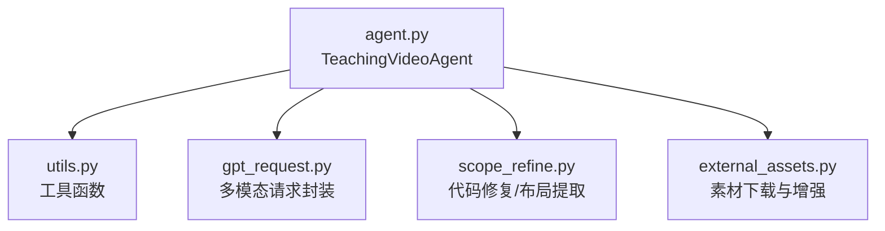
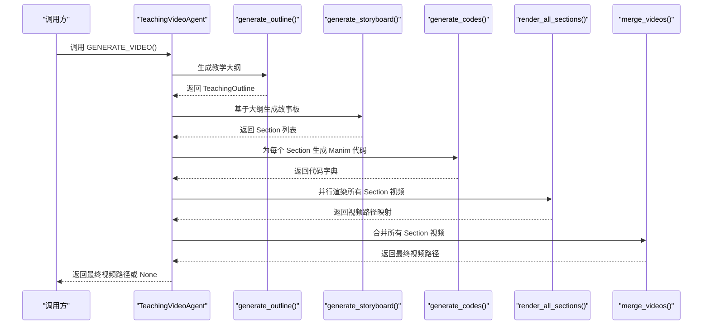
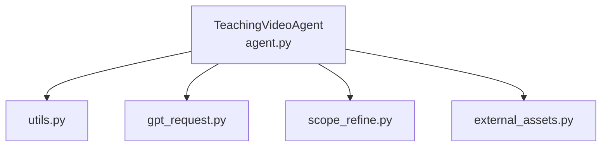

# GENERATE_VIDEO 方法

<cite>
**本文引用的文件列表**
- [agent.py](file://src/agent.py)
- [utils.py](file://src/utils.py)
- [gpt_request.py](file://src/gpt_request.py)
- [scope_refine.py](file://src/scope_refine.py)
- [external_assets.py](file://src/external_assets.py)
</cite>

## 目录
1. [简介](#简介)
2. [项目结构](#项目结构)
3. [核心组件](#核心组件)
4. [架构总览](#架构总览)
5. [详细组件分析](#详细组件分析)
6. [依赖关系分析](#依赖关系分析)
7. [性能考量](#性能考量)
8. [故障排查指南](#故障排查指南)
9. [结论](#结论)
10. [附录](#附录)

## 简介
本文件围绕 TeachingVideoAgent 的主入口方法 GENERATE_VIDEO() 进行系统化文档化，覆盖其调用顺序、错误处理策略、日志输出模式、最终视频路径返回机制，以及性能监控数据（token_usage）的汇总方式。同时给出与各子模块的集成示例，并建议在批量处理中通过 process_knowledge_point 函数间接调用以实现任务隔离。

## 项目结构
- 核心类与方法集中在 agent.py 中，包含 TeachingVideoAgent 及其主流程方法 GENERATE_VIDEO()。
- 工具函数与资源监控位于 utils.py。
- 多模态请求封装位于 gpt_request.py。
- 代码修复与布局提取位于 scope_refine.py。
- 外部素材增强位于 external_assets.py。

图表来源
- [agent.py](file://src/agent.py#L56-L718)
- [utils.py](file://src/utils.py#L1-L210)
- [gpt_request.py](file://src/gpt_request.py#L1-L800)
- [scope_refine.py](file://src/scope_refine.py#L1-L803)
- [external_assets.py](file://src/external_assets.py#L1-L220)

章节来源
- [agent.py](file://src/agent.py#L56-L718)

## 核心组件
- TeachingVideoAgent：负责从“教学主题”到“完整视频”的全流程编排，包括生成大纲、故事板、代码、渲染、反馈优化与合并。
- 令牌用量统计：通过内部 token_usage 字典记录 prompt_tokens、completion_tokens、total_tokens。
- 批量处理入口：process_knowledge_point 封装单个知识点的生成流程，便于批处理隔离与统计。

章节来源
- [agent.py](file://src/agent.py#L56-L133)
- [agent.py](file://src/agent.py#L722-L738)

## 架构总览
下图展示 GENERATE_VIDEO() 的调用顺序与关键步骤之间的关系：

图表来源
- [agent.py](file://src/agent.py#L703-L719)
- [agent.py](file://src/agent.py#L138-L187)
- [agent.py](file://src/agent.py#L189-L271)
- [agent.py](file://src/agent.py#L506-L524)
- [agent.py](file://src/agent.py#L595-L664)
- [agent.py](file://src/agent.py#L666-L700)

## 详细组件分析

### 主流程：GENERATE_VIDEO()
- 调用顺序严格遵循：generate_outline → generate_storyboard → generate_codes → render_all_sections → merge_videos。
- 全局 try-except 捕获任意阶段异常，保证流程健壮性；异常时打印失败日志并返回 None。
- 成功时打印成功日志并返回最终视频路径字符串；失败时打印失败日志并返回 None。

章节来源
- [agent.py](file://src/agent.py#L703-L719)

### 步骤一：generate_outline()
- 若存在缓存文件则直接加载；否则构造提示词，调用 API 获取大纲 JSON，解析后写入缓存。
- 异常重试与格式校验：最多尝试若干次，若多次失败抛出异常；JSON 解析失败时重试。
- 输出：构建 TeachingOutline 对象并返回。

章节来源
- [agent.py](file://src/agent.py#L138-L187)

### 步骤二：generate_storyboard()
- 若无大纲则抛出异常；支持从缓存加载或重新生成。
- 可选启用素材增强：调用外部素材增强模块，将下载的图标/矢量图嵌入动画描述。
- 输出：解析为 Section 列表并返回。

章节来源
- [agent.py](file://src/agent.py#L189-L271)
- [external_assets.py](file://src/external_assets.py#L1-L220)

### 步骤三：generate_codes()
- 使用线程池并发为每个 Section 生成 Manim 代码；异常时记录失败但不中断其他任务。
- 输出：返回 section_id 到代码内容的字典。

章节来源
- [agent.py](file://src/agent.py#L506-L524)

### 步骤四：render_all_sections()
- 使用进程池并行渲染每个 Section 的视频；每个 Section 在独立进程中运行，避免相互影响。
- 支持 MLLM 反馈优化：对每个 Section 的视频进行布局分析与优化，必要时回滚并重生成代码。
- 统计输出：渲染完成后输出成功率与统计信息。

章节来源
- [agent.py](file://src/agent.py#L595-L664)
- [scope_refine.py](file://src/scope_refine.py#L1-L803)

### 步骤五：merge_videos()
- 将已渲染的 Section 视频按排序写入临时列表文件，使用 ffmpeg 合并为最终 MP4。
- 成功返回绝对路径字符串，失败返回 None。

章节来源
- [agent.py](file://src/agent.py#L666-L700)
- [utils.py](file://src/utils.py#L163-L174)

### 性能监控：token_usage 汇总
- TeachingVideoAgent 内置 token_usage 字典，初始为 {prompt_tokens: 0, completion_tokens: 0, total_tokens: 0}。
- 通过 _request_api_and_track_tokens 与 _request_video_api_and_track_tokens 自动累加使用量。
- process_knowledge_point 在完成单个知识点处理后，打印耗时与总 token 数，便于批处理统计。

章节来源
- [agent.py](file://src/agent.py#L112-L133)
- [agent.py](file://src/agent.py#L124-L133)
- [agent.py](file://src/agent.py#L722-L738)

### 日志输出模式
- 各阶段均输出明确的提示信息，如“生成大纲”“生成故事板”“渲染 Section 成功/失败”“合并视频”等。
- 失败场景会打印异常信息或错误原因，便于定位问题。
- 渲染统计输出包含总节数与成功率，帮助快速评估整体质量。

章节来源
- [agent.py](file://src/agent.py#L138-L187)
- [agent.py](file://src/agent.py#L189-L271)
- [agent.py](file://src/agent.py#L506-L524)
- [agent.py](file://src/agent.py#L595-L664)
- [agent.py](file://src/agent.py#L666-L700)

### 最终视频路径返回机制
- 仅当 merge_videos 成功时返回最终视频路径字符串；否则返回 None。
- 调用方需根据返回值判断是否继续后续处理（例如上传、归档、通知）。

章节来源
- [agent.py](file://src/agent.py#L666-L700)
- [agent.py](file://src/agent.py#L703-L719)

### 与模块的集成示例
- 与多模态 API 的集成：通过 _request_api_and_track_tokens 与 _request_video_api_and_track_tokens 统一封装，自动累加 token 使用量。
- 与外部素材增强的集成：在生成故事板阶段可选启用，基于 LLM 提示词选择并下载图标/矢量图，再由 LLM 指导如何放置素材。
- 与代码修复/布局分析的集成：渲染失败时利用 ScopeRefineFixer 分析错误并尝试修复；MLLM 反馈用于布局优化。

章节来源
- [agent.py](file://src/agent.py#L112-L133)
- [agent.py](file://src/agent.py#L124-L133)
- [agent.py](file://src/agent.py#L189-L271)
- [external_assets.py](file://src/external_assets.py#L1-L220)
- [scope_refine.py](file://src/scope_refine.py#L1-L803)

### 建议：批量处理中的任务隔离
- 推荐通过 process_knowledge_point 间接调用 GENERATE_VIDEO()，以实现：
  - 单个知识点的独立进程空间，避免相互干扰；
  - 统一统计耗时与 token 使用量；
  - 批量调度与错误隔离。

章节来源
- [agent.py](file://src/agent.py#L722-L738)

## 依赖关系分析
- TeachingVideoAgent 依赖：
  - utils：路径安全转换、资源监控、ffmpeg 合并等工具。
  - gpt_request：多模态请求封装与 token 使用统计。
  - scope_refine：代码修复、布局提取与网格位置修改。
  - external_assets：智能素材下载与故事板增强。

图表来源
- [agent.py](file://src/agent.py#L56-L718)
- [utils.py](file://src/utils.py#L1-L210)
- [gpt_request.py](file://src/gpt_request.py#L1-L800)
- [scope_refine.py](file://src/scope_refine.py#L1-L803)
- [external_assets.py](file://src/external_assets.py#L1-L220)

章节来源
- [agent.py](file://src/agent.py#L56-L718)

## 性能考量
- 并行策略：
  - 代码生成阶段使用线程池，适合 I/O 密集型 API 请求。
  - 视频渲染阶段使用进程池，适合 CPU 密集型 Manim 渲染，避免 GIL 影响。
- 资源监控：utils 提供资源监控与最优并行度计算，有助于在高负载环境下稳定运行。
- Token 使用：统一在请求封装层统计，便于成本控制与预算管理。

章节来源
- [agent.py](file://src/agent.py#L506-L524)
- [agent.py](file://src/agent.py#L595-L664)
- [utils.py](file://src/utils.py#L53-L70)
- [utils.py](file://src/utils.py#L73-L89)

## 故障排查指南
- API 请求失败：
  - 检查网络与凭据配置；查看重试日志与异常堆栈。
  - 关注 token 使用统计，确认是否触发配额限制。
- JSON 解析失败：
  - 大纲/故事板生成阶段出现格式错误时会重试；检查提示词与模型稳定性。
- 渲染失败：
  - 使用 ScopeRefineFixer 分析错误上下文，优先局部修复；必要时进行完整重写。
  - 检查 Manim 版本兼容性与依赖安装。
- 合并失败：
  - 确认 ffmpeg 安装与可用性；检查视频列表文件与路径是否正确。
- 批处理异常：
  - 使用 process_knowledge_point 包裹单个任务，避免全局异常导致整个批次中断。

章节来源
- [agent.py](file://src/agent.py#L138-L187)
- [agent.py](file://src/agent.py#L189-L271)
- [agent.py](file://src/agent.py#L506-L524)
- [agent.py](file://src/agent.py#L595-L664)
- [agent.py](file://src/agent.py#L666-L700)
- [scope_refine.py](file://src/scope_refine.py#L1-L803)
- [utils.py](file://src/utils.py#L163-L174)

## 结论
GENERATE_VIDEO() 作为 TeachingVideoAgent 的主入口，以严格的调用顺序与完善的异常处理保障了端到端流程的稳健性。通过统一的 token 使用统计与清晰的日志输出，开发者能够高效定位问题并优化性能。结合 process_knowledge_point 的任务隔离设计，可在批量场景中实现高吞吐与高可靠性的视频生成流水线。

## 附录
- 关键方法路径参考：
  - [GENERATE_VIDEO](file://src/agent.py#L703-L719)
  - [generate_outline](file://src/agent.py#L138-L187)
  - [generate_storyboard](file://src/agent.py#L189-L271)
  - [generate_codes](file://src/agent.py#L506-L524)
  - [render_all_sections](file://src/agent.py#L595-L664)
  - [merge_videos](file://src/agent.py#L666-L700)
  - [_request_api_and_track_tokens](file://src/agent.py#L112-L133)
  - [_request_video_api_and_track_tokens](file://src/agent.py#L124-L133)
  - [process_knowledge_point](file://src/agent.py#L722-L738)
  - [get_optimal_workers](file://src/utils.py#L53-L70)
  - [stitch_videos](file://src/utils.py#L163-L174)
  - [ScopeRefineFixer](file://src/scope_refine.py#L250-L573)
  - [GridPositionExtractor](file://src/scope_refine.py#L683-L751)
  - [GridCodeModifier](file://src/scope_refine.py#L753-L803)
  - [process_storyboard_with_assets](file://src/external_assets.py#L194-L199)