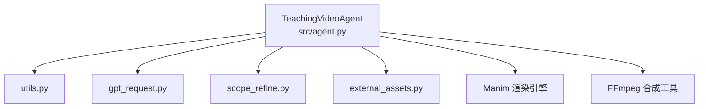
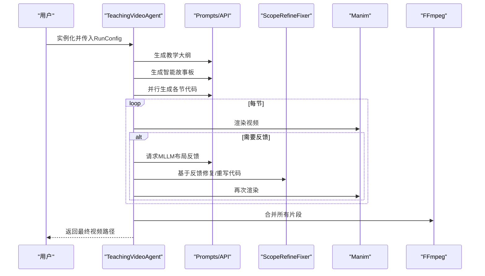
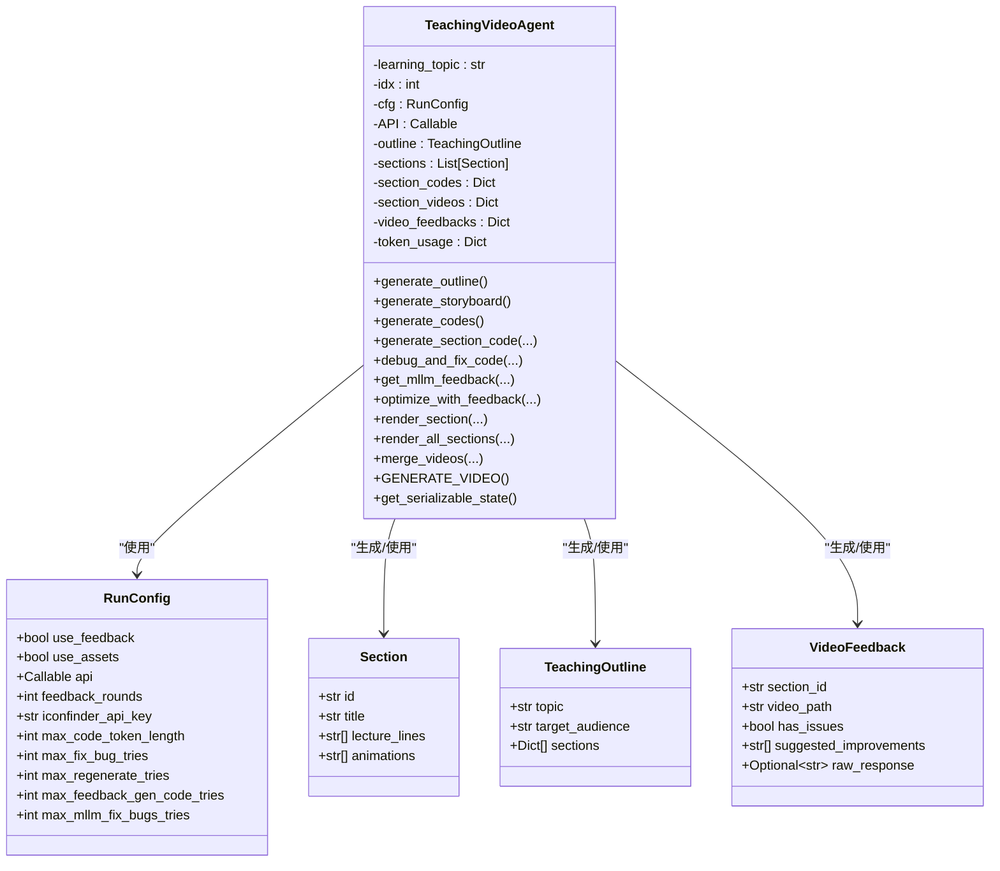

# TeachingVideoAgent类

<cite>
**本文引用的文件列表**
- [agent.py](file://src/agent.py)
- [utils.py](file://src/utils.py)
- [gpt_request.py](file://src/gpt_request.py)
- [scope_refine.py](file://src/scope_refine.py)
- [external_assets.py](file://src/external_assets.py)
</cite>

## 目录
1. [简介](#简介)
2. [项目结构](#项目结构)
3. [核心组件](#核心组件)
4. [架构总览](#架构总览)
5. [详细组件分析](#详细组件分析)
6. [依赖关系分析](#依赖关系分析)
7. [性能考量](#性能考量)
8. [故障排查指南](#故障排查指南)
9. [结论](#结论)
10. [附录](#附录)

## 简介
本文件为Code2Video核心业务类TeachingVideoAgent的权威API参考文档。内容覆盖构造函数参数、RunConfig配置注入机制、全部公共方法的参数与返回值、异常处理与调用时序、类属性的数据结构说明、生命周期与状态持久化、资源管理策略，以及从“生成教学大纲”到“合并最终视频”的完整端到端调用示例。

## 项目结构
TeachingVideoAgent位于src/agent.py中，围绕以下模块协作：
- 工具与通用能力：utils.py（JSON提取、替换基类、资源监控、路径转换等）
- 多模态请求封装：gpt_request.py（统一API调用、Token统计、多模型适配）
- 智能修复与布局分析：scope_refine.py（错误分析、智能修复、网格位置提取、代码修改器）
- 资源增强：external_assets.py（智能下载与增强故事板）

图表来源
- [agent.py](file://src/agent.py#L57-L114)
- [utils.py](file://src/utils.py#L1-L210)
- [gpt_request.py](file://src/gpt_request.py#L1-L200)
- [scope_refine.py](file://src/scope_refine.py#L480-L802)
- [external_assets.py](file://src/external_assets.py#L42-L71)

章节来源
- [agent.py](file://src/agent.py#L57-L114)

## 核心组件
- TeachingVideoAgent：主控制器，负责端到端视频生成流水线
- RunConfig：运行期配置对象，注入API、开关与超参
- Section/TeachingOutline/VideoFeedback：数据结构载体
- ScopeRefineFixer/GridPositionExtractor/GridCodeModifier：智能修复与布局分析
- 工具函数：utils.extract_json_from_markdown、utils.replace_base_class、utils.topic_to_safe_name等

章节来源
- [agent.py](file://src/agent.py#L19-L56)
- [agent.py](file://src/agent.py#L57-L114)
- [scope_refine.py](file://src/scope_refine.py#L480-L802)
- [utils.py](file://src/utils.py#L1-L210)

## 架构总览
TeachingVideoAgent采用“流水线+反馈闭环”的设计：
- 通过RunConfig注入API与超参
- 生成教学大纲与智能故事板
- 并行生成各节Manim代码并渲染
- 可选的MLLM反馈优化
- 最终合并视频

图表来源
- [agent.py](file://src/agent.py#L138-L720)
- [gpt_request.py](file://src/gpt_request.py#L1-L200)
- [scope_refine.py](file://src/scope_refine.py#L480-L802)

## 详细组件分析

### 构造函数 __init__
- 参数
  - idx: int/str，知识主题索引，用于输出目录命名
  - knowledge_point: str，学习主题名称
  - folder: str，默认"CASES"，根输出目录前缀
  - cfg: RunConfig，运行配置对象
- RunConfig注入机制
  - 将cfg中的use_feedback/use_assets/api/feedback_rounds/iconfinder_api_key/max_*等字段映射到Agent实例属性
  - 将cfg.api赋给self.API，作为统一的API调用入口
- 输出目录与资源
  - 基于utils.get_output_dir生成输出目录
  - 加载外部知识映射与网格参考图
- 数据结构初始化
  - outline/enhanced_storyboard/sections/section_codes/section_videos/video_feedbacks
- Token统计
  - token_usage字典累计prompt_tokens/completion_tokens/total_tokens

章节来源
- [agent.py](file://src/agent.py#L57-L114)
- [utils.py](file://src/utils.py#L185-L193)

### 类属性
- outline: TeachingOutline，教学大纲对象
- sections: List[Section]，解析后的分节对象列表
- section_codes: Dict[str, str]，节ID到生成的Manim代码
- section_videos: Dict[str, str]，节ID到渲染出的视频路径
- video_feedbacks: Dict[str, VideoFeedback]，节ID+轮次到反馈对象
- token_usage: Dict[str, int]，Token用量统计
- 其他：use_feedback/use_assets/API/feedback_rounds等来自RunConfig

章节来源
- [agent.py](file://src/agent.py#L104-L114)
- [agent.py](file://src/agent.py#L19-L56)

### 方法API参考

#### generate_outline() -> TeachingOutline
- 功能：生成教学大纲
- 输入：无
- 返回：TeachingOutline对象
- 行为要点：
  - 若存在缓存outline.json则直接加载
  - 否则根据knowledge_point与可选参考图构建提示词，调用API生成
  - 提取Markdown中的JSON并校验格式，失败按最大重试次数回退
  - 成功后持久化到outline.json
- 异常：多次失败抛出异常；格式无效抛出异常
- 时序：outline.json存在则跳过API调用

章节来源
- [agent.py](file://src/agent.py#L138-L188)

#### generate_storyboard() -> List[Section]
- 功能：生成智能故事板（可选资产增强）
- 输入：无
- 返回：List[Section]
- 行为要点：
  - 依赖已生成的outline；若未生成则抛错
  - 优先加载storyboard_with_assets.json；否则加载storyboard.json并按需增强
  - 通过API生成原始故事板，保存并可选进行资产增强
  - 解析为Section对象列表
- 异常：未生成大纲抛错；多次失败抛错
- 时序：先检查缓存，再决定是否调用API

章节来源
- [agent.py](file://src/agent.py#L190-L272)
- [agent.py](file://src/agent.py#L274-L294)
- [external_assets.py](file://src/external_assets.py#L42-L71)

#### generate_codes() -> Dict[str, str]
- 功能：并行生成所有节的Manim代码
- 输入：无
- 返回：Dict[str, str]，节ID到代码
- 行为要点：
  - 使用线程池并发调用generate_section_code
  - 捕获单节异常并打印，不影响其他节
- 异常：内部异常被捕获并记录

章节来源
- [agent.py](file://src/agent.py#L507-L526)

#### generate_section_code(section, attempt=1, feedback_improvements=None) -> str
- 功能：为单节生成Manim代码
- 参数：
  - section: Section
  - attempt: int，重试次数
  - feedback_improvements: List[str]，来自MLLM的改进建议
- 返回：str，生成的代码
- 行为要点：
  - 若首次调用且存在同名.py文件且无反馈，则直接读取缓存
  - 若有反馈，尝试使用GridCodeModifier解析反馈并局部修改，失败则走重写流程
  - 通过API生成代码，提取Python代码块，替换基类定义，写入文件并缓存
- 异常：API失败返回空字符串；异常被捕获

章节来源
- [agent.py](file://src/agent.py#L295-L354)
- [scope_refine.py](file://src/scope_refine.py#L753-L802)
- [utils.py](file://src/utils.py#L91-L129)

#### debug_and_fix_code(section_id: str, max_fix_attempts: int = 3) -> bool
- 功能：本地调试与修复，调用Manim渲染验证
- 参数：
  - section_id: str
  - max_fix_attempts: int
- 返回：bool，是否成功
- 行为要点：
  - 通过subprocess调用manim渲染指定场景
  - 成功则定位视频文件并缓存路径
  - 失败时交由ScopeRefineFixer进行智能修复，必要时回退重写
- 异常：超时或异常均记录并终止当前尝试

章节来源
- [agent.py](file://src/agent.py#L356-L401)
- [scope_refine.py](file://src/scope_refine.py#L480-L669)

#### get_mllm_feedback(section, video_path, round_number: int = 1) -> VideoFeedback
- 功能：请求MLLM对视频进行布局反馈
- 参数：
  - section: Section
  - video_path: str
  - round_number: int
- 返回：VideoFeedback
- 行为要点：
  - 使用GridPositionExtractor从代码中提取网格位置信息，生成位置表
  - 构建布局反馈提示词，调用多模态API
  - 解析响应，支持JSON与关键词回退解析
  - 缓存VideoFeedback对象
- 异常：失败时返回空建议并记录错误

章节来源
- [agent.py](file://src/agent.py#L402-L460)
- [scope_refine.py](file://src/scope_refine.py#L683-L751)

#### optimize_with_feedback(section, feedback: VideoFeedback) -> bool
- 功能：基于反馈优化代码并重新渲染
- 参数：
  - section: Section
  - feedback: VideoFeedback
- 返回：bool
- 行为要点：
  - 若无问题或无建议则直接返回成功
  - 备份原代码，最多尝试若干轮重新生成+修复
  - 成功后移动优化视频至专用目录并更新缓存

章节来源
- [agent.py](file://src/agent.py#L461-L506)

#### render_section(section: Section) -> bool
- 功能：渲染单节视频（含重试与反馈）
- 参数：section: Section
- 返回：bool
- 行为要点：
  - 循环重试生成代码与修复，直至成功
  - 若启用反馈，按轮次调用MLLM反馈并优化
- 异常：过程异常捕获并继续

章节来源
- [agent.py](file://src/agent.py#L527-L580)

#### render_all_sections(max_workers: int = 6) -> Dict[str, str]
- 功能：并行渲染所有节视频
- 参数：max_workers: int
- 返回：Dict[str, str]，节ID到视频路径
- 行为要点：
  - 使用进程池，每节在独立进程中执行render_section
  - 通过get_serializable_state传递Agent状态
  - 统计成功/失败数量并汇总

章节来源
- [agent.py](file://src/agent.py#L596-L702)

#### merge_videos(output_filename: str = None) -> str
- 功能：合并所有节视频
- 参数：output_filename: str
- 返回：str，最终视频路径
- 行为要点：
  - 生成video_list.txt，按节ID排序
  - 调用ffmpeg进行无损拼接
- 异常：失败返回None并打印错误

章节来源
- [agent.py](file://src/agent.py#L667-L702)

#### GENERATE_VIDEO() -> str
- 功能：端到端生成完整视频（含可选反馈优化）
- 参数：无
- 返回：str，最终视频路径
- 行为要点：
  - 顺序调用：generate_outline -> generate_storyboard -> generate_codes -> render_all_sections -> merge_videos
  - 异常捕获并返回None

章节来源
- [agent.py](file://src/agent.py#L703-L720)

### 生命周期与状态持久化
- 状态持久化：get_serializable_state()返回可序列化的字典（idx、knowledge_point、folder、cfg），用于并行渲染时重建Agent实例
- 资源管理：
  - 输出目录自动创建
  - 临时文件与中间产物（outline.json、storyboard*.json、*.py、优化视频）按流程生成
  - Token用量通过_request_api_and_track_tokens/_request_video_api_and_track_tokens累积

章节来源
- [agent.py](file://src/agent.py#L115-L133)
- [agent.py](file://src/agent.py#L134-L137)

## 依赖关系分析

图表来源
- [agent.py](file://src/agent.py#L19-L56)
- [agent.py](file://src/agent.py#L57-L114)
- [agent.py](file://src/agent.py#L138-L720)

章节来源
- [agent.py](file://src/agent.py#L19-L56)
- [agent.py](file://src/agent.py#L57-L114)

## 性能考量
- 并行策略
  - generate_codes使用线程池并行生成代码
  - render_all_sections使用进程池并行渲染，适合CPU密集型场景
- 资源监控
  - utils.get_optimal_workers根据CPU核数自适应设置并行度
  - utils.monitor_system_resources可辅助观察高负载风险
- Token与重试
  - 所有API调用通过_request_api_and_track_tokens累积Token用量
  - 多处设置最大重试次数，避免单点失败导致整体失败

章节来源
- [agent.py](file://src/agent.py#L507-L526)
- [agent.py](file://src/agent.py#L596-L702)
- [utils.py](file://src/utils.py#L53-L71)
- [utils.py](file://src/utils.py#L73-L89)

## 故障排查指南
- API失败
  - 现象：generate_outline/generate_storyboard/generate_section_code返回None或抛错
  - 排查：检查RunConfig.api是否正确注入；查看重试次数与日志
- 代码生成异常
  - 现象：generate_section_code返回空字符串
  - 排查：确认API响应格式；检查max_code_token_length是否足够
- 渲染失败
  - 现象：debug_and_fix_code返回False
  - 排查：查看Manim命令行输出；检查ScopeRefineFixer是否成功修复
- 反馈优化失败
  - 现象：optimize_with_feedback返回False
  - 排查：确认MLLM反馈解析是否成功；检查GridCodeModifier匹配规则
- 合并失败
  - 现象：merge_videos返回None
  - 排查：确认ffmpeg可用；检查video_list.txt与视频路径

章节来源
- [agent.py](file://src/agent.py#L138-L188)
- [agent.py](file://src/agent.py#L190-L272)
- [agent.py](file://src/agent.py#L295-L354)
- [agent.py](file://src/agent.py#L356-L401)
- [agent.py](file://src/agent.py#L402-L506)
- [agent.py](file://src/agent.py#L667-L702)

## 结论
TeachingVideoAgent提供了从“教学大纲—智能故事板—代码生成—渲染—反馈优化—视频合并”的完整流水线。通过RunConfig集中注入配置与API，结合ScopeRefine与MLLM反馈形成闭环优化，配合并行渲染与资源监控，能够稳定产出高质量的教学视频。

## 附录

### 完整调用示例（端到端）
- 步骤
  1) 准备RunConfig并注入API
  2) 实例化TeachingVideoAgent
  3) 调用GENERATE_VIDEO()完成全流程
- 关键点
  - 生成outline/storyboard/codes/render_all_sections/merge_videos
  - 可选启用use_feedback与use_assets
  - 通过get_serializable_state实现并行渲染

章节来源
- [agent.py](file://src/agent.py#L703-L720)
- [agent.py](file://src/agent.py#L596-L702)
- [agent.py](file://src/agent.py#L134-L137)