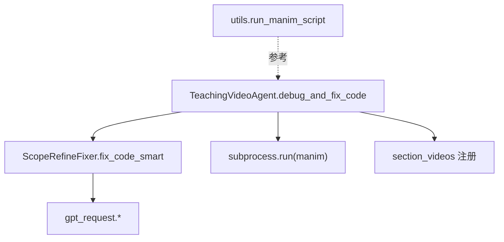
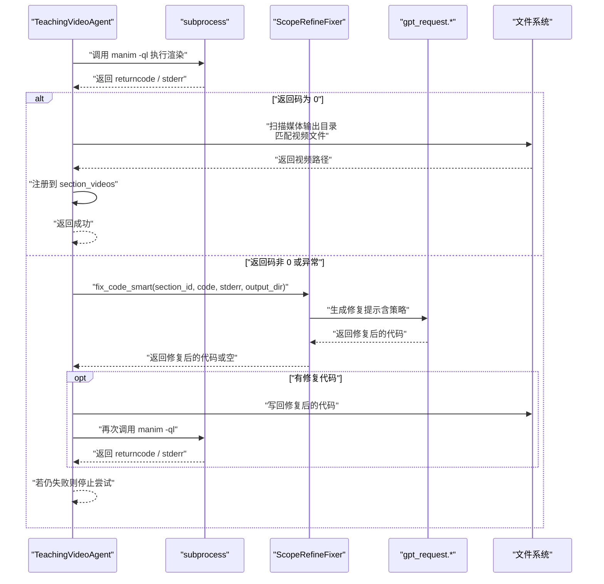
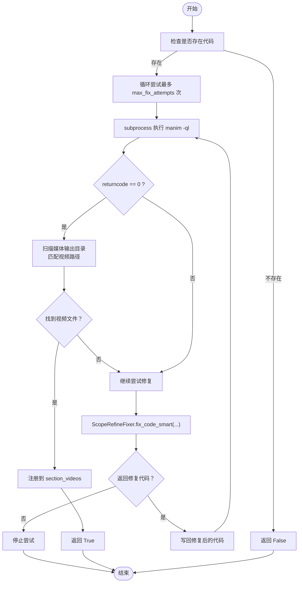
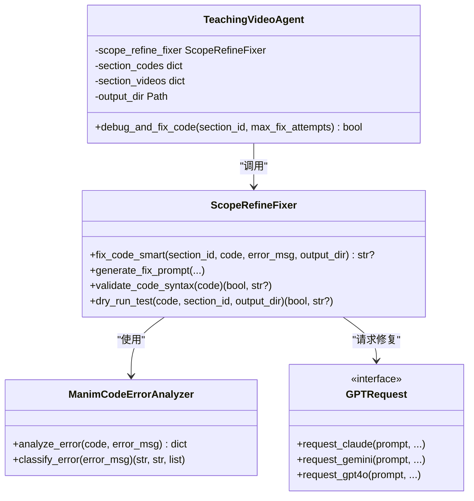
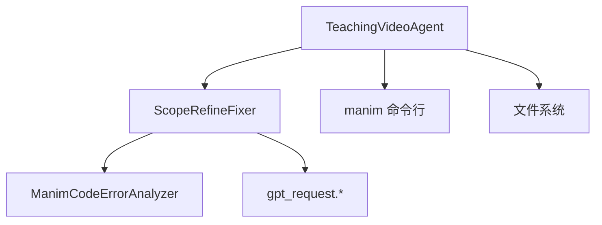

# debug_and_fix_code 方法

<cite>
**本文引用的文件**
- [agent.py](file://src/agent.py)
- [scope_refine.py](file://src/scope_refine.py)
- [utils.py](file://src/utils.py)
- [gpt_request.py](file://src/gpt_request.py)
</cite>

## 目录
1. [简介](#简介)
2. [项目结构](#项目结构)
3. [核心组件](#核心组件)
4. [架构总览](#架构总览)
5. [详细组件分析](#详细组件分析)
6. [依赖关系分析](#依赖关系分析)
7. [性能考量](#性能考量)
8. [故障排查指南](#故障排查指南)
9. [结论](#结论)

## 简介
本文件为 debug_and_fix_code() 方法的权威技术文档，聚焦于其如何通过子进程调用 manim 命令行工具对单个章节的 Manim 代码进行自动化调试与修复。文档详细说明：
- 如何以低质量快速渲染模式运行 manim，捕获标准错误输出；
- 超时控制（180 秒）与异常处理策略；
- 与 ScopeRefineFixer 组件的深度集成：将原始代码、错误日志与项目路径传递给 fix_code_smart() 进行智能修复；
- 最多 max_fix_attempts 次修复尝试的循环机制；
- 视频文件路径的识别与注册到 section_videos；
- 成功状态的判定条件；
- 调试日志分析示例与常见编译错误的修复策略。

## 项目结构
围绕 debug_and_fix_code 的相关模块与职责如下：
- TeachingVideoAgent：包含 debug_and_fix_code 的主流程，负责调用 manim、解析输出、触发智能修复、更新视频注册表等。
- ScopeRefineFixer：封装智能修复逻辑，基于错误类型与上下文进行局部修复或完整重写，并通过 LLM 生成修复提示。
- gpt_request：提供统一的 LLM 请求接口，用于 ScopeRefineFixer 的修复提示生成与验证。
- utils：提供通用工具函数，如资源监控、输出目录管理等；与 debug_and_fix_code 的直接耦合点主要体现在渲染与合并阶段的工具函数。

图表来源
- [agent.py](file://src/agent.py#L355-L400)
- [scope_refine.py](file://src/scope_refine.py#L483-L573)
- [gpt_request.py](file://src/gpt_request.py#L1-L120)
- [utils.py](file://src/utils.py#L138-L161)

章节来源
- [agent.py](file://src/agent.py#L355-L400)
- [scope_refine.py](file://src/scope_refine.py#L483-L573)
- [gpt_request.py](file://src/gpt_request.py#L1-L120)
- [utils.py](file://src/utils.py#L138-L161)

## 核心组件
- TeachingVideoAgent.debug_and_fix_code(section_id, max_fix_attempts)
  - 作用：对指定章节的 Manim 代码进行调试与修复，最多尝试 max_fix_attempts 次。
  - 关键行为：
    - 使用 subprocess 调用 manim -ql 执行渲染；
    - 捕获 stderr 并传入 ScopeRefineFixer；
    - 在成功时扫描媒体输出目录，匹配视频文件并注册到 self.section_videos；
    - 失败时根据返回码与异常决定是否继续尝试修复。
- ScopeRefineFixer.fix_code_smart(section_id, code, error_msg, output_dir)
  - 作用：基于错误分析与上下文，优先局部修复；失败则进入多阶段验证的完整重写流程。
  - 关键行为：
    - 错误分类与上下文提取；
    - 本地修复（按单行/函数/章节范围）；
    - 语法校验与干跑测试；
    - 多轮 LLM 修复与回退策略。

章节来源
- [agent.py](file://src/agent.py#L355-L400)
- [scope_refine.py](file://src/scope_refine.py#L250-L573)

## 架构总览
下图展示 debug_and_fix_code 的端到端调用链路与组件交互。

图表来源
- [agent.py](file://src/agent.py#L355-L400)
- [scope_refine.py](file://src/scope_refine.py#L483-L573)
- [gpt_request.py](file://src/gpt_request.py#L1-L120)

## 详细组件分析

### debug_and_fix_code 方法详解
- 输入参数
  - section_id：章节标识，对应已生成的 .py 文件与场景类名。
  - max_fix_attempts：最大修复尝试次数，默认值由 RunConfig 提供。
- 执行流程
  - 计算场景类名与代码文件名；
  - 以低质量快速渲染模式调用 manim -ql；
  - 若返回码为 0，则扫描媒体输出目录，匹配两种可能的视频路径格式，命中后注册到 self.section_videos 并返回成功；
  - 若失败，从 stderr 获取错误日志，调用 ScopeRefineFixer.fix_code_smart 进行智能修复；
  - 若返回新代码，写回原文件并再次尝试渲染；
  - 超时（180 秒）或异常时提前终止当前尝试。
- 成功判定
  - 返回码为 0 且能定位到视频文件路径；
  - 视频路径注册到 self.section_videos[section_id]。
- 失败判定
  - 达到 max_fix_attempts 次数上限；
  - 超时或异常导致无法继续尝试；
  - 修复后仍无法生成有效视频。

图表来源
- [agent.py](file://src/agent.py#L355-L400)
- [scope_refine.py](file://src/scope_refine.py#L483-L573)

章节来源
- [agent.py](file://src/agent.py#L355-L400)

### 与 ScopeRefineFixer 的集成
- 参数传递
  - 将 section_id、当前代码、stderr 错误日志、输出目录路径传递给 fix_code_smart。
- 修复策略
  - 首先基于错误分析器定位问题范围（单行/函数/章节），尝试局部修复；
  - 局部修复失败则进入多阶段验证流程：LLM 生成修复提示 -> 语法校验 -> 干跑测试 -> 返回最终修复代码；
  - 若多轮尝试均失败，返回空值，驱动上层停止尝试。
- 与 LLM 的交互
  - 通过 gpt_request.* 接口发送修复提示，支持多种模型与重试机制。

图表来源
- [agent.py](file://src/agent.py#L355-L400)
- [scope_refine.py](file://src/scope_refine.py#L250-L573)
- [gpt_request.py](file://src/gpt_request.py#L1-L120)

章节来源
- [scope_refine.py](file://src/scope_refine.py#L250-L573)
- [gpt_request.py](file://src/gpt_request.py#L1-L120)

### 视频文件路径识别与注册
- 识别规则
  - 两种候选路径格式：
    - 基于章节文件名的子目录：media/videos/{section_id}/480p15/{SceneName}.mp4
    - 全局目录：media/videos/480p15/{SceneName}.mp4
  - 命中任一即认为渲染成功，注册到 self.section_videos[section_id]。
- 注册时机
  - 成功渲染后立即注册，便于后续反馈与优化流程复用。

章节来源
- [agent.py](file://src/agent.py#L371-L381)

### 超时与异常处理
- 超时控制
  - 子进程调用设置 timeout=180 秒，超时抛出 TimeoutExpired 异常，上层据此停止尝试。
- 异常处理
  - 捕获 TimeoutExpired 与通用异常，打印错误并终止当前尝试，避免无限等待。
- 修复循环
  - 采用 for 循环，每次失败后调用 ScopeRefineFixer 生成修复代码，直至成功或达到上限。

章节来源
- [agent.py](file://src/agent.py#L367-L399)

### 常见编译错误与修复策略
以下策略由 ScopeRefineFixer 内置的错误分类与模式匹配提供，结合 LLM 生成修复提示，覆盖常见场景：
- 导入错误（ImportError）
  - 现象：找不到模块或导入语句不正确。
  - 策略：检查 from manim import * 或具体对象导入是否正确。
- 名称错误（NameError）
  - 现象：变量未定义或拼写错误。
  - 策略：补全缺失导入或修正变量名；针对常见 Manim 对象给出建议。
- 属性错误（AttributeError）
  - 现象：对象缺少属性或方法。
  - 策略：确认对象类型与可用方法；提供替代方案或版本兼容性检查。
- 类型错误（TypeError）
  - 现象：参数数量或类型不匹配。
  - 策略：核对函数签名与参数；修正运算符类型。
- 语法错误（SyntaxError/IndentationError）
  - 现象：括号不匹配、缩进错误等。
  - 策略：修复语法与缩进；必要时进行完整重写。

章节来源
- [scope_refine.py](file://src/scope_refine.py#L272-L289)
- [scope_refine.py](file://src/scope_refine.py#L83-L147)

## 依赖关系分析
- TeachingVideoAgent 依赖 ScopeRefineFixer 完成智能修复；
- ScopeRefineFixer 依赖 ManimCodeErrorAnalyzer 进行错误分析与上下文提取；
- ScopeRefineFixer 依赖 gpt_request.* 发送修复提示并获取 LLM 结果；
- debug_and_fix_code 通过 subprocess 调用 manim，依赖文件系统进行视频路径扫描与注册。

图表来源
- [agent.py](file://src/agent.py#L355-L400)
- [scope_refine.py](file://src/scope_refine.py#L250-L573)
- [gpt_request.py](file://src/gpt_request.py#L1-L120)

章节来源
- [agent.py](file://src/agent.py#L355-L400)
- [scope_refine.py](file://src/scope_refine.py#L250-L573)
- [gpt_request.py](file://src/gpt_request.py#L1-L120)

## 性能考量
- 渲染模式
  - 使用 -ql 快速低质量渲染，缩短调试周期，适合频繁修复迭代。
- 超时限制
  - 180 秒超时避免长时间卡死，提升整体鲁棒性。
- 干跑测试
  - 通过 dry_run_test 在不生成视频的前提下验证修复效果，减少无效渲染。
- 并发与批量
  - 上层渲染流程支持并行处理多个章节，但单个 debug_and_fix_code 仅串行尝试修复。

章节来源
- [agent.py](file://src/agent.py#L367-L399)
- [scope_refine.py](file://src/scope_refine.py#L341-L371)

## 故障排查指南
- 现象：debug_and_fix_code 返回 False
  - 可能原因：未生成代码、多次修复失败、超时或异常。
  - 排查步骤：
    - 确认 self.section_codes 中是否存在对应 section_id；
    - 查看 stderr 日志，定位错误类型；
    - 检查输出目录 media/videos 是否存在目标视频文件；
    - 检查网络与 LLM 服务可用性（gpt_request.*）。
- 现象：超时
  - 可能原因：复杂动画或资源不足。
  - 排查步骤：
    - 减少动画复杂度或分段渲染；
    - 检查系统资源占用（CPU/内存）。
- 现象：修复无效
  - 可能原因：LLM 生成代码不符合预期或未通过干跑测试。
  - 排查步骤：
    - 检查错误分类与修复提示是否合理；
    - 适当提高 max_fix_attempts 或调整修复策略。

章节来源
- [agent.py](file://src/agent.py#L355-L400)
- [scope_refine.py](file://src/scope_refine.py#L518-L573)
- [gpt_request.py](file://src/gpt_request.py#L1-L120)

## 结论
debug_and_fix_code() 通过“子进程调用 manim + 智能修复 + 多轮验证”的闭环，实现了对 Manim 代码的自动化调试与修复。其关键优势在于：
- 明确的超时与异常处理，保障稳定性；
- 与 ScopeRefineFixer 的深度集成，实现从错误分析到修复落地的自动化；
- 成功状态以视频文件存在为判定依据，确保可验证性；
- 支持最多 max_fix_attempts 次修复尝试，兼顾效率与可靠性。