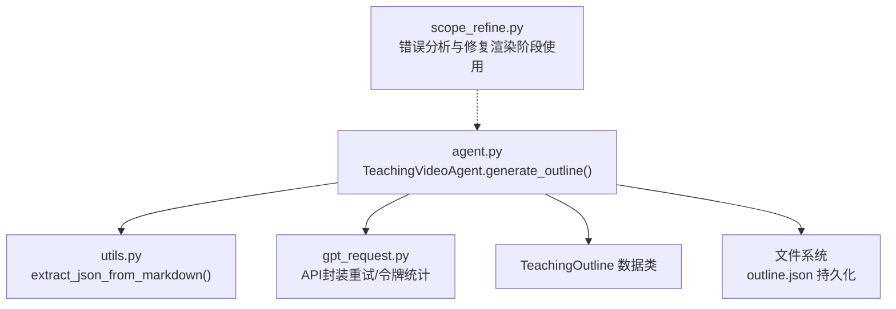
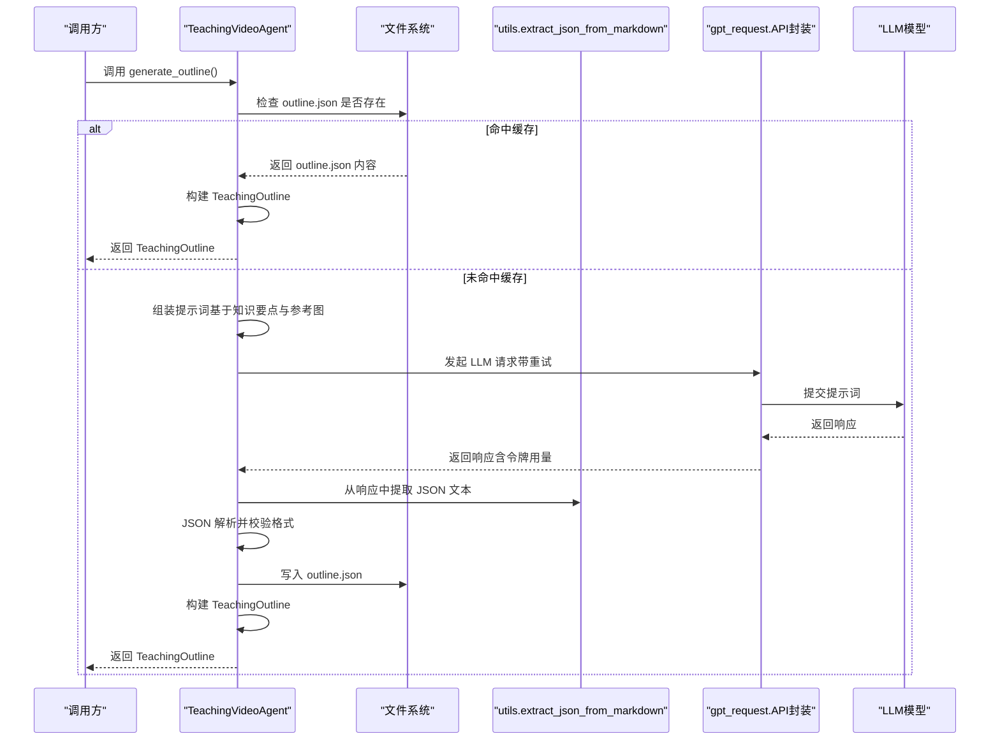
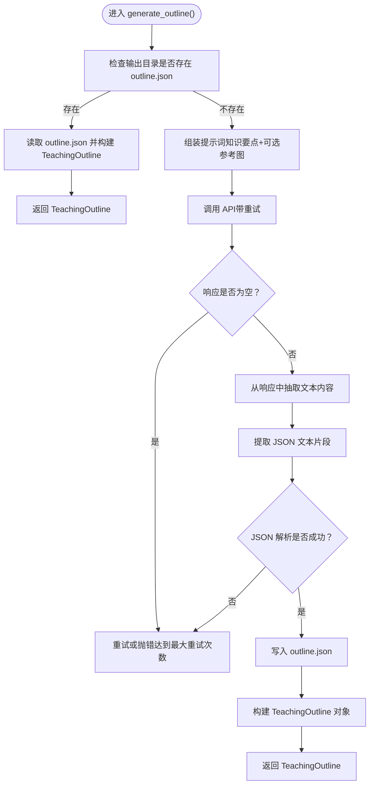
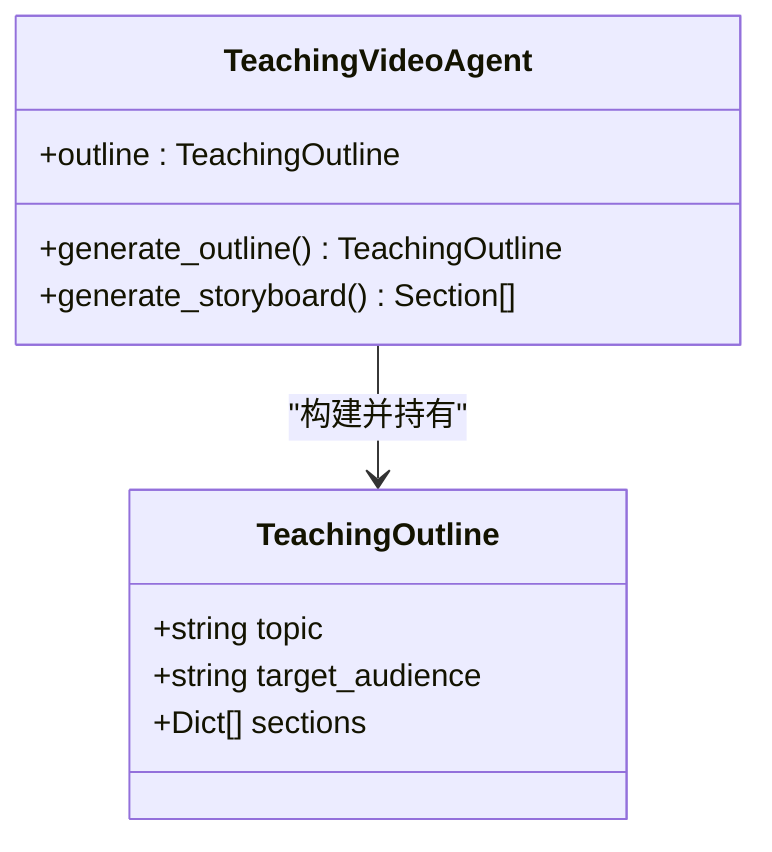
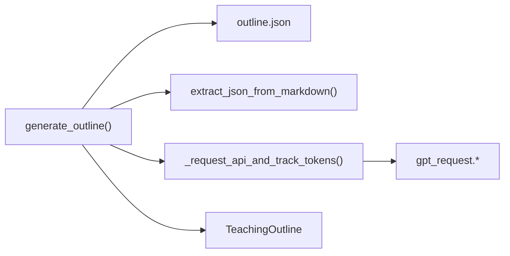

# generate_outline 方法

<cite>
**本文引用的文件**
- [agent.py](file://src/agent.py)
- [utils.py](file://src/utils.py)
- [gpt_request.py](file://src/gpt_request.py)
- [scope_refine.py](file://src/scope_refine.py)
</cite>

## 目录
1. [简介](#简介)
2. [项目结构](#项目结构)
3. [核心组件](#核心组件)
4. [架构总览](#架构总览)
5. [详细组件分析](#详细组件分析)
6. [依赖关系分析](#依赖关系分析)
7. [性能考量](#性能考量)
8. [故障排查指南](#故障排查指南)
9. [结论](#结论)

## 简介
本节聚焦于 TeachingVideoAgent 类的 generate_outline() 方法，系统性说明其职责、调用时机、内部执行流程、重试机制、响应解析、异常处理与结果持久化，并解释 TeachingOutline 数据类的构建过程及在后续流程中的作用。同时给出返回值类型 TeachingOutline 的结构说明，以及成功与失败场景的处理建议。

## 项目结构
围绕 generate_outline() 的关键文件与角色：
- agent.py：包含 TeachingVideoAgent 类、generate_outline() 方法、TeachingOutline 数据类、以及与 LLM 请求封装、文件读写等逻辑。
- utils.py：提供通用工具函数，如 extract_json_from_markdown()，用于从模型响应中提取 JSON 字符串。
- gpt_request.py：封装多种 LLM API 调用（含重试与令牌统计），供 agent 使用。
- scope_refine.py：提供错误分析与修复能力，虽不直接参与 outline 生成，但为后续渲染与优化奠定基础。

图表来源
- [agent.py](file://src/agent.py#L137-L187)
- [utils.py](file://src/utils.py#L11-L16)
- [gpt_request.py](file://src/gpt_request.py#L1-L120)
- [scope_refine.py](file://src/scope_refine.py#L1-L120)

章节来源
- [agent.py](file://src/agent.py#L137-L187)
- [utils.py](file://src/utils.py#L11-L16)
- [gpt_request.py](file://src/gpt_request.py#L1-L120)

## 核心组件
- TeachingOutline 数据类：用于承载结构化的大纲数据，字段包括主题、目标受众、分段列表等。
- TeachingVideoAgent.generate_outline()：负责从知识要点生成教学大纲，支持缓存命中与 LLM 生成两种路径。
- 工具函数 extract_json_from_markdown()：从模型响应文本中提取 JSON 片段，便于后续 JSON 解析。
- API 封装：统一的请求入口，内置重试与令牌用量统计，保证稳定性与可观测性。

章节来源
- [agent.py](file://src/agent.py#L27-L32)
- [agent.py](file://src/agent.py#L137-L187)
- [utils.py](file://src/utils.py#L11-L16)
- [gpt_request.py](file://src/gpt_request.py#L1-L120)

## 架构总览
generate_outline() 在 TeachingVideoAgent 生命周期中的位置如下：

图表来源
- [agent.py](file://src/agent.py#L137-L187)
- [utils.py](file://src/utils.py#L11-L16)
- [gpt_request.py](file://src/gpt_request.py#L1-L120)

## 详细组件分析

### generate_outline() 方法调用时机与职责
- 调用时机：通常在完整视频生成流程的早期阶段，由 TeachingVideoAgent.GENERATE_VIDEO() 首先调用 generate_outline()，以确保后续 storyboard 生成与代码生成有稳定的输入。
- 职责：从知识要点生成教学大纲，优先读取本地缓存；若无缓存，则通过 LLM API 生成结构化 JSON，并进行格式校验与持久化。

章节来源
- [agent.py](file://src/agent.py#L703-L719)
- [agent.py](file://src/agent.py#L137-L187)

### 内部逻辑流程
- 缓存检查：若输出目录下存在 outline.json，则直接读取并构建 TeachingOutline 返回。
- 未命中缓存：
  - 组装提示词：根据当前学习主题与可选参考图生成提示词。
  - 发起请求：通过 _request_api_and_track_tokens() 包装 API 调用，内置 max_regenerate_tries 次重试。
  - 响应解析：尝试从不同 SDK 响应结构中抽取文本内容，再用 extract_json_from_markdown() 提取 JSON 片段。
  - JSON 校验与落盘：对提取出的内容进行 JSON 解析，失败则重试；成功则写入 outline.json。
  - 构建对象：将 outline_data 映射为 TeachingOutline 并返回。

图表来源
- [agent.py](file://src/agent.py#L137-L187)
- [utils.py](file://src/utils.py#L11-L16)
- [gpt_request.py](file://src/gpt_request.py#L1-L120)

章节来源
- [agent.py](file://src/agent.py#L137-L187)
- [utils.py](file://src/utils.py#L11-L16)

### 重试机制（max_regenerate_tries）
- 生成大纲时，最多尝试 max_regenerate_tries 次（来自 RunConfig）。每次失败会打印提示并在达到上限后抛出异常。
- API 层面也具备独立的重试策略（例如 request_claude_token/request_gpt4o_token 等），generate_outline() 通过 _request_api_and_track_tokens() 统一调用，从而复用这些重试与令牌统计能力。

章节来源
- [agent.py](file://src/agent.py#L44-L55)
- [agent.py](file://src/agent.py#L115-L123)
- [gpt_request.py](file://src/gpt_request.py#L1-L120)

### 响应解析（extract_json_from_markdown）
- 从模型响应中提取 JSON 文本片段，兼容多种 Markdown 包裹形式，避免因模型输出格式差异导致解析失败。
- generate_outline() 在获取到纯文本后，再进行 JSON 解析，确保 outline.json 的正确性。

章节来源
- [utils.py](file://src/utils.py#L11-L16)
- [agent.py](file://src/agent.py#L137-L187)

### 异常处理
- API 调用失败：当连续达到 max_regenerate_tries 次失败时，抛出异常，提示“多次 API 请求失败”。
- JSON 解析失败：当提取的 JSON 文本无法被解析为结构化数据时，打印提示并重试；达到上限后抛出异常，提示“大纲格式无效多次”。
- 其他异常：在生成流程中捕获并记录异常信息，避免中断整个流程。

章节来源
- [agent.py](file://src/agent.py#L156-L180)

### 结果持久化到文件系统
- 成功解析后，将 outline_data 写入输出目录下的 outline.json，以便后续步骤复用。
- 后续步骤（如 generate_storyboard()）会优先读取该缓存文件，减少重复调用 LLM 的成本。

章节来源
- [agent.py](file://src/agent.py#L171-L176)

### TeachingOutline 数据类的构建与作用
- 构建过程：从 outline.json 或 LLM 生成的 outline_data 中提取 topic、target_audience、sections 字段，构造 TeachingOutline 实例。
- 后续作用：作为 generate_storyboard() 的输入之一，驱动后续分镜与动画脚本生成；同时在渲染阶段被用于生成各分段的 Manim 代码与视频。

图表来源
- [agent.py](file://src/agent.py#L27-L32)
- [agent.py](file://src/agent.py#L137-L187)

章节来源
- [agent.py](file://src/agent.py#L27-L32)
- [agent.py](file://src/agent.py#L137-L187)

### 返回值类型 TeachingOutline 的结构说明
- topic：教学主题名称。
- target_audience：目标受众描述。
- sections：分段列表，每项为字典，包含分段标识、标题、讲授语句与动画描述等键（具体键名以实际 JSON 结构为准）。

章节来源
- [agent.py](file://src/agent.py#L27-L32)

### 成功与失败场景的处理建议
- 成功场景
  - 缓存命中：直接读取 outline.json，快速返回 TeachingOutline。
  - 未命中缓存：LLM 正常返回结构化 JSON，经解析与持久化后返回 TeachingOutline。
- 失败场景
  - API 调用失败：检查网络、密钥配置与服务端可用性；适当增加 max_regenerate_tries 或调整重试间隔。
  - JSON 解析失败：确认提示词是否明确要求返回 JSON；必要时在提示词中强调 JSON 格式与键名；或在上游增加更严格的格式约束。
  - 文件写入失败：检查输出目录权限与磁盘空间；确保路径存在且可写。
- 最佳实践
  - 在调用 generate_outline() 前，确保 RunConfig 中的 API 函数已正确注入，且 max_regenerate_tries 设置合理。
  - 若频繁生成相同主题的大纲，建议保留 outline.json 以提升整体吞吐。
  - 对于多线程/多进程环境，注意并发写文件的安全性（当前实现为单实例生成，无需额外锁）。

章节来源
- [agent.py](file://src/agent.py#L137-L187)
- [gpt_request.py](file://src/gpt_request.py#L1-L120)

## 依赖关系分析
- generate_outline() 主要依赖：
  - 文件系统：读写 outline.json。
  - utils.extract_json_from_markdown()：解析响应中的 JSON 文本。
  - gpt_request.API 封装：统一的 LLM 请求入口，内置重试与令牌统计。
  - TeachingOutline 数据类：承载结构化大纲数据。

图表来源
- [agent.py](file://src/agent.py#L137-L187)
- [utils.py](file://src/utils.py#L11-L16)
- [gpt_request.py](file://src/gpt_request.py#L1-L120)

章节来源
- [agent.py](file://src/agent.py#L137-L187)
- [utils.py](file://src/utils.py#L11-L16)
- [gpt_request.py](file://src/gpt_request.py#L1-L120)

## 性能考量
- 缓存优先：优先读取 outline.json 可显著降低 LLM 调用次数与延迟。
- 重试策略：在 API 层与 generate_outline() 层均设置重试，提高成功率与鲁棒性。
- 令牌统计：通过 _request_api_and_track_tokens() 累计令牌用量，便于成本控制与资源规划。
- I/O 开销：文件读写为顺序 I/O，开销较小；建议在高并发场景下避免重复生成相同主题的大纲。

章节来源
- [agent.py](file://src/agent.py#L115-L123)
- [agent.py](file://src/agent.py#L137-L187)

## 故障排查指南
- API 请求失败
  - 现象：连续达到 max_regenerate_tries 次后抛错。
  - 排查：检查网络连通性、服务端状态、密钥配置；查看日志中的重试提示。
- JSON 解析失败
  - 现象：提示“大纲格式无效多次”，随后抛错。
  - 排查：确认提示词要求严格返回 JSON；检查模型输出是否包含多余文本或非 JSON 片段；必要时在上游增加格式约束。
- 文件写入失败
  - 现象：无法创建/写入 outline.json。
  - 排查：检查输出目录权限、磁盘空间与路径有效性。
- 缓存命中但数据不一致
  - 现象：读取 outline.json 后与预期不符。
  - 排查：删除旧缓存文件，重新生成；或在提示词中加入版本/时间戳等区分字段。

章节来源
- [agent.py](file://src/agent.py#L156-L180)
- [gpt_request.py](file://src/gpt_request.py#L1-L120)

## 结论
generate_outline() 通过“缓存优先 + LLM 生成 + 格式校验 + 持久化”的闭环，稳定地产出结构化教学大纲 TeachingOutline。其重试机制与响应解析工具共同提升了鲁棒性；后续流程可直接复用该缓存，降低整体成本。建议在生产环境中结合合理的重试参数与提示词约束，持续优化成功率与质量。