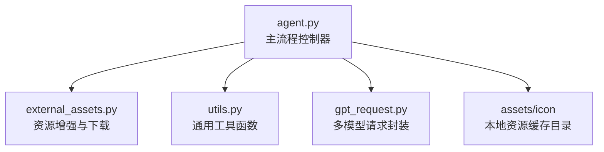
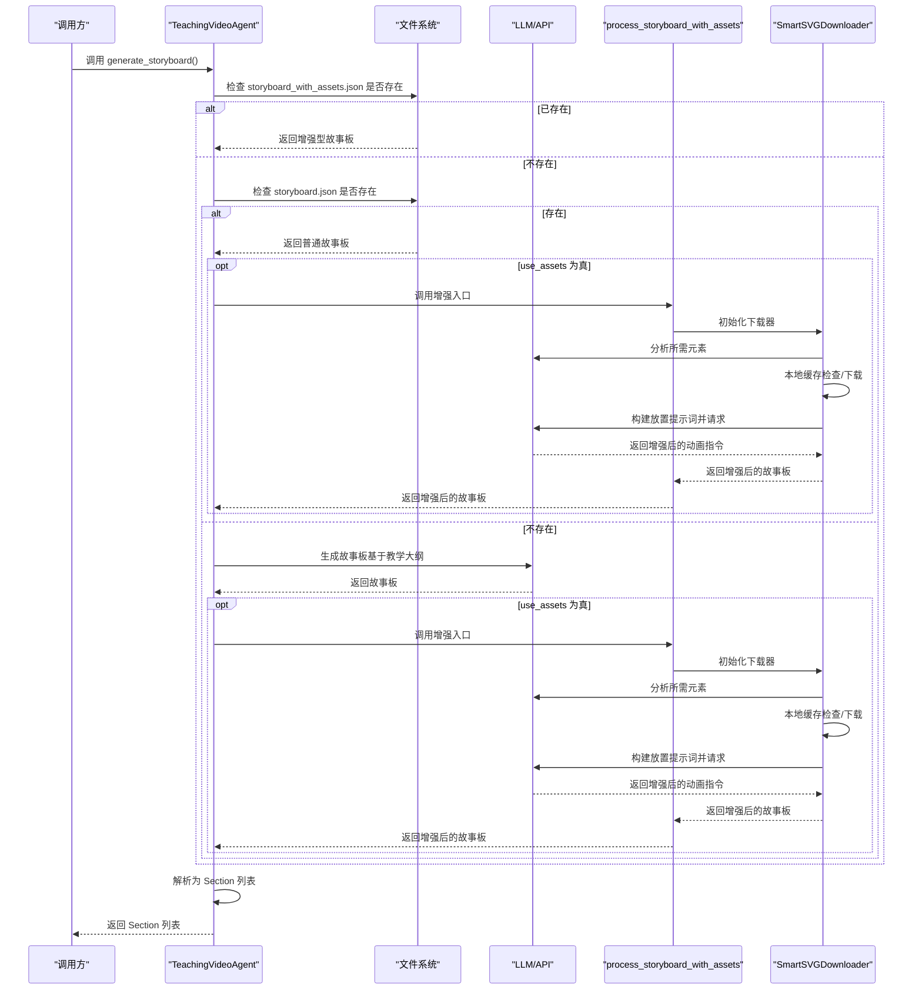
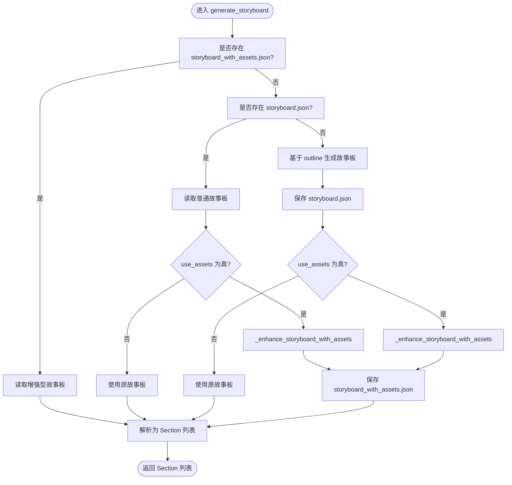
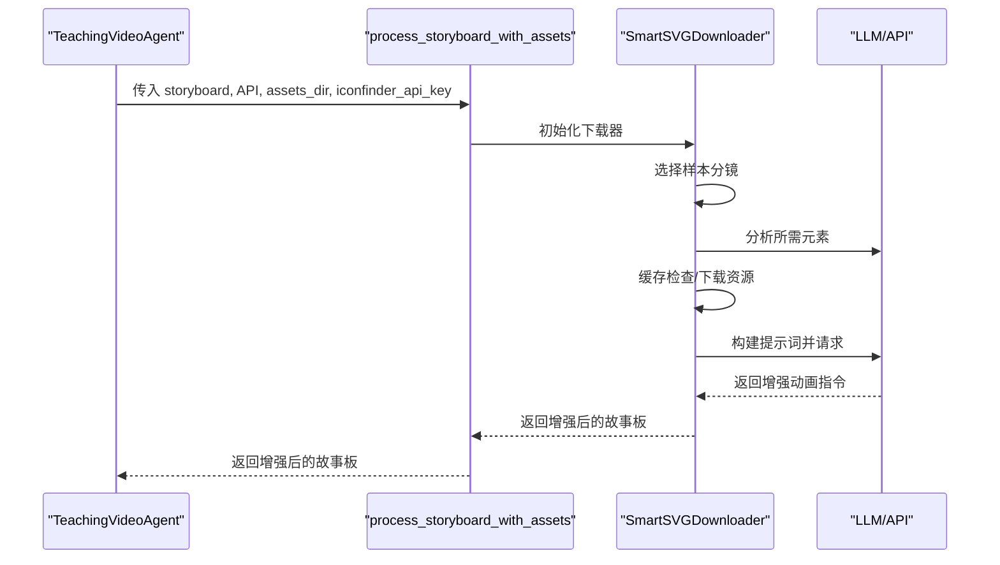
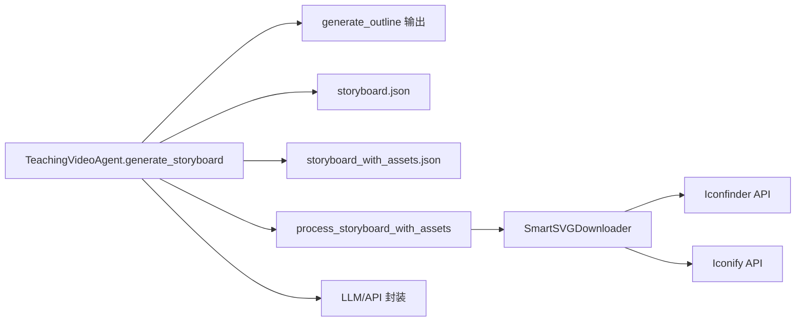

# generate_storyboard 方法

<cite>
**本文引用的文件**
- [agent.py](file://src/agent.py)
- [external_assets.py](file://src/external_assets.py)
- [utils.py](file://src/utils.py)
- [gpt_request.py](file://src/gpt_request.py)
</cite>

## 目录
1. [简介](#简介)
2. [项目结构](#项目结构)
3. [核心组件](#核心组件)
4. [架构总览](#架构总览)
5. [详细组件分析](#详细组件分析)
6. [依赖关系分析](#依赖关系分析)
7. [性能考量](#性能考量)
8. [故障排查指南](#故障排查指南)
9. [结论](#结论)
10. [附录](#附录)

## 简介
本文件围绕 generate_storyboard 方法展开，系统性解析其在“教学大纲”基础上生成“智能故事板”的完整流程。文档强调以下关键点：
- 前置条件：必须先调用 generate_outline，否则直接抛出异常。
- 三种执行路径：加载已存在的增强型故事板、加载普通故事板并进行资源增强、或通过 LLM 从头生成。
- _with_assets 分支中 process_storyboard_with_assets 的集成方式与 SmartSVGDownloader 的实际应用。
- 文件结构差异：storyboard.json 与 storyboard_with_assets.json 的字段组织与用途。
- Section 对象的转换逻辑与数据来源。
- 动画指令与讲稿文本的组织方式。
- 错误重试机制与性能优化策略。

## 项目结构
本仓库以模块化方式组织，generate_storyboard 位于主流程控制器中，资源增强由外部资产模块提供，工具函数与 API 请求封装分别位于 utils 与 gpt_request 中。

图表来源
- [agent.py](file://src/agent.py#L189-L294)
- [external_assets.py](file://src/external_assets.py#L1-L219)
- [utils.py](file://src/utils.py#L1-L210)
- [gpt_request.py](file://src/gpt_request.py#L1-L200)

章节来源
- [agent.py](file://src/agent.py#L189-L294)

## 核心组件
- TeachingVideoAgent.generate_storyboard：负责根据教学大纲生成/加载故事板，并将结果转换为 Section 列表。
- SmartSVGDownloader：在“资源增强”路径中，分析所需元素、下载图标资源、构建提示词并调用 LLM 将资源注入动画指令。
- process_storyboard_with_assets：对外暴露的增强入口，桥接 Agent 与 SmartSVGDownloader。
- Section：轻量数据类，承载每个分镜的 id、标题、讲稿行与动画指令列表。

章节来源
- [agent.py](file://src/agent.py#L189-L294)
- [external_assets.py](file://src/external_assets.py#L1-L219)

## 架构总览
下图展示 generate_storyboard 的三种执行路径与关键交互：

图表来源
- [agent.py](file://src/agent.py#L189-L294)
- [external_assets.py](file://src/external_assets.py#L1-L219)
- [gpt_request.py](file://src/gpt_request.py#L1-L200)

## 详细组件分析

### generate_storyboard 方法的三路径与控制流
- 路径一：加载已存在的增强型故事板
  - 若 storyboard_with_assets.json 存在，则直接读取并作为增强版故事板使用。
- 路径二：加载普通故事板并进行资源增强
  - 若 storyboard.json 存在但未增强：
    - 当 use_assets 为真时，调用 _enhance_storyboard_with_assets 进行增强；
    - 否则直接使用原故事板。
- 路径三：通过 LLM 从头生成
  - 若两者均不存在：
    - 使用 generate_outline 输出的 outline 生成故事板；
    - 保存原始 storyboard.json；
    - 若 use_assets 为真，再进行增强并保存 storyboard_with_assets.json。

图表来源
- [agent.py](file://src/agent.py#L189-L294)

章节来源
- [agent.py](file://src/agent.py#L189-L294)

### _enhance_storyboard_with_assets 与 SmartSVGDownloader 集成
- 入口：TeachingVideoAgent._enhance_storyboard_with_assets
- 实现：调用 process_storyboard_with_assets，传入 API 函数、assets_dir 与 iconfinder_api_key。
- 内部：SmartSVGDownloader.process_storyboard
  - 选择首尾若干分镜作为样本，分析所需元素；
  - 本地缓存优先，缺失才下载（支持 Iconfinder 与 Iconify）；
  - 构建“可用资源映射 + 动画结构”的提示词，请求 LLM 返回增强后的动画指令；
  - 将增强结果写回 storyboard_with_assets.json 并返回。

图表来源
- [agent.py](file://src/agent.py#L274-L294)
- [external_assets.py](file://src/external_assets.py#L1-L219)

章节来源
- [agent.py](file://src/agent.py#L274-L294)
- [external_assets.py](file://src/external_assets.py#L1-L219)

### 文件结构差异：storyboard.json vs storyboard_with_assets.json
- storyboard.json
  - 由 LLM 直接生成，包含 sections 数组，每项含 id、title、lecture_lines、animations。
  - 保存于输出目录，作为中间产物。
- storyboard_with_assets.json
  - 在 use_assets 为真时生成，内容结构与 storyboard.json 相同，但 animations 字段可能被 LLM 注入了资源路径信息（例如 [Asset: ...]）。
  - 用于后续渲染阶段直接消费，避免重复增强。

章节来源
- [agent.py](file://src/agent.py#L189-L294)
- [external_assets.py](file://src/external_assets.py#L1-L219)

### Section 对象的转换逻辑
- generate_storyboard 会将增强后的故事板 sections 字段逐一解析为 Section 对象：
  - id：分镜标识
  - title：分镜标题
  - lecture_lines：讲稿文本列表
  - animations：动画指令列表
- 这些 Section 将驱动后续代码生成与渲染流程。

章节来源
- [agent.py](file://src/agent.py#L260-L272)

### 动画指令与讲稿文本的组织方式
- 讲稿文本 lecture_lines 与动画指令 animations 通常按分镜维度一一对应，便于在渲染阶段将讲稿与动画同步。
- 在资源增强路径中，LLM 可能对 animations 进行改写，加入资源路径信息，使渲染阶段可直接引用本地资源。

章节来源
- [agent.py](file://src/agent.py#L260-L272)
- [external_assets.py](file://src/external_assets.py#L48-L110)

### 错误重试机制
- generate_outline 与 generate_storyboard 均内置重试逻辑：
  - 最多重试次数由 max_regenerate_tries 控制；
  - API 调用失败或 JSON 解析失败时，打印警告并继续尝试；
  - 达到最大重试次数仍未成功，抛出明确异常。
- API 请求封装层（如 request_claude_token、request_gpt4o_token 等）也采用指数退避与抖动的重试策略，提升稳定性。

章节来源
- [agent.py](file://src/agent.py#L138-L188)
- [agent.py](file://src/agent.py#L190-L294)
- [gpt_request.py](file://src/gpt_request.py#L1-L200)

### 性能优化策略
- 并发与并行
  - 代码生成阶段使用线程池并发处理多个分镜；
  - 视频渲染阶段使用进程池并行渲染，提高吞吐。
- 资源复用
  - SmartSVGDownloader 优先使用本地缓存，减少网络请求；
  - 仅对缺失元素进行下载，降低 I/O 开销。
- Token 统计与限制
  - TeachingVideoAgent 内置 token_usage 统计，便于成本控制；
  - API 请求封装统一返回 usage，便于追踪消耗。
- 系统监控
  - utils 提供资源监控与最优并行度计算，辅助运行时自适应调整。

章节来源
- [agent.py](file://src/agent.py#L518-L666)
- [external_assets.py](file://src/external_assets.py#L128-L183)
- [utils.py](file://src/utils.py#L53-L90)
- [gpt_request.py](file://src/gpt_request.py#L1-L200)

## 依赖关系分析
- generate_storyboard 依赖：
  - generate_outline 的输出（TeachingOutline）；
  - 文件系统（读写 storyboard.json 与 storyboard_with_assets.json）；
  - process_storyboard_with_assets 与 SmartSVGDownloader（use_assets 为真时）；
  - API 请求封装（LLM 调用）。
- 外部资产模块依赖：
  - Iconfinder 与 Iconify 接口；
  - LLM 提示词模板（由 prompts 模块提供，虽文件不在当前仓库，但调用处可见）。

图表来源
- [agent.py](file://src/agent.py#L189-L294)
- [external_assets.py](file://src/external_assets.py#L1-L219)
- [gpt_request.py](file://src/gpt_request.py#L1-L200)

章节来源
- [agent.py](file://src/agent.py#L189-L294)
- [external_assets.py](file://src/external_assets.py#L1-L219)

## 性能考量
- I/O 与网络
  - 优先使用本地缓存，减少重复下载；
  - 合理设置超时与重试，避免阻塞。
- 渲染与生成
  - 代码生成与视频渲染并行化，充分利用多核；
  - 严格控制最大并行度，避免内存与 CPU 过载。
- 成本控制
  - 统计 token 使用，结合 max_code_token_length 限制响应长度；
  - 在高并发场景下，合理配置重试与退避参数。

[本节为通用指导，不直接分析具体文件]

## 故障排查指南
- 常见问题
  - 未先生成教学大纲：调用 generate_storyboard 前必须先调用 generate_outline，否则抛出异常。
  - API 请求失败：检查 API 密钥与网络连通性；查看重试日志与退避延迟。
  - JSON 解析失败：确认 LLM 返回内容符合预期格式，必要时调整提示词或增加重试次数。
  - 资源下载失败：检查 iconfinder_api_key 与网络；观察缓存命中情况。
- 定位手段
  - 查看 generate_outline 与 generate_storyboard 的重试日志；
  - 检查 storyboard.json 与 storyboard_with_assets.json 的生成时间与内容；
  - 使用 utils 的资源监控函数观察系统负载。

章节来源
- [agent.py](file://src/agent.py#L138-L188)
- [agent.py](file://src/agent.py#L190-L294)
- [utils.py](file://src/utils.py#L73-L90)

## 结论
generate_storyboard 是连接“教学大纲”与“可渲染故事板”的关键桥梁。它通过三种稳健的执行路径确保在不同条件下都能产出可用的故事板，并在 use_assets 为真时借助 SmartSVGDownloader 与 LLM 实现资源的智能注入。配合完善的重试与性能优化策略，该方法能够在保证质量的同时提升整体吞吐与稳定性。

[本节为总结性内容，不直接分析具体文件]

## 附录
- 关键实现位置参考
  - generate_storyboard 主流程：[agent.py](file://src/agent.py#L189-L294)
  - 资源增强入口：[agent.py](file://src/agent.py#L274-L294)、[external_assets.py](file://src/external_assets.py#L194-L200)
  - SmartSVGDownloader 核心逻辑：[external_assets.py](file://src/external_assets.py#L1-L183)
  - API 请求封装与重试：[gpt_request.py](file://src/gpt_request.py#L1-L200)
  - Section 转换与解析：[agent.py](file://src/agent.py#L260-L272)