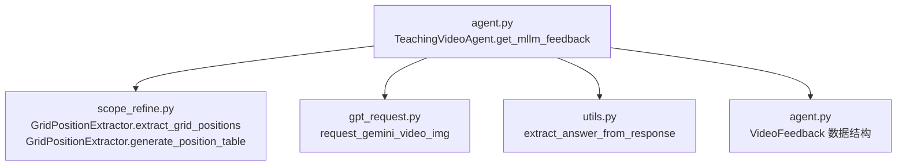
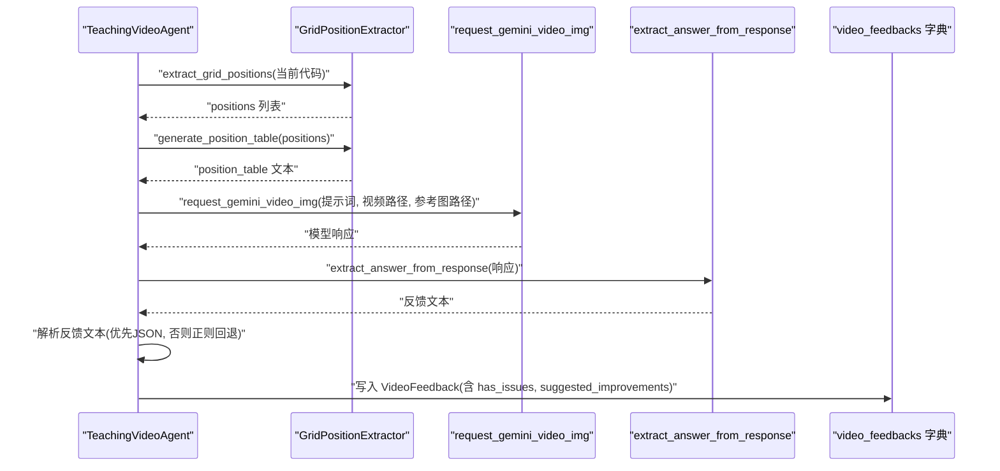
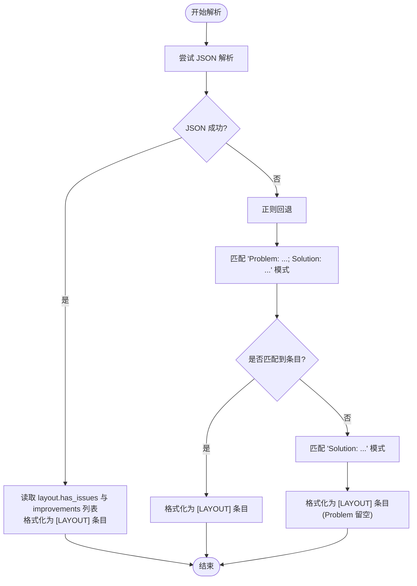
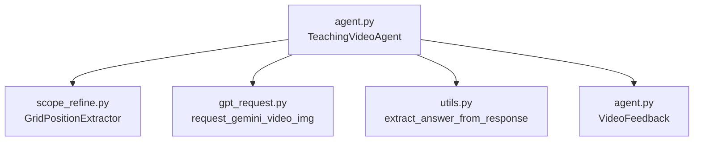

# get_mllm_feedback 方法

<cite>
**本文引用的文件列表**
- [agent.py](file://src/agent.py)
- [scope_refine.py](file://src/scope_refine.py)
- [gpt_request.py](file://src/gpt_request.py)
- [utils.py](file://src/utils.py)
</cite>

## 目录
1. [简介](#简介)
2. [项目结构](#项目结构)
3. [核心组件](#核心组件)
4. [架构总览](#架构总览)
5. [详细组件分析](#详细组件分析)
6. [依赖关系分析](#依赖关系分析)
7. [性能考量](#性能考量)
8. [故障排查指南](#故障排查指南)
9. [结论](#结论)

## 简介
本节聚焦于 get_mllm_feedback() 方法，该方法利用多模态大模型（MLLM）对已渲染完成的视频进行视觉布局评估。其输入参数为当前片段对象与视频文件路径；在内部，该方法会结合 GridPositionExtractor 分析代码中的元素坐标，生成 position_table 作为提示词的一部分，从而指导 MLLM 对布局进行评估。随后通过 request_gemini_video_img API 发起多模态请求，提示词由 get_prompt4_layout_feedback 设计；当模型返回的非结构化文本无法被 JSON 解析时，采用正则回退机制提取问题与建议。最终，将 has_issues 与 suggested_improvements 等字段封装到 VideoFeedback 数据结构中，并存入 video_feedbacks 字典，供后续优化流程使用。

## 项目结构
围绕 get_mllm_feedback 的关键文件与职责如下：
- agent.py：包含 TeachingVideoAgent 类、VideoFeedback 数据结构、get_mllm_feedback 方法、以及调用 request_gemini_video_img 的封装。
- scope_refine.py：提供 GridPositionExtractor，负责从 Manim 代码中抽取网格位置信息并生成表格。
- gpt_request.py：封装多模态请求接口 request_gemini_video_img，支持视频与参考图同时输入。
- utils.py：提供 extract_answer_from_response 等工具函数，统一从不同模型响应中提取文本内容。

图表来源
- [agent.py](file://src/agent.py#L402-L459)
- [scope_refine.py](file://src/scope_refine.py#L683-L751)
- [gpt_request.py](file://src/gpt_request.py#L192-L273)
- [utils.py](file://src/utils.py#L19-L28)

章节来源
- [agent.py](file://src/agent.py#L402-L459)
- [scope_refine.py](file://src/scope_refine.py#L683-L751)
- [gpt_request.py](file://src/gpt_request.py#L192-L273)
- [utils.py](file://src/utils.py#L19-L28)

## 核心组件
- VideoFeedback 数据结构：用于承载单轮 MLLM 布局评估的结果，包含字段 section_id、video_path、has_issues、suggested_improvements、raw_response。
- GridPositionExtractor：从 Manim 代码中抽取 place_at_grid 与 place_in_area 调用，生成 position_table。
- request_gemini_video_img：以“文本 + 视频 + 参考图”三模态形式发起请求。
- extract_answer_from_response：统一从不同模型响应中提取可解析文本。

章节来源
- [agent.py](file://src/agent.py#L34-L41)
- [scope_refine.py](file://src/scope_refine.py#L683-L751)
- [gpt_request.py](file://src/gpt_request.py#L192-L273)
- [utils.py](file://src/utils.py#L19-L28)

## 架构总览
下图展示了 get_mllm_feedback 在整体流程中的位置与交互关系。

图表来源
- [agent.py](file://src/agent.py#L402-L459)
- [scope_refine.py](file://src/scope_refine.py#L683-L751)
- [gpt_request.py](file://src/gpt_request.py#L192-L273)
- [utils.py](file://src/utils.py#L19-L28)

## 详细组件分析

### get_mllm_feedback 方法
- 输入参数
  - section：当前片段对象，包含 id、title、lecture_lines、animations 等字段。
  - video_path：已渲染完成的视频文件路径（MP4）。
  - round_number：当前反馈轮次编号（用于命名存储键值）。
- 处理流程
  1) 读取当前片段对应的 Manim 代码。
  2) 使用 GridPositionExtractor 提取 place_at_grid 与 place_in_area 调用，得到 positions。
  3) 生成 position_table，作为提示词的一部分。
  4) 调用 request_gemini_video_img 发起多模态请求（文本提示词 + 视频 + 参考图）。
  5) 使用 extract_answer_from_response 统一提取模型回复文本。
  6) 解析策略
     - 优先尝试 JSON 解析，读取 layout.has_issues 与 layout.improvements 列表，将每条改进项格式化为“[LAYOUT] Problem: ...; Solution: ...”。
     - 若 JSON 解析失败，则采用正则回退：先按“Problem: ...; Solution: ...”模式匹配，再回退到“Solution: ...”模式。
  7) 封装 VideoFeedback 并写入 self.video_feedbacks，键名形如 “{section_id}_round{round_number}”。

- 输出
  - 返回 VideoFeedback 实例，包含 section_id、video_path、has_issues、suggested_improvements、raw_response。
  - 同时将该实例存入 self.video_feedbacks，便于后续优化流程复用。

- 错误处理
  - 若请求或解析异常，返回 has_issues=False、空建议列表，并将错误信息写入 raw_response。

章节来源
- [agent.py](file://src/agent.py#L402-L459)

#### 解析策略流程图（JSON 优先，正则回退）

图表来源
- [agent.py](file://src/agent.py#L410-L435)

### GridPositionExtractor 与 position_table
- 功能
  - 从 Manim 代码中抽取 place_at_grid 与 place_in_area 调用，记录对象名、方法、网格位置、缩放因子、所在行号及原始代码行。
  - 生成表格字符串，便于提示词直接引用。
- 表格字段
  - Object：对象名
  - Method：方法名（place_at_grid 或 place_in_area）
  - Position：网格位置（如 B2 或 A1-C3）
  - Scale：缩放因子（未设置时为默认）
  - Line：代码行号

章节来源
- [scope_refine.py](file://src/scope_refine.py#L683-L751)

### request_gemini_video_img API 调用流程
- 请求参数
  - prompt：布局评估提示词（由 get_prompt4_layout_feedback 生成）。
  - video_path：视频文件路径（本地 MP4）。
  - image_path：参考图路径（GRID.png），用于提供网格布局参考。
- 请求细节
  - 将视频与图片分别进行 base64 编码，构造多模态消息体。
  - 支持重试与指数退避，返回模型响应。
- Token 统计
  - 在 _request_video_api_and_track_tokens 中累加 prompt_tokens/completion_tokens/total_tokens。

章节来源
- [gpt_request.py](file://src/gpt_request.py#L192-L273)
- [agent.py](file://src/agent.py#L124-L132)

### VideoFeedback 数据结构
- 字段说明
  - section_id：片段标识符
  - video_path：视频文件路径
  - has_issues：是否存在布局问题（布尔）
  - suggested_improvements：改进建议列表（字符串数组，格式为“[LAYOUT] Problem: ...; Solution: ...”）
  - raw_response：原始模型回复文本（用于调试与回溯）

- 生成逻辑
  - has_issues：来源于 JSON 中 layout.has_issues 的布尔值；若 JSON 解析失败，则置为 False。
  - suggested_improvements：来源于 JSON 中 layout.improvements 的条目；若 JSON 解析失败，则通过正则回退提取。
  - raw_response：始终保留原始回复文本。

- 存储方式
  - 写入 self.video_feedbacks，键名形如 “{section_id}_round{round_number}”，便于后续优化流程检索与复用。

章节来源
- [agent.py](file://src/agent.py#L34-L41)
- [agent.py](file://src/agent.py#L441-L449)

## 依赖关系分析
- 组件耦合
  - TeachingVideoAgent 依赖 GridPositionExtractor 生成 position_table，再依赖 request_gemini_video_img 发起多模态请求。
  - extract_answer_from_response 作为统一文本提取器，降低不同模型响应差异带来的影响。
- 外部依赖
  - gpt_request.py 提供多模态请求能力，支持视频与图片输入。
- 潜在循环依赖
  - 当前模块间无循环导入，耦合方向清晰（agent -> extractor -> gpt_request -> utils）。

图表来源
- [agent.py](file://src/agent.py#L402-L459)
- [scope_refine.py](file://src/scope_refine.py#L683-L751)
- [gpt_request.py](file://src/gpt_request.py#L192-L273)
- [utils.py](file://src/utils.py#L19-L28)

章节来源
- [agent.py](file://src/agent.py#L402-L459)
- [scope_refine.py](file://src/scope_refine.py#L683-L751)
- [gpt_request.py](file://src/gpt_request.py#L192-L273)
- [utils.py](file://src/utils.py#L19-L28)

## 性能考量
- 视频与图片编码开销：request_gemini_video_img 会对视频与图片进行 base64 编码，体积较大时可能增加网络传输与解析成本。
- 正则回退成本：当 JSON 解析失败时，正则匹配会带来额外时间开销；但通常只在极少数情况下触发。
- Token 统计：_request_video_api_and_track_tokens 会在每次请求后累加 token 使用量，便于成本控制与预算管理。
- 建议
  - 控制视频大小与帧率，避免超大文件导致编码与传输耗时过长。
  - 保持提示词简洁明确，减少不必要的冗余信息，提高 JSON 结构稳定性，降低正则回退概率。

## 故障排查指南
- 视频文件不存在
  - 现象：抛出“文件未找到”异常。
  - 排查：确认 video_path 是否正确且存在。
- 参考图缺失
  - 现象：抛出“图像文件未找到”异常。
  - 排查：确认 GRID.png 路径有效。
- JSON 解析失败
  - 现象：进入正则回退分支，尝试提取“Problem: ...; Solution: ...”或“Solution: ...”。
  - 排查：检查模型输出是否符合预期格式；必要时调整提示词以增强结构化输出。
- 请求异常
  - 现象：捕获异常并返回 VideoFeedback(has_issues=False, suggested_improvements=[], raw_response=错误信息)。
  - 排查：查看日志与重试机制，确认网络与服务端可用性。

章节来源
- [gpt_request.py](file://src/gpt_request.py#L224-L273)
- [agent.py](file://src/agent.py#L451-L459)

## 结论
get_mllm_feedback 方法通过“代码网格分析 + 多模态布局评估”的组合，实现了对教学动画视频的自动化布局质量评估。其设计要点在于：
- 使用 GridPositionExtractor 将代码中的布局信息结构化为 position_table，提升提示词的可解释性与准确性。
- 采用 request_gemini_video_img 同时输入视频与参考图，使 MLLM 能够基于网格参考进行更精准的判断。
- 解析策略兼顾结构化与非结构化：优先 JSON，失败时以正则回退，确保鲁棒性。
- 将评估结果标准化为 VideoFeedback，并持久化至 video_feedbacks，为后续优化与迭代提供可靠依据。