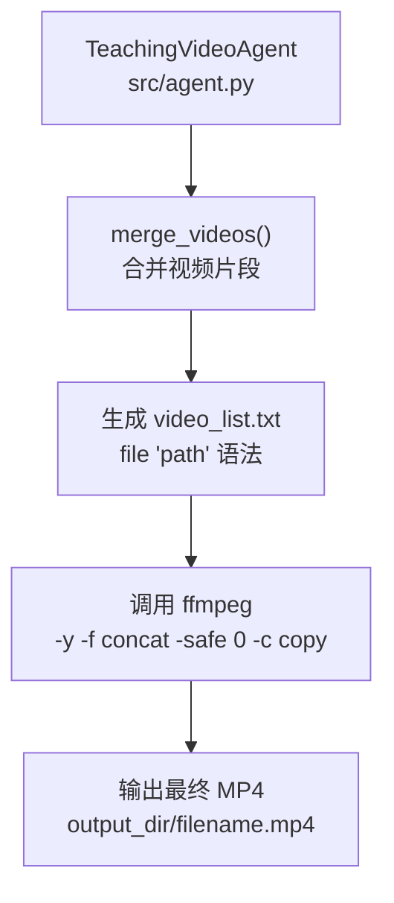
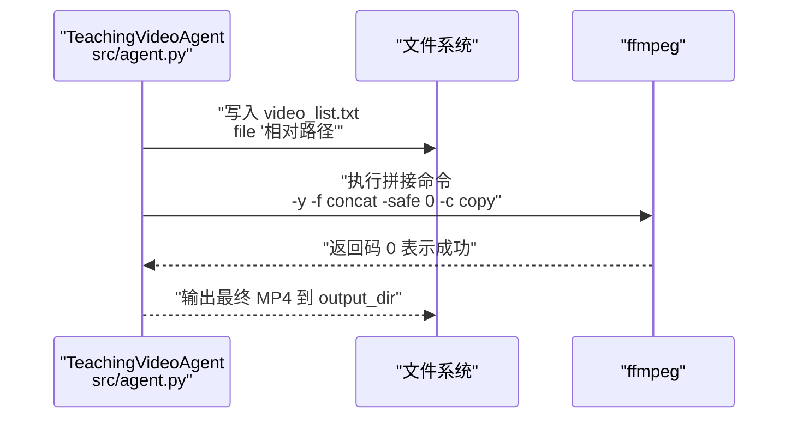
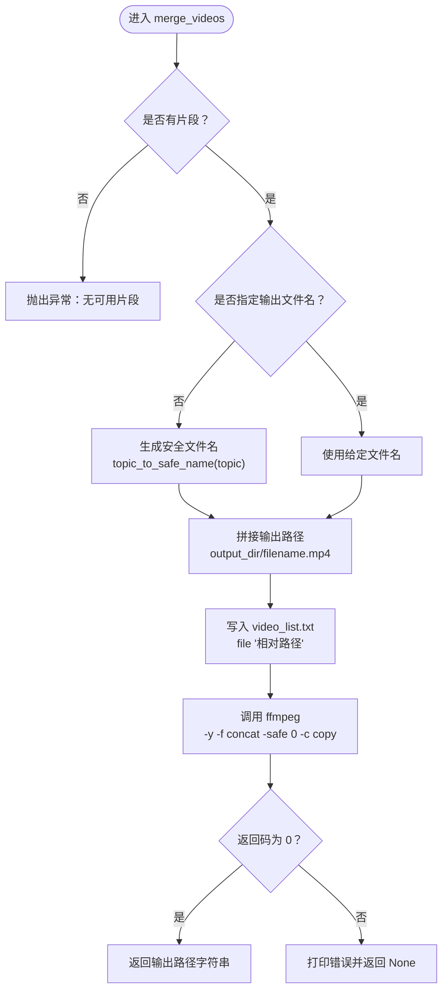
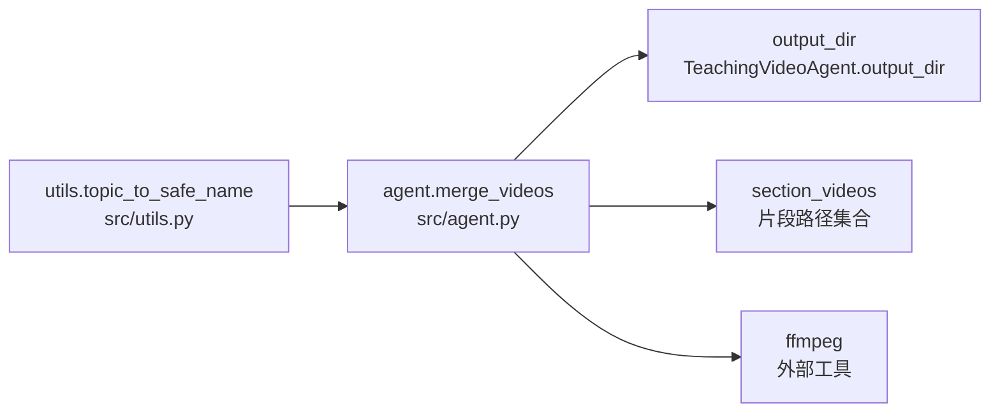

# merge_videos 方法

<cite>
**本文引用的文件**
- [src/agent.py](file://src/agent.py)
- [src/utils.py](file://src/utils.py)
</cite>

## 目录
1. [简介](#简介)
2. [项目结构](#项目结构)
3. [核心组件](#核心组件)
4. [架构总览](#架构总览)
5. [详细组件分析](#详细组件分析)
6. [依赖关系分析](#依赖关系分析)
7. [性能考量](#性能考量)
8. [故障排查指南](#故障排查指南)
9. [结论](#结论)

## 简介
本文件围绕 merge_videos() 方法的技术文档展开，该方法位于 TeachingVideoAgent 类中，负责将流水线末端生成的多个独立视频片段合并为最终成品。该方法通过调用外部工具 ffmpeg，采用 concat 协议对视频进行无损拼接（复制流，不重新编码），确保质量与效率兼顾。输入来自 self.section_videos 字典中的有序视频路径列表；输出文件名由主题名称安全化策略生成，并统一写入到指定输出目录。

## 项目结构
- merge_videos() 位于 src/agent.py 中的 TeachingVideoAgent 类内，作为流水线的最后一步执行。
- 视频拼接的核心逻辑依赖于 ffmpeg 命令行工具，参数使用 -y、-f concat、-safe 0、-c copy 等选项，配合一个“文件列表”文本文件完成无损拼接。
- 输出文件名生成策略由 topic_to_safe_name() 提供，确保文件系统兼容性；输出路径由 Agent 的 output_dir 统一管理。

图表来源
- [src/agent.py](file://src/agent.py#L666-L701)

章节来源
- [src/agent.py](file://src/agent.py#L666-L701)

## 核心组件
- merge_videos(self, output_filename: str = None) -> str
  - 输入：可选输出文件名；若为空则基于学习主题生成安全文件名。
  - 处理：按 section_videos 键排序，生成 video_list.txt；调用 ffmpeg 进行无损拼接。
  - 返回：成功时返回最终输出文件的绝对路径字符串，失败时返回 None。
- topic_to_safe_name(knowledge_point) -> str
  - 将学习主题转换为文件系统安全的文件名，移除非法字符并将连续空格替换为下划线。
- 视频列表文件 video_list.txt
  - 每行一条记录，采用 file '相对路径' 的语法，用于 ffmpeg 的 concat 协议。

章节来源
- [src/agent.py](file://src/agent.py#L666-L701)
- [src/utils.py](file://src/utils.py#L175-L181)

## 架构总览
merge_videos() 在流水线末端承担“收尾”职责，它依赖以下组件：
- 数据来源：self.section_videos（已渲染完成的片段路径集合）
- 路径管理：self.output_dir（统一输出根目录）
- 文件生成：video_list.txt（供 ffmpeg 读取的列表文件）
- 工具链：ffmpeg（无损拼接）

图表来源
- [src/agent.py](file://src/agent.py#L666-L701)

## 详细组件分析

### merge_videos() 方法
- 功能定位
  - 流水线末端：在所有片段渲染完成后，将它们合并为最终成品。
  - 安全性：若未显式指定输出文件名，则使用主题安全化后的名称。
  - 可靠性：捕获异常并打印错误信息，返回 None 以提示上层处理。
- 输入与数据来源
  - 来自 self.section_videos 的键值对，键为片段 ID，值为对应视频文件的绝对路径。
  - 合并顺序：按键排序，保证稳定且可重复的拼接顺序。
- 列表文件生成
  - 生成 video_list.txt，每行采用 file '相对路径' 的语法，路径去除 output_dir 前缀，确保 ffmpeg 能正确解析。
- ffmpeg 参数说明
  - -y：覆盖输出文件（避免交互确认）
  - -f concat：选择 concat 协议
  - -safe 0：允许使用相对路径（相对于 concat 协议的安全策略）
  - -c copy：直接复制音视频流，不做重编码，实现无损拼接
  - -i video_list.txt：读取列表文件
  - 最后参数为目标输出路径（output_dir/filename.mp4）
- 输出与路径管理
  - 若未指定输出文件名，使用 topic_to_safe_name() 生成安全文件名并追加 .mp4 扩展。
  - 输出路径为 self.output_dir / filename.mp4。

图表来源
- [src/agent.py](file://src/agent.py#L666-L701)
- [src/utils.py](file://src/utils.py#L175-L181)

章节来源
- [src/agent.py](file://src/agent.py#L666-L701)

### 输出文件名生成策略（topic_to_safe_name）
- 设计目标：确保文件名能在文件系统中安全使用，避免非法字符导致的写入失败或路径解析问题。
- 实现要点：
  - 移除不允许的字符，保留字母数字、空格、下划线、连字符、花括号、方括号、逗号、加号、与号、单引号、等号以及希腊小写 pi（π）。
  - 将连续空格压缩为单一下划线，去除首尾空白。
- 使用场景：
  - 当 output_filename 为空时，merge_videos() 会调用该函数生成安全文件名，再拼接 .mp4 扩展。

章节来源
- [src/utils.py](file://src/utils.py#L175-L181)

### 视频列表文件 video_list.txt 的生成格式
- 每行一条记录，采用 file '相对路径' 的语法，其中相对路径是去掉 output_dir 前缀的片段路径。
- 作用：供 ffmpeg 的 concat 协议读取，按顺序拼接视频片段。
- 注意事项：
  - 必须与 ffmpeg 的工作目录或相对路径规则匹配，否则可能导致找不到文件。
  - 由于使用 -safe 0，允许相对路径，但路径必须存在于输出目录结构中。

章节来源
- [src/agent.py](file://src/agent.py#L679-L684)

### subprocess 调用 ffmpeg 的具体参数
- 关键参数说明：
  - -y：自动覆盖输出文件
  - -f concat：启用 concat 协议
  - -safe 0：允许使用相对路径（concat 协议默认只接受绝对路径）
  - -i video_list.txt：输入为列表文件
  - -c copy：直接复制音视频流，不做重编码，实现无损拼接
  - 最后参数为目标输出路径（output_dir/filename.mp4）
- 返回码判断：
  - 返回码为 0 表示成功；非零表示失败，错误信息从 stderr 输出。

章节来源
- [src/agent.py](file://src/agent.py#L686-L700)

### 在流水线末端的集成作用
- merge_videos() 是流水线的收尾步骤，通常在以下流程之后执行：
  - 生成大纲与故事板
  - 生成并渲染各片段代码
  - 可选：MLLM 反馈优化
  - 渲染完成，收集 self.section_videos
- 调用位置：
  - 在 GENERATE_VIDEO() 中，渲染完成后调用 merge_videos() 生成最终成品。

章节来源
- [src/agent.py](file://src/agent.py#L702-L718)

## 依赖关系分析
- merge_videos() 依赖：
  - topic_to_safe_name()：用于生成安全文件名
  - ffmpeg：外部工具，用于无损拼接
  - self.output_dir：统一输出目录
  - self.section_videos：片段路径集合
- 依赖关系图：

图表来源
- [src/agent.py](file://src/agent.py#L666-L701)
- [src/utils.py](file://src/utils.py#L175-L181)

章节来源
- [src/agent.py](file://src/agent.py#L666-L701)
- [src/utils.py](file://src/utils.py#L175-L181)

## 性能考量
- 无损拼接的优势：-c copy 避免了重编码过程，显著降低 CPU 开销与时间成本，适合大规模片段合并。
- I/O 与磁盘空间：合并前请确保输出目录有足够空间；合并过程中需顺序读取多个大文件，建议使用高速存储介质。
- 并发与顺序：merge_videos() 本身不并发执行，但可在上层批处理框架中并行渲染片段，再串行合并，以平衡资源占用与稳定性。

## 故障排查指南
- 常见失败原因与解决建议：
  - 文件路径错误
    - 现象：ffmpeg 报错找不到文件或路径无效
    - 原因：video_list.txt 中的相对路径与实际输出目录不一致，或片段路径不在 output_dir 下
    - 解决：确认 self.section_videos 中的路径均位于 self.output_dir 下；检查 video_list.txt 的路径是否为去掉 output_dir 前缀的相对路径
  - 编码不一致
    - 现象：拼接后播放器报错或画面/音频异常
    - 原因：各片段的编码参数（分辨率、帧率、编解码器）不一致
    - 解决：在渲染阶段统一参数，或在 ffmpeg 中添加必要的转码参数（如 -c:v libx264 -preset fast -crf 23），但会失去无损特性
  - ffmpeg 未安装或不可用
    - 现象：调用 subprocess 抛出异常或找不到命令
    - 解决：安装 ffmpeg 并将其加入系统 PATH；在 CI 环境中预装 ffmpeg
  - 权限不足
    - 现象：无法写入输出目录或 video_list.txt
    - 解决：检查输出目录权限，确保可写
  - 列表文件格式错误
    - 现象：ffmpeg 报错解析列表文件
    - 解决：确认每行均为 file '相对路径' 语法，且路径使用单引号包裹
- 建议的日志与调试：
  - 打印 ffmpeg 的 stderr 输出，便于快速定位问题
  - 在调用前打印 video_list.txt 内容，核对路径是否正确
  - 确认输出目录存在且可写

章节来源
- [src/agent.py](file://src/agent.py#L686-L700)

## 结论
merge_videos() 通过 ffmpeg 的 concat 协议实现了高效的无损视频拼接，结合安全文件名生成与统一路径管理，使整个流水线在保证质量的同时具备良好的稳定性与可维护性。在实际部署中，应重点关注片段编码一致性与 ffmpeg 的可用性，以确保拼接流程顺畅。