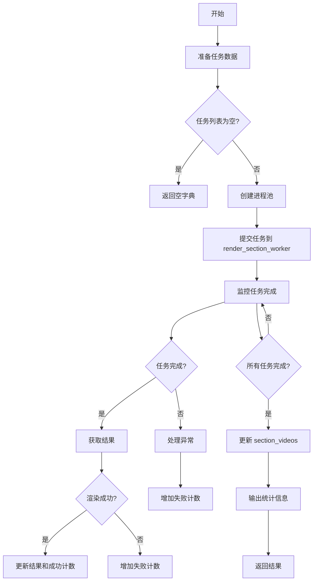
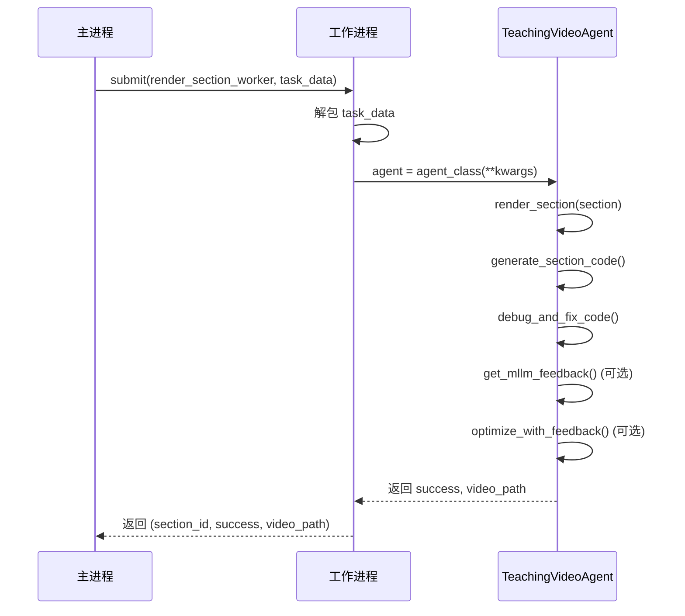

# render_all_sections 方法

<cite>
**本文档中引用的文件**   
- [agent.py](file://src/agent.py)
- [utils.py](file://src/utils.py)
</cite>

## 目录
1. [简介](#简介)
2. [核心组件](#核心组件)
3. [详细组件分析](#详细组件分析)
4. [性能调优建议](#性能调优建议)

## 简介
`render_all_sections` 方法是 Code2Video 项目中的核心功能之一，负责并行渲染所有视频片段。该方法利用多进程架构，通过 `ProcessPoolExecutor` 实现高效的并行处理，能够显著缩短视频生成的总耗时。其设计充分考虑了资源利用率和错误处理，通过 `max_workers` 参数控制并发度，并在任务执行完成后输出详细的统计信息。该方法与 `render_section_worker` 工作函数协同工作，实现了任务的序列化传递和分布式执行。

**Section sources**
- [agent.py](file://src/agent.py#L596-L665)

## 核心组件

`render_all_sections` 方法的实现依赖于多个关键组件。首先，它使用 `ProcessPoolExecutor` 来创建一个进程池，该进程池中的工作进程数量由 `max_workers` 参数决定。在任务准备阶段，方法会遍历 `self.sections` 列表，为每个视频片段构建一个可序列化的任务数据元组，该元组包含 `Section` 对象、`TeachingVideoAgent` 类本身以及通过 `get_serializable_state()` 获取的代理状态。这个设计允许每个工作进程独立地重建一个功能完整的 `TeachingVideoAgent` 实例来执行渲染任务。

任务的执行由 `render_section_worker` 函数负责。该函数接收一个任务数据元组，反序列化出 `Section`、`agent_class` 和 `kwargs`，然后创建一个新的 `agent` 实例，并调用其 `render_section` 方法来完成具体的渲染工作。`render_section` 方法内部封装了完整的渲染流程，包括代码生成、调试修复和多轮反馈优化。整个过程通过 `as_completed` 函数进行监控，确保能够及时处理每个任务的完成或失败状态，并最终汇总成功和失败的计数以及视频文件路径。

**Section sources**
- [agent.py](file://src/agent.py#L582-L665)
- [utils.py](file://src/utils.py#L53-L70)

## 详细组件分析

### render_all_sections 方法分析
`render_all_sections` 方法是实现并行渲染的核心。它首先打印启动信息，然后遍历所有待渲染的 `Section` 对象，为每个片段准备一个包含 `(section, self.__class__, self.get_serializable_state())` 的任务数据元组。这些元组被添加到 `tasks` 列表中。如果没有任何有效任务，方法会提前返回。随后，方法创建一个 `ProcessPoolExecutor` 实例，并将每个任务提交给 `render_section_worker` 函数执行。通过 `future_to_section` 字典，方法可以将 `Future` 对象映射回对应的 `section_id`，以便在结果处理时进行追踪。

在结果收集阶段，方法使用 `as_completed` 来迭代所有已完成的任务。对于每个完成的 `Future`，它会调用 `future.result(timeout=300)` 来获取结果，超时时间为300秒。根据返回的 `success` 和 `video_path`，方法会更新 `results` 字典、成功/失败计数，并打印相应的状态信息。最后，方法将收集到的结果更新到 `self.section_videos` 中，并输出包含总片段数和成功率的统计信息。



**Diagram sources**
- [agent.py](file://src/agent.py#L596-L665)

### render_section_worker 工作函数分析
`render_section_worker` 是一个关键的辅助函数，作为 `ProcessPoolExecutor` 中每个工作进程的入口点。它接收一个包含 `(section, agent_class, kwargs)` 的元组。函数首先尝试从 `kwargs` 中解包数据，然后使用 `agent_class(**kwargs)` 创建一个新的 `TeachingVideoAgent` 实例。这个实例是完全独立的，拥有自己的一套配置和状态，从而实现了进程间的隔离。接着，新创建的 `agent` 调用其 `render_section(section)` 方法来执行渲染。如果渲染成功，`agent.section_videos` 字典中会包含该片段的视频路径。函数最后返回一个包含 `section_id`、`success` 状态和 `video_path` 的元组，这个元组会被主进程收集和处理。



**Diagram sources**
- [agent.py](file://src/agent.py#L582-L594)

### render_section 内部流程分析
`render_section` 方法定义了单个视频片段的完整渲染流程。它首先尝试在有限的重试次数（`max_regenerate_tries`）内生成并调试代码。如果 `regenerate_attempt > 0`，它会重新生成代码。核心的调试步骤由 `debug_and_fix_code` 方法完成，该方法会调用 `manim` 命令行工具来渲染视频，并捕获任何错误。如果渲染失败，它会利用 `ScopeRefineFixer` 智能地修复代码中的错误，然后重试，最多尝试 `max_fix_bug_tries` 次。

一旦视频成功渲染，如果启用了反馈（`use_feedback=True`），系统会进入多轮反馈优化阶段。`get_mllm_feedback` 方法会使用多模态大模型（如 Gemini）分析生成的视频和参考图像，生成关于布局和内容的改进建议。`optimize_with_feedback` 方法则会根据这些建议，通过 `GridCodeModifier` 或重新生成代码的方式来优化 `Manim` 代码，并再次调用 `debug_and_fix_code` 来验证优化后的代码。这个过程会重复 `feedback_rounds` 轮，旨在不断提升视频质量。

```mermaid
flowchart TD
A[开始 render_section] --> B[代码生成与调试]
B --> C{尝试次数 < max_regenerate_tries?}
C --> |是| D[generate_section_code]
D --> E[debug_and_fix_code]
E --> F{成功?}
F --> |是| G[进入反馈优化]
F --> |否| H{尝试次数 < max_fix_bug_tries?}
H --> |是| I[修复代码并重试]
I --> E
H --> |否| J[增加尝试次数]
J --> C
C --> |否| K[渲染失败，跳过]
G --> L{use_feedback?}
L --> |是| M[for round in range(feedback_rounds)]
M --> N[get_mllm_feedback]
N --> O[optimize_with_feedback]
O --> P{优化成功?}
P --> |是| Q[保存优化后视频]
P --> |否| R[使用当前版本]
M --> S[结束]
L --> |否| S
S --> T[返回结果]
```

**Diagram sources**
- [agent.py](file://src/agent.py#L527-L580)

## 性能调优建议

为了获得最佳性能，建议根据运行环境的硬件配置合理设置 `max_workers` 参数。项目中的 `utils.py` 文件提供了一个 `get_optimal_workers()` 函数，该函数会自动检测 CPU 核心数，并推荐使用 `CPU核心数 - 1` 作为工作进程数，以保留一个核心给系统和其他进程。对于拥有超过16个核心的高性能机器，该函数会将最大工作进程数限制为16，以避免内存溢出。这是一个很好的起点。

在实践中，应避免将 `max_workers` 设置得过高，因为每个 `manim` 渲染进程都是 CPU 和内存密集型的。过多的并发进程会导致严重的资源竞争，反而降低整体效率，甚至可能导致系统不稳定。建议从 `get_optimal_workers()` 的推荐值开始，然后根据实际的系统资源监控（如 `monitor_system_resources()` 函数所示）进行微调。如果观察到 CPU 或内存使用率持续过高，应适当减少 `max_workers` 的值。此外，确保有足够的磁盘 I/O 带宽来处理多个视频文件的同时读写操作也是至关重要的。

**Section sources**
- [utils.py](file://src/utils.py#L53-L70)
- [utils.py](file://src/utils.py#L73-L88)