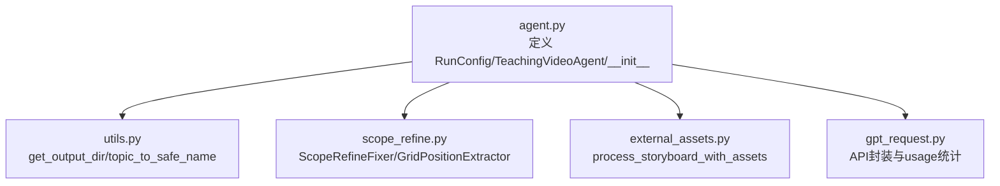
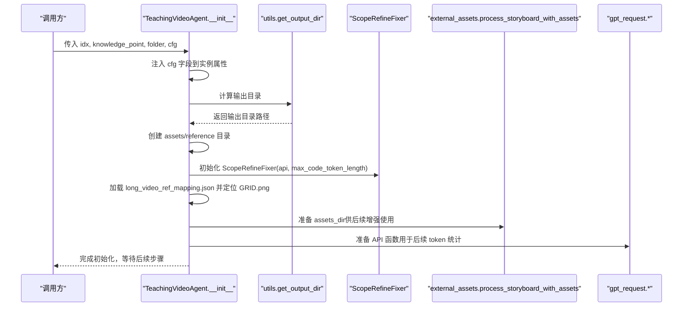
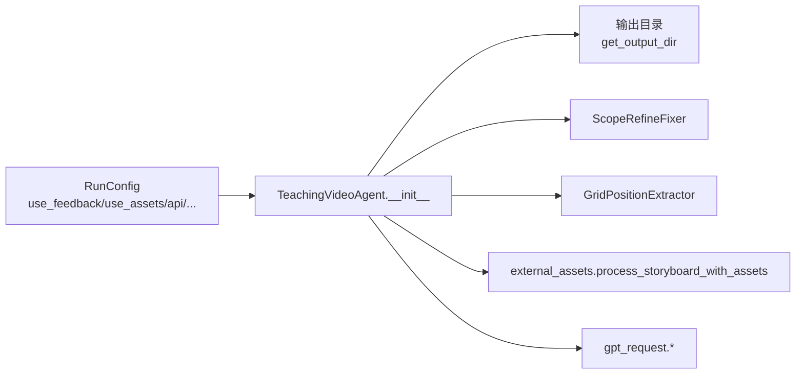

# 构造函数 __init__

<cite>
**本文引用的文件**
- [agent.py](file://src/agent.py)
- [utils.py](file://src/utils.py)
- [scope_refine.py](file://src/scope_refine.py)
- [external_assets.py](file://src/external_assets.py)
- [gpt_request.py](file://src/gpt_request.py)
</cite>

## 目录
1. [简介](#简介)
2. [项目结构](#项目结构)
3. [核心组件](#核心组件)
4. [架构总览](#架构总览)
5. [详细组件分析](#详细组件分析)
6. [依赖关系分析](#依赖关系分析)
7. [性能考量](#性能考量)
8. [故障排查指南](#故障排查指南)
9. [结论](#结论)

## 简介
本节聚焦于 TeachingVideoAgent 类的构造函数 __init__，系统性阐述其参数语义、配置注入机制、初始化流程与五大模块职责，并结合实际代码路径给出可操作的调用示例与最佳实践。该构造函数是视频生成流水线的入口，负责将 RunConfig 配置对象注入为内部属性，建立输出路径、ScopeRefine 代码修复器、外部资源数据库连接、核心数据结构等，为后续大纲生成、故事板生成、代码生成、渲染与反馈优化奠定基础。

## 项目结构
围绕构造函数的关键文件与职责如下：
- agent.py：定义 RunConfig、TeachingVideoAgent 及其 __init__；提供输出路径工具函数 get_output_dir；封装 API 请求与令牌统计。
- utils.py：提供 get_output_dir、topic_to_safe_name、stitch_videos 等通用工具。
- scope_refine.py：提供 ScopeRefineFixer、GridPositionExtractor、GridCodeModifier 等用于智能修复与布局分析。
- external_assets.py：提供 SmartSVGDownloader/process_storyboard_with_assets，用于资产下载与故事板增强。
- gpt_request.py：提供多种请求封装（Claude、Gemini、GPT-4o 等），统一返回带 usage 的响应，便于 token 统计。

图表来源
- [agent.py](file://src/agent.py#L43-L114)
- [utils.py](file://src/utils.py#L185-L193)
- [scope_refine.py](file://src/scope_refine.py#L250-L260)
- [external_assets.py](file://src/external_assets.py#L194-L200)
- [gpt_request.py](file://src/gpt_request.py#L1-L120)

章节来源
- [agent.py](file://src/agent.py#L43-L114)
- [utils.py](file://src/utils.py#L185-L193)

## 核心组件
- 参数与类型
  - idx：整数或可标识任务的序号，用于输出目录命名与任务追踪。
  - knowledge_point：字符串，表示学习主题或知识点名称，作为视频主题与输出目录的一部分。
  - folder：字符串，默认 "CASES"，作为输出根目录基名。
  - cfg：可选的 RunConfig 对象，若未传入则使用默认构造（见下文）。
- 配置注入与默认值
  - 构造函数将 cfg 中的关键字段映射到实例属性，包括 use_feedback、use_assets、api、feedback_rounds、iconfinder_api_key、max_code_token_length、max_fix_bug_tries、max_regenerate_tries、max_feedback_gen_code_tries、max_mllm_fix_bugs_tries。
  - 若 cfg 为 None，将在上层调用处使用默认 RunConfig() 实例（参见 run_Code2Video 的默认参数）。
- 初始化的五大模块
  1) 全局参数：学习主题、任务索引、配置对象及其字段。
  2) 输出路径：基于 idx 与 knowledge_point 生成安全目录名，确保输出目录存在；同时准备 assets 与 reference 资源目录。
  3) ScopeRefine 代码修复器与锚定视觉提取器：初始化 ScopeRefineFixer 与 GridPositionExtractor，用于后续错误定位与修复。
  4) 外部数据库：加载 long_video_ref_mapping.json，构建 KNOWLEDGE2PATH 映射，定位参考图片 GRID.png。
  5) 核心数据结构：outline、enhanced_storyboard、sections、section_codes、section_videos、video_feedbacks、token_usage 等。

章节来源
- [agent.py](file://src/agent.py#L58-L114)
- [agent.py](file://src/agent.py#L134-L140)
- [agent.py](file://src/agent.py#L189-L210)
- [agent.py](file://src/agent.py#L274-L294)
- [agent.py](file://src/agent.py#L356-L401)
- [agent.py](file://src/agent.py#L402-L460)
- [agent.py](file://src/agent.py#L461-L506)
- [agent.py](file://src/agent.py#L507-L581)
- [agent.py](file://src/agent.py#L667-L720)

## 架构总览
构造函数在 TeachingVideoAgent 生命周期早期完成以下关键动作：
- 将 RunConfig 注入为 self.cfg 并复制到 self.use_feedback、self.use_assets、self.API、self.feedback_rounds 等实例字段。
- 基于 idx 与 knowledge_point 计算输出目录，确保存在；同时准备 assets 与 reference 资源目录。
- 初始化 ScopeRefineFixer 与 GridPositionExtractor，用于后续代码修复与布局分析。
- 加载外部参考映射与图片，为后续提示词与分析提供锚点。
- 初始化核心数据结构，为后续各阶段（大纲、故事板、代码、渲染、反馈）提供容器。

图表来源
- [agent.py](file://src/agent.py#L58-L114)
- [utils.py](file://src/utils.py#L185-L193)
- [scope_refine.py](file://src/scope_refine.py#L250-L260)
- [external_assets.py](file://src/external_assets.py#L194-L200)
- [gpt_request.py](file://src/gpt_request.py#L1-L120)

## 详细组件分析

### 参数与类型说明
- idx
  - 类型：整数或可标识任务的序号
  - 作用：参与输出目录命名，便于批量任务管理与结果定位
  - 默认值：无（必须显式传入）
- knowledge_point
  - 类型：字符串
  - 作用：作为视频主题与输出目录的一部分，决定最终产物命名
  - 默认值：无（必须显式传入）
- folder
  - 类型：字符串
  - 作用：输出根目录基名，默认 "CASES"
  - 默认值："CASES"
- cfg
  - 类型：可选的 RunConfig 对象
  - 作用：承载运行期配置，包括反馈开关、资产开关、API 函数、反馈轮次、最大尝试次数、token 上限等
  - 默认值：None（在上层调用时通常使用 RunConfig()）

章节来源
- [agent.py](file://src/agent.py#L58-L64)
- [agent.py](file://src/agent.py#L43-L55)

### RunConfig 配置注入与传递机制
- 构造函数将 cfg 中的关键字段复制到实例属性，形成“配置桥接”：
  - use_feedback -> self.use_feedback
  - use_assets -> self.use_assets
  - api -> self.API
  - feedback_rounds -> self.feedback_rounds
  - iconfinder_api_key -> self.iconfinder_api_key
  - max_code_token_length -> self.max_code_token_length
  - max_fix_bug_tries -> self.max_fix_bug_tries
  - max_regenerate_tries -> self.max_regenerate_tries
  - max_feedback_gen_code_tries -> self.max_feedback_gen_code_tries
  - max_mllm_fix_bugs_tries -> self.max_mllm_fix_bugs_tries
- 这些字段贯穿后续各阶段：API 请求包装、重试策略、反馈优化、布局分析等。

章节来源
- [agent.py](file://src/agent.py#L65-L80)

### 初始化的五大模块详解

#### 1) 全局参数
- 作用：记录任务上下文与配置桥接
- 关键字段：learning_topic、idx、cfg 及上述配置字段
- 影响范围：贯穿所有后续方法（如 generate_outline、generate_storyboard、generate_section_code 等）

章节来源
- [agent.py](file://src/agent.py#L65-L80)

#### 2) 输出路径
- 作用：确定视频生成的输出根目录与子目录
- 关键逻辑：
  - 使用 utils.get_output_dir(idx, knowledge_point, base_dir) 计算输出目录
  - 确保输出目录存在（mkdir(parents=True, exist_ok=True)）
  - 创建 assets 与 reference 目录，用于外部资源与参考图
- 注意：folder 作为基名，最终输出目录由 get_output_dir 内部拼接得到

章节来源
- [agent.py](file://src/agent.py#L81-L88)
- [utils.py](file://src/utils.py#L185-L193)

#### 3) ScopeRefine 代码修复器与锚定视觉
- 作用：为后续代码修复与布局分析提供能力
- 初始化：
  - ScopeRefineFixer(api, self.max_code_token_length)
  - GridPositionExtractor()
- 后续用途：在 debug_and_fix_code 与 get_mllm_feedback 中分别用于错误修复与布局表格生成

章节来源
- [agent.py](file://src/agent.py#L89-L93)
- [scope_refine.py](file://src/scope_refine.py#L250-L260)
- [scope_refine.py](file://src/scope_refine.py#L683-L751)

#### 4) 外部资源数据库连接
- 作用：加载参考映射与定位参考图，为提示词与分析提供锚点
- 关键逻辑：
  - 读取 long_video_ref_mapping.json，构建 KNOWLEDGE2PATH 映射
  - 定位 reference 图片 GRID.png，作为布局分析的图像锚点
- 影响范围：后续生成大纲与故事板时，可能根据 KNOWLEDGE2PATH 选择参考图

章节来源
- [agent.py](file://src/agent.py#L94-L103)

#### 5) 核心数据结构
- 作用：承载各阶段中间结果与最终产物
- 关键字段：
  - outline：教学大纲对象
  - enhanced_storyboard：增强后的故事板
  - sections：Section 列表
  - section_codes：分节代码字典
  - section_videos：分节视频路径字典
  - video_feedbacks：视频反馈字典
  - token_usage：令牌使用统计（prompt/completion/total）
- 初始化后，后续各阶段方法会逐步填充这些字段

章节来源
- [agent.py](file://src/agent.py#L104-L114)

### 异常处理与健壮性
- API 请求包装：_request_api_and_track_tokens 与 _request_video_api_and_track_tokens 在调用 API 后自动累加 token_usage，避免重复统计。
- 外部资源失败回退：在增强故事板时，若资产下载失败，会回退到原始故事板，保证流程继续。
- 错误修复链路：ScopeRefineFixer 支持多轮修复与干跑测试，失败时回退到完整重写策略。
- 文件与路径校验：构造函数对输出目录、assets 与 reference 目录进行创建；外部资源访问前进行存在性检查。

章节来源
- [agent.py](file://src/agent.py#L115-L133)
- [agent.py](file://src/agent.py#L274-L294)
- [scope_refine.py](file://src/scope_refine.py#L518-L573)
- [scope_refine.py](file://src/scope_refine.py#L341-L371)

### 调用示例与最佳实践
- 示例一：使用默认 RunConfig
  - 调用位置参考：run_Code2Video 中默认传入 RunConfig()
  - 路径参考：[agent.py](file://src/agent.py#L760-L762)
- 示例二：自定义 RunConfig
  - 构造 RunConfig(use_feedback=True, use_assets=True, api=your_api_func, feedback_rounds=2, ...)
  - 传入 TeachingVideoAgent(idx, knowledge_point, folder, cfg)
  - 路径参考：[agent.py](file://src/agent.py#L722-L731)
- 最佳实践
  - 明确 folder 与 idx 的组合，确保输出目录唯一且可追踪
  - 为 API 提供稳定的封装函数，并开启 token 统计以便成本控制
  - 合理设置 max_* 尝试次数与 max_code_token_length，平衡质量与成本

章节来源
- [agent.py](file://src/agent.py#L722-L731)
- [agent.py](file://src/agent.py#L760-L762)

## 依赖关系分析
- 内部依赖
  - agent.py 依赖 utils.py（输出目录）、scope_refine.py（修复与提取）、external_assets.py（资产增强）、gpt_request.py（API 封装）
- 外部依赖
  - OpenAI/Azure OpenAI 客户端（通过 gpt_request 封装）
  - requests 库（external_assets 从 Iconfinder/Iconify 拉取图标）
  - subprocess（scope_refine 与 utils 的渲染/拼接命令）
- 耦合与内聚
  - 构造函数集中完成初始化，降低后续方法的耦合度
  - 配置通过 RunConfig 注入，便于测试与批处理场景切换

图表来源
- [agent.py](file://src/agent.py#L43-L114)
- [utils.py](file://src/utils.py#L185-L193)
- [scope_refine.py](file://src/scope_refine.py#L250-L260)
- [external_assets.py](file://src/external_assets.py#L194-L200)
- [gpt_request.py](file://src/gpt_request.py#L1-L120)

章节来源
- [agent.py](file://src/agent.py#L43-L114)
- [utils.py](file://src/utils.py#L185-L193)
- [scope_refine.py](file://src/scope_refine.py#L250-L260)
- [external_assets.py](file://src/external_assets.py#L194-L200)
- [gpt_request.py](file://src/gpt_request.py#L1-L120)

## 性能考量
- 输出目录与资源准备：一次性完成，避免重复 IO。
- API 请求与 token 统计：通过包装函数集中统计，减少重复计算。
- 修复策略：优先局部修复与干跑测试，失败再降级为完整重写，兼顾速度与稳定性。
- 外部资源：本地缓存与按需下载，减少网络开销。

[本节为通用指导，不直接分析具体文件]

## 故障排查指南
- 输出目录不存在或权限不足
  - 现象：构造函数报错或后续步骤无法写入
  - 排查：确认 folder 与 idx 组合是否有效，检查权限
  - 参考：[agent.py](file://src/agent.py#L81-L88)
- API 调用失败或返回空
  - 现象：后续生成阶段抛出异常或返回 None
  - 排查：检查 API 函数签名与返回格式，确认 token 统计逻辑正常
  - 参考：[_request_api_and_track_tokens](file://src/agent.py#L115-L123)
- 资产下载失败
  - 现象：增强故事板回退到原始版本
  - 排查：检查 iconfinder_api_key 与网络连通性
  - 参考：[process_storyboard_with_assets](file://src/agent.py#L274-L294)
- 修复失败或循环修复
  - 现象：多次尝试仍无法生成视频
  - 排查：调整 max_* 尝试次数、检查 ScopeRefineFixer 的策略与日志
  - 参考：[ScopeRefineFixer](file://src/scope_refine.py#L518-L573)

章节来源
- [agent.py](file://src/agent.py#L115-L133)
- [agent.py](file://src/agent.py#L274-L294)
- [scope_refine.py](file://src/scope_refine.py#L518-L573)

## 结论
TeachingVideoAgent.__init__ 通过 RunConfig 将配置注入为实例属性，完成输出路径、修复器、提取器、外部资源与核心数据结构的初始化。该设计使后续各阶段（大纲、故事板、代码、渲染、反馈）能够稳定复用同一套上下文与配置，既保证了扩展性，也便于批处理与成本控制。建议在调用时明确 folder 与 idx，合理设置 RunConfig，并在生产环境启用 token 统计与资源缓存以提升稳定性与效率。