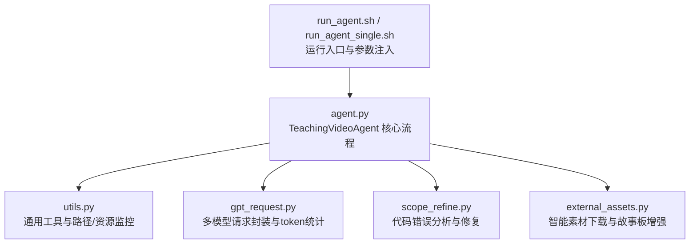
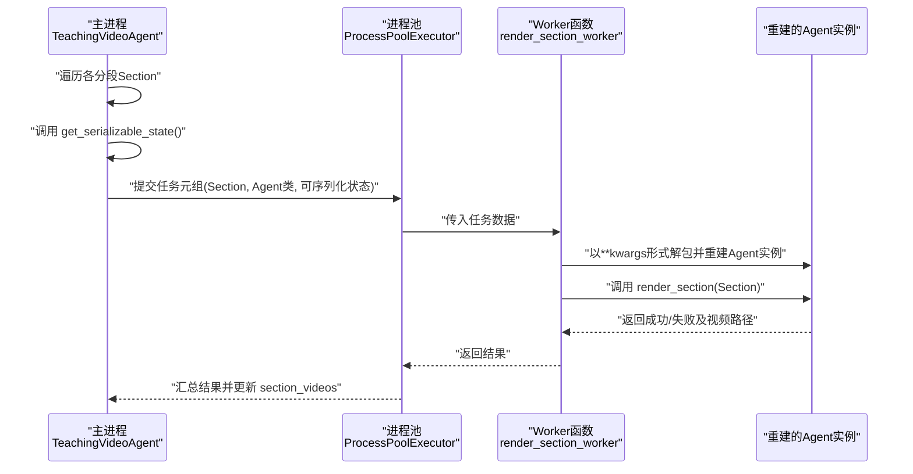
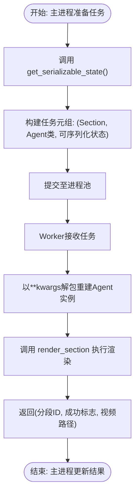
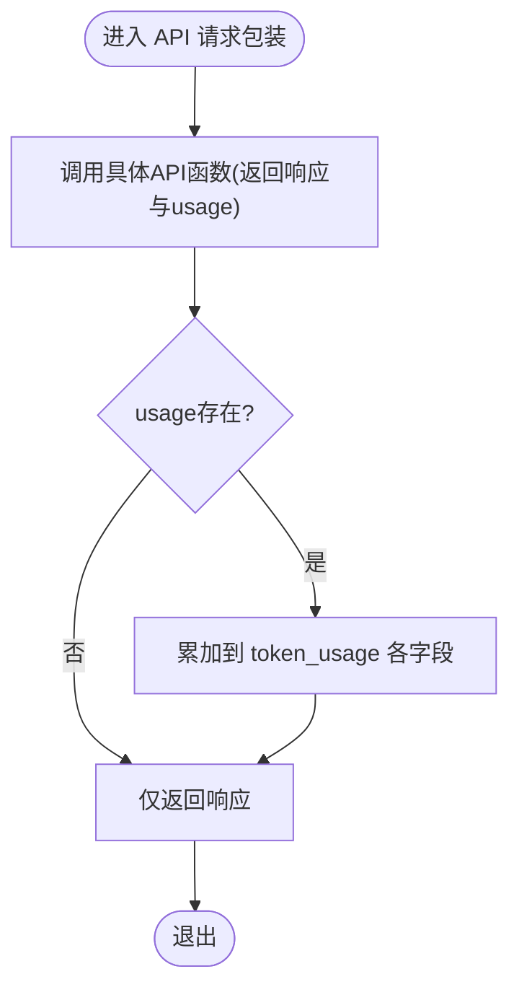
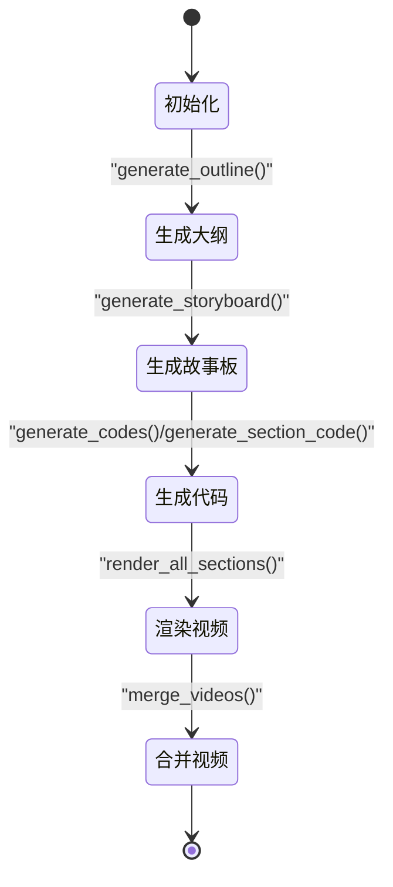
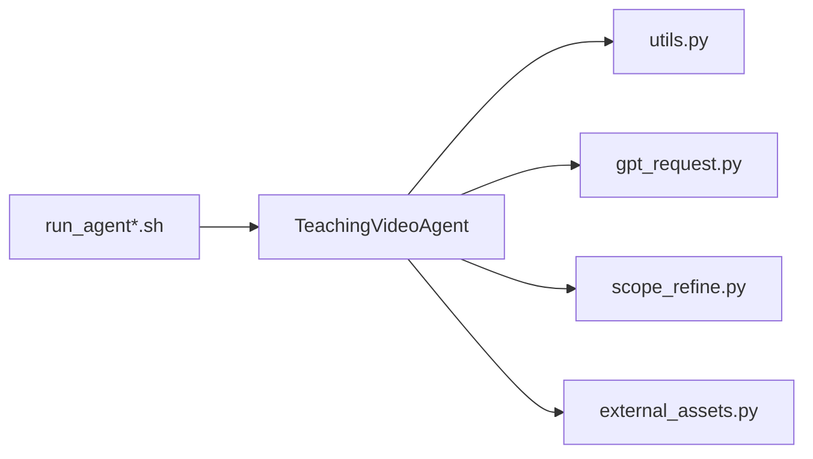

# 状态管理与序列化

<cite>
**本文引用的文件**
- [agent.py](file://src/agent.py)
- [utils.py](file://src/utils.py)
- [gpt_request.py](file://src/gpt_request.py)
- [scope_refine.py](file://src/scope_refine.py)
- [external_assets.py](file://src/external_assets.py)
- [run_agent.sh](file://src/run_agent.sh)
- [run_agent_single.sh](file://src/run_agent_single.sh)
</cite>

## 目录
1. [引言](#引言)
2. [项目结构](#项目结构)
3. [核心组件](#核心组件)
4. [架构总览](#架构总览)
5. [详细组件分析](#详细组件分析)
6. [依赖关系分析](#依赖关系分析)
7. [性能考量](#性能考量)
8. [故障排查指南](#故障排查指南)
9. [结论](#结论)
10. [附录](#附录)

## 引言
本文件聚焦于 TeachingVideoAgent 的状态管理与序列化机制，系统阐述以下关键主题：
- get_serializable_state() 如何提取可序列化的配置状态（idx、knowledge_point、folder、cfg），用于跨进程传递或持久化存储。
- 在 render_section_worker 中，通过将 get_serializable_state() 返回的字典解包为关键字参数，重建 Agent 实例，从而实现并行渲染的“状态迁移”。
- RunConfig 对象的序列化兼容性与使用注意事项。
- token_usage 字典对 API 调用成本的实时追踪方式。
- section_codes、section_videos 等核心数据结构在整个生命周期中的演化过程。
- 基于上述机制的状态恢复与断点续跑最佳实践。

## 项目结构
该项目采用“功能模块化 + 工具函数”的组织方式，核心流程集中在 TeachingVideoAgent 类中，配合工具模块完成 API 请求、代码修复、资源下载与视频拼接等任务。

图表来源
- [agent.py](file://src/agent.py#L56-L718)
- [utils.py](file://src/utils.py#L1-L210)
- [gpt_request.py](file://src/gpt_request.py#L1-L800)
- [scope_refine.py](file://src/scope_refine.py#L1-L803)
- [external_assets.py](file://src/external_assets.py#L1-L220)
- [run_agent.sh](file://src/run_agent.sh#L1-L40)
- [run_agent_single.sh](file://src/run_agent_single.sh#L1-L49)

章节来源
- [agent.py](file://src/agent.py#L56-L718)
- [utils.py](file://src/utils.py#L1-L210)
- [gpt_request.py](file://src/gpt_request.py#L1-L800)
- [scope_refine.py](file://src/scope_refine.py#L1-L803)
- [external_assets.py](file://src/external_assets.py#L1-L220)
- [run_agent.sh](file://src/run_agent.sh#L1-L40)
- [run_agent_single.sh](file://src/run_agent_single.sh#L1-L49)

## 核心组件
- TeachingVideoAgent：负责从知识主题生成教学大纲、故事板、分段代码、渲染视频、合并视频，并维护 token_usage、section_codes、section_videos 等状态。
- RunConfig：承载运行时配置（如是否启用反馈、资产增强、API 函数、重试次数、最大 token 长度等）。
- ScopeRefineFixer：基于 LLM 的智能代码修复器，辅助调试与修复 Manim 代码。
- SmartSVGDownloader：智能素材下载器，结合 LLM 将素材放置到故事板动画中。
- gpt_request：统一的 API 请求封装，支持多种模型与 token 统计返回。

章节来源
- [agent.py](file://src/agent.py#L42-L55)
- [agent.py](file://src/agent.py#L56-L136)
- [scope_refine.py](file://src/scope_refine.py#L250-L803)
- [external_assets.py](file://src/external_assets.py#L1-L220)
- [gpt_request.py](file://src/gpt_request.py#L1-L800)

## 架构总览
下图展示了并行渲染阶段中，主进程如何将 Agent 的可序列化状态传递给子进程 Worker，以实现跨进程重建与执行。

图表来源
- [agent.py](file://src/agent.py#L582-L595)
- [agent.py](file://src/agent.py#L596-L666)
- [agent.py](file://src/agent.py#L133-L136)

章节来源
- [agent.py](file://src/agent.py#L582-L595)
- [agent.py](file://src/agent.py#L596-L666)
- [agent.py](file://src/agent.py#L133-L136)

## 详细组件分析

### TeachingVideoAgent 的状态提取与跨进程重建
- get_serializable_state() 提取的键值包括：idx、knowledge_point、folder、cfg。这些字段足以在子进程中重新构造一个具有相同配置与工作目录的 Agent 实例。
- render_section_worker 接收三元组 (section, agent_class, kwargs)，其中 kwargs 即为 get_serializable_state() 的返回值。该函数内部以 agent_class(**kwargs) 的方式重建 Agent，并继续执行 render_section，最终返回视频路径供上层汇总。

图表来源
- [agent.py](file://src/agent.py#L582-L595)
- [agent.py](file://src/agent.py#L596-L666)
- [agent.py](file://src/agent.py#L133-L136)

章节来源
- [agent.py](file://src/agent.py#L582-L595)
- [agent.py](file://src/agent.py#L596-L666)
- [agent.py](file://src/agent.py#L133-L136)

### RunConfig 的序列化兼容性与使用
- RunConfig 是一个 dataclass，包含布尔开关、整型阈值、字符串密钥以及一个可调用的 API 函数。在 get_serializable_state() 中直接将其作为字典值返回。
- 兼容性要点：
  - API 函数是可调用对象，通常由外部脚本注入；在跨进程传递时，需确保该函数在目标进程环境中可用且可被 pickled 或以其他方式共享。
  - 若 API 函数不可序列化，建议在子进程侧显式注入或通过环境变量/配置文件加载。
  - 其他字段（use_feedback、use_assets、feedback_rounds、iconfinder_api_key、max_code_token_length、max_fix_bug_tries、max_regenerate_tries、max_feedback_gen_code_tries、max_mllm_fix_bugs_tries）均为基本类型，天然可序列化。

章节来源
- [agent.py](file://src/agent.py#L42-L55)
- [agent.py](file://src/agent.py#L133-L136)

### token_usage 的实时追踪机制
- TeachingVideoAgent 内部维护 token_usage 字典，初始值为 {"prompt_tokens": 0, "completion_tokens": 0, "total_tokens": 0}。
- 两类 API 包装方法会自动累加 token 使用量：
  - _request_api_and_track_tokens：调用 cfg.api 并累加 usage。
  - _request_video_api_and_track_tokens：调用 request_gemini_video_img 并累加 usage。
- 在 process_knowledge_point 中，会读取 agent.token_usage["total_tokens"] 作为本次主题处理的总 token 消耗。

图表来源
- [agent.py](file://src/agent.py#L112-L132)
- [gpt_request.py](file://src/gpt_request.py#L1-L800)
- [agent.py](file://src/agent.py#L722-L738)

章节来源
- [agent.py](file://src/agent.py#L112-L132)
- [gpt_request.py](file://src/gpt_request.py#L1-L800)
- [agent.py](file://src/agent.py#L722-L738)

### 核心数据结构的生命周期演进
- outline：首次生成后缓存于输出目录，后续可直接复用。
- enhanced_storyboard：若启用 use_assets，则在生成原始 storyboard 后进行增强；否则直接使用原始 storyboard。
- sections：由增强后的 storyboard 解析得到，作为渲染阶段的任务集合。
- section_codes：以分段ID为键，存储生成的 Manim 代码；可从本地文件读取或通过 LLM 生成。
- section_videos：以分段ID为键，记录渲染成功的视频路径；在并行渲染完成后由主进程汇总。
- video_feedbacks：以“分段ID_轮次”为键，存储 MLLM 反馈结果。

图表来源
- [agent.py](file://src/agent.py#L138-L272)
- [agent.py](file://src/agent.py#L294-L354)
- [agent.py](file://src/agent.py#L526-L576)
- [agent.py](file://src/agent.py#L667-L702)

章节来源
- [agent.py](file://src/agent.py#L138-L272)
- [agent.py](file://src/agent.py#L294-L354)
- [agent.py](file://src/agent.py#L526-L576)
- [agent.py](file://src/agent.py#L667-L702)

### 并行渲染与断点续跑策略
- 并行渲染：主进程将每个分段与可序列化状态打包，交由进程池并行执行。Worker 重建 Agent 后独立渲染，成功则返回视频路径，失败则记录失败数。
- 断点续跑：
  - 利用 section_codes 与 section_videos 的持久化特性：若某分段已有本地代码文件或已存在视频文件，Agent 可跳过生成/渲染步骤，直接复用。
  - 结合 get_serializable_state() 的可序列化字段，可在中断后重启时快速重建上下文，继续未完成的渲染任务。
  - 建议在每次渲染后定期写入中间产物（如 storyboard、代码文件、视频文件），以便在失败时最小化重算范围。

章节来源
- [agent.py](file://src/agent.py#L596-L666)
- [agent.py](file://src/agent.py#L294-L354)
- [agent.py](file://src/agent.py#L356-L399)

## 依赖关系分析
- TeachingVideoAgent 依赖：
  - utils：路径生成、资源监控、代码替换、视频拼接等工具。
  - gpt_request：统一的 API 请求封装与 token 统计。
  - scope_refine：代码错误分析与修复。
  - external_assets：智能素材下载与故事板增强。
- 运行入口：
  - run_agent.sh / run_agent_single.sh：设置默认参数并启动 agent.py。

图表来源
- [agent.py](file://src/agent.py#L1-L18)
- [utils.py](file://src/utils.py#L1-L210)
- [gpt_request.py](file://src/gpt_request.py#L1-L800)
- [scope_refine.py](file://src/scope_refine.py#L1-L803)
- [external_assets.py](file://src/external_assets.py#L1-L220)
- [run_agent.sh](file://src/run_agent.sh#L1-L40)
- [run_agent_single.sh](file://src/run_agent_single.sh#L1-L49)

章节来源
- [agent.py](file://src/agent.py#L1-L18)
- [utils.py](file://src/utils.py#L1-L210)
- [gpt_request.py](file://src/gpt_request.py#L1-L800)
- [scope_refine.py](file://src/scope_refine.py#L1-L803)
- [external_assets.py](file://src/external_assets.py#L1-L220)
- [run_agent.sh](file://src/run_agent.sh#L1-L40)
- [run_agent_single.sh](file://src/run_agent_single.sh#L1-L49)

## 性能考量
- 并行度选择：utils.get_optimal_workers() 基于 CPU 核心数动态计算最优进程数，避免内存溢出。
- 资源监控：monitor_system_resources() 输出 CPU 与内存占用，便于在高负载场景下调整并发。
- 渲染优化：render_all_sections 使用进程池并行渲染，显著缩短整体耗时；同时通过 section_codes 与 section_videos 的本地缓存减少重复计算。

章节来源
- [utils.py](file://src/utils.py#L53-L90)
- [agent.py](file://src/agent.py#L596-L666)

## 故障排查指南
- API 调用失败：
  - 检查 API 函数是否正确注入，以及网络与鉴权配置。
  - 关注 token_usage 是否异常增长但无有效响应，可能为接口限流或参数错误。
- 渲染失败：
  - 查看 section_codes 是否存在对应分段文件；若缺失，检查 generate_section_code 是否成功。
  - 使用 ScopeRefineFixer 的智能修复能力，结合日志定位具体错误行号与上下文。
- 多媒体反馈：
  - 若 MLLM 反馈解析失败，检查视频路径与参考图路径是否存在，必要时降低反馈轮次以减少 API 调用。

章节来源
- [agent.py](file://src/agent.py#L112-L132)
- [scope_refine.py](file://src/scope_refine.py#L250-L803)
- [external_assets.py](file://src/external_assets.py#L1-L220)

## 结论
TeachingVideoAgent 通过 get_serializable_state() 将关键运行状态（idx、knowledge_point、folder、cfg）打包，配合 render_section_worker 的重建逻辑，实现了可靠的跨进程状态迁移。结合 token_usage 的实时追踪与 section_codes/section_videos 的持久化，系统具备良好的可观测性与断点续跑能力。RunConfig 的 dataclass 设计使其易于扩展与序列化，但需注意 API 函数的可序列化性与环境一致性。

## 附录
- 最佳实践建议
  - 在子进程侧显式注入或加载 API 函数，确保其在目标环境中可用。
  - 定期备份 storyboard、代码与视频产物，便于断点续跑。
  - 控制并发度，结合 monitor_system_resources() 动态调整，避免资源瓶颈。
  - 使用较小的 feedback_rounds 与 max_*_tries 参数进行预跑，验证流程后再扩大规模。