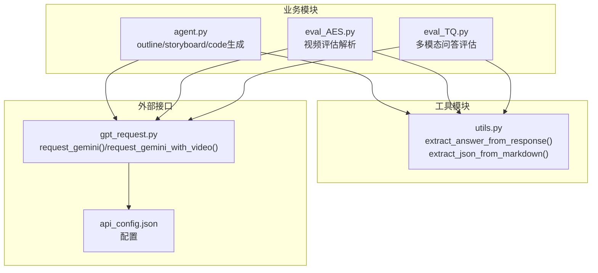
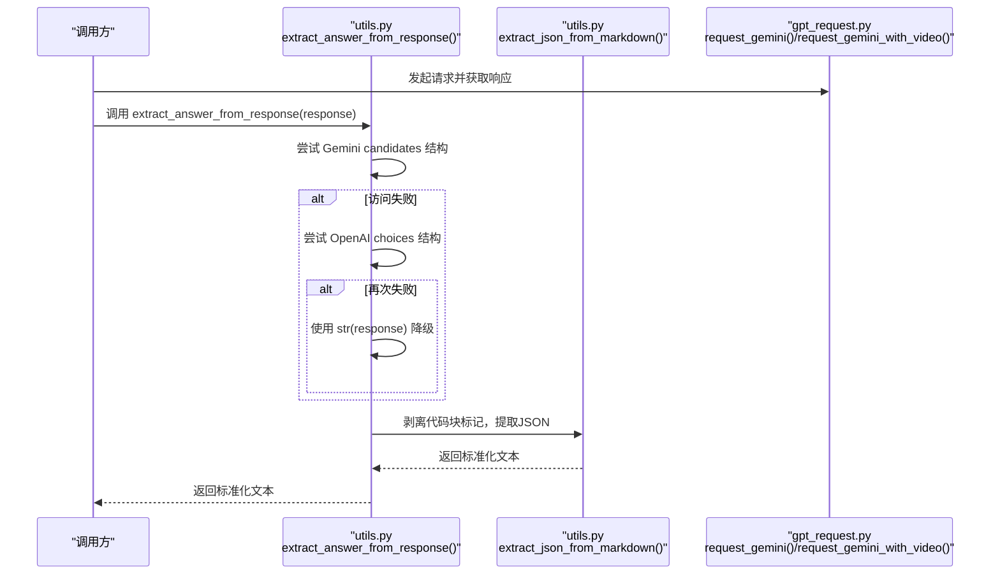
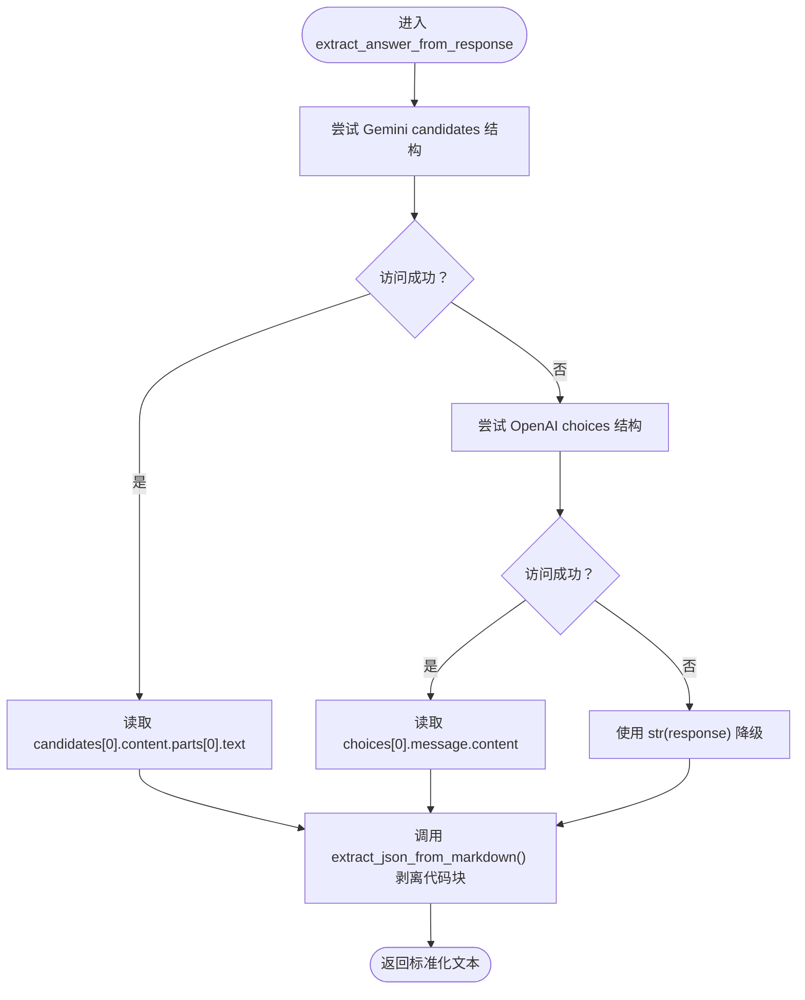
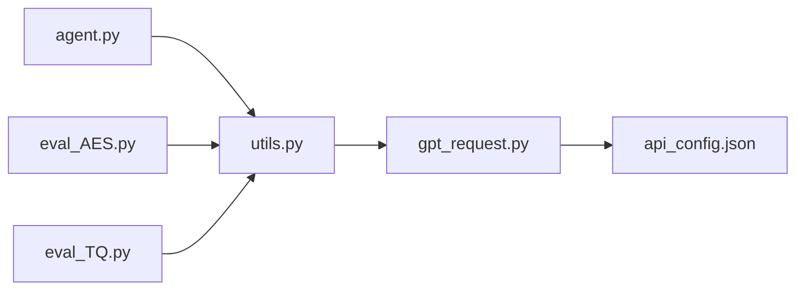

# extract_answer_from_response函数

<cite>
**本文引用的文件**
- [utils.py](file://src/utils.py)
- [agent.py](file://src/agent.py)
- [eval_AES.py](file://src/eval_AES.py)
- [eval_TQ.py](file://src/eval_TQ.py)
- [gpt_request.py](file://src/gpt_request.py)
- [api_config.json](file://src/api_config.json)
</cite>

## 目录
1. [简介](#简介)
2. [项目结构](#项目结构)
3. [核心组件](#核心组件)
4. [架构总览](#架构总览)
5. [详细组件分析](#详细组件分析)
6. [依赖关系分析](#依赖关系分析)
7. [性能考量](#性能考量)
8. [故障排查指南](#故障排查指南)
9. [结论](#结论)
10. [附录](#附录)

## 简介
本文件为 extract_answer_from_response(response) 函数的详细API参考与技术解析。该函数负责在不同LLM API（如Gemini的candidates结构与OpenAI风格的choices结构）之间进行响应格式的兼容性处理，并统一提取可解析的文本内容。它通过多级异常处理机制，优先尝试Gemini风格的响应字段，回退到OpenAI风格，最后在极端情况下将原始响应对象转换为字符串，确保在API切换或响应格式变更时具备良好的容错能力。此外，该函数通常与 extract_json_from_markdown 配合使用，用于从包含代码块标记的文本中抽取JSON片段，从而支持后续的结构化解析。

## 项目结构
该函数位于工具模块 utils.py 中，被多个业务模块复用：
- agent.py：在生成教学大纲、故事板、代码等流程中，先通过 extract_answer_from_response 提取文本，再进一步解析为JSON。
- eval_AES.py：在视频评估流程中，先提取文本，再尝试解析其中的JSON结构。
- eval_TQ.py：在多模态问答评估流程中，同样依赖该函数进行响应标准化。



图表来源
- [utils.py](file://src/utils.py#L1-L30)
- [agent.py](file://src/agent.py#L156-L176)
- [eval_AES.py](file://src/eval_AES.py#L163-L199)
- [eval_TQ.py](file://src/eval_TQ.py#L101-L111)
- [gpt_request.py](file://src/gpt_request.py#L368-L418)
- [api_config.json](file://src/api_config.json#L1-L39)

章节来源
- [utils.py](file://src/utils.py#L1-L30)
- [agent.py](file://src/agent.py#L156-L176)
- [eval_AES.py](file://src/eval_AES.py#L163-L199)
- [eval_TQ.py](file://src/eval_TQ.py#L101-L111)
- [gpt_request.py](file://src/gpt_request.py#L368-L418)
- [api_config.json](file://src/api_config.json#L1-L39)

## 核心组件
- extract_answer_from_response(response: Any) -> str
  - 功能：从任意LLM响应对象中提取可解析的文本内容，兼容Gemini candidates结构与OpenAI choices结构，并在必要时降级为字符串。
  - 返回：str（通常是包含JSON的文本，或原始响应的字符串表示）。
- extract_json_from_markdown(text: str) -> str
  - 功能：从包含代码块标记的文本中抽取JSON片段；若未找到则原样返回。
  - 返回：str（JSON字符串或原文本）。

章节来源
- [utils.py](file://src/utils.py#L1-L30)

## 架构总览
该函数在系统中的位置如下：
- 输入：来自不同API客户端（如Gemini）的响应对象。
- 处理：按优先级尝试不同字段访问路径，失败则回退；随后剥离代码块标记，保留纯JSON文本。
- 输出：标准化后的文本，供上层模块进行JSON解析或进一步处理。



图表来源
- [utils.py](file://src/utils.py#L19-L28)
- [gpt_request.py](file://src/gpt_request.py#L368-L418)
- [agent.py](file://src/agent.py#L156-L176)
- [eval_AES.py](file://src/eval_AES.py#L163-L199)
- [eval_TQ.py](file://src/eval_TQ.py#L101-L111)

## 详细组件分析

### 函数签名与行为
- 参数
  - response: Any
    - 说明：任意LLM API返回的响应对象。典型情况下，Gemini返回的对象具有 candidates[0].content.parts[0].text 字段；OpenAI风格的响应对象具有 choices[0].message.content 字段。
- 返回值
  - str
    - 说明：标准化后的文本内容。若响应对象包含代码块标记（如三引号包裹的JSON），会先抽取其中的JSON片段；若无法解析，则返回原始响应对象的字符串形式。

章节来源
- [utils.py](file://src/utils.py#L19-L28)

### 多级异常处理机制
该函数采用“优先级+回退”的策略，以适配不同API的响应结构：
- 第一级：尝试Gemini风格的 candidates[0].content.parts[0].text。
- 第二级：若失败，尝试OpenAI风格的 choices[0].message.content。
- 第三级：若仍失败，将响应对象转换为字符串，保证不中断后续流程。



图表来源
- [utils.py](file://src/utils.py#L19-L28)

章节来源
- [utils.py](file://src/utils.py#L19-L28)

### 与 extract_json_from_markdown 的集成逻辑
- 在提取到文本后，函数会调用 extract_json_from_markdown 对文本进行处理：
  - 若文本包含三引号包裹的JSON（包括 ```json 或 ```)，则抽取其中的JSON片段。
  - 否则，原样返回文本。
- 这一步确保了即使响应文本中混入了代码块标记，也能正确提取出可解析的JSON字符串，供上层模块进行结构化解析。

章节来源
- [utils.py](file://src/utils.py#L1-L17)
- [utils.py](file://src/utils.py#L19-L28)

### 在agent.py中的关键作用
- 在生成教学大纲、故事板、代码等流程中，该函数被广泛用于：
  - 从API响应中提取文本内容，随后调用 extract_json_from_markdown 进一步抽取JSON。
  - 在多次重试失败的情况下，仍能通过降级策略返回字符串，避免流程中断。
- 典型调用位置：
  - 生成大纲：在 outline.json 解析前，先通过该函数标准化响应文本。
  - 生成故事板：在 storyboard.json 解析前，先通过该函数标准化响应文本。
  - 生成代码：在代码抽取前，先通过该函数标准化响应文本。

章节来源
- [agent.py](file://src/agent.py#L156-L176)
- [agent.py](file://src/agent.py#L232-L241)
- [agent.py](file://src/agent.py#L335-L341)

### 在eval_AES.py与eval_TQ.py中的应用
- 视频评估与问答评估模块同样依赖该函数进行响应标准化：
  - 评估模块先调用该函数提取文本，再尝试解析其中的JSON结构，若未找到JSON则回退到基于正则的评分提取逻辑。
  - 问答评估模块在调用文本/视频API后，同样通过该函数进行响应标准化，再进行后续处理。

章节来源
- [eval_AES.py](file://src/eval_AES.py#L163-L199)
- [eval_TQ.py](file://src/eval_TQ.py#L101-L111)

### 模拟响应对象的使用示例
以下示例展示如何构造不同API风格的响应对象，以便验证该函数的行为：
- Gemini风格响应对象
  - 特征：包含 candidates[0].content.parts[0].text 字段。
  - 场景：当API返回的是Gemini风格的响应时，函数会优先读取该字段。
- OpenAI风格响应对象
  - 特征：包含 choices[0].message.content 字段。
  - 场景：当API返回的是OpenAI风格的响应时，函数会回退读取该字段。
- 非标准响应对象
  - 场景：当API返回的对象既不包含上述字段，或字段不可访问时，函数会将响应对象转换为字符串，确保流程继续执行。

注意：以上为概念性示例说明，具体字段名称与结构以实际API返回为准。

### 容错与降级策略
- 当候选字段访问失败时，函数会依次尝试其他字段；若所有字段均不可用，则将响应对象转换为字符串，避免抛出异常导致流程中断。
- 该策略使得系统在API切换或响应格式变更时具备更强的鲁棒性。

章节来源
- [utils.py](file://src/utils.py#L19-L28)
- [agent.py](file://src/agent.py#L156-L176)
- [agent.py](file://src/agent.py#L232-L241)
- [agent.py](file://src/agent.py#L335-L341)

## 依赖关系分析
- 直接依赖
  - utils.py：定义 extract_answer_from_response 与 extract_json_from_markdown。
- 间接依赖
  - gpt_request.py：提供不同API客户端的请求封装，返回的响应对象可能为Gemini或OpenAI风格。
  - api_config.json：提供各API的配置项，影响请求端点与模型选择。
- 调用关系
  - agent.py、eval_AES.py、eval_TQ.py 在需要解析LLM响应时，都会调用 utils.py 中的 extract_answer_from_response。



图表来源
- [utils.py](file://src/utils.py#L1-L30)
- [agent.py](file://src/agent.py#L156-L176)
- [eval_AES.py](file://src/eval_AES.py#L163-L199)
- [eval_TQ.py](file://src/eval_TQ.py#L101-L111)
- [gpt_request.py](file://src/gpt_request.py#L368-L418)
- [api_config.json](file://src/api_config.json#L1-L39)

章节来源
- [utils.py](file://src/utils.py#L1-L30)
- [agent.py](file://src/agent.py#L156-L176)
- [eval_AES.py](file://src/eval_AES.py#L163-L199)
- [eval_TQ.py](file://src/eval_TQ.py#L101-L111)
- [gpt_request.py](file://src/gpt_request.py#L368-L418)
- [api_config.json](file://src/api_config.json#L1-L39)

## 性能考量
- 时间复杂度
  - 该函数主要执行字段访问与正则匹配操作，整体时间复杂度为 O(n)，n为响应文本长度。
- 空间复杂度
  - 仅返回标准化后的文本，空间开销与输入文本长度线性相关。
- 优化建议
  - 若响应文本较大，可考虑在上层模块提前进行必要的预处理，减少不必要的字符串复制。
  - 对于频繁调用的场景，可在上层缓存已解析的JSON结果，避免重复解析。

## 故障排查指南
- 症状：函数返回空字符串或非预期内容
  - 可能原因：响应对象不包含 candidates 或 choices 字段，或字段不可访问。
  - 排查步骤：
    - 检查API返回对象的实际结构，确认是否为Gemini或OpenAI风格。
    - 在调用前打印响应对象的关键字段，定位缺失的字段。
    - 确认 extract_json_from_markdown 是否正确识别代码块标记。
- 症状：上层模块解析JSON失败
  - 可能原因：extract_answer_from_response 返回的文本中仍包含代码块标记或非JSON片段。
  - 排查步骤：
    - 确认 extract_json_from_markdown 的正则是否覆盖了目标代码块格式。
    - 在上层模块增加日志，记录标准化后的文本内容，便于定位问题。
- 症状：API切换后行为异常
  - 可能原因：新API的响应结构与旧API不同。
  - 排查步骤：
    - 打印新API的响应对象，确认新增字段或结构变化。
    - 在 extract_answer_from_response 中增加新的分支以兼容新结构，或在上层模块进行适配。

章节来源
- [utils.py](file://src/utils.py#L1-L30)
- [agent.py](file://src/agent.py#L156-L176)
- [eval_AES.py](file://src/eval_AES.py#L163-L199)
- [eval_TQ.py](file://src/eval_TQ.py#L101-L111)

## 结论
extract_answer_from_response 是一个关键的响应标准化入口，通过多级异常处理与降级策略，有效兼容不同LLM API的响应格式差异，并与 extract_json_from_markdown 协同工作，确保后续JSON解析的稳定性。其在agent.py、eval_AES.py、eval_TQ.py等模块中发挥着承上启下的作用，是系统在API切换与响应格式变更时保持高可用性的关键保障。

## 附录
- 相关函数
  - extract_json_from_markdown(text: str) -> str
    - 用途：从包含代码块标记的文本中抽取JSON片段。
    - 返回：str（JSON字符串或原文本）。
- 相关调用点
  - agent.py：大纲生成、故事板生成、代码生成。
  - eval_AES.py：视频评估解析。
  - eval_TQ.py：问答评估解析。

章节来源
- [utils.py](file://src/utils.py#L1-L17)
- [utils.py](file://src/utils.py#L19-L28)
- [agent.py](file://src/agent.py#L156-L176)
- [eval_AES.py](file://src/eval_AES.py#L163-L199)
- [eval_TQ.py](file://src/eval_TQ.py#L101-L111)