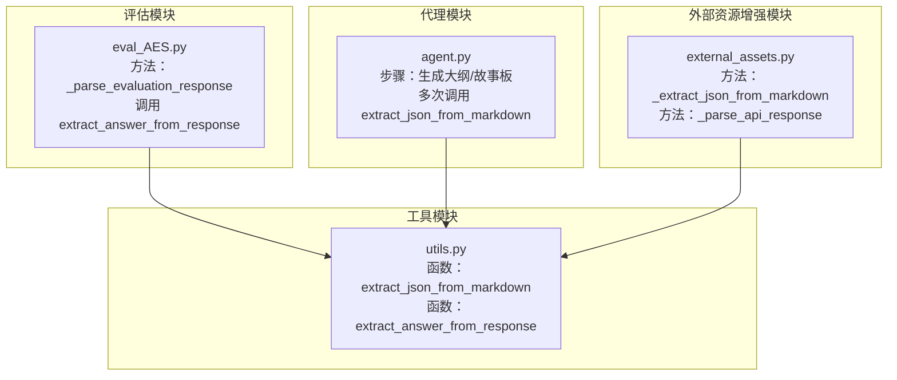
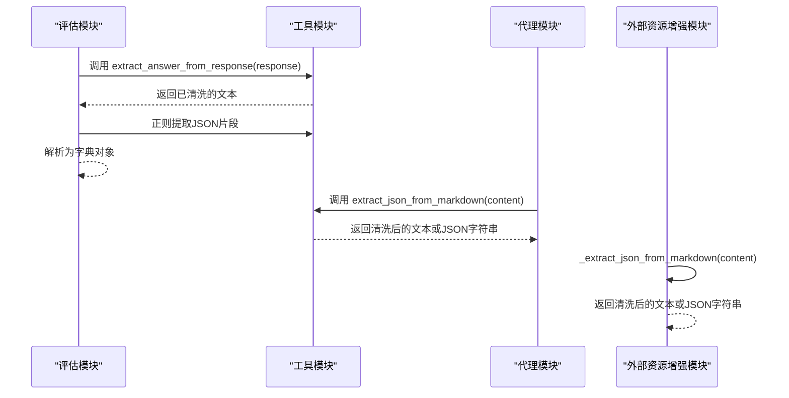
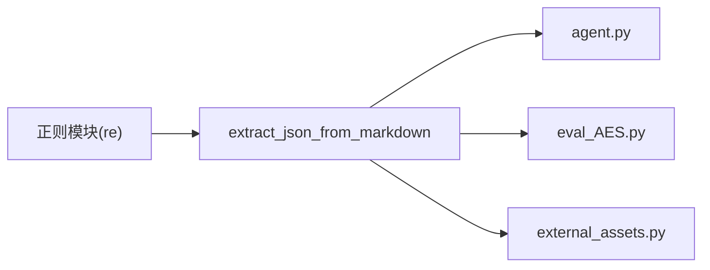

# extract_json_from_markdown函数

<cite>
**本文引用的文件**
- [utils.py](file://src/utils.py)
- [agent.py](file://src/agent.py)
- [external_assets.py](file://src/external_assets.py)
- [eval_AES.py](file://src/eval_AES.py)
</cite>

## 目录
1. [简介](#简介)
2. [项目结构](#项目结构)
3. [核心组件](#核心组件)
4. [架构总览](#架构总览)
5. [详细组件分析](#详细组件分析)
6. [依赖关系分析](#依赖关系分析)
7. [性能考量](#性能考量)
8. [故障排查指南](#故障排查指南)
9. [结论](#结论)
10. [附录](#附录)

## 简介
本文件为 extract_json_from_markdown(text) 函数的详细API参考文档。该函数用于从LLM返回的Markdown文本中提取被代码块标记包裹的JSON字符串内容，并在未检测到代码块时回退为原始文本。它在主流程中被 extract_answer_from_response 调用，以清洗LLM输出，确保后续解析环节能稳定地得到可解析的JSON字符串。本文还说明了函数的参数与返回值类型、典型使用场景、边界情况处理策略与潜在限制。

## 项目结构
该函数位于工具模块中，供多个业务流程共享使用：
- 工具模块：提供通用的文本清洗与辅助功能
- 代理模块：负责生成教学大纲与故事板，期间多次调用该函数清洗LLM输出
- 外部资源增强模块：在增强动画数据时同样使用该函数进行清洗
- 评估模块：在解析多维评分结果时，先通过 extract_answer_from_response 清洗，再进一步提取JSON片段



图表来源
- [utils.py](file://src/utils.py#L11-L28)
- [agent.py](file://src/agent.py#L156-L246)
- [external_assets.py](file://src/external_assets.py#L74-L103)
- [eval_AES.py](file://src/eval_AES.py#L163-L196)

章节来源
- [utils.py](file://src/utils.py#L11-L28)
- [agent.py](file://src/agent.py#L156-L246)
- [external_assets.py](file://src/external_assets.py#L74-L103)
- [eval_AES.py](file://src/eval_AES.py#L163-L196)

## 核心组件
- 函数名称：extract_json_from_markdown
- 参数类型：text: str
- 返回值类型：str
- 功能概述：从Markdown文本中提取第一个出现的JSON字符串（支持```json或```代码块包裹）。若未找到代码块，则直接返回原文本。

实现要点
- 使用正则表达式匹配代码块标记，允许可选的语言标识（如json），并捕获代码块内的内容。
- 使用非贪婪匹配以尽可能提取第一个JSON片段，避免跨多个代码块时的误匹配。
- 当未匹配到任何代码块时，原样返回输入文本，保证对“纯文本”场景的兼容性。

章节来源
- [utils.py](file://src/utils.py#L11-L16)

## 架构总览
该函数在系统中的调用路径如下：
- 评估模块在解析多维评分时，先通过 extract_answer_from_response 获取文本，再调用 extract_json_from_markdown 提取JSON。
- 代理模块在生成大纲与故事板时，直接调用 extract_json_from_markdown 清洗LLM输出。
- 外部资源增强模块在解析API响应时，也使用类似的清洗逻辑。



图表来源
- [eval_AES.py](file://src/eval_AES.py#L163-L196)
- [utils.py](file://src/utils.py#L19-L28)
- [agent.py](file://src/agent.py#L156-L246)
- [external_assets.py](file://src/external_assets.py#L74-L103)

## 详细组件分析

### 函数签名与行为
- 函数签名：extract_json_from_markdown(text: str) -> str
- 行为说明：
  - 若输入文本包含由代码块标记包裹的JSON内容，则返回其中的JSON字符串；
  - 若未检测到代码块，则直接返回原始文本。

章节来源
- [utils.py](file://src/utils.py#L11-L16)

### 正则表达式解析
- 匹配规则：
  - 允许可选的语言标识（如json），以提升识别准确性；
  - 支持任意空白字符（包括换行）；
  - 捕获代码块内的JSON内容；
  - 使用非贪婪匹配，优先提取第一个JSON片段。
- 兼容性：
  - 对于“纯文本”场景，未匹配到代码块时直接返回原文本；
  - 对于“多段代码块”的场景，仅提取第一个匹配的JSON片段。

章节来源
- [utils.py](file://src/utils.py#L11-L16)

### 在主流程中的关键作用
- 在生成大纲阶段，代理模块调用该函数清洗LLM输出，随后尝试将其解析为JSON，失败时会重试或报错。
- 在生成故事板阶段，代理模块同样调用该函数清洗LLM输出，再进行JSON解析与持久化。
- 在评估阶段，先通过 extract_answer_from_response 清洗，再通过正则提取JSON片段进行评分解析。

章节来源
- [agent.py](file://src/agent.py#L156-L246)
- [eval_AES.py](file://src/eval_AES.py#L163-L196)

### 边界情况与潜在限制
- 嵌套大括号：
  - 函数采用非贪婪匹配，优先提取第一个JSON片段；若存在多段JSON，仅返回第一个匹配项。
- 不完整JSON：
  - 若代码块内包含不完整或格式错误的JSON，函数仍会返回该片段；后续解析环节需自行处理JSON解码异常。
- 多段代码块：
  - 仅提取第一个匹配的JSON片段，不会合并多个代码块中的JSON。
- 纯文本：
  - 未检测到代码块时，直接返回原文本，避免误删其他内容。

章节来源
- [utils.py](file://src/utils.py#L11-L16)
- [agent.py](file://src/agent.py#L156-L246)
- [eval_AES.py](file://src/eval_AES.py#L163-L196)

### 实际使用示例（基于仓库中的调用位置）
以下示例展示了该函数在不同场景下的典型用法（以路径引用代替具体代码内容）：
- 生成大纲时清洗LLM输出：
  - 调用位置：[agent.py](file://src/agent.py#L156-L176)
  - 关键步骤：从响应中提取文本 -> 调用 extract_json_from_markdown -> 尝试解析为JSON
- 生成故事板时清洗LLM输出：
  - 调用位置：[agent.py](file://src/agent.py#L223-L259)
  - 关键步骤：从响应中提取文本 -> 调用 extract_json_from_markdown -> 解析为JSON并持久化
- 评估模块解析评分时的预处理：
  - 调用位置：[eval_AES.py](file://src/eval_AES.py#L163-L196)
  - 关键步骤：先通过 extract_answer_from_response 清洗 -> 再正则提取JSON片段 -> 解析为字典

章节来源
- [agent.py](file://src/agent.py#L156-L246)
- [eval_AES.py](file://src/eval_AES.py#L163-L196)

### 与其他清洗函数的关系
- extract_answer_from_response：
  - 从LLM响应中提取文本后，再调用 extract_json_from_markdown 进一步清洗；
  - 该组合常用于“先统一文本格式，再提取JSON”的流程。
- external_assets.py 中的 _extract_json_from_markdown：
  - 与工具模块中的函数类似，但正则模式略有差异（支持数组或对象），并在解析失败时有更明确的回退策略。

章节来源
- [utils.py](file://src/utils.py#L19-L28)
- [external_assets.py](file://src/external_assets.py#L74-L103)

## 依赖关系分析
- 直接依赖：
  - 正则模块：用于匹配代码块与JSON片段
- 间接依赖：
  - 代理模块与评估模块在解析JSON前均依赖该函数进行文本清洗
- 可能的循环依赖：
  - 无循环依赖，函数为纯工具函数，被上层模块单向调用



图表来源
- [utils.py](file://src/utils.py#L11-L16)
- [agent.py](file://src/agent.py#L156-L246)
- [eval_AES.py](file://src/eval_AES.py#L163-L196)
- [external_assets.py](file://src/external_assets.py#L74-L103)

## 性能考量
- 时间复杂度：与输入文本长度近似线性相关，受正则匹配影响较小
- 空间复杂度：仅返回匹配到的子串，额外内存开销极低
- 优化建议：
  - 避免在超长文本中重复调用，可在上层逻辑中先做必要裁剪
  - 若已知JSON位于特定位置，可考虑先做局部截取再调用该函数

## 故障排查指南
- 现象：解析失败或返回空JSON
  - 可能原因：代码块内包含不完整JSON或格式错误
  - 排查步骤：确认LLM输出是否包含完整JSON；检查是否存在多余注释或非JSON内容
- 现象：返回了多个JSON片段中的中间部分
  - 可能原因：存在多段代码块，函数仅返回第一个匹配项
  - 排查步骤：检查输出中是否有多段JSON；如需全部提取，请在上层逻辑中另行处理
- 现象：返回了原始文本而非JSON
  - 可能原因：未检测到代码块标记
  - 排查步骤：确认LLM输出是否使用了正确的代码块标记；或在上层逻辑中先进行格式化

章节来源
- [utils.py](file://src/utils.py#L11-L16)
- [agent.py](file://src/agent.py#L156-L246)
- [eval_AES.py](file://src/eval_AES.py#L163-L196)

## 结论
extract_json_from_markdown 是一个简洁高效的文本清洗工具函数，能够从LLM返回的Markdown文本中提取首个JSON片段，并在未检测到代码块时安全回退为原始文本。它在代理模块与评估模块中承担着关键的预处理角色，确保后续JSON解析流程的稳定性。对于嵌套大括号与多段JSON等边界情况，应结合上层逻辑进行针对性处理，以获得更准确的结果。

## 附录
- 函数定义位置：[utils.py](file://src/utils.py#L11-L16)
- 主流程调用位置：
  - 生成大纲：[agent.py](file://src/agent.py#L156-L176)
  - 生成故事板：[agent.py](file://src/agent.py#L223-L259)
  - 评估评分解析：[eval_AES.py](file://src/eval_AES.py#L163-L196)
- 类似的清洗实现（外部资源模块）：[external_assets.py](file://src/external_assets.py#L74-L103)