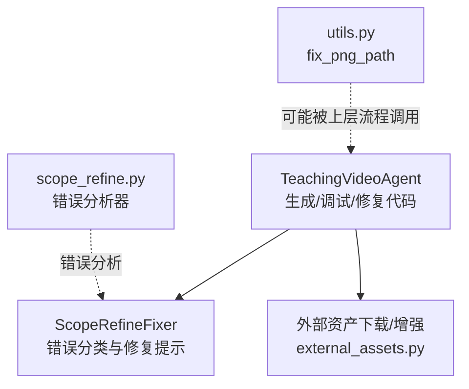
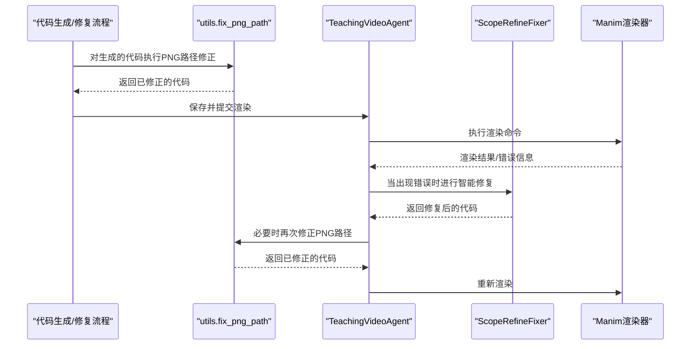
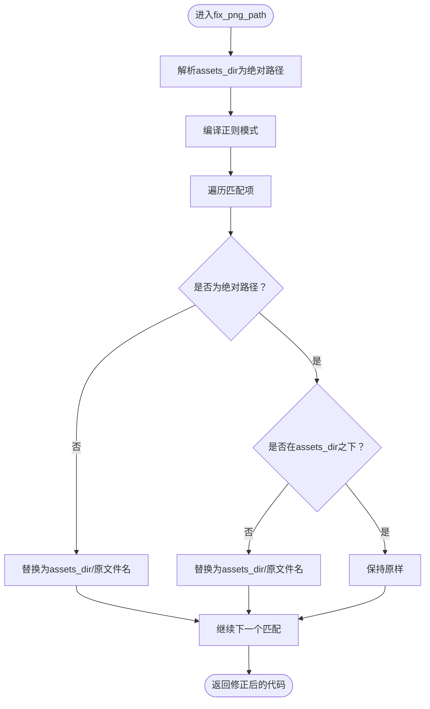
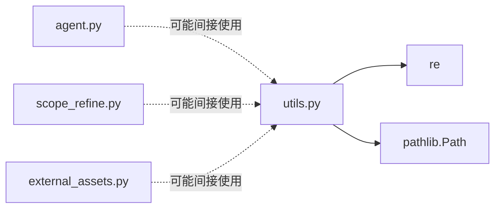

# fix_png_path函数

<cite>
**本文引用的文件**
- [utils.py](file://src/utils.py)
- [agent.py](file://src/agent.py)
- [scope_refine.py](file://src/scope_refine.py)
</cite>

## 目录
1. [简介](#简介)
2. [项目结构](#项目结构)
3. [核心组件](#核心组件)
4. [架构总览](#架构总览)
5. [详细组件分析](#详细组件分析)
6. [依赖关系分析](#依赖关系分析)
7. [性能考量](#性能考量)
8. [故障排查指南](#故障排查指南)
9. [结论](#结论)

## 简介
本文件为 fix_png_path 函数提供详细的API参考与实现解析。该函数用于修复Manim代码中对PNG资源的引用路径，确保渲染时能够正确加载位于指定资源目录下的图片。它通过正则表达式匹配字符串中的“引号包裹的.png文件名”，并在必要时将相对路径或非资源目录下的绝对路径重写为指向 assets_dir 的绝对路径。

## 项目结构
- 该函数定义于工具模块 utils.py 中，供上层流程在生成或修复代码后进行资源路径规范化。
- 在渲染流程中，TeachingVideoAgent 负责生成、调试与修复代码；ScopeRefineFixer 提供智能修复能力；但当前仓库未发现直接调用 fix_png_path 的证据，其主要用途是作为通用的路径修正工具。

图表来源
- [agent.py](file://src/agent.py#L356-L400)
- [scope_refine.py](file://src/scope_refine.py#L1-L120)
- [utils.py](file://src/utils.py#L31-L50)

章节来源
- [agent.py](file://src/agent.py#L356-L400)
- [scope_refine.py](file://src/scope_refine.py#L1-L120)
- [utils.py](file://src/utils.py#L31-L50)

## 核心组件
- 函数签名与职责
  - 函数：fix_png_path(code_str: str, assets_dir: Path) -> str
  - 输入：
    - code_str: 待处理的Python源码字符串，其中可能包含对PNG资源的引用
    - assets_dir: 资源目录的Path对象，最终会转换为绝对路径
  - 输出：返回重写后的源码字符串，所有匹配到的PNG引用均被规范化为指向assets_dir的绝对路径
- 正则表达式模式
  - 模式：r'["\']([^"\']+\.png)["\']'
  - 匹配规则：单引号或双引号包裹的任意字符组成的.png文件名（不包含引号）
- 内部replacer逻辑
  - 将匹配到的原始路径original_path解析为Path对象path_obj
  - 若path_obj不是绝对路径，则将其替换为“assets_dir/原文件名”
  - 若path_obj是绝对路径但不在assets_dir之下，则同样替换为“assets_dir/原文件名”
  - 否则保持原样不变
  - 异常兜底：当判断父目录链时发生异常（如运行时错误），也回退为“assets_dir/原文件名”

章节来源
- [utils.py](file://src/utils.py#L31-L50)

## 架构总览
下图展示了从代码生成到渲染的关键路径，以及可能的资源路径修正时机。注意：当前仓库未发现直接调用 fix_png_path 的证据，因此下图展示的是概念性流程，而非实际调用关系。

图表来源
- [agent.py](file://src/agent.py#L356-L400)
- [scope_refine.py](file://src/scope_refine.py#L250-L370)
- [utils.py](file://src/utils.py#L31-L50)

## 详细组件分析

### 函数行为与正则匹配
- 正则匹配范围
  - 仅匹配引号包裹的.png文件名，不改变其他文本
  - 支持单引号与双引号两种引号形式
- 替换策略
  - 相对路径：总是替换为“assets_dir/原文件名”
  - 绝对路径但不在assets_dir下：替换为“assets_dir/原文件名”
  - 绝对路径且确实在assets_dir下：保持原样
- 异常处理
  - 判断父目录链时若抛出运行时异常，统一回退为“assets_dir/原文件名”

图表来源
- [utils.py](file://src/utils.py#L31-L50)

章节来源
- [utils.py](file://src/utils.py#L31-L50)

### 参数与返回值
- 参数
  - code_str: str
    - 类型：字符串
    - 作用：承载包含PNG引用的Manim代码
    - 注意：函数不会修改原字符串，而是返回新字符串
  - assets_dir: Path
    - 类型：Path对象
    - 作用：指定资源目录，函数内部会解析为绝对路径
- 返回值
  - str
    - 类型：字符串
    - 作用：返回已修正PNG引用路径的代码字符串

章节来源
- [utils.py](file://src/utils.py#L31-L50)

### 处理前后示例（概念性说明）
- 示例场景
  - 原始代码中存在如下引用：
    - "relative.png"
    - "./subdir/absolute.png"
    - "/some/other/path/asset.png"
  - assets_dir 解析为绝对路径后，上述引用将被统一修正为：
    - "assets_dir/relative.png"
    - "assets_dir/absolute.png"
    - "assets_dir/asset.png"
- 说明
  - 以上示例为概念性描述，旨在帮助理解路径修正策略；请勿直接复制粘贴到代码中。

### 在系统中的关键时机
- 当前仓库未发现直接调用 fix_png_path 的证据。根据现有代码：
  - TeachingVideoAgent 在渲染失败时会调用 ScopeRefineFixer 进行智能修复，但未见对 fix_png_path 的显式调用
  - external_assets.py 负责下载与缓存资源，但未见对 fix_png_path 的显式调用
- 建议的调用时机（基于函数设计）
  - 在生成或修复后的代码准备渲染前，对代码字符串执行一次PNG路径修正
  - 在多轮修复过程中，若发现新的PNG引用或路径变更，可重复执行修正

章节来源
- [agent.py](file://src/agent.py#L356-L400)
- [scope_refine.py](file://src/scope_refine.py#L250-L370)
- [utils.py](file://src/utils.py#L31-L50)

## 依赖关系分析
- 内部依赖
  - re：用于正则匹配与替换
  - pathlib.Path：用于路径解析与拼接
- 外部依赖
  - 无直接外部库依赖
- 调用关系
  - 当前仓库未发现直接调用 fix_png_path 的文件
  - 其他模块（agent.py、scope_refine.py、external_assets.py）未导入或调用该函数

图表来源
- [utils.py](file://src/utils.py#L1-L10)
- [agent.py](file://src/agent.py#L1-L20)
- [scope_refine.py](file://src/scope_refine.py#L1-L10)
- [external_assets.py](file://src/external_assets.py#L1-L10)

章节来源
- [utils.py](file://src/utils.py#L1-L10)
- [agent.py](file://src/agent.py#L1-L20)
- [scope_refine.py](file://src/scope_refine.py#L1-L10)
- [external_assets.py](file://src/external_assets.py#L1-L10)

## 性能考量
- 时间复杂度
  - 正则匹配与替换：O(n)，n为输入字符串长度
  - 路径解析与拼接：对每个匹配项为O(1)
- 空间复杂度
  - 生成新字符串：O(n)
- 实践建议
  - 避免在高频路径中重复执行不必要的修正
  - 若多次修复流程中PNG引用稳定，可在首次修正后缓存结果

## 故障排查指南
- 常见问题
  - PNG路径仍无法加载
    - 检查assets_dir是否正确设置且存在
    - 确认目标PNG文件确实存在于assets_dir中
  - 修正后路径仍不生效
    - 确认原始代码中PNG引用确实被引号包裹
    - 检查是否存在大小写差异或扩展名不一致
- 排错步骤
  - 使用最小化示例验证函数行为
  - 对比修正前后的代码字符串，确认替换是否按预期发生
  - 在渲染前打印修正后的代码，核对路径是否符合预期

## 结论
fix_png_path 提供了针对Manim代码中PNG资源引用的可靠路径修正机制。通过正则匹配与路径解析，它能够将相对路径与非资源目录下的绝对路径统一重写为指向assets_dir的绝对路径，从而提升渲染时资源加载的成功率。尽管当前仓库未发现直接调用该函数的证据，但其设计清晰、边界明确，适合在生成与修复流程的关键节点中使用，以确保资源路径的一致性与可移植性。