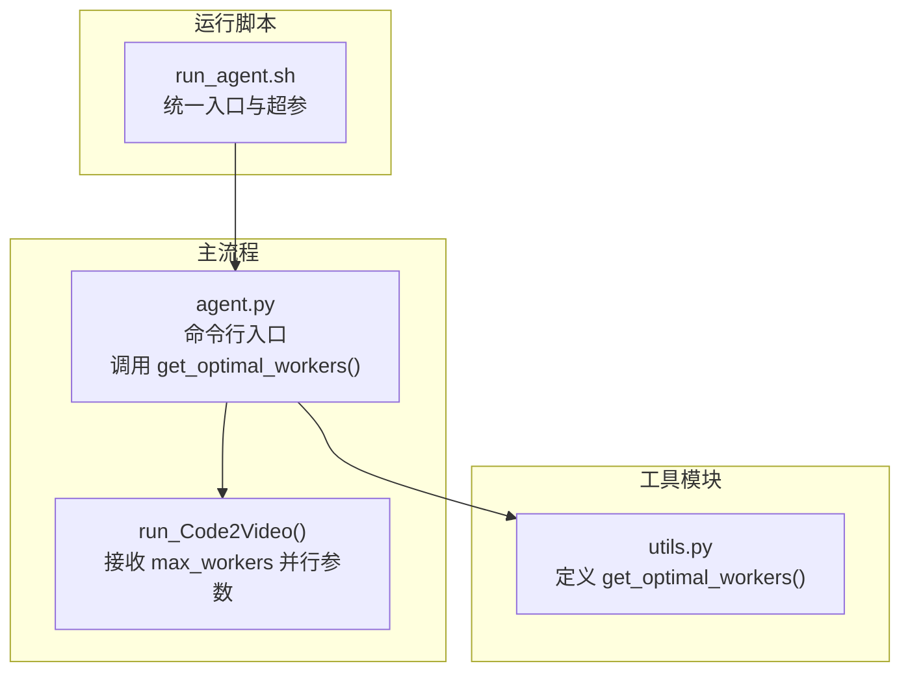
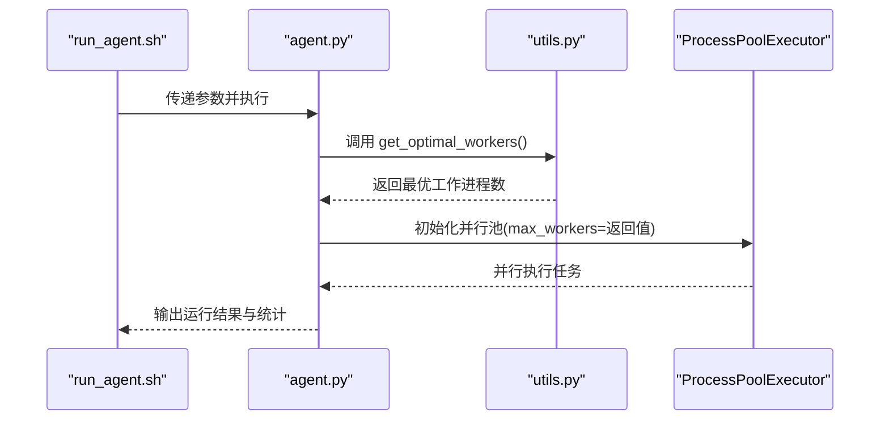
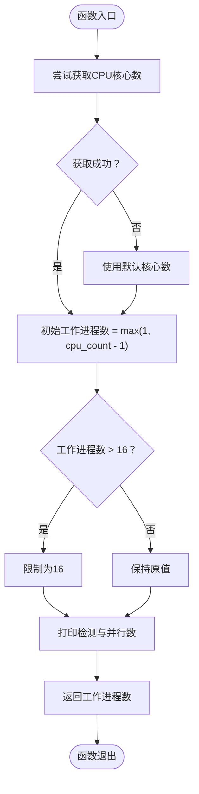
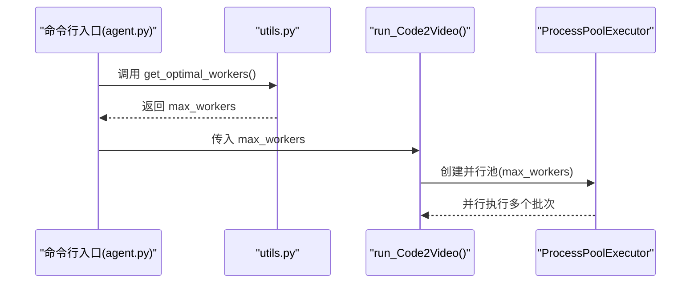
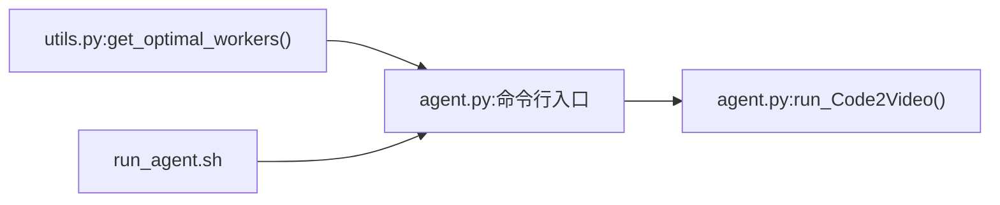

# get_optimal_workers函数

<cite>
**本文引用的文件**
- [utils.py](file://src/utils.py)
- [agent.py](file://src/agent.py)
- [run_agent.sh](file://src/run_agent.sh)
</cite>

## 目录
1. [简介](#简介)
2. [项目结构](#项目结构)
3. [核心组件](#核心组件)
4. [架构总览](#架构总览)
5. [详细组件分析](#详细组件分析)
6. [依赖关系分析](#依赖关系分析)
7. [性能考量](#性能考量)
8. [故障排查指南](#故障排查指南)
9. [结论](#结论)
10. [附录](#附录)

## 简介
本文件为 get_optimal_workers() 函数的详细API参考与实践说明。该函数用于在并行渲染流程中自适应地确定最优工作进程数量，其核心逻辑基于系统CPU核心数，采用“核心数减一”的保守策略，并对极高核数（>16核）进行上限控制，以避免内存压力导致的性能退化或崩溃。该函数在命令行入口脚本与Python主流程中被调用，作为初始化并行渲染任务的关键参数来源；同时，其打印语句提供调试信息，帮助用户快速确认当前系统资源与并行度配置。

## 项目结构
- get_optimal_workers() 定义于工具模块 utils.py 中，负责计算并返回整数型的最优工作进程数。
- 在主流程 agent.py 的命令行入口处，通过调用 get_optimal_workers() 获取 max_workers 参数，传入 run_Code2Video() 以启用并行批处理。
- 运行脚本 run_agent.sh 提供统一的入口与超参设置，便于在容器化或CI环境中复现。

图表来源
- [utils.py](file://src/utils.py#L53-L70)
- [agent.py](file://src/agent.py#L900-L913)

章节来源
- [utils.py](file://src/utils.py#L53-L70)
- [agent.py](file://src/agent.py#L900-L913)
- [run_agent.sh](file://src/run_agent.sh#L1-L40)

## 核心组件
- get_optimal_workers(): 计算并返回最优并行工作进程数。输入：无；输出：整数（工作进程数）。行为要点：
  - 读取CPU核心数：优先使用系统API获取；若不可用则回退到默认值。
  - 基于“核心数减一”原则设定初始值，保留至少一个核心给系统/其他进程。
  - 对极高核数（>16核）进行上限控制，防止内存溢出风险。
  - 打印检测到的核心数与最终使用的并行数，便于调试。

章节来源
- [utils.py](file://src/utils.py#L53-L70)

## 架构总览
get_optimal_workers() 在系统启动阶段被调用，作为并行渲染任务的参数来源，贯穿以下关键路径：
- 命令行入口：解析参数后调用 run_Code2Video()，并将 max_workers 设为 get_optimal_workers() 的返回值。
- 并行执行：run_Code2Video() 使用 ProcessPoolExecutor(max_workers=...) 启动并行批处理，内部再按批次串行处理知识点，从而实现“批内串行、批间并行”的两层并发模型。

图表来源
- [run_agent.sh](file://src/run_agent.sh#L1-L40)
- [agent.py](file://src/agent.py#L900-L913)
- [utils.py](file://src/utils.py#L53-L70)

## 详细组件分析

### get_optimal_workers() 函数签名与行为
- 函数名：get_optimal_workers()
- 输入：无
- 输出：整数（工作进程数）
- 关键步骤：
  1) 获取CPU核心数：优先使用系统API；若抛出特定异常则回退到默认值。
  2) 初始工作进程数 = max(1, cpu_count - 1)，保留至少一个核心给系统。
  3) 若工作进程数超过阈值，则限制为上限，避免内存压力。
  4) 打印检测到的核心数与最终使用的并行数，便于调试。

图表来源
- [utils.py](file://src/utils.py#L53-L70)

章节来源
- [utils.py](file://src/utils.py#L53-L70)

### 调用场景与上下文
- 在命令行入口中，get_optimal_workers() 的返回值被直接传入 run_Code2Video() 的 max_workers 参数，用于控制顶层并行批处理的工作进程数。
- run_Code2Video() 内部使用 ProcessPoolExecutor(max_workers=...) 启动并行池，随后将知识点分批提交执行，形成“批内串行、批间并行”的两层并发模型。

图表来源
- [agent.py](file://src/agent.py#L900-L913)
- [utils.py](file://src/utils.py#L53-L70)

章节来源
- [agent.py](file://src/agent.py#L900-L913)

### 不同CPU核心数下的输出示例
- 4核：工作进程数 = max(1, 4-1) = 3
- 16核：工作进程数 = max(1, 16-1) = 15
- 32核：工作进程数 = max(1, 32-1) = 31，但因超过16上限，最终为16
- 1核：工作进程数 = max(1, 1-1) = 0，经min约束仍为1

上述示例均以“核心数减一”的保守策略为基础，并在极高核数场景下进行上限控制，兼顾性能与稳定性。

章节来源
- [utils.py](file://src/utils.py#L53-L70)

### 调试信息与可观测性
- get_optimal_workers() 在计算完成后会打印一行包含“检测到的核心数”和“使用的并行数”的提示信息，便于在日志中快速核验当前并行度是否符合预期。
- 在命令行入口处，run_Code2Video() 也会打印“并行批处理模式”的统计信息，包括批次数量、每批知识点数量与并发批次数，有助于定位性能瓶颈或资源占用问题。

章节来源
- [utils.py](file://src/utils.py#L53-L70)
- [agent.py](file://src/agent.py#L760-L795)

### 容器化与CPU限制场景的潜在局限性
- 当容器对CPU进行限制（例如仅分配部分核心）时，系统API可能无法准确反映可用核心数，导致 get_optimal_workers() 的返回值与实际可调度核心不一致，进而引发过度并行或资源争用。
- 建议在受限环境中显式设置 max_workers 或通过环境变量注入目标并行度，以覆盖自动推断的结果，确保稳定运行。

章节来源
- [utils.py](file://src/utils.py#L53-L70)
- [agent.py](file://src/agent.py#L900-L913)

## 依赖关系分析
- 模块依赖：
  - utils.py：定义 get_optimal_workers()，依赖系统CPU核心数API与标准库。
  - agent.py：命令行入口调用 get_optimal_workers()，并将返回值传入 run_Code2Video()。
  - run_agent.sh：提供统一入口与超参，间接影响命令行参数与并行度配置。

图表来源
- [utils.py](file://src/utils.py#L53-L70)
- [agent.py](file://src/agent.py#L900-L913)
- [run_agent.sh](file://src/run_agent.sh#L1-L40)

章节来源
- [utils.py](file://src/utils.py#L53-L70)
- [agent.py](file://src/agent.py#L900-L913)
- [run_agent.sh](file://src/run_agent.sh#L1-L40)

## 性能考量
- CPU密集型渲染：Manim渲染属于CPU密集型任务，采用“核心数减一”的策略可避免系统资源枯竭，保证渲染过程稳定。
- 高核数上限：当核心数超过16时，强制限制为16，以缓解内存压力与上下文切换开销，提升整体吞吐。
- 并行粒度：结合 run_Code2Video() 的“批内串行、批间并行”设计，可在保证任务一致性的同时最大化利用多核资源。

章节来源
- [utils.py](file://src/utils.py#L53-L70)
- [agent.py](file://src/agent.py#L760-L795)

## 故障排查指南
- 并行度异常偏低：
  - 检查系统API是否可用；若不可用，函数会回退到默认值，可能导致并行度不足。
  - 查看 get_optimal_workers() 的打印信息，确认检测到的核心数与期望是否一致。
- 高核数下内存溢出：
  - 确认是否超过16核上限；若超过，函数已自动限制为16，但仍需关注内存监控。
- 容器化环境不稳定：
  - 显式设置 max_workers 或通过环境变量覆盖自动推断，避免受容器CPU配额影响。
- 日志定位：
  - 关注 run_Code2Video() 的并行批处理统计信息，定位批次级失败或耗时异常。

章节来源
- [utils.py](file://src/utils.py#L53-L70)
- [agent.py](file://src/agent.py#L760-L795)

## 结论
get_optimal_workers() 通过“核心数减一 + 高核数上限”的稳健策略，在CPU密集型渲染场景下实现了性能与资源平衡的折中。其在命令行入口与主流程中的调用，为并行渲染提供了可靠的并行度基准；配合调试打印与批处理模型，能够有效支撑从单机到容器化的多种部署形态。

## 附录
- 典型调用链：
  - run_agent.sh -> agent.py 命令行入口 -> get_optimal_workers() -> run_Code2Video() -> ProcessPoolExecutor
- 参考实现位置：
  - get_optimal_workers() 定义：[utils.py](file://src/utils.py#L53-L70)
  - 命令行入口调用：[agent.py](file://src/agent.py#L900-L913)
  - 并行批处理入口：[agent.py](file://src/agent.py#L760-L795)