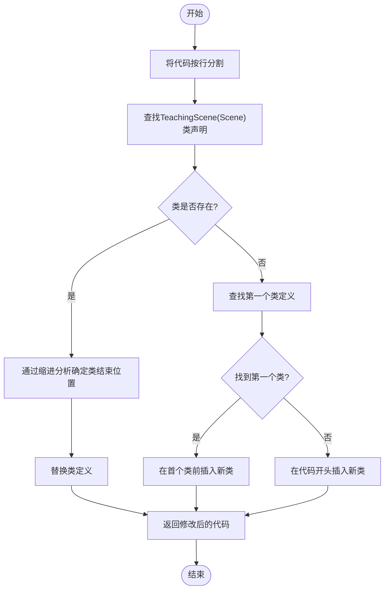

# replace_base_class函数

<cite>
**本文档引用的文件**  
- [agent.py](file://src/agent.py#L347)
- [utils.py](file://src/utils.py#L91-L129)
</cite>

## 目录
1. [简介](#简介)
2. [核心功能分析](#核心功能分析)
3. [参数说明](#参数说明)
4. [返回值](#返回值)
5. [代码替换示例](#代码替换示例)
6. [在agent.py中的关键作用](#在agentpy中的关键作用)
7. [应用场景](#应用场景)
8. [处理限制与注意事项](#处理限制与注意事项)

## 简介
`replace_base_class`函数是Code2Video项目中的一个核心工具函数，用于动态修改Manim动画代码中的场景基类。该函数通过解析Python代码字符串，定位特定的类定义并进行替换或插入操作，支持在未找到目标类时将新类定义插入到首个类之前。此功能在代码热更新、模板注入等场景中发挥着重要作用。

## 核心功能分析

`replace_base_class`函数实现了基于行分割和缩进分析的类边界检测算法，结合正则表达式对类声明行进行精确匹配。其主要逻辑分为两个部分：查找并替换现有类定义，或在适当位置插入新类定义。

当目标类`TeachingScene(Scene)`存在时，函数首先使用正则表达式`r"^\s*class\s+TeachingScene\s*\(Scene\)\s*:"`匹配类声明行，确定类定义的起始位置。随后，通过分析缩进级别来确定类定义的结束位置——即找到第一个与类声明行相同或更少缩进的非空行。最后，将原始类定义替换为新的类定义，并保留代码的其余部分。

若目标类不存在，则函数会搜索代码中第一个以`class`关键字开头的类定义，并将新类插入其前；若无任何类定义，则直接将新类添加至代码开头。



**图示来源**  
- [utils.py](file://src/utils.py#L91-L129)

**本节来源**  
- [utils.py](file://src/utils.py#L91-L129)

## 参数说明

- **code: str**  
  原始的Python代码字符串，通常为由大语言模型生成的Manim动画脚本。该字符串包含一个或多个类定义，其中可能包含名为`TeachingScene(Scene)`的类。

- **new_class_def: str**  
  新的类定义字符串，将用于替换原有的`TeachingScene(Scene)`类。该字符串应为完整的Python类定义，包括类名、继承关系和方法体。

**本节来源**  
- [utils.py](file://src/utils.py#L91)

## 返回值

- **str**  
  修改后的代码字符串。如果原始代码中存在`TeachingScene(Scene)`类，则该类被`new_class_def`完全替换；否则，`new_class_def`将被插入到第一个类定义之前，或在没有类定义时插入到代码开头。返回的代码字符串保留了原始代码的结构和格式，并确保新类定义后有两个换行符以符合Python代码风格。

**本节来源**  
- [utils.py](file://src/utils.py#L91-L129)

## 代码替换示例

假设原始代码如下：
```python
class TeachingScene(Scene):
    def construct(self):
        self.play(Create(Circle()))
```

调用`replace_base_class(code, "class CustomScene(Scene):\n    def construct(self):\n        self.play(Write(Text('Hello World')))")`后，输出为：
```python
class CustomScene(Scene):
    def construct(self):
        self.play(Write(Text('Hello World')))


```

若原始代码中没有`TeachingScene(Scene)`类，例如：
```python
class AnotherScene(Scene):
    def construct(self):
        self.play(Create(Square()))
```

则新类将被插入到`AnotherScene`之前，结果为：
```python
class CustomScene(Scene):
    def construct(self):
        self.play(Write(Text('Hello World')))


class AnotherScene(Scene):
    def construct(self):
        self.play(Create(Square()))
```

**本节来源**  
- [utils.py](file://src/utils.py#L91-L129)

## 在agent.py中的关键作用

在`agent.py`中，`replace_base_class`函数被用于动态注入自定义的场景基类。具体而言，在生成Manim代码后，系统会调用此函数将生成的代码中的`TeachingScene(Scene)`替换为用户指定的基类（通过`base_class`变量传递）。这一机制使得系统能够灵活地应用不同的动画模板或行为逻辑，而无需修改核心代码生成逻辑。

该函数在`TeachingVideoAgent.generate_section_code`方法中被调用，位于代码生成流程的后期阶段，确保所有动态定制化操作在代码保存前完成。

**本节来源**  
- [agent.py](file://src/agent.py#L347)

## 应用场景

- **代码热更新**：在不重启服务的情况下，动态替换正在使用的类定义，适用于需要频繁调整动画逻辑的开发环境。
- **模板注入**：根据不同教学主题或用户偏好，注入预定义的动画模板，提升内容生成的多样性和个性化程度。
- **模块化扩展**：允许第三方开发者提供自定义的场景基类，系统可无缝集成并应用这些扩展。
- **A/B测试**：快速切换不同版本的动画实现，便于评估不同视觉呈现方式的效果。

**本节来源**  
- [agent.py](file://src/agent.py#L347)
- [utils.py](file://src/utils.py#L91-L129)

## 处理限制与注意事项

尽管`replace_base_class`函数在大多数情况下表现良好，但仍存在一些处理复杂Python语法时的限制：

- **装饰器支持有限**：当前实现未充分考虑类上的装饰器（如`@staticmethod`、`@classmethod`等），若`TeachingScene`类带有装饰器，可能无法正确识别类边界。
- **嵌套类不支持**：函数假设类定义是顶层的，无法正确处理嵌套在其他类或函数内的`TeachingScene`定义。
- **缩进敏感性**：依赖缩进来判断类结束位置，若代码缩进不规范（如混合使用空格和制表符），可能导致错误的类边界判断。
- **正则表达式局限**：使用的正则表达式较为简单，无法处理复杂的继承语法（如多继承、泛型类等）。

建议在使用时确保输入代码格式规范，并避免在复杂语法结构中使用该函数。

**本节来源**  
- [utils.py](file://src/utils.py#L91-L129)