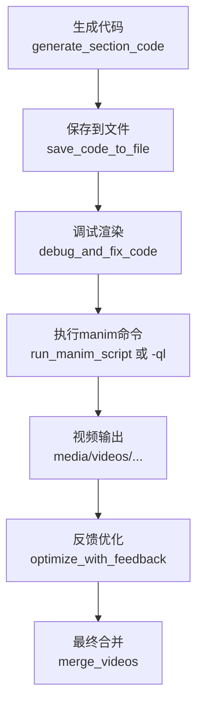
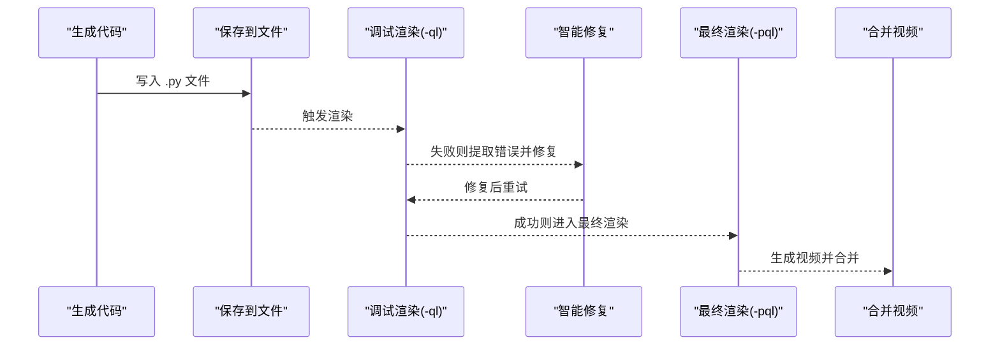
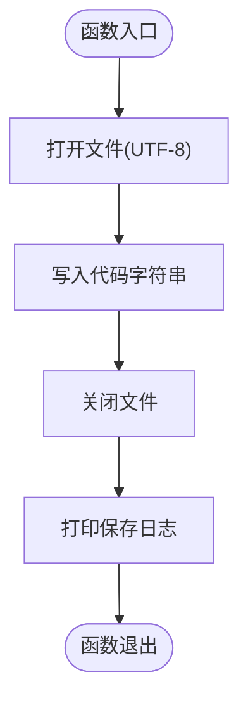
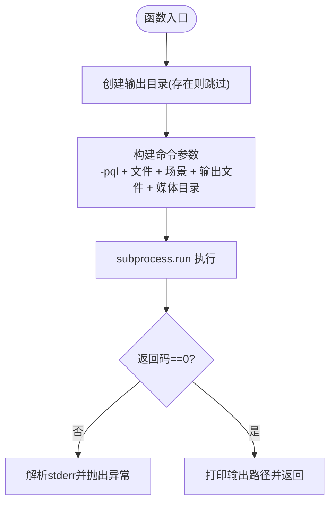
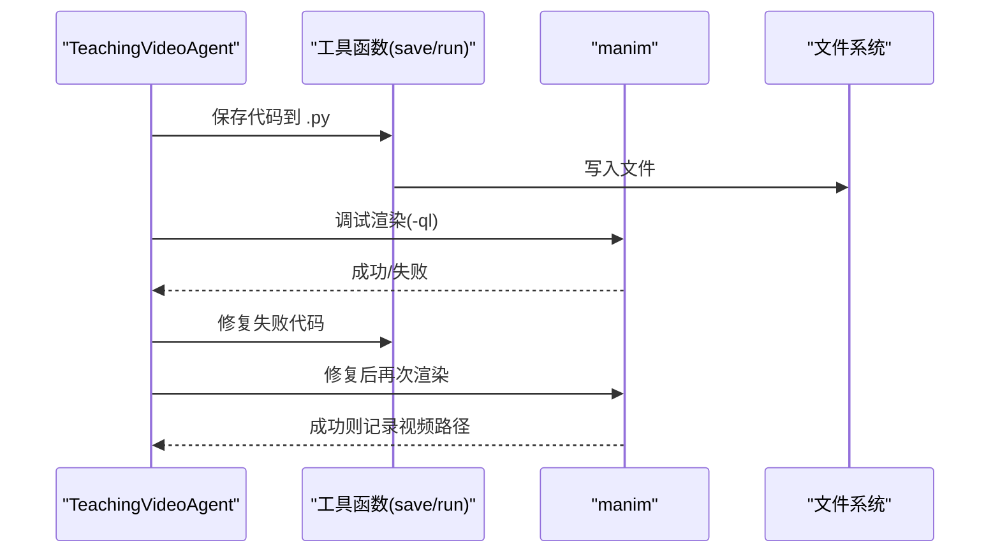
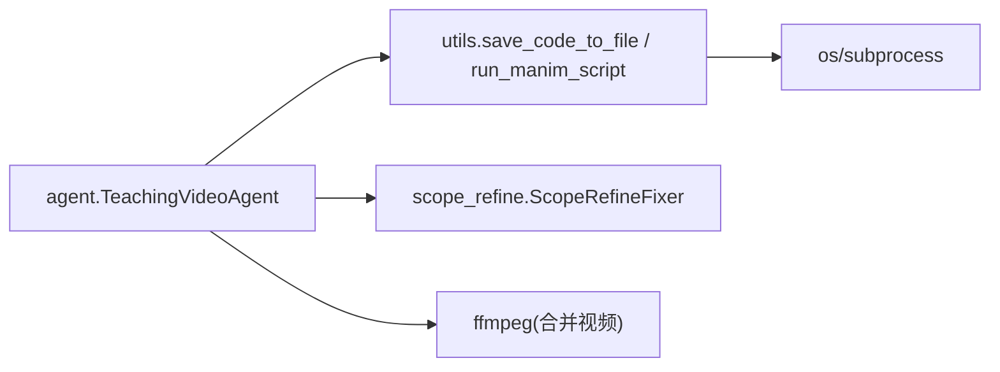

# save_code_to_file与run_manim_script函数

<cite>
**本文引用的文件**
- [src/utils.py](file://src/utils.py)
- [src/agent.py](file://src/agent.py)
- [src/scope_refine.py](file://src/scope_refine.py)
</cite>

## 目录
1. [简介](#简介)
2. [项目结构](#项目结构)
3. [核心组件](#核心组件)
4. [架构总览](#架构总览)
5. [详细组件分析](#详细组件分析)
6. [依赖关系分析](#依赖关系分析)
7. [性能考量](#性能考量)
8. [故障排查指南](#故障排查指南)
9. [结论](#结论)
10. [附录：串联使用示例](#附录串联使用示例)

## 简介
本文件聚焦于两个关键函数：save_code_to_file 与 run_manim_script。前者负责将生成的 Manim 代码字符串安全写入指定的 .py 文件，并输出操作日志；后者负责构建 manim 命令行参数（包含 -pql 质量设置、输出目录、媒体路径等），通过 subprocess 执行渲染，处理失败时的 stderr 输出与异常抛出。文档还结合 agent.py 主流程，说明这两个函数在代码持久化与执行引擎中的核心作用，并讨论 -pql 参数对开发调试效率的影响，以及 subprocess.run 的安全选项与错误处理最佳实践。

## 项目结构
- 代码持久化与执行引擎位于工具模块中：
  - save_code_to_file：将代码写入 .py 文件并打印日志
  - run_manim_script：构建 manim 命令并执行渲染，失败时抛出异常
- 渲染主流程在 TeachingVideoAgent 中，贯穿“生成代码—调试修复—反馈优化—合并视频”的闭环，其中：
  - 生成代码阶段会调用 save_code_to_file 将代码落盘
  - 调试修复阶段会调用 manim 进行快速渲染验证（-ql）
  - 反馈优化阶段可再次触发渲染（-pql）

图表来源
- [src/utils.py](file://src/utils.py#L131-L161)
- [src/agent.py](file://src/agent.py#L356-L401)
- [src/agent.py](file://src/agent.py#L527-L580)
- [src/agent.py](file://src/agent.py#L667-L702)

章节来源
- [src/utils.py](file://src/utils.py#L131-L161)
- [src/agent.py](file://src/agent.py#L356-L401)
- [src/agent.py](file://src/agent.py#L527-L580)
- [src/agent.py](file://src/agent.py#L667-L702)

## 核心组件
- save_code_to_file
  - 功能：将代码字符串写入目标 .py 文件，使用 UTF-8 编码，完成后打印保存日志
  - 参数：
    - code: str，待写入的代码字符串
    - filename: str，目标文件名（默认 "scene.py"）
  - 返回值：无（函数内部完成写入与日志输出）
  - 典型调用位置：生成代码后落盘
- run_manim_script
  - 功能：构建 manim 命令行参数并执行渲染，支持 -pql（播放+低质量）等质量设置，失败时记录 stderr 并抛出异常
  - 参数：
    - filename: str，Manim 脚本文件路径
    - scene_name: str，场景类名
    - output_dir: str，输出目录（默认 "videos"）
  - 返回值：str，最终生成的视频文件路径
  - 典型调用位置：调试渲染或最终渲染

章节来源
- [src/utils.py](file://src/utils.py#L131-L161)

## 架构总览
- 代码生成与持久化
  - 生成代码后，TeachingVideoAgent 会将代码写入 .py 文件，便于后续调试与渲染
- 渲染与修复
  - 使用 manim -ql 快速验证代码是否能生成视频，若失败则交由智能修复器进行修复并重试
- 反馈与优化
  - 基于 MLLM 对视频进行布局反馈，再根据建议重新生成/修改代码并再次渲染
- 合并输出
  - 将多个分段视频合并为最终成品

图表来源
- [src/agent.py](file://src/agent.py#L356-L401)
- [src/agent.py](file://src/agent.py#L527-L580)
- [src/agent.py](file://src/agent.py#L667-L702)
- [src/utils.py](file://src/utils.py#L131-L161)

## 详细组件分析

### save_code_to_file 函数
- 实现要点
  - 使用 UTF-8 编码写入文件
  - 写入完成后打印保存日志，便于追踪
- 数据流
  - 输入：code 字符串、filename
  - 输出：文件系统写入、控制台日志
- 错误处理
  - 未显式捕获异常；上层调用方应确保传入合法路径与权限
- 性能特性
  - IO 操作为主，复杂度 O(n)，n 为代码字符数

图表来源
- [src/utils.py](file://src/utils.py#L131-L136)

章节来源
- [src/utils.py](file://src/utils.py#L131-L136)

### run_manim_script 函数
- 实现要点
  - 自动创建输出目录（如不存在）
  - 构建 manim 命令行参数，包含 -pql（播放+低质量）、脚本路径、场景类名、输出文件名、媒体目录
  - 使用 subprocess.run 执行命令，捕获 stdout/stderr
  - 若返回码非零，解析 stderr 并抛出异常
  - 成功时打印输出路径并返回
- 数据流
  - 输入：filename、scene_name、output_dir
  - 输出：视频文件路径（字符串）
- 错误处理
  - 非零返回码即抛出异常，便于上层统一处理
  - 建议上层捕获异常并记录详细错误信息
- 安全性与最佳实践
  - 建议固定工作目录（cwd）避免相对路径歧义
  - 建议限制超时时间，防止长时间阻塞
  - 建议对用户输入进行白名单校验，避免命令注入
  - 建议仅在必要时启用 check=True，否则需自行检查返回码

图表来源
- [src/utils.py](file://src/utils.py#L138-L161)

章节来源
- [src/utils.py](file://src/utils.py#L138-L161)

### 在 agent.py 主流程中的角色
- 代码持久化
  - 生成代码后写入 .py 文件，便于后续调试与渲染
- 调试渲染
  - 使用 manim -ql 快速验证代码，若失败则交由智能修复器进行修复并重试
- 最终渲染
  - 修复成功后可选择 -pql 进行最终渲染（该参数在工具函数中已体现）
- 反馈优化
  - 基于 MLLM 反馈优化后的代码再次渲染，形成闭环

图表来源
- [src/agent.py](file://src/agent.py#L356-L401)
- [src/utils.py](file://src/utils.py#L131-L161)

章节来源
- [src/agent.py](file://src/agent.py#L356-L401)
- [src/utils.py](file://src/utils.py#L131-L161)

### -pql 参数对开发调试效率的影响
- -pql 的含义
  - -p：播放模式（自动播放）
  - -q：质量设置（低质量）
- 效果
  - 加快渲染速度，便于快速迭代与问题定位
  - 适合在开发阶段频繁验证代码正确性
- 注意事项
  - 低质量输出用于开发验证，最终发布前建议切换到更高质量参数（如 -pqm/-pqh）
  - 在工具函数中已体现 -pql 的使用方式，便于统一管理

章节来源
- [src/utils.py](file://src/utils.py#L143-L152)
- [src/agent.py](file://src/agent.py#L364-L369)

## 依赖关系分析
- save_code_to_file
  - 依赖：内置 open、print
  - 外部依赖：文件系统（写入 .py 文件）
- run_manim_script
  - 依赖：os、subprocess
  - 外部依赖：manim 可执行程序、FFmpeg（合并视频时）
- agent.py
  - 依赖：subprocess、Path、正则表达式
  - 依赖：scope_refine 智能修复器

图表来源
- [src/utils.py](file://src/utils.py#L1-L161)
- [src/agent.py](file://src/agent.py#L1-L120)
- [src/scope_refine.py](file://src/scope_refine.py#L45-L120)

章节来源
- [src/utils.py](file://src/utils.py#L1-L161)
- [src/agent.py](file://src/agent.py#L1-L120)
- [src/scope_refine.py](file://src/scope_refine.py#L45-L120)

## 性能考量
- save_code_to_file
  - IO 密集型，主要瓶颈在磁盘写入；可通过批量写入减少系统调用次数
- run_manim_script
  - 渲染为 CPU 密集型任务；建议合理设置并发与超时，避免资源争用
  - 建议在 agent.py 中使用 -ql 快速验证，减少等待时间
- 合并视频
  - 使用 ffmpeg 进行拼接，注意输入文件列表与路径合法性

章节来源
- [src/agent.py](file://src/agent.py#L667-L702)
- [src/utils.py](file://src/utils.py#L163-L174)

## 故障排查指南
- save_code_to_file
  - 症状：无法写入文件
  - 排查：确认路径是否存在、权限是否足够、编码是否正确
- run_manim_script
  - 症状：渲染失败且抛出异常
  - 排查：查看 stderr 输出，确认 manim 是否安装、命令参数是否正确、输出目录权限是否足够
- agent.py 调试渲染
  - 症状：-ql 渲染失败
  - 排查：检查智能修复器是否成功修复；若多次失败，考虑提高质量参数或调整场景逻辑
- 合并视频
  - 症状：拼接失败
  - 排查：确认视频列表文件内容与路径、ffmpeg 是否可用

章节来源
- [src/utils.py](file://src/utils.py#L154-L161)
- [src/agent.py](file://src/agent.py#L356-L401)
- [src/agent.py](file://src/agent.py#L667-L702)

## 结论
- save_code_to_file 与 run_manim_script 分别承担“代码持久化”和“渲染执行”的职责，二者配合 agent.py 的主流程，实现了从代码生成到视频产出的自动化闭环
- -pql 在开发调试阶段显著提升效率，建议在最终发布前切换到更高质量参数
- 通过合理的错误处理与超时控制，可进一步提升系统的稳定性与可观测性

## 附录：串联使用示例
以下示例展示从代码保存到视频生成的完整流程（步骤说明，不包含具体代码内容）：

1. 生成代码
   - 调用生成接口获取 Manim 代码字符串
   - 将代码写入 .py 文件（调用 save_code_to_file）
2. 调试渲染
   - 使用 manim -ql 快速验证代码是否能生成视频
   - 若失败，交由智能修复器进行修复并重试
3. 最终渲染
   - 修复成功后，使用 manim -pql 进行最终渲染（工具函数已体现）
4. 合并视频
   - 将多个分段视频合并为最终成品

章节来源
- [src/utils.py](file://src/utils.py#L131-L161)
- [src/agent.py](file://src/agent.py#L356-L401)
- [src/agent.py](file://src/agent.py#L527-L580)
- [src/agent.py](file://src/agent.py#L667-L702)