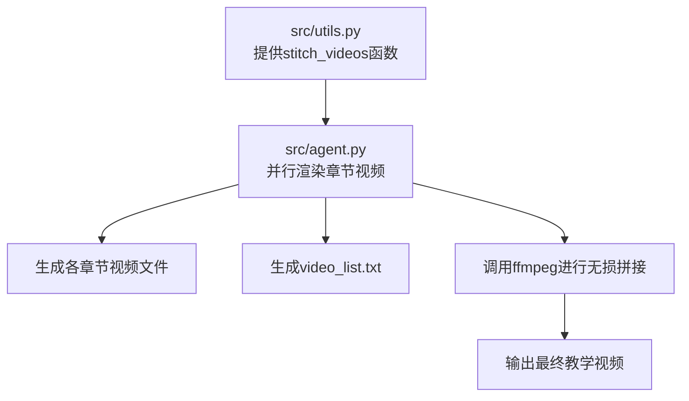
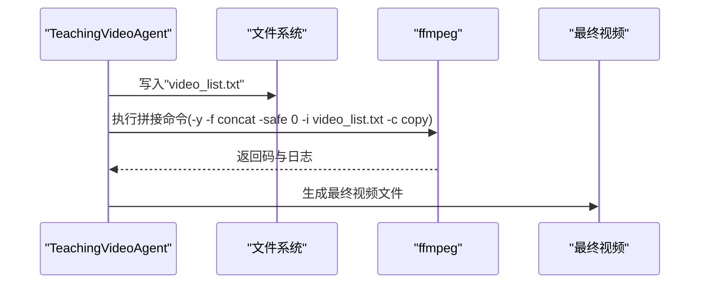
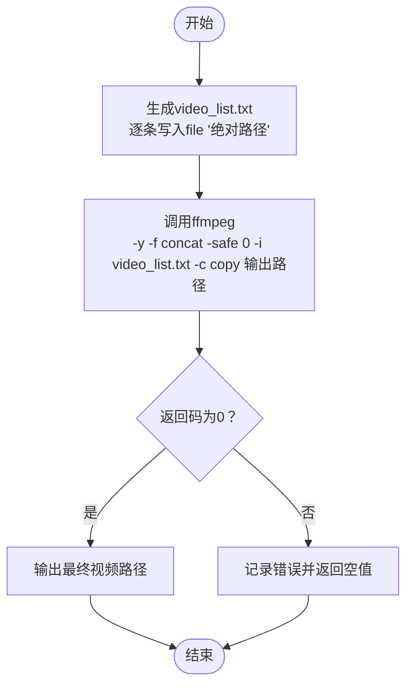
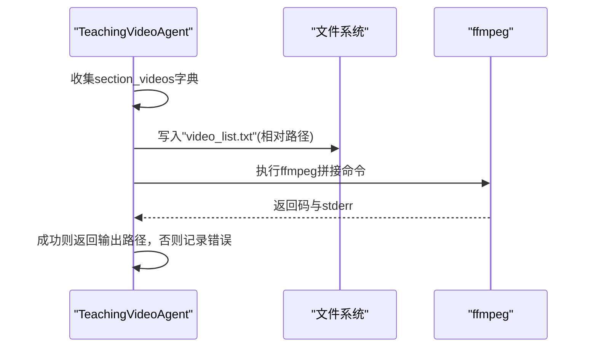
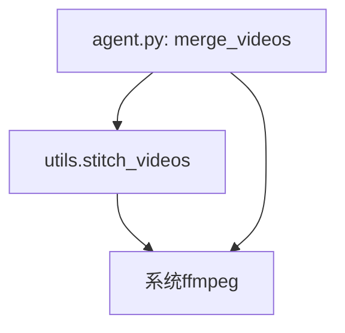

# stitch_videos函数

<cite>
**本文引用的文件**
- [src/utils.py](file://src/utils.py)
- [src/agent.py](file://src/agent.py)
- [src/requirements.txt](file://src/requirements.txt)
</cite>

## 目录
1. [简介](#简介)
2. [项目结构](#项目结构)
3. [核心组件](#核心组件)
4. [架构总览](#架构总览)
5. [详细组件分析](#详细组件分析)
6. [依赖关系分析](#依赖关系分析)
7. [性能考量](#性能考量)
8. [故障排查指南](#故障排查指南)
9. [结论](#结论)
10. [附录](#附录)

## 简介
本文件为 stich_videos 函数的详细API参考文档。该函数用于将多个已渲染的视频片段无损拼接为一个完整的教学视频。其工作原理是：先生成一个 ffmpeg 的输入列表文件（video_list.txt），再通过 ffmpeg concat 协议与流复制（-c copy）的方式进行快速拼接，避免重新编码带来的质量损失与时间消耗。本文将从系统架构、数据流、处理逻辑、集成点、错误处理与性能特征等维度进行深入解析，并结合 agent.py 中的并行渲染流程说明其在最终视频合成中的关键作用，同时给出参数说明、调用示例、临时文件管理注意事项、编码一致性要求及 ffmpeg 依赖的部署前提。

## 项目结构
- 核心实现位于工具模块中，提供独立的视频拼接能力；
- 在智能教学视频生成流水线中，agent.py 负责并行渲染各章节视频，随后调用拼接函数产出最终视频。

图表来源
- [src/utils.py](file://src/utils.py#L163-L174)
- [src/agent.py](file://src/agent.py#L667-L701)

章节来源
- [src/utils.py](file://src/utils.py#L163-L174)
- [src/agent.py](file://src/agent.py#L667-L701)

## 核心组件
- stitch_videos 函数：接收视频文件路径列表与输出路径，生成 ffmpeg 输入列表文件并调用 ffmpeg 进行无损拼接。
- 依赖 ffmpeg：通过子进程方式执行，使用 concat 协议与流复制策略。
- 返回值：成功时返回输出文件的绝对路径字符串；失败时返回空值或抛出异常（取决于调用方封装）。

章节来源
- [src/utils.py](file://src/utils.py#L163-L174)

## 架构总览
下图展示了从并行渲染到最终拼接的整体流程，以及 stitch_videos 在其中的位置。

图表来源
- [src/agent.py](file://src/agent.py#L667-L701)
- [src/utils.py](file://src/utils.py#L163-L174)

## 详细组件分析

### 函数签名与职责
- 函数名：stitch_videos
- 参数：
  - video_files: List[str] —— 待拼接的视频文件绝对路径或相对路径列表
  - output_path: str —— 最终输出文件的路径（默认值见函数内部）
- 返回值：无（函数内部直接打印结果信息；若需外部判断，请参考 agent.py 中的封装返回）

章节来源
- [src/utils.py](file://src/utils.py#L163-L174)

### 数据结构与算法
- 输入列表生成：遍历 video_files，写入“video_list.txt”，每行格式为 file '绝对路径'，以满足 ffmpeg concat 协议要求。
- 拼接策略：使用 ffmpeg concat 协议与 -c copy 流复制，避免重编码，从而实现无损且高性能的拼接。

图表来源
- [src/utils.py](file://src/utils.py#L163-L174)

### 命令行参数设计与性能优势
- -y：覆盖输出文件，避免交互式确认，便于自动化脚本运行。
- -f concat：指定输入容器格式为 concat，使 ffmpeg 能正确识别并按顺序读取列表文件。
- -safe 0：允许使用绝对路径，避免 concat 协议对相对路径的安全限制导致的失败。
- -c copy：流复制，直接搬运原始编码数据，不进行解码/重编码，显著提升速度并保持无损质量。

章节来源
- [src/utils.py](file://src/utils.py#L163-L174)

### 在agent.py中的关键步骤
- 并行渲染完成后，TeachingVideoAgent 将各章节视频路径收集到字典中；
- 生成 video_list.txt，内容为各视频文件相对输出目录的路径；
- 调用 ffmpeg 进行无损拼接，成功后返回最终视频路径。

图表来源
- [src/agent.py](file://src/agent.py#L667-L701)

章节来源
- [src/agent.py](file://src/agent.py#L667-L701)

### 参数说明
- video_files: 视频路径列表
  - 类型：List[str]
  - 含义：待拼接的视频文件路径集合
  - 注意：当使用 utils.stitch_videos 时，建议传入绝对路径以避免 concat 协议的路径解析问题；若传入相对路径，concat 协议可能因安全限制而失败
- output_path: 输出路径
  - 类型：str
  - 含义：最终合成视频的保存路径
  - 默认值：函数内部有默认输出文件名（通常为 final_output.mp4），但建议显式传入以确保可预测性

章节来源
- [src/utils.py](file://src/utils.py#L163-L174)

### 返回值
- 无（函数内部未显式返回值）；在 agent.py 的封装中，merge_videos 方法会根据 ffmpeg 返回码决定是否返回最终输出路径字符串。若需在外部判断拼接结果，建议参考 agent.py 的返回逻辑。

章节来源
- [src/utils.py](file://src/utils.py#L163-L174)
- [src/agent.py](file://src/agent.py#L667-L701)

### 实际调用示例（合并三个分段视频）
以下为调用示例的路径参考，不展示具体代码内容：
- 使用 utils.stitch_videos 的调用位置参考：[调用示例路径](file://src/utils.py#L163-L174)
- 在 agent.py 中的调用位置参考：[调用示例路径](file://src/agent.py#L667-L701)

章节来源
- [src/utils.py](file://src/utils.py#L163-L174)
- [src/agent.py](file://src/agent.py#L667-L701)

### 临时文件管理注意事项
- video_list.txt：由函数或 agent 自动创建于当前工作目录或输出目录，拼接完成后不会自动删除，建议在上层逻辑中显式清理，避免占用磁盘空间。
- 输出文件：由 -y 参数覆盖写入，如需保留历史版本，应在调用前自行备份。

章节来源
- [src/utils.py](file://src/utils.py#L163-L174)
- [src/agent.py](file://src/agent.py#L667-L701)

### 编码格式一致性要求
- 由于采用 -c copy 流复制策略，ffmpeg 不会改变视频的编码格式与参数，因此要求所有输入视频必须具有相同的编码格式、分辨率、帧率与像素格式等关键参数，否则 ffmpeg 可能无法拼接或产生错误。
- 若输入视频存在差异，建议在渲染阶段统一参数，或在拼接前使用转码工具进行预处理。

章节来源
- [src/utils.py](file://src/utils.py#L163-L174)

### ffmpeg 依赖的部署前提
- 需要在系统 PATH 中可用 ffmpeg 命令，且具备执行权限；
- 依赖版本：仓库未强制限定版本，但 concat 协议与 -safe 选项在主流版本 ffmpeg 中均受支持；
- 若使用 imageio-ffmpeg 包（见 requirements.txt），它提供了 Python 层面的 ffmpeg 安装与调用辅助，但本函数直接通过子进程调用系统 ffmpeg，不依赖该包。

章节来源
- [src/requirements.txt](file://src/requirements.txt#L24-L30)
- [src/utils.py](file://src/utils.py#L163-L174)

## 依赖关系分析
- 组件耦合：
  - utils.stitch_videos 与 ffmpeg 存在外部依赖耦合；
  - agent.py 的 merge_videos 与 utils.stitch_videos 在功能上互补：前者负责生成 video_list.txt 并封装返回值，后者提供通用拼接能力。
- 外部依赖：
  - ffmpeg：系统级二进制程序，通过 subprocess 调用；
  - imageio-ffmpeg：Python 包，用于安装与管理 ffmpeg，但本函数不依赖此包。

图表来源
- [src/utils.py](file://src/utils.py#L163-L174)
- [src/agent.py](file://src/agent.py#L667-L701)
- [src/requirements.txt](file://src/requirements.txt#L24-L30)

章节来源
- [src/utils.py](file://src/utils.py#L163-L174)
- [src/agent.py](file://src/agent.py#L667-L701)
- [src/requirements.txt](file://src/requirements.txt#L24-L30)

## 性能考量
- 流复制（-c copy）的优势：避免重编码，拼接速度极快，内存占用低，适合大规模视频拼接；
- 输入一致性：编码一致可避免 ffmpeg 的兼容性检查失败与额外处理开销；
- 列表文件大小：video_list.txt 文件过大可能影响读取效率，建议控制单次拼接的片段数量；
- I/O瓶颈：磁盘吞吐能力可能成为瓶颈，建议使用SSD或高速存储介质。

## 故障排查指南
- ffmpeg返回非零码：
  - 检查 video_list.txt 是否生成成功、路径是否正确（建议使用绝对路径）；
  - 确认所有输入视频的编码格式一致；
  - 查看 stderr 日志定位具体失败原因。
- 权限问题：
  - 确保 ffmpeg 可执行且在 PATH 中；
  - 确保输出目录具有写入权限。
- 路径问题：
  - concat 协议对相对路径有限制，建议使用绝对路径或确保相对路径在 concat 协议范围内。

章节来源
- [src/utils.py](file://src/utils.py#L163-L174)
- [src/agent.py](file://src/agent.py#L667-L701)

## 结论
stitch_videos 提供了简洁高效的无损视频拼接能力，配合 agent.py 的并行渲染流程，能够快速产出高质量的教学视频。通过流复制与 concat 协议，系统在保证质量的同时最大化提升性能。实际使用中应关注输入视频的一致性、路径规范与临时文件管理，并确保 ffmpeg 的可用性与权限配置正确。

## 附录
- 相关调用路径参考：
  - [utils.stitch_videos 定义](file://src/utils.py#L163-L174)
  - [agent.py: merge_videos 定义](file://src/agent.py#L667-L701)
- 依赖声明参考：
  - [requirements.txt 中的 ffmpeg 相关依赖](file://src/requirements.txt#L24-L30)