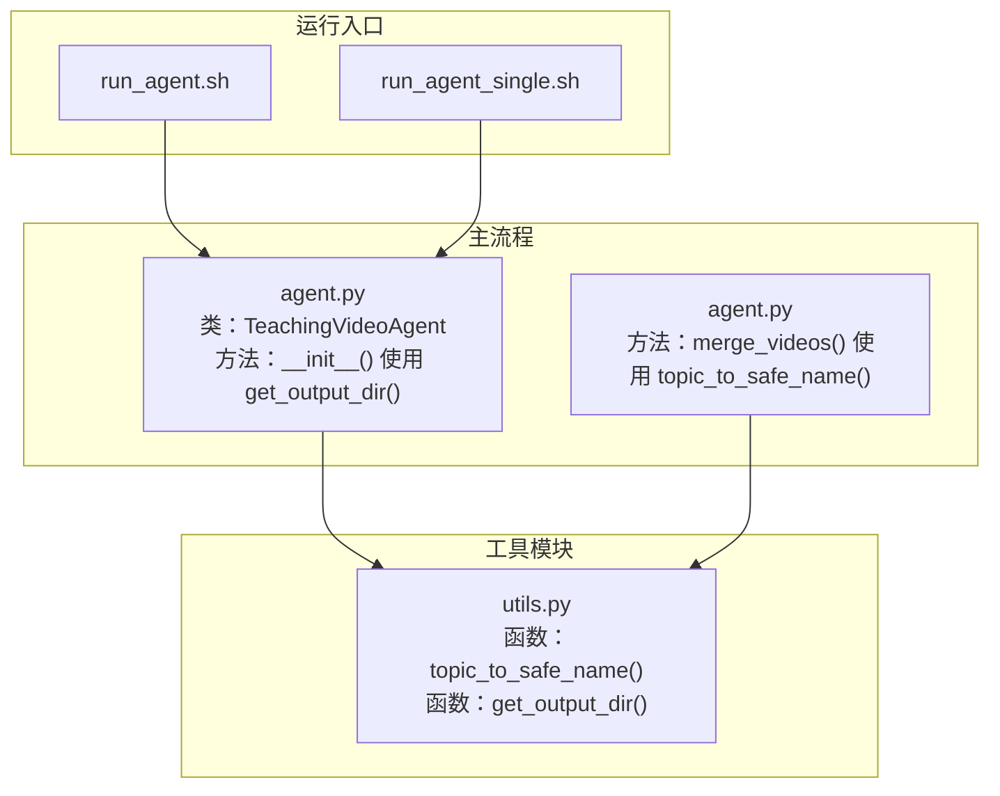
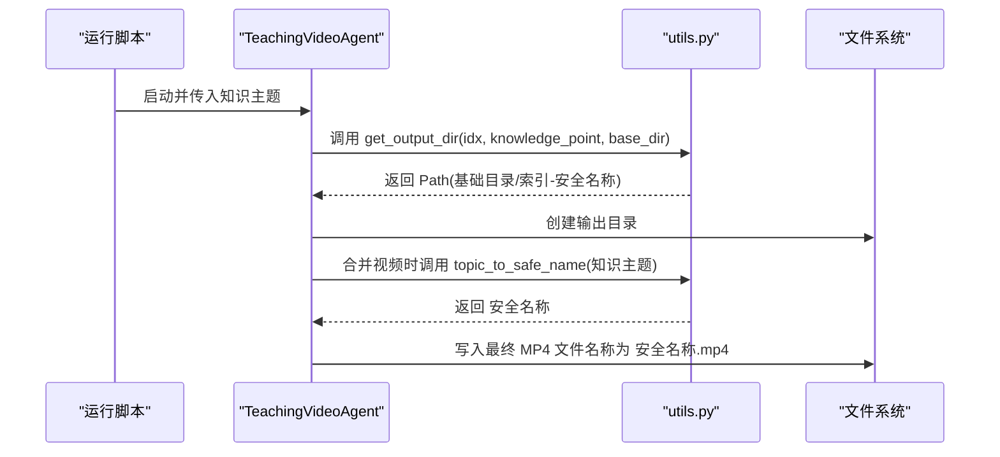
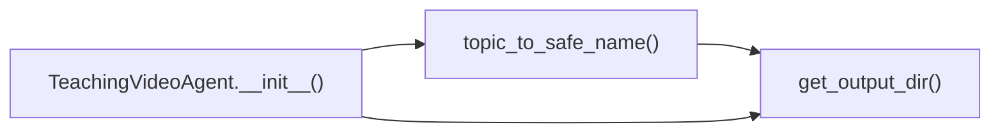

# topic_to_safe_name与get_output_dir函数

<cite>
**本文引用的文件**
- [utils.py](file://src/utils.py)
- [agent.py](file://src/agent.py)
- [run_agent.sh](file://src/run_agent.sh)
- [run_agent_single.sh](file://src/run_agent_single.sh)
</cite>

## 目录
1. [简介](#简介)
2. [项目结构](#项目结构)
3. [核心组件](#核心组件)
4. [架构总览](#架构总览)
5. [详细组件分析](#详细组件分析)
6. [依赖关系分析](#依赖关系分析)
7. [性能考虑](#性能考虑)
8. [故障排查指南](#故障排查指南)
9. [结论](#结论)
10. [附录](#附录)

## 简介
本文档面向topic_to_safe_name与get_output_dir两个函数，提供完整的API参考与实践说明。内容涵盖：
- topic_to_safe_name如何通过正则表达式过滤非法文件字符并替换空格为下划线，生成安全的文件夹/文件名；
- get_output_dir如何结合索引与安全名称构建唯一输出目录路径，并支持返回安全名称的附加模式；
- 参数说明、返回值定义与行为边界；
- 在run_agent.sh与agent.py中用于组织批量输出文件结构的关键作用；
- SAFE_PATTERN字符集的设计考量与跨平台文件系统兼容性优势；
- 特殊字符知识点（如“量子纠缠 & 超导”）的处理示例与建议。

## 项目结构
这两个函数位于工具模块utils.py中，被agent.py中的TeachingVideoAgent类在初始化阶段调用以确定每个知识点的输出目录；同时在合并视频时也会复用topic_to_safe_name生成安全的最终MP4文件名。

图表来源
- [utils.py](file://src/utils.py#L176-L193)
- [agent.py](file://src/agent.py#L80-L90)
- [agent.py](file://src/agent.py#L672-L676)
- [run_agent.sh](file://src/run_agent.sh#L1-L39)
- [run_agent_single.sh](file://src/run_agent_single.sh#L1-L48)

章节来源
- [utils.py](file://src/utils.py#L176-L193)
- [agent.py](file://src/agent.py#L80-L90)
- [agent.py](file://src/agent.py#L672-L676)
- [run_agent.sh](file://src/run_agent.sh#L1-L39)
- [run_agent_single.sh](file://src/run_agent_single.sh#L1-L48)

## 核心组件
- topic_to_safe_name(knowledge_point)
  - 功能：将输入的知识点字符串转换为适合文件系统使用的安全名称。
  - 行为要点：
    - 使用正则表达式过滤掉不安全字符，保留字母、数字、空格、下划线、连字符、花括号、方括号、逗号、加号、等号与希腊小写π（用于数学表达式）。
    - 将连续空格压缩为单一下划线，并去除首尾空白。
  - 返回：字符串（安全文件名）。
- get_output_dir(idx, knowledge_point, base_dir, get_safe_name=False)
  - 功能：根据索引、安全名称与基础目录生成唯一的输出目录路径。
  - 行为要点：
    - 默认仅返回目录路径；当get_safe_name=True时，额外返回安全名称。
    - 目录命名格式为“idx-安全名称”，确保不同知识点在同一base_dir下具备唯一性。
  - 返回：Path对象（默认）或二元组(Path, str)（当get_safe_name=True时）。

章节来源
- [utils.py](file://src/utils.py#L176-L193)

## 架构总览
topic_to_safe_name与get_output_dir在数据流中的位置如下：
- 输入：知识主题字符串（来自用户或配置文件）。
- 处理：先生成安全名称，再拼接索引形成唯一目录。
- 输出：目录路径（供TeachingVideoAgent创建工作目录），并在合并视频时作为最终MP4文件名的基础。

图表来源
- [agent.py](file://src/agent.py#L80-L90)
- [agent.py](file://src/agent.py#L672-L676)
- [utils.py](file://src/utils.py#L176-L193)

## 详细组件分析

### topic_to_safe_name 函数
- 函数签名与用途
  - 签名：topic_to_safe_name(knowledge_point)
  - 用途：将任意字符串转换为可直接用于文件系统路径的安全名称。
- 正则策略与字符集
  - 允许字符：字母、数字、空格、下划线、连字符、花括号、方括号、逗号、加号、等号、希腊小写π（用于数学表达式）。
  - 不允许字符：其他所有特殊符号（如尖括号、反斜杠、冒号、星号、问号、竖线、百分号等）。
  - 空白处理：将连续空格压缩为单一下划线，并去除首尾空白。
- 复杂度
  - 时间复杂度：O(n)，其中n为输入字符串长度。
  - 空间复杂度：O(n)，用于生成新字符串。
- 错误处理
  - 无显式异常抛出；若输入非字符串类型，需确保上游调用者保证类型正确。
- 兼容性
  - 该字符集覆盖Windows、macOS与Linux常见文件系统限制，避免路径分隔符、控制字符与保留字符导致的问题。

章节来源
- [utils.py](file://src/utils.py#L176-L182)

### get_output_dir 函数
- 函数签名与用途
  - 签名：get_output_dir(idx, knowledge_point, base_dir, get_safe_name=False)
  - 用途：为每个知识主题生成唯一的输出目录路径，并可选择返回安全名称。
- 参数说明
  - idx：整数，用于前缀编号，确保同一base_dir下的目录唯一。
  - knowledge_point：字符串，知识主题文本。
  - base_dir：字符串或Path对象，输出根目录。
  - get_safe_name：布尔值，是否同时返回安全名称。
- 返回值
  - 默认：Path对象（基础目录/索引-安全名称）。
  - 当get_safe_name=True：返回二元组(Path, str)，其中第二项为安全名称。
- 处理逻辑
  - 先调用topic_to_safe_name生成安全名称。
  - 组合“索引-安全名称”，并拼接到base_dir下。
  - 若get_safe_name=True，额外返回安全名称。
- 复杂度
  - 时间复杂度：O(n)，主要由正则替换决定。
  - 空间复杂度：O(n)。
- 错误处理
  - 无显式异常抛出；调用者应确保idx为整数且base_dir可解析为有效路径。
- 典型用法
  - 初始化TeachingVideoAgent时设置输出目录。
  - 批量评估视频列表时，同时获取目录与安全名称，确保MP4文件名一致。

章节来源
- [utils.py](file://src/utils.py#L185-L193)

### 在 run_agent.sh 与 agent.py 中的作用
- run_agent.sh
  - 作为批量运行入口，通过命令行参数传递API、反馈开关、并发参数等，间接驱动TeachingVideoAgent对多个知识主题进行处理。
  - 该脚本本身不直接调用topic_to_safe_name/get_output_dir，但其执行流程会触发agent.py中的调用。
- agent.py
  - TeachingVideoAgent.__init__：调用get_output_dir(idx, knowledge_point, base_dir)创建每个知识主题的工作目录。
  - TeachingVideoAgent.merge_videos：调用topic_to_safe_name(knowledge_point)生成最终MP4文件名，确保文件名安全且与目录命名一致。
  - 这些调用保证了批量输出的层次清晰、命名规范、跨平台兼容。

章节来源
- [run_agent.sh](file://src/run_agent.sh#L1-L39)
- [agent.py](file://src/agent.py#L80-L90)
- [agent.py](file://src/agent.py#L672-L676)

### 示例：特殊字符知识点的处理
- 输入示例：包含“&”、“超导”等字符的主题
- 处理流程：
  - topic_to_safe_name过滤掉不安全字符，保留字母、数字、空格、下划线、连字符、花括号、方括号、逗号、加号、等号与希腊小写π。
  - 连续空格被压缩为单一下划线，首尾空白被去除。
  - 最终得到安全文件名，随后由get_output_dir拼接“索引-安全名称”作为目录名。
- 建议
  - 对于包含数学符号（如“&”）的主题，推荐在知识主题中明确使用允许的符号集合，避免出现未预期的截断或重名。
  - 若需要保留特定符号，请在上游预处理阶段将其映射为允许字符或替换为空格后由函数统一处理。

章节来源
- [utils.py](file://src/utils.py#L176-L182)
- [utils.py](file://src/utils.py#L185-L193)

## 依赖关系分析
- 模块内依赖
  - get_output_dir依赖topic_to_safe_name生成安全名称。
- 跨模块依赖
  - agent.py在TeachingVideoAgent初始化与视频合并阶段分别调用utils.py中的函数。
- 可能的耦合点
  - 目录命名规则与文件命名规则需保持一致（均由安全名称派生），避免路径与文件名冲突。
  - get_safe_name=True时，调用方需同时使用返回的安全名称生成MP4文件名，确保一致性。

图表来源
- [utils.py](file://src/utils.py#L176-L193)
- [agent.py](file://src/agent.py#L80-L90)
- [agent.py](file://src/agent.py#L672-L676)

章节来源
- [utils.py](file://src/utils.py#L176-L193)
- [agent.py](file://src/agent.py#L80-L90)
- [agent.py](file://src/agent.py#L672-L676)

## 性能考虑
- 正则替换的线性时间复杂度与常数空间开销，适用于短至中等长度的知识主题字符串。
- 在批量处理场景中，建议：
  - 预先校验输入字符串类型，避免不必要的异常处理开销。
  - 控制知识主题长度，减少正则匹配与替换成本。
  - 合理设置base_dir，避免过深的目录层级影响I/O性能。

## 故障排查指南
- 症状：输出目录名为空或包含非法字符
  - 排查：确认输入knowledge_point为字符串；检查是否包含未允许的特殊字符。
  - 解决：在上游预处理中移除或替换不允许的字符。
- 症状：多条目输出目录重名
  - 排查：确认idx是否唯一；检查topic_to_safe_name是否因空格压缩导致名称冲突。
  - 解决：为idx增加更细粒度的前缀或在上游增强知识主题的区分度。
- 症状：最终MP4文件名与目录名不一致
  - 排查：确认merge_videos是否使用topic_to_safe_name生成文件名。
  - 解决：确保始终使用相同的安全名称生成逻辑。

章节来源
- [utils.py](file://src/utils.py#L176-L193)
- [agent.py](file://src/agent.py#L672-L676)

## 结论
topic_to_safe_name与get_output_dir共同构成了本项目文件命名与目录组织的核心机制。前者负责将任意字符串转换为安全名称，后者负责基于索引与安全名称生成唯一目录路径。二者配合在run_agent.sh与agent.py中实现了批量输出的规范化、可维护性与跨平台兼容性。通过合理设计的字符集与处理流程，能够有效避免文件系统层面的兼容性问题，并提升自动化流水线的稳定性。

## 附录
- API参考摘要
  - topic_to_safe_name(knowledge_point)
    - 参数：knowledge_point（字符串）
    - 返回：安全文件名（字符串）
  - get_output_dir(idx, knowledge_point, base_dir, get_safe_name=False)
    - 参数：idx（整数）、knowledge_point（字符串）、base_dir（字符串或Path）、get_safe_name（布尔）
    - 返回：Path对象（默认）或二元组(Path, str)（当get_safe_name=True时）