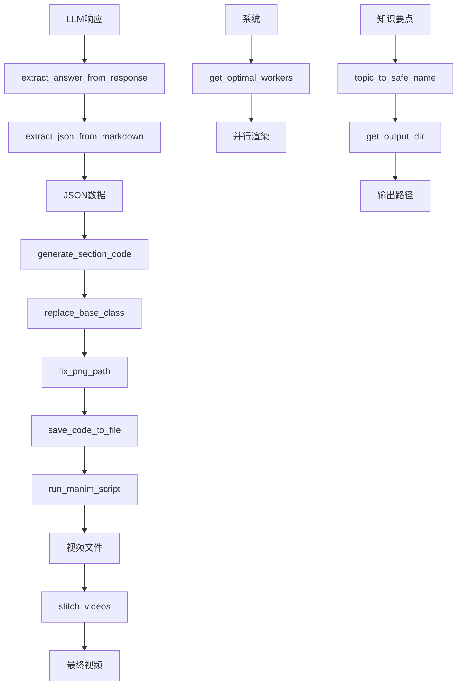

# 工具函数

<cite>
**本文档中引用的文件**  
- [utils.py](file://src/utils.py)
- [agent.py](file://src/agent.py)
- [gpt_request.py](file://src/gpt_request.py)
</cite>

## 目录
1. [简介](#简介)
2. [核心工具函数](#核心工具函数)
3. [JSON与响应处理](#json与响应处理)
4. [Manim代码与文件操作](#manim代码与文件操作)
5. [视频处理与系统资源](#视频处理与系统资源)
6. [路径与命名处理](#路径与命名处理)

## 简介
`utils.py` 模块是 Code2Video 项目的核心工具库，提供了一系列关键函数，用于处理从大型语言模型（LLM）生成的响应、操作 Manim 动画代码、管理文件和系统资源，以及处理路径和命名。这些工具函数贯穿于整个视频生成流程，确保了从内容生成到最终视频输出的自动化和可靠性。本文档详细记录了该模块中所有关键工具函数的参数、返回值、实现逻辑和使用场景。

## 核心工具函数

`utils.py` 模块中的函数构成了 Code2Video 项目的基础，它们被 `TeachingVideoAgent` 类在生成教学视频的各个阶段所调用。这些函数主要分为几大类：处理 LLM 响应、操作 Manim 代码、执行文件和系统命令、以及处理路径和命名。通过这些工具，项目能够智能地解析不同 API 的响应、动态生成和修正动画代码、并行渲染视频片段，并最终将它们合并成一个完整的教学视频。



**图表来源**
- [utils.py](file://src/utils.py#L11-L208)
- [agent.py](file://src/agent.py#L507-L666)

## JSON与响应处理

### extract_json_from_markdown 函数
此函数负责从大型语言模型返回的 Markdown 格式文本中提取 JSON 内容。它使用正则表达式来匹配包含在 ```json 或 ``` 代码块中的 JSON 对象。如果找到匹配项，则返回其中的 JSON 字符串；否则，返回原始输入文本。这确保了即使 LLM 的响应格式不完全规范，也能正确提取出结构化的数据。

**函数签名**
```python
def extract_json_from_markdown(text)
```

**参数**
- `text` (str): 包含潜在 JSON 内容的 Markdown 格式字符串。

**返回值**
- (str): 提取出的 JSON 字符串，或原始输入文本。

**使用示例**
```python
markdown_text = "```json\n{\"key\": \"value\"}\n```"
json_content = extract_json_from_markdown(markdown_text)
# json_content 的值为 "{\"key\": \"value\"}"
```

**在主流程中的调用场景**
该函数被 `extract_answer_from_response` 函数调用，作为处理 LLM 响应的最后一步，确保从文本中提取出纯净的 JSON 数据。它也被 `agent.py` 中的 `generate_outline` 和 `generate_storyboard` 方法直接调用，用于解析 LLM 生成的教学大纲和故事板。

**函数来源**
- [utils.py](file://src/utils.py#L11-L16)

### extract_answer_from_response 函数
此函数旨在兼容处理来自不同 LLM API（如 Gemini 和 OpenAI）的响应格式。它通过尝试访问不同响应对象的属性来获取文本内容，首先尝试 Gemini 的 `response.candidates[0].content.parts[0].text` 结构，然后尝试 OpenAI 的 `response.choices[0].message.content` 结构，如果都失败则返回响应对象的字符串表示。最后，它会调用 `extract_json_from_markdown` 来清理内容。

**函数签名**
```python
def extract_answer_from_response(response)
```

**参数**
- `response` (object): 来自 LLM API 的原始响应对象。

**返回值**
- (str): 从响应中提取并清理后的文本内容。

**使用示例**
```python
# 假设 response 是来自 Gemini 或 OpenAI 的响应对象
clean_content = extract_answer_from_response(response)
```

**在主流程中的调用场景**
该函数在 `agent.py` 的 `get_mllm_feedback` 方法中被调用，用于处理多模态大模型（MLLM）对生成视频的反馈分析结果。它确保了无论使用哪种 API，都能以统一的方式获取反馈内容。

**函数来源**
- [utils.py](file://src/utils.py#L19-L28)
- [agent.py](file://src/agent.py#L439)

## Manim代码与文件操作

### replace_base_class 函数
此函数安全地替换 Manim 代码中的基类定义。它通过解析代码的行，查找名为 `TeachingScene(Scene):` 的类定义，然后用新的类定义替换整个旧的类块。如果未找到 `TeachingScene`，它会将新类定义插入到第一个类定义之前。这允许项目动态地为不同的教学场景注入特定的基类配置。

**函数签名**
```python
def replace_base_class(code: str, new_class_def: str) -> str
```

**参数**
- `code` (str): 包含 Manim 代码的原始字符串。
- `new_class_def` (str): 用于替换的新类定义字符串。

**返回值**
- (str): 修改后的代码字符串。

**使用示例**
```python
original_code = '''
class TeachingScene(Scene):
    def construct(self):
        pass

class MyScene(TeachingScene):
    def construct(self):
        self.add(Text("Hello"))
'''

new_base = 'class TeachingScene(Scene):\n    def setup(self):\n        self.camera.background_color = "#000000"'

modified_code = replace_base_class(original_code, new_base)
```

**在主流程中的调用场景**
该函数在 `agent.py` 的 `generate_section_code` 方法中被调用，在将 LLM 生成的代码保存到文件之前，用项目定义的 `base_class` 替换掉代码中的默认基类。

**函数来源**
- [utils.py](file://src/utils.py#L91-L128)
- [agent.py](file://src/agent.py#L348)

### save_code_to_file 函数
此函数将生成的 Manim 代码字符串保存到指定的 Python 文件中。它使用 UTF-8 编码写入文件，并在控制台输出保存成功的提示。

**函数签名**
```python
def save_code_to_file(code: str, filename: str = "scene.py")
```

**参数**
- `code` (str): 要保存的 Manim 代码字符串。
- `filename` (str, optional): 输出文件的名称，默认为 "scene.py"。

**返回值**
- 无

**使用示例**
```python
manim_code = "from manim import *\nclass MyScene(Scene):\n    def construct(self):\n        self.add(Circle())"
save_code_to_file(manim_code, "my_animation.py")
```

**在主流程中的调用场景**
该函数在 `agent.py` 的 `generate_section_code` 方法中被调用，用于将每个章节的 Manim 代码保存为独立的 `.py` 文件，以便后续进行渲染。

**函数来源**
- [utils.py](file://src/utils.py#L132-L135)

### run_manim_script 函数
此函数通过调用命令行来运行 Manim 脚本，生成视频。它构建了一个包含 `manim` 命令、脚本文件路径、场景类名和输出目录等参数的命令列表，并使用 `subprocess.run` 执行。如果渲染失败，会抛出运行时异常。

**函数签名**
```python
def run_manim_script(filename: str, scene_name: str, output_dir: str = "videos") -> str
```

**参数**
- `filename` (str): Manim 脚本文件的路径。
- `scene_name` (str): 要渲染的场景类的名称。
- `output_dir` (str, optional): 视频输出目录，默认为 "videos"。

**返回值**
- (str): 生成的视频文件的完整路径。

**使用示例**
```python
video_path = run_manim_script("my_animation.py", "MyScene", "output_videos")
```

**在主流程中的调用场景**
该函数在 `agent.py` 的 `debug_and_fix_code` 方法中被间接调用（通过 `subprocess.run`），用于渲染单个章节的视频。`agent.py` 中的 `render_all_sections` 方法负责协调所有章节的并行渲染。

**函数来源**
- [utils.py](file://src/utils.py#L139-L160)

## 视频处理与系统资源

### stitch_videos 函数
此函数利用 `ffmpeg` 工具将多个 MP4 视频文件合并成一个最终的视频。它首先创建一个文本文件，其中列出了所有要合并的视频文件的绝对路径，然后调用 `ffmpeg` 的 concat 协议来执行无损合并（`-c copy`）。

**函数签名**
```python
def stitch_videos(video_files: List[str], output_path: str = "final_output.mp4")
```

**参数**
- `video_files` (List[str]): 要合并的视频文件路径列表。
- `output_path` (str, optional): 合并后视频的输出路径，默认为 "final_output.mp4"。

**返回值**
- 无

**使用示例**
```python
video_list = ["part1.mp4", "part2.mp4", "part3.mp4"]
stitch_videos(video_list, "final_lecture.mp4")
```

**在主流程中的调用场景**
该函数在 `agent.py` 的 `merge_videos` 方法中被调用，作为视频生成流程的最后一步，将所有成功渲染的章节视频片段合并成一个完整的教学视频。

**函数来源**
- [utils.py](file://src/utils.py#L164-L173)
- [agent.py](file://src/agent.py#L667-L701)

### get_optimal_workers 函数
此函数根据 CPU 核心数动态计算最优的并行工作进程数。它首先获取系统的 CPU 核心总数，然后减去一个核心（为系统和其他进程保留），得到最优工作数。为了防止在高核心数机器上内存溢出，当最优数超过 16 时，会将其限制为 16。

**函数签名**
```python
def get_optimal_workers()
```

**参数**
- 无

**返回值**
- (int): 计算得出的最优并行工作进程数。

**使用示例**
```python
optimal_workers = get_optimal_workers()
# 在 8 核机器上，optimal_workers 的值为 7
```

**在主流程中的调用场景**
该函数在 `agent.py` 的 `run_Code2Video` 函数中被调用，用于确定并行处理知识要点时的最大工作进程数，以优化整体处理效率。

**函数来源**
- [utils.py](file://src/utils.py#L53-L70)
- [agent.py](file://src/agent.py#L909)

### monitor_system_resources 函数
此函数监控系统的 CPU 和内存使用率。它使用 `psutil` 库获取当前的资源使用情况，并在控制台输出使用率。如果 CPU 使用率超过 95% 或内存使用率超过 90%，会输出警告信息。

**函数签名**
```python
def monitor_system_resources()
```

**参数**
- 无

**返回值**
- (bool): 如果成功获取资源信息则返回 `True`，否则返回 `False`。

**使用示例**
```python
if monitor_system_resources():
    print("系统资源监控正常")
else:
    print("系统资源监控失败")
```

**在主流程中的调用场景**
该函数在项目中被定义，但根据现有代码分析，它可能在调试或监控阶段被调用，以确保在高负载渲染时系统资源充足。

**函数来源**
- [utils.py](file://src/utils.py#L73-L88)

## 路径与命名处理

### fix_png_path 函数
此函数自动修正 Manim 代码中的 PNG 资源路径。它通过正则表达式找到代码中所有引用 `.png` 文件的字符串，然后检查这些路径。如果路径不是绝对路径，或者虽然是绝对路径但不在指定的资源目录下，它会将文件名提取出来，并与资源目录的绝对路径拼接，从而确保所有 PNG 资源都能被正确加载。

**函数签名**
```python
def fix_png_path(code_str: str, assets_dir: Path) -> str
```

**参数**
- `code_str` (str): 包含 Manim 代码的字符串。
- `assets_dir` (Path): PNG 资源所在的目录路径。

**返回值**
- (str): 修正了 PNG 路径后的代码字符串。

**使用示例**
```python
code_with_relative_path = 'self.add(ImageMobject("logo.png"))'
fixed_code = fix_png_path(code_with_relative_path, Path("/path/to/assets"))
# fixed_code 中的路径将被修正为 "/path/to/assets/logo.png"
```

**在主流程中的调用场景**
该函数在 `external_assets.py` 的 `process_storyboard_with_assets` 函数中被调用，用于在将下载的图标资产集成到 Manim 代码之前，修正代码中对这些资产的引用路径。

**函数来源**
- [utils.py](file://src/utils.py#L31-L50)
- [agent.py](file://src/agent.py#L283)

### topic_to_safe_name 函数
此函数将知识要点的标题转换为安全的文件名。它使用正则表达式移除所有不允许的字符（只保留字母、数字、空格、下划线、连字符、括号、加号、&、= 和 π 符号），然后将连续的空格替换为单个下划线。

**函数签名**
```python
def topic_to_safe_name(knowledge_point)
```

**参数**
- `knowledge_point` (str): 原始的知识要点标题。

**返回值**
- (str): 转换后的安全文件名。

**使用示例**
```python
unsafe_name = "微积分: 导数与积分 (基础篇)"
safe_name = topic_to_safe_name(unsafe_name)
# safe_name 的值为 "微积分_导数与积分_基础篇"
```

**在主流程中的调用场景**
该函数在 `agent.py` 的 `get_output_dir` 和 `merge_videos` 方法中被调用，用于生成基于知识要点标题的输出目录名和最终视频文件名，确保文件系统兼容性。

**函数来源**
- [utils.py](file://src/utils.py#L176-L182)
- [agent.py](file://src/agent.py#L673)

### get_output_dir 函数
此函数根据知识要点的索引和标题生成输出目录的路径。它调用 `topic_to_safe_name` 将标题转换为安全名称，并在前面加上索引（如 "0-微积分"）。它还支持返回安全名称本身，以便在其他地方复用。

**函数签名**
```python
def get_output_dir(idx, knowledge_point, base_dir, get_safe_name=False)
```

**参数**
- `idx` (int): 知识要点的索引。
- `knowledge_point` (str): 知识要点的标题。
- `base_dir` (str): 基础输出目录。
- `get_safe_name` (bool, optional): 是否同时返回安全名称。

**返回值**
- (Path 或 Tuple[Path, str]): 输出目录的路径，如果 `get_safe_name` 为 `True`，则返回一个包含路径和安全名称的元组。

**使用示例**
```python
output_path = get_output_dir(0, "线性代数", "CASES")
# output_path 的值为 Path("CASES/0-线性代数")
```

**在主流程中的调用场景**
该函数在 `agent.py` 的 `TeachingVideoAgent` 构造函数中被调用，用于初始化每个知识要点的专属输出目录，确保不同任务的输出文件不会相互覆盖。

**函数来源**
- [utils.py](file://src/utils.py#L185-L192)
- [agent.py](file://src/agent.py#L83)