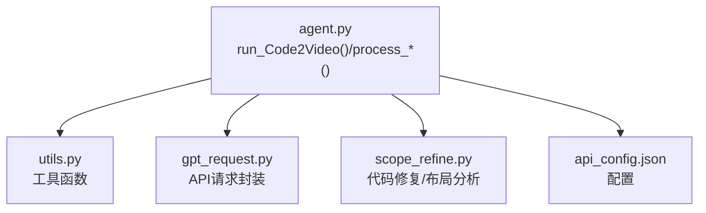
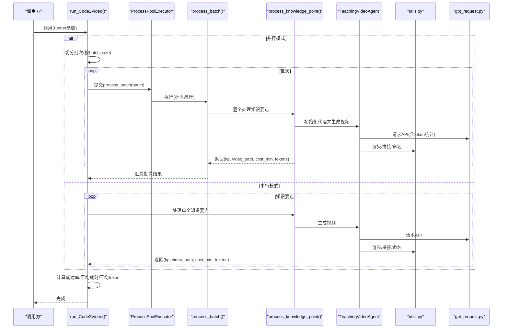
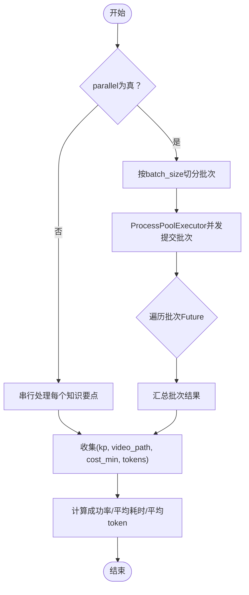
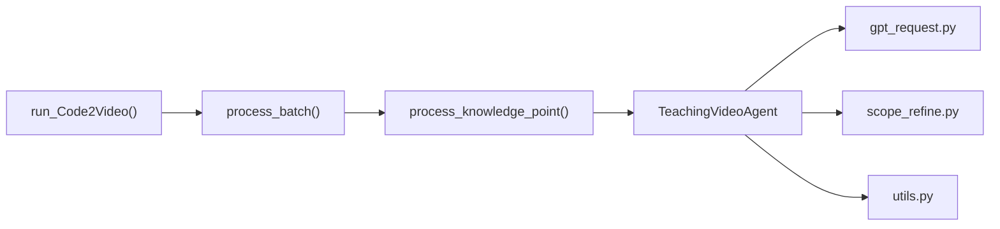
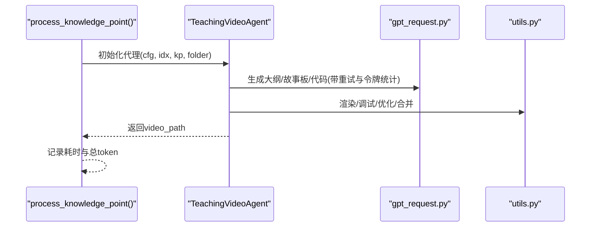

# 顶层函数

<cite>
**本文引用的文件**
- [agent.py](file://src/agent.py)
- [utils.py](file://src/utils.py)
- [gpt_request.py](file://src/gpt_request.py)
- [scope_refine.py](file://src/scope_refine.py)
- [api_config.json](file://src/api_config.json)
</cite>

## 目录
1. [简介](#简介)
2. [项目结构](#项目结构)
3. [核心组件](#核心组件)
4. [架构总览](#架构总览)
5. [详细组件分析](#详细组件分析)
6. [依赖关系分析](#依赖关系分析)
7. [性能考量](#性能考量)
8. [故障排查指南](#故障排查指南)
9. [结论](#结论)
10. [附录](#附录)

## 简介
本文件面向Code2Video的高层程序接口，聚焦于批量生成教学视频的主入口函数run_Code2Video()。文档将系统性说明其参数与行为、执行流程（分批与并行策略）、辅助函数process_knowledge_point()与process_batch()的角色、返回值与统计指标，并提供可直接用于脚本调用的示例路径与最佳实践。

## 项目结构
- 核心入口与主流程位于agent.py，包含RunConfig配置类、TeachingVideoAgent智能体、以及run_Code2Video()、process_knowledge_point()、process_batch()等高层函数。
- 工具函数位于utils.py，涵盖资源监控、文件名安全化、输出目录构建、视频拼接等。
- 大模型请求封装位于gpt_request.py，提供多模型统一请求与重试、令牌用量统计。
- 代码修复与布局分析位于scope_refine.py，负责错误分类、修复提示生成与网格布局提取。
- 配置文件api_config.json集中存放各模型的base_url、api_version、api_key与模型名称。

图表来源
- [agent.py](file://src/agent.py#L760-L912)
- [utils.py](file://src/utils.py#L1-L210)
- [gpt_request.py](file://src/gpt_request.py#L1-L200)
- [scope_refine.py](file://src/scope_refine.py#L1-L200)
- [api_config.json](file://src/api_config.json#L1-L40)

章节来源
- [agent.py](file://src/agent.py#L760-L912)

## 核心组件
- RunConfig：运行配置对象，承载API回调、反馈开关、资产使用、最大尝试次数、令牌上限等参数。
- TeachingVideoAgent：单个知识要点的全流程代理，包含大纲生成、故事板生成、代码生成、渲染、反馈优化与视频合并。
- run_Code2Video()：批量入口，支持串行或并行模式；并行时按batch_size分批，每批内部串行，避免API速率限制。
- process_knowledge_point()：处理单个知识要点，记录耗时与总token消耗。
- process_batch()：处理一批知识要点（批内串行），批间由ProcessPoolExecutor并行。

章节来源
- [agent.py](file://src/agent.py#L43-L55)
- [agent.py](file://src/agent.py#L722-L739)
- [agent.py](file://src/agent.py#L741-L757)
- [agent.py](file://src/agent.py#L760-L809)

## 架构总览
下图展示了run_Code2Video()的高层执行流：根据parallel参数选择串行或并行；并行时先将知识要点按batch_size切分为多个批次，再通过ProcessPoolExecutor并发调度各批次；每个批次内部对知识要点逐个串行处理，以降低API限速风险；最终汇总统计成功比例、平均耗时与平均token消耗。

图表来源
- [agent.py](file://src/agent.py#L760-L809)
- [agent.py](file://src/agent.py#L741-L757)
- [agent.py](file://src/agent.py#L722-L739)
- [gpt_request.py](file://src/gpt_request.py#L1-L200)
- [utils.py](file://src/utils.py#L138-L174)

## 详细组件分析

### run_Code2Video() 函数
- 参数
  - knowledge_points：知识要点字符串列表
  - folder_path：输出根目录路径
  - parallel：是否并行处理，默认True
  - batch_size：每批知识要点数量，默认3
  - max_workers：最大并发批次数，默认8
  - cfg：RunConfig配置对象
- 行为
  - 若parallel为True：按batch_size切分批次，使用ProcessPoolExecutor并发提交各批次；每个批次内部逐个处理知识要点，以避免API速率限制。
  - 若parallel为False：串行遍历知识要点，逐个处理。
  - 每个知识要点处理完成后收集(kp, video_path, cost_min, tokens)，最后计算成功率、平均耗时与平均token消耗。
- 返回值
  - 无显式返回；但会打印统计信息：总知识要点数、成功数、成功率、平均耗时（分钟/知识要点）、平均token消耗（tokens/知识要点）。
- 典型调用示例（路径）
  - 参考命令行入口中的调用方式：[agent.py](file://src/agent.py#L905-L912)

章节来源
- [agent.py](file://src/agent.py#L760-L809)

#### 流程图：run_Code2Video() 执行逻辑

图表来源
- [agent.py](file://src/agent.py#L760-L809)

### process_knowledge_point() 函数
- 角色：单个知识要点的处理单元，负责初始化TeachingVideoAgent并执行完整流程，记录耗时与总token消耗。
- 输出：返回(kp, video_path, cost_min, tokens)四元组，供上层聚合统计。
- 典型调用示例（路径）
  - 在process_batch()中被调用：[agent.py](file://src/agent.py#L741-L757)
  - 在run_Code2Video()串行分支中被调用：[agent.py](file://src/agent.py#L783-L791)

章节来源
- [agent.py](file://src/agent.py#L722-L739)

### process_batch() 函数
- 角色：批内串行处理器，按顺序处理批次内的每个知识要点；为避免API限速，在相邻知识要点之间插入随机延迟。
- 输出：返回(batch_idx, results)二元组，results为该批次内所有知识要点的处理结果列表。
- 典型调用示例（路径）
  - 在run_Code2Video()并行分支中被调用：[agent.py](file://src/agent.py#L760-L809)

章节来源
- [agent.py](file://src/agent.py#L741-L757)

### TeachingVideoAgent 类与核心流程
- 关键阶段
  - 生成教学大纲：从知识要点生成课程大纲
  - 生成故事板：基于大纲生成动画分镜，可选增强资产
  - 生成代码：为每个分镜生成Manim代码
  - 渲染视频：并行渲染各分镜视频，支持MLLM反馈优化
  - 合并视频：将分镜视频拼接为完整视频
- Token统计：在请求API时自动累加prompt_tokens、completion_tokens、total_tokens，供process_knowledge_point()汇总。
- 典型调用示例（路径）
  - 生成视频主流程：[agent.py](file://src/agent.py#L703-L719)
  - 渲染并行：[agent.py](file://src/agent.py#L596-L666)

章节来源
- [agent.py](file://src/agent.py#L134-L141)
- [agent.py](file://src/agent.py#L138-L189)
- [agent.py](file://src/agent.py#L190-L272)
- [agent.py](file://src/agent.py#L295-L355)
- [agent.py](file://src/agent.py#L527-L577)
- [agent.py](file://src/agent.py#L596-L666)
- [agent.py](file://src/agent.py#L667-L702)

### API封装与令牌统计
- 统一请求接口：gpt_request.py提供多种模型的请求函数，均支持重试与指数退避、日志ID、超时控制。
- 令牌统计：多数请求函数返回usage字典，TeachingVideoAgent在每次请求后累加到token_usage，便于最终统计。
- 配置来源：api_config.json集中管理各模型的base_url、api_version、api_key与模型名称。

章节来源
- [gpt_request.py](file://src/gpt_request.py#L1-L200)
- [gpt_request.py](file://src/gpt_request.py#L276-L366)
- [api_config.json](file://src/api_config.json#L1-L40)

### 工具函数与资源管理
- 输出目录与安全命名：topic_to_safe_name()与get_output_dir()确保输出路径与文件名符合平台要求。
- 视频拼接：stitch_videos()使用ffmpeg将分镜视频拼接为最终视频。
- 系统资源监控：monitor_system_resources()打印CPU与内存使用率，便于观察高负载情况。
- 最优工作进程：get_optimal_workers()根据CPU核数动态估算并行渲染进程数，避免内存溢出。

章节来源
- [utils.py](file://src/utils.py#L176-L193)
- [utils.py](file://src/utils.py#L185-L193)
- [utils.py](file://src/utils.py#L163-L174)
- [utils.py](file://src/utils.py#L53-L71)

## 依赖关系分析
- run_Code2Video()依赖：
  - process_batch()：批内串行处理
  - ProcessPoolExecutor：批间并行
  - utils.py：输出目录与视频拼接
  - gpt_request.py：API请求与令牌统计
- process_knowledge_point()依赖：
  - TeachingVideoAgent：完整生成流程
  - utils.py：输出目录与命名
  - gpt_request.py：API请求
- TeachingVideoAgent依赖：
  - gpt_request.py：多轮API请求
  - scope_refine.py：代码修复与布局分析
  - utils.py：渲染、拼接、命名

图表来源
- [agent.py](file://src/agent.py#L722-L809)
- [gpt_request.py](file://src/gpt_request.py#L1-L200)
- [scope_refine.py](file://src/scope_refine.py#L1-L200)
- [utils.py](file://src/utils.py#L138-L174)

章节来源
- [agent.py](file://src/agent.py#L722-L809)

## 性能考量
- 并行策略
  - 批间并行：使用ProcessPoolExecutor并发处理多个批次，提升吞吐量
  - 批内串行：批次内部逐个处理，避免API限速与资源争用
- 资源控制
  - get_optimal_workers()建议渲染进程数，避免高负载导致内存溢出
  - monitor_system_resources()可用于运行时观察资源占用
- I/O与网络
  - ffmpeg拼接视频为硬拷贝，速度快但不重编码；如需转码请另行处理
  - API请求采用指数退避与重试，提高稳定性

[本节为通用指导，无需特定文件来源]

## 故障排查指南
- 常见问题
  - API请求失败：检查api_config.json中的base_url、api_key与模型名称；确认网络连通性
  - Manim渲染失败：查看TeachingVideoAgent.debug_and_fix_code()的错误日志；必要时启用scope_refine.py的智能修复
  - 视频拼接失败：确认ffmpeg已安装且可用；检查video_list.txt与输出路径权限
- 定位方法
  - 查看process_knowledge_point()返回的video_path是否为空，结合时间戳定位失败环节
  - 使用monitor_system_resources()观察CPU/内存峰值，判断是否资源不足
- 优化建议
  - 适当增大batch_size与max_workers，但需平衡API限速与本地资源
  - 对频繁失败的知识要点，减少并发或增加重试次数

章节来源
- [agent.py](file://src/agent.py#L527-L577)
- [agent.py](file://src/agent.py#L596-L666)
- [utils.py](file://src/utils.py#L163-L174)
- [scope_refine.py](file://src/scope_refine.py#L341-L371)

## 结论
run_Code2Video()提供了灵活高效的批量教学视频生成能力：通过“批间并行、批内串行”的策略，在保证API稳定性的同时最大化吞吐；配合TeachingVideoAgent的完整流水线与gpt_request.py的令牌统计，能够便捷地评估成本与质量。建议在生产环境中结合资源监控与合理的batch_size/max_workers配置，以获得最佳性能与稳定性。

[本节为总结性内容，无需特定文件来源]

## 附录

### API定义与调用示例（路径）
- run_Code2Video()签名与默认参数
  - [agent.py](file://src/agent.py#L760-L762)
- 串行/并行调用示例（命令行入口）
  - [agent.py](file://src/agent.py#L905-L912)
- 运行配置对象RunConfig字段
  - [agent.py](file://src/agent.py#L43-L55)
- 输出目录与安全命名
  - [utils.py](file://src/utils.py#L176-L193)
- 视频拼接
  - [utils.py](file://src/utils.py#L163-L174)
- API配置
  - [api_config.json](file://src/api_config.json#L1-L40)

### 关键流程时序图：单个知识要点处理

图表来源
- [agent.py](file://src/agent.py#L722-L739)
- [agent.py](file://src/agent.py#L138-L189)
- [agent.py](file://src/agent.py#L190-L272)
- [agent.py](file://src/agent.py#L295-L355)
- [agent.py](file://src/agent.py#L527-L577)
- [agent.py](file://src/agent.py#L667-L702)
- [gpt_request.py](file://src/gpt_request.py#L1-L200)
- [utils.py](file://src/utils.py#L138-L174)