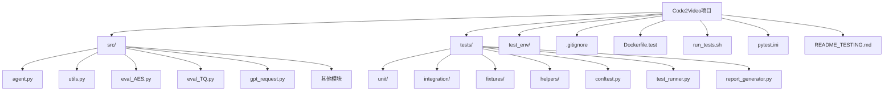
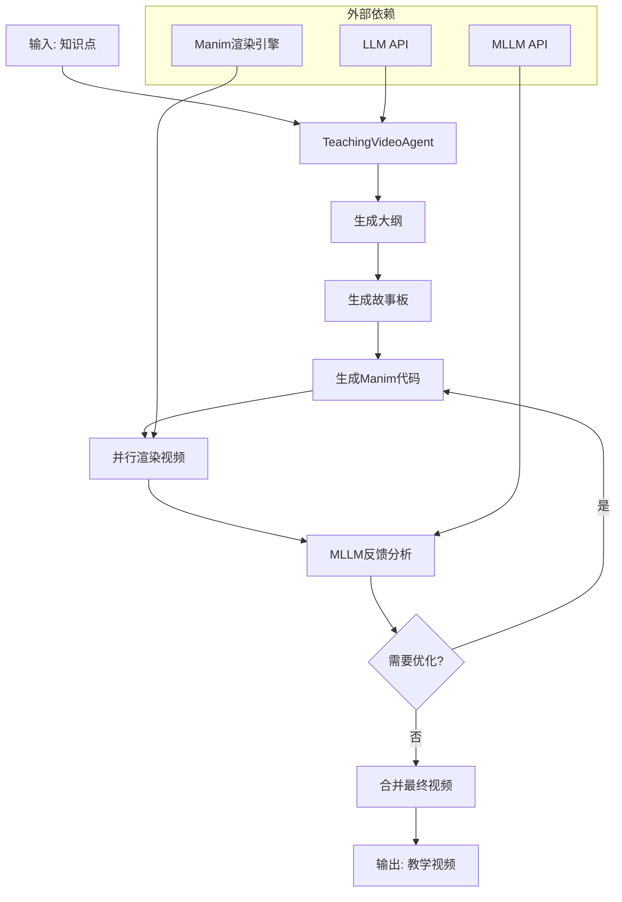
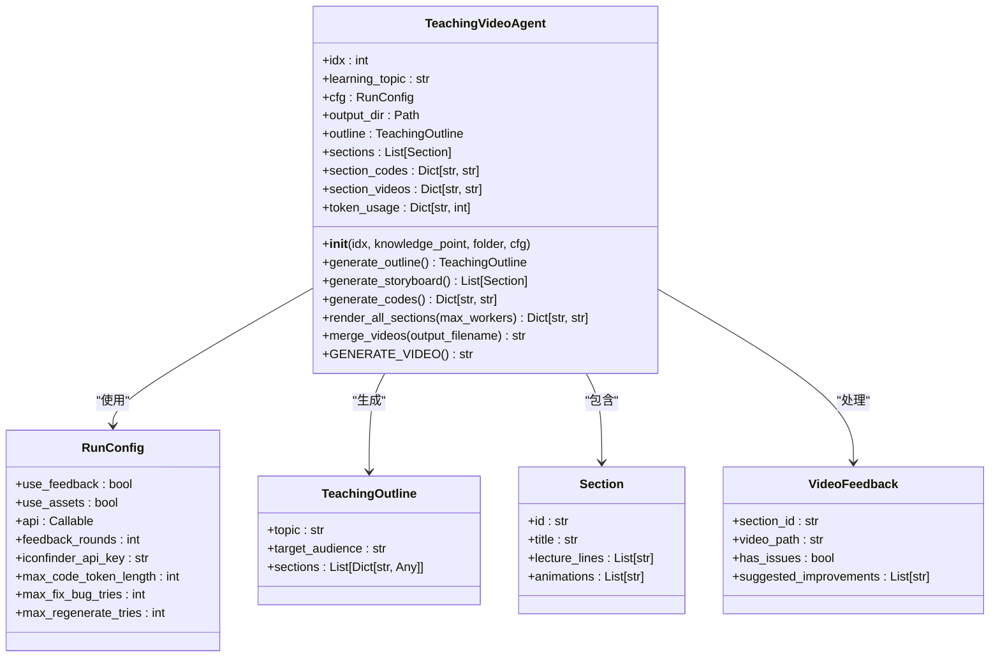
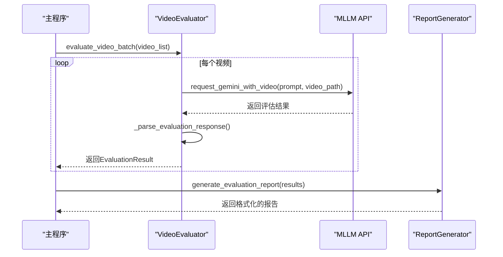
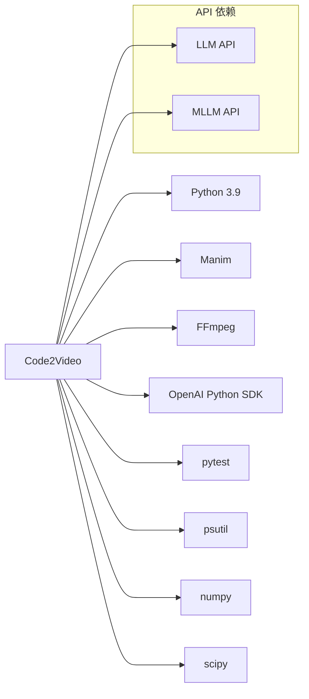

# Git版本控制

<cite>
**本文档引用的文件**
- [.gitignore](file://.gitignore)
- [Dockerfile.test](file://Dockerfile.test)
- [run_tests.sh](file://run_tests.sh)
- [pytest.ini](file://pytest.ini)
- [README_TESTING.md](file://README_TESTING.md)
- [src/agent.py](file://src/agent.py)
- [src/utils.py](file://src/utils.py)
- [src/eval_AES.py](file://src/eval_AES.py)
- [src/eval_TQ.py](file://src/eval_TQ.py)
- [src/gpt_request.py](file://src/gpt_request.py)
- [tests/conftest.py](file://tests/conftest.py)
- [tests/test_runner.py](file://tests/test_runner.py)
- [tests/report_generator.py](file://tests/report_generator.py)
- [tests/fixtures/sample_data.py](file://tests/fixtures/sample_data.py)
- [tests/helpers/mock_objects.py](file://tests/helpers/mock_objects.py)
</cite>

## 目录
1. [简介](#简介)
2. [项目结构](#项目结构)
3. [核心组件](#核心组件)
4. [架构概述](#架构概述)
5. [详细组件分析](#详细组件分析)
6. [依赖分析](#依赖分析)
7. [性能考虑](#性能考虑)
8. [故障排除指南](#故障排除指南)
9. [结论](#结论)
10. [附录](#附录)（如有必要）

## 简介
Code2Video 项目是一个先进的教育视频生成系统，利用大型语言模型（LLM）和多模态大型语言模型（MLLM）自动化创建高质量的教学视频。该系统通过一个复杂的流水线工作，从生成教学大纲开始，到创建故事板，生成Manim代码，渲染视频，最后进行多轮基于MLLM的反馈优化。该项目拥有一个全面的测试套件，包括单元测试、集成测试和详细的测试报告系统，确保代码质量和系统稳定性。Git版本控制系统被用于管理代码库，通过`.gitignore`文件排除临时文件和敏感信息，并通过Docker和shell脚本实现可重复的测试环境。

## 项目结构
该项目采用模块化结构，将源代码、测试、配置和外部资产清晰地分离。

**Diagram sources**
- [.gitignore](file://.gitignore)
- [Dockerfile.test](file://Dockerfile.test)
- [run_tests.sh](file://run_tests.sh)

**Section sources**
- [.gitignore](file://.gitignore)
- [Dockerfile.test](file://Dockerfile.test)
- [run_tests.sh](file://run_tests.sh)

## 核心组件
本项目的核心功能由几个关键的Python模块组成，它们协同工作以实现教育视频的自动化生成。

**Section sources**
- [src/agent.py](file://src/agent.py#L1-L800)
- [src/utils.py](file://src/utils.py#L1-L210)
- [src/eval_AES.py](file://src/eval_AES.py#L1-L353)
- [src/eval_TQ.py](file://src/eval_TQ.py#L1-L366)

## 架构概述
该系统的架构是一个多阶段的流水线，每个阶段都依赖于前一个阶段的输出。

**Diagram sources**
- [src/agent.py](file://src/agent.py#L703-L719)
- [src/eval_AES.py](file://src/eval_AES.py#L46-L55)
- [src/eval_TQ.py](file://src/eval_TQ.py#L184-L214)

## 详细组件分析
### TeachingVideoAgent 分析
`TeachingVideoAgent` 类是整个系统的核心控制器。它负责协调从大纲生成到最终视频合并的整个工作流程。

#### 类图

**Diagram sources**
- [src/agent.py](file://src/agent.py#L57-L800)

### 评估系统分析
项目包含两个独立的评估模块，用于对生成的视频进行质量评估。

#### 序列图

**Diagram sources**
- [src/eval_AES.py](file://src/eval_AES.py#L60-L161)
- [src/eval_TQ.py](file://src/eval_TQ.py#L182-L214)

## 依赖分析
该项目依赖于多种外部工具和库，这些依赖关系通过配置文件和脚本进行管理。

**Diagram sources**
- [Dockerfile.test](file://Dockerfile.test#L2-L16)
- [src/agent.py](file://src/agent.py#L1-L7)
- [src/utils.py](file://src/utils.py#L1-L3)

## 性能考虑
系统在设计时考虑了性能和资源管理，特别是在视频渲染和API调用方面。

**Section sources**
- [src/utils.py](file://src/utils.py#L53-L70)
- [src/agent.py](file://src/agent.py#L518-L525)
- [src/eval_AES.py](file://src/eval_AES.py#L99-L101)

## 故障排除指南
当系统出现问题时，可以参考以下常见问题的解决方案。

**Section sources**
- [run_tests.sh](file://run_tests.sh#L208-L220)
- [README_TESTING.md](file://README_TESTING.md#L208-L228)
- [src/agent.py](file://src/agent.py#L369-L398)

## 结论
Code2Video 项目是一个功能强大且结构良好的教育视频生成系统。它通过一个精心设计的流水线，结合了LLM和MLLM的能力，实现了从文本到高质量视频的自动化转换。项目拥有一个全面的测试和报告系统，确保了代码的可靠性和可维护性。Git版本控制系统被有效地用于管理代码库，通过`.gitignore`文件排除了不必要的文件，并通过Docker和shell脚本保证了开发和测试环境的一致性。该架构具有良好的可扩展性，可以轻松集成新的评估模块或支持不同的视频生成引擎。