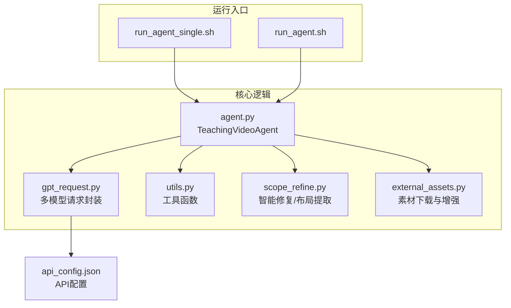
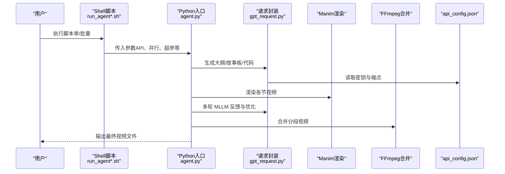
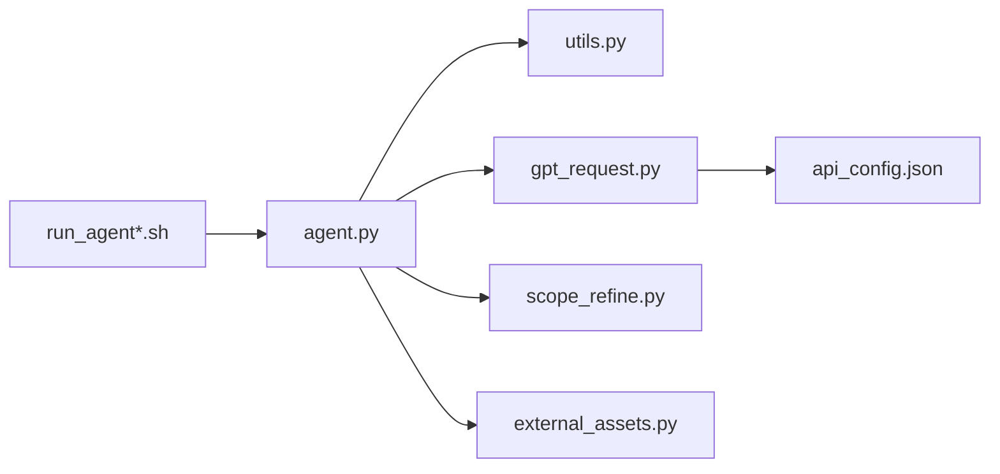

# 快速开始

<cite>
**本文引用的文件**
- [src/run_agent.sh](file://src/run_agent.sh)
- [src/run_agent_single.sh](file://src/run_agent_single.sh)
- [src/requirements.txt](file://src/requirements.txt)
- [src/api_config.json](file://src/api_config.json)
- [src/agent.py](file://src/agent.py)
- [src/gpt_request.py](file://src/gpt_request.py)
- [src/utils.py](file://src/utils.py)
- [src/scope_refine.py](file://src/scope_refine.py)
- [src/external_assets.py](file://src/external_assets.py)
</cite>

## 目录
1. [简介](#简介)
2. [项目结构](#项目结构)
3. [核心组件](#核心组件)
4. [架构总览](#架构总览)
5. [详细组件解析](#详细组件解析)
6. [依赖关系分析](#依赖关系分析)
7. [性能与资源建议](#性能与资源建议)
8. [故障排查指南](#故障排查指南)
9. [结论](#结论)
10. [附录](#附录)

## 简介
本指南面向新手用户，帮助你在本地环境快速部署并运行 Code2Video，从零开始完成一次完整的“知识点视频”生成流程。你将学会：
- 准备 Python 环境与系统依赖（Manim、FFmpeg、OpenCV）
- 安装项目依赖（requirements.txt）
- 配置 API 密钥（Gemini/GPT-4/Claude）与 api_config.json
- 使用 run_agent_single.sh 生成单个知识点视频
- 使用 run_agent.sh 批量生成多个知识点视频
- 识别成功标志与常见问题的初步排查方法

目标是在约 15 分钟内完成首次视频生成。

## 项目结构
本项目采用“脚本入口 + 核心逻辑模块”的组织方式，核心文件位于 src/ 目录下：
- 运行脚本：run_agent.sh、run_agent_single.sh
- 核心逻辑：agent.py（主流程）、gpt_request.py（多模型请求封装）、utils.py（工具函数）、scope_refine.py（智能修复与布局提取）、external_assets.py（外部素材下载与增强）
- 配置：api_config.json（API 密钥与端点）
- 依赖：requirements.txt（Python 包清单）

图表来源
- [src/run_agent_single.sh](file://src/run_agent_single.sh#L1-L49)
- [src/run_agent.sh](file://src/run_agent.sh#L1-L40)
- [src/agent.py](file://src/agent.py#L1-L120)
- [src/gpt_request.py](file://src/gpt_request.py#L1-L60)
- [src/utils.py](file://src/utils.py#L1-L60)
- [src/scope_refine.py](file://src/scope_refine.py#L1-L60)
- [src/external_assets.py](file://src/external_assets.py#L1-L40)
- [src/api_config.json](file://src/api_config.json#L1-L40)

章节来源
- [src/run_agent.sh](file://src/run_agent.sh#L1-L40)
- [src/run_agent_single.sh](file://src/run_agent_single.sh#L1-L49)
- [src/agent.py](file://src/agent.py#L1-L120)

## 核心组件
- 运行脚本
  - run_agent_single.sh：单知识点模式，自动注入默认知识主题，支持并行渲染与反馈优化。
  - run_agent.sh：批量模式，支持分组并行、多批并发，适合批量生成多个知识点视频。
- 核心流程（agent.py）
  - 生成教学大纲（outline）
  - 生成故事板（storyboard），可选增强素材
  - 逐节生成 Manim 代码
  - 渲染视频（Manim）
  - 多轮 MLLM 反馈与优化
  - 合并分段视频为最终成品
- 请求封装（gpt_request.py）
  - 统一读取 api_config.json，封装 Gemini、GPT-4、Claude 等多模型请求，含重试与令牌统计
- 工具函数（utils.py）
  - JSON 提取、代码替换、并行进程数自适应、Manim/FFmpeg 调用等
- 智能修复与布局（scope_refine.py）
  - 基于错误信息定位并修复 Manim 代码，支持干跑验证与多阶段修复
  - 提取网格布局位置，用于 MLLM 反馈优化
- 素材下载与增强（external_assets.py）
  - 从 Iconfinder/Iconify 下载 PNG/SVG 素材，结合 LLM 将素材注入动画描述

章节来源
- [src/agent.py](file://src/agent.py#L120-L220)
- [src/gpt_request.py](file://src/gpt_request.py#L1-L120)
- [src/utils.py](file://src/utils.py#L120-L180)
- [src/scope_refine.py](file://src/scope_refine.py#L250-L360)
- [src/external_assets.py](file://src/external_assets.py#L1-L120)

## 架构总览
下面的时序图展示了从脚本到最终视频的完整流程。

图表来源
- [src/run_agent_single.sh](file://src/run_agent_single.sh#L1-L49)
- [src/run_agent.sh](file://src/run_agent.sh#L1-L40)
- [src/agent.py](file://src/agent.py#L680-L720)
- [src/gpt_request.py](file://src/gpt_request.py#L1-L120)
- [src/utils.py](file://src/utils.py#L138-L174)
- [src/api_config.json](file://src/api_config.json#L1-L40)

## 详细组件解析

### 环境准备与依赖安装
- Python 版本与包管理
  - 使用 Python 3（脚本以 python3 调用）。推荐使用虚拟环境隔离依赖。
- Manim
  - 项目使用 Manim 0.19.0，负责动画渲染。确保已正确安装并可从命令行调用 manim。
- FFmpeg
  - 用于视频合并（concat 模式）。确保 ffmpeg 在 PATH 中可用。
- OpenCV
  - 用于图像处理与视频相关操作。项目中通过 opencv-python 引入。
- 其他图形与渲染依赖
  - moderngl、pyglet、PyOpenGL、pycairo、skia-pathops 等，满足 Manim 的渲染需求。
- 安装依赖
  - 在项目根目录执行安装命令，安装 requirements.txt 中列出的所有依赖。

章节来源
- [src/requirements.txt](file://src/requirements.txt#L1-L60)
- [src/requirements.txt](file://src/requirements.txt#L18-L44)
- [src/requirements.txt](file://src/requirements.txt#L24-L30)
- [src/utils.py](file://src/utils.py#L138-L174)

### API 配置与密钥设置
- 配置文件
  - api_config.json 中包含 Gemini、GPT-4、GPT-5、GPT-o4mini、GPT-4o、Claude 等服务的 base_url、api_version、api_key、model 等字段。
- 读取机制
  - gpt_request.py 会按服务名与键名读取配置，并支持通过环境变量覆盖。
- 设置步骤
  - 将你的实际密钥填入对应服务项；若使用 Azure/OpenAI 兼容网关，请填写 base_url 与 api_version。
  - 若需要 Iconfinder 素材下载，需在 iconfinder.api_key 填写有效密钥。

章节来源
- [src/api_config.json](file://src/api_config.json#L1-L40)
- [src/gpt_request.py](file://src/gpt_request.py#L1-L40)

### 单知识点视频生成（run_agent_single.sh）
- 默认行为
  - 自动注入默认知识主题（可通过命令行覆盖）
  - 启用反馈与素材增强
  - 并行渲染，提高效率
- 关键参数（来自脚本中的默认值与传参）
  - --API：选择模型（如 gpt-41、claude、gpt-5、gpt-4o、gpt-o4mini、Gemini）
  - --folder_prefix：输出文件夹前缀
  - --use_feedback：启用 MLLM 反馈优化
  - --use_assets：启用素材下载与增强
  - --max_code_token_length：代码生成最大令牌长度
  - --max_fix_bug_tries：Manim 渲染错误修复尝试次数
  - --max_regenerate_tries：大纲/故事板/代码重试次数
  - --max_feedback_gen_code_tries：基于反馈重新生成代码的尝试次数
  - --max_mllm_fix_bugs_tries：MLLM 优化后再次修复的尝试次数
  - --feedback_rounds：反馈轮次
  - --parallel：开启并行
  - --knowledge_point：可选，覆盖默认主题
- 命令示例
  - 单知识点默认主题：直接运行脚本
  - 指定主题：在命令行追加 --knowledge_point "你的主题"
- 预期输出
  - 输出目录包含 outline.json、storyboard*.json、各节 .py 代码、渲染出的分段视频、最终合并视频等
  - 成功标志：最终打印“视频生成成功”或类似提示，且输出目录存在最终 .mp4 文件

章节来源
- [src/run_agent_single.sh](file://src/run_agent_single.sh#L1-L49)
- [src/agent.py](file://src/agent.py#L680-L720)

### 批量视频生成（run_agent.sh）
- 默认行为
  - 读取 long_video_topics_list.json（脚本中指定文件名），逐条生成视频
  - 支持分组并行（每组内部串行，组间并行）
- 关键参数
  - --API、--folder_prefix、--use_feedback、--use_assets、--max_* 系列超参与 run_agent_single.sh 类似
  - --parallel_group_num：每批并行组数
  - --knowledge_file：知识点列表文件路径
  - --max_concepts：最多处理的概念数（-1 表示全部）
- 命令示例
  - 直接运行脚本，按默认配置批量生成
- 预期输出
  - 每个知识点生成独立输出目录，最终汇总统计与成功/失败计数

章节来源
- [src/run_agent.sh](file://src/run_agent.sh#L1-L40)
- [src/agent.py](file://src/agent.py#L760-L800)

### Manim 渲染与 FFmpeg 合并
- Manim 渲染
  - 通过子进程调用 manim 进行渲染，输出媒体目录下的视频文件
  - 若渲染失败，将触发智能修复流程（scope_refine.py）
- FFmpeg 合并
  - 将各节视频按顺序合并为最终成品，使用 concat 模式

章节来源
- [src/utils.py](file://src/utils.py#L138-L174)
- [src/agent.py](file://src/agent.py#L686-L702)
- [src/scope_refine.py](file://src/scope_refine.py#L341-L371)

### MLLM 反馈与优化
- 流程
  - 渲染完成后，使用 Gemini 视频+参考图对视频进行布局与内容分析
  - 解析反馈建议，生成新的代码并再次渲染
  - 支持多轮反馈，逐步优化
- 关键点
  - 布局提取：从代码中抽取网格位置信息，形成表格供 MLLM 分析
  - 代码修改：根据反馈精准替换指定行号处的调用

章节来源
- [src/agent.py](file://src/agent.py#L402-L460)
- [src/scope_refine.py](file://src/scope_refine.py#L683-L751)
- [src/scope_refine.py](file://src/scope_refine.py#L753-L803)

### 素材下载与增强
- 流程
  - 从故事板中分析所需元素，优先检查本地缓存
  - 未命中则通过 Iconfinder 或 Iconify 下载 PNG/SVG
  - 将素材路径注入动画描述，再由 LLM 评估与增强
- 注意
  - 需要有效的 Iconfinder API Key 才能启用素材下载

章节来源
- [src/external_assets.py](file://src/external_assets.py#L1-L120)
- [src/external_assets.py](file://src/external_assets.py#L138-L183)

## 依赖关系分析
- 脚本到核心
  - run_agent*.sh 作为入口，调用 agent.py 主流程
- 核心到工具
  - agent.py 依赖 utils.py（路径、并行、渲染、合并）
  - agent.py 依赖 gpt_request.py（多模型请求）
  - agent.py 依赖 scope_refine.py（智能修复与布局）
  - agent.py 依赖 external_assets.py（素材下载与增强）
- 配置到请求
  - gpt_request.py 读取 api_config.json 获取密钥与端点

图表来源
- [src/run_agent_single.sh](file://src/run_agent_single.sh#L1-L49)
- [src/run_agent.sh](file://src/run_agent.sh#L1-L40)
- [src/agent.py](file://src/agent.py#L1-L120)
- [src/gpt_request.py](file://src/gpt_request.py#L1-L60)
- [src/utils.py](file://src/utils.py#L1-L60)
- [src/scope_refine.py](file://src/scope_refine.py#L1-L60)
- [src/external_assets.py](file://src/external_assets.py#L1-L40)
- [src/api_config.json](file://src/api_config.json#L1-L40)

## 性能与资源建议
- 并行策略
  - utils.get_optimal_workers 会根据 CPU 核心数动态计算最优并行进程数，避免内存溢出
- 渲染质量
  - 脚本默认使用低质量预览参数，便于快速迭代；如需更高画质，可在调用时调整
- 磁盘与网络
  - 素材下载与视频渲染会产生大量临时文件，建议预留充足磁盘空间
  - 素材下载依赖网络，建议在稳定网络环境下运行

章节来源
- [src/utils.py](file://src/utils.py#L53-L71)

## 故障排查指南
- API 连接失败
  - 检查 api_config.json 中的 base_url、api_version、api_key 是否正确
  - 确认网络可达性与代理设置
  - 查看 gpt_request.py 的重试日志与异常信息
- Manim 渲染错误
  - agent.py 的 debug_and_fix_code 会尝试调用 manim 并捕获错误
  - scope_refine.py 的智能修复会根据错误类型与上下文生成修复建议
  - 若多次尝试失败，检查代码语法、导入与 API 兼容性
- FFmpeg 合并失败
  - 确认 ffmpeg 已安装并加入 PATH
  - 检查各节视频是否存在且可访问
- 素材下载失败
  - 确认 Iconfinder API Key 有效
  - 检查网络与接口返回状态码
- 常见提示与标志
  - “视频生成成功”、“渲染成功”、“合并成功”等提示通常表示流程顺利完成
  - 若出现“所有分段失败”、“无法找到视频文件”等提示，需回溯上一步骤定位原因

章节来源
- [src/gpt_request.py](file://src/gpt_request.py#L1-L120)
- [src/agent.py](file://src/agent.py#L356-L401)
- [src/scope_refine.py](file://src/scope_refine.py#L483-L573)
- [src/utils.py](file://src/utils.py#L138-L174)
- [src/external_assets.py](file://src/external_assets.py#L138-L183)

## 结论
通过本指南，你可以在本地完成 Code2Video 的环境准备、依赖安装与 API 配置，并使用 run_agent_single.sh 与 run_agent.sh 快速生成单个或批量知识点视频。遇到问题时，可依据“故障排查指南”进行定位与修复。建议在首次运行时使用单知识点模式，熟悉流程后再切换到批量模式以提升效率。

## 附录
- 常用命令示例（仅列出路径与要点，不展示具体命令）
  - 安装依赖：在项目根目录执行安装命令
  - 单知识点默认主题：直接运行 run_agent_single.sh
  - 指定主题：在 run_agent_single.sh 后追加 --knowledge_point "你的主题"
  - 批量生成：直接运行 run_agent.sh
- 成功标志识别
  - 最终输出目录存在 .mp4 文件，控制台打印“视频生成成功”或类似提示