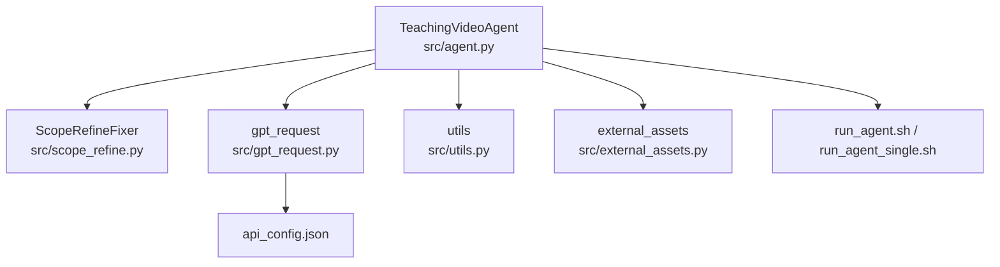
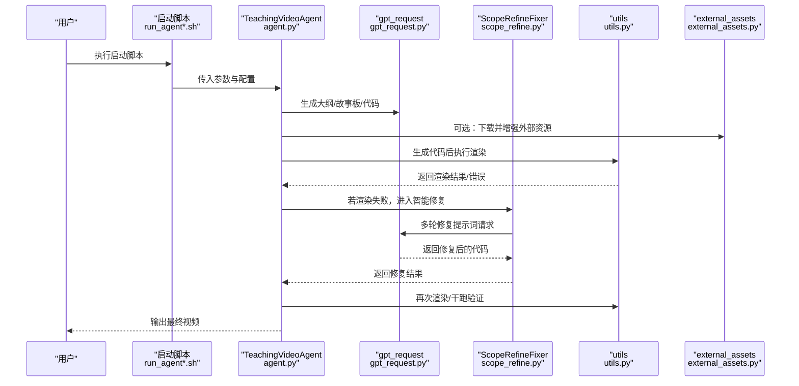
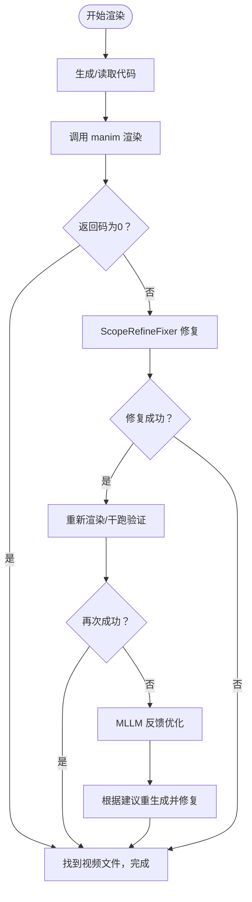
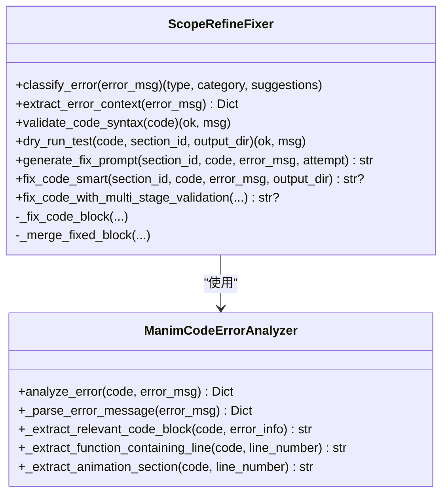
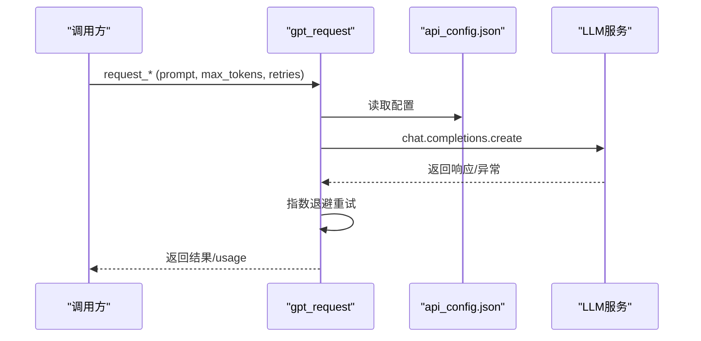
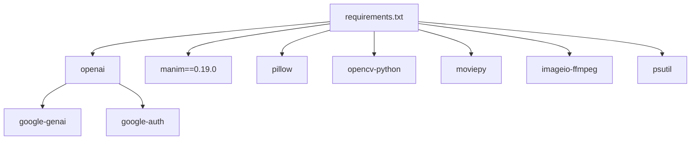

# 故障排除

<cite>
**本文引用的文件**
- [agent.py](file://src/agent.py)
- [scope_refine.py](file://src/scope_refine.py)
- [gpt_request.py](file://src/gpt_request.py)
- [utils.py](file://src/utils.py)
- [external_assets.py](file://src/external_assets.py)
- [api_config.json](file://src/api_config.json)
- [requirements.txt](file://src/requirements.txt)
- [run_agent.sh](file://src/run_agent.sh)
- [run_agent_single.sh](file://src/run_agent_single.sh)
</cite>

## 目录
1. [简介](#简介)
2. [项目结构](#项目结构)
3. [核心组件](#核心组件)
4. [架构总览](#架构总览)
5. [详细组件分析](#详细组件分析)
6. [依赖关系分析](#依赖关系分析)
7. [性能与稳定性考虑](#性能与稳定性考虑)
8. [故障排除指南](#故障排除指南)
9. [结论](#结论)
10. [附录](#附录)

## 简介
本指南面向使用 Code2Video 的用户，系统性梳理在使用过程中可能遇到的常见问题，并提供可操作的排查步骤与修复方案。内容覆盖环境配置、API 连接、代码生成与渲染、资源加载等场景；重点说明 scope_refine.py 在自动修复 Manim 代码错误方面的能力边界与适用策略；并给出日志分析技巧、调试模式启用方式与关键日志字段解读，以及预防性措施建议。

## 项目结构
- 核心流程由 TeachingVideoAgent 驱动，贯穿“大纲生成—故事板—代码生成—渲染—合并视频”的闭环。
- scope_refine.py 提供智能错误分析与修复，结合多阶段验证（语法校验、干跑测试）与多轮修复策略。
- gpt_request.py 封装多模型 API 请求与重试机制，统一日志追踪 ID。
- utils.py 负责系统资源监控、Manim 渲染调用、FFmpeg 视频拼接、路径安全处理等。
- external_assets.py 实现外部图标资源的智能下载与增强。
- 配置通过 api_config.json 与 shell 启动脚本传参控制。

图表来源
- [agent.py](file://src/agent.py#L1-L200)
- [scope_refine.py](file://src/scope_refine.py#L1-L120)
- [gpt_request.py](file://src/gpt_request.py#L1-L120)
- [utils.py](file://src/utils.py#L130-L175)
- [external_assets.py](file://src/external_assets.py#L1-L60)
- [api_config.json](file://src/api_config.json#L1-L40)
- [run_agent.sh](file://src/run_agent.sh#L1-L40)
- [run_agent_single.sh](file://src/run_agent_single.sh#L1-L49)

章节来源
- [agent.py](file://src/agent.py#L1-L200)
- [run_agent.sh](file://src/run_agent.sh#L1-L40)
- [run_agent_single.sh](file://src/run_agent_single.sh#L1-L49)

## 核心组件
- TeachingVideoAgent：编排全流程，负责大纲、故事板、代码生成、渲染、反馈优化与视频合并。
- ScopeRefineFixer：基于错误分析器进行错误分类、上下文提取、多阶段修复与回退策略。
- gpt_request：封装多模型请求、指数退避重试、令牌用量统计与日志追踪 ID。
- utils：系统资源监控、Manim 渲染命令、FFmpeg 拼接、路径安全转换。
- external_assets：智能下载图标资源，支持缓存命中与多源回退。

章节来源
- [agent.py](file://src/agent.py#L50-L120)
- [scope_refine.py](file://src/scope_refine.py#L250-L370)
- [gpt_request.py](file://src/gpt_request.py#L1-L120)
- [utils.py](file://src/utils.py#L130-L175)
- [external_assets.py](file://src/external_assets.py#L1-L60)

## 架构总览
下图展示从用户触发到最终视频产出的关键交互路径，以及错误修复与反馈优化的闭环。

图表来源
- [agent.py](file://src/agent.py#L350-L520)
- [scope_refine.py](file://src/scope_refine.py#L480-L575)
- [gpt_request.py](file://src/gpt_request.py#L27-L120)
- [utils.py](file://src/utils.py#L138-L175)
- [external_assets.py](file://src/external_assets.py#L1-L60)
- [run_agent.sh](file://src/run_agent.sh#L20-L40)
- [run_agent_single.sh](file://src/run_agent_single.sh#L30-L49)

## 详细组件分析

### TeachingVideoAgent（渲染与修复主控）
- 代码生成与替换基类、保存与读取已有代码、并发生成任务。
- 渲染阶段：调用 manim 命令行进行低质量预览渲染，捕获错误输出并交由 ScopeRefineFixer 修复。
- 反馈优化：调用 MLLM 分析布局问题，解析建议并回写代码，再次渲染验证。
- 并行渲染：进程池并行处理多个章节，统计成功/失败数量。

图表来源
- [agent.py](file://src/agent.py#L356-L401)
- [scope_refine.py](file://src/scope_refine.py#L483-L573)
- [utils.py](file://src/utils.py#L138-L175)

章节来源
- [agent.py](file://src/agent.py#L356-L401)
- [agent.py](file://src/agent.py#L527-L581)

### ScopeRefineFixer（智能修复引擎）
- 错误分析器：解析错误类型、行号、列号、问题代码片段，提取相关上下文块。
- 分类与建议：基于常见错误类型与正则模式匹配，给出修复建议类别与策略。
- 多阶段修复：
  - 第一阶段：聚焦修复（仅改报错行/函数/动画段），合并回原代码并进行语法与干跑验证。
  - 第二阶段：综合审查（全量扫描潜在问题，校验 API 兼容性、变量作用域、方法名与参数）。
  - 第三阶段：完全重写（简化为已知稳定特性，确保功能可用）。
- 干跑测试：创建临时测试文件，注入快速退出逻辑，避免完整渲染耗时。
- 本地修复优先：若能提取到精确代码块，优先局部替换；否则直接进入多轮修复。

图表来源
- [scope_refine.py](file://src/scope_refine.py#L18-L216)
- [scope_refine.py](file://src/scope_refine.py#L250-L573)

章节来源
- [scope_refine.py](file://src/scope_refine.py#L18-L216)
- [scope_refine.py](file://src/scope_refine.py#L250-L573)

### gpt_request（API 请求与重试）
- 统一配置读取：从 api_config.json 与环境变量中读取各模型的 base_url、api_key、model 等。
- 日志追踪：为每次请求生成唯一 log_id，便于跨服务链路定位。
- 重试机制：指数退避 + 抖动，支持最大重试次数。
- 令牌统计：记录 prompt_tokens/completion_tokens/total_tokens，便于成本控制与问题定位。

图表来源
- [gpt_request.py](file://src/gpt_request.py#L12-L120)
- [api_config.json](file://src/api_config.json#L1-L40)

章节来源
- [gpt_request.py](file://src/gpt_request.py#L12-L120)
- [api_config.json](file://src/api_config.json#L1-L40)

### utils（系统与渲染工具）
- run_manim_script：调用 manim 命令行渲染，捕获 stderr 并抛出异常。
- stitch_videos：使用 FFmpeg 拼接多个 MP4 文件。
- get_optimal_workers：根据 CPU 核心数动态确定并行渲染进程数。
- monitor_system_resources：打印 CPU/内存占用，辅助判断资源瓶颈。

章节来源
- [utils.py](file://src/utils.py#L138-L175)
- [utils.py](file://src/utils.py#L163-L175)
- [utils.py](file://src/utils.py#L53-L90)

### external_assets（外部资源下载与增强）
- SmartSVGDownloader：分析所需元素，优先本地缓存，再尝试 Iconfinder 与 Iconify 下载，支持多源回退。
- process_storyboard_with_assets：对故事板进行资源增强，将可用资产映射注入提示词，更新动画描述。

章节来源
- [external_assets.py](file://src/external_assets.py#L1-L120)
- [external_assets.py](file://src/external_assets.py#L120-L220)

## 依赖关系分析
- 运行时依赖集中在 requirements.txt，涵盖 openai、manim、pillow、opencv、moviepy、imageio-ffmpeg、psutil 等。
- API 客户端依赖由 openai 间接引入，包括 google-genai、google-auth 等。
- FFmpeg 通过 imageio-ffmpeg 包装，实际依赖系统 FFmpeg。

图表来源
- [requirements.txt](file://src/requirements.txt#L1-L60)
- [requirements.txt](file://src/requirements.txt#L80-L100)

章节来源
- [requirements.txt](file://src/requirements.txt#L1-L139)

## 性能与稳定性考虑
- 并行渲染：get_optimal_workers 建议 CPU 核心数减一，高配机器限制最大并行度，避免内存溢出。
- 资源监控：monitor_system_resources 在渲染期间打印 CPU/内存使用率，及时发现过载。
- 渲染策略：默认 -pql（播放+低质量）以缩短渲染时间；必要时可调整为 -pqm/-pqh。
- FFmpeg 拼接：stitch_videos 使用流拷贝模式，避免二次编码开销。

章节来源
- [utils.py](file://src/utils.py#L53-L90)
- [utils.py](file://src/utils.py#L138-L175)
- [utils.py](file://src/utils.py#L163-L175)

## 故障排除指南

### 一、环境配置问题
- 现象
  - 无法运行：找不到 manim 命令或模块导入失败。
  - 渲染失败：FFmpeg 缺失或版本不兼容。
  - 资源下载超时：网络受限或第三方 API 密钥未配置。
- 根因
  - 未正确安装依赖或 Python 环境隔离导致模块不可见。
  - 系统未安装 FFmpeg 或 PATH 未包含 FFmpeg。
  - external_assets 依赖 Iconfinder API Key，未配置导致下载失败。
- 解决步骤
  - 安装依赖：使用 requirements.txt 安装所有依赖。
  - 验证 manim：在终端执行 manim -h，确认安装成功。
  - 安装 FFmpeg：确保系统已安装 FFmpeg，并加入 PATH。
  - 配置 API 密钥：在 api_config.json 中填写各模型的 base_url、api_key、model 等；如使用 external_assets，需配置 iconfinder.api_key。
  - 预防措施：在 CI/CD 中固定依赖版本，使用虚拟环境隔离；在容器镜像中预装 FFmpeg。
- 关键日志字段
  - gpt_request：X-TT-LOGID（用于跨服务追踪）。
  - utils.run_manim_script：stderr（渲染错误详情）。
  - external_assets：下载失败时的异常栈与状态码。
- 章节来源
  - [requirements.txt](file://src/requirements.txt#L1-L60)
  - [utils.py](file://src/utils.py#L138-L175)
  - [external_assets.py](file://src/external_assets.py#L138-L183)
  - [api_config.json](file://src/api_config.json#L1-L40)

### 二、API 连接问题（密钥无效、服务不可达）
- 现象
  - API 请求失败：返回空响应或异常。
  - 重试多次后仍失败。
  - 令牌用量统计为 0 或异常。
- 根因
  - api_config.json 中的 base_url、api_key、model 配置错误或过期。
  - 网络不稳定或代理阻断。
  - 模型版本不匹配或服务端限流。
- 解决步骤
  - 校验配置：核对 api_config.json 中各模型项是否正确。
  - 重试与退避：gpt_request 已内置指数退避与最大重试次数，观察重试日志。
  - 代理与网络：在企业网络环境下配置代理，或切换网络。
  - 令牌统计：关注 prompt_tokens/completion_tokens/total_tokens 是否增长，若无增长，检查请求是否被拦截。
- 关键日志字段
  - gpt_request.request_*：最后一次异常信息与重试次数。
  - X-TT-LOGID：用于在服务端侧定位请求链路。
- 章节来源
  - [gpt_request.py](file://src/gpt_request.py#L27-L120)
  - [api_config.json](file://src/api_config.json#L1-L40)

### 三、代码生成与渲染问题（Manim 语法错误、渲染失败）
- 现象
  - manim 渲染返回非零码，stderr 中出现 NameError、AttributeError、TypeError、SyntaxError、IndentationError 等。
  - 生成的视频文件不存在或为空。
- 根因
  - 代码不符合 Manim CE v0.19.0 API，或缺少必要的导入。
  - 作用域错误、方法名拼写错误、参数个数或类型不匹配。
  - 语法错误或缩进问题。
- 解决步骤
  - 使用 ScopeRefineFixer 自动修复：
    - 第一阶段：聚焦修复（单行/函数/动画段），合并回原代码并进行语法与干跑验证。
    - 第二阶段：综合审查（全量扫描潜在问题，校验 API 兼容性、变量作用域、方法名与参数）。
    - 第三阶段：完全重写（简化为已知稳定特性，确保功能可用）。
  - 干跑测试：dry_run_test 会注入快速退出逻辑，避免完整渲染耗时。
  - 若修复失败，检查错误上下文（行号、问题代码、建议修复）并手动修正。
- scope_refine.py 的能力与局限
  - 能力：能识别常见错误类型、提取上下文、生成修复提示词、多轮迭代修复。
  - 局限：对于大规模重构或深层逻辑错误，可能需要人工介入；对特定第三方依赖的兼容性需结合 API 版本。
- 关键日志字段
  - agent.debug_and_fix_code：stderr（渲染错误）、returncode（返回码）。
  - scope_refine.generate_fix_prompt：attempt/strategy（尝试次数与策略）、error_context（行号、具体错误）。
- 章节来源
  - [agent.py](file://src/agent.py#L356-L401)
  - [scope_refine.py](file://src/scope_refine.py#L331-L371)
  - [scope_refine.py](file://src/scope_refine.py#L398-L573)

### 四、资源加载问题（图标下载超时）
- 现象
  - external_assets 下载失败，返回 None 或异常。
  - 故事板增强失败，回退到原始数据。
- 根因
  - 网络超时或第三方接口限流。
  - 未配置 iconfinder.api_key 或密钥无效。
  - 图标尺寸与格式选择失败，回退到其他源。
- 解决步骤
  - 配置 Iconfinder API Key：在 api_config.json 中设置 iconfinder.api_key。
  - 降低并发：减少同时下载的元素数量，避免触发限流。
  - 缓存复用：assets 目录下已有缓存文件可直接复用。
  - 多源回退：Iconfinder 失败时自动尝试 Iconify，若均失败，保留原始动画描述。
- 关键日志字段
  - external_assets：下载过程中的状态码、异常信息。
- 章节来源
  - [external_assets.py](file://src/external_assets.py#L138-L183)
  - [api_config.json](file://src/api_config.json#L36-L38)

### 五、调试模式与日志分析
- 启用方式
  - 启动脚本：run_agent.sh/run_agent_single.sh 已内置常用参数，可在脚本中调整超参（如 max_fix_bug_tries、max_regenerate_tries、feedback_rounds 等）。
  - 令牌统计：gpt_request 在每次请求后返回 usage，TeachingVideoAgent 会累加 prompt_tokens/completion_tokens/total_tokens。
- 关键日志字段解读
  - X-TT-LOGID：跨服务追踪 ID，便于在日志系统中定位请求链路。
  - manim stderr：渲染错误详情，包含错误类型、行号、问题代码片段。
  - external_assets：下载失败的状态码与异常栈。
  - scope_refine：attempt/strategy/error_context/suggestions。
- 章节来源
  - [run_agent.sh](file://src/run_agent.sh#L20-L40)
  - [run_agent_single.sh](file://src/run_agent_single.sh#L30-L49)
  - [gpt_request.py](file://src/gpt_request.py#L27-L120)
  - [agent.py](file://src/agent.py#L115-L133)

## 结论
Code2Video 通过 TeachingVideoAgent 统筹全流程，结合 scope_refine.py 的智能修复与 gpt_request 的稳健 API 访问，能够有效应对多数常见问题。建议用户在部署阶段完善环境与依赖、配置好 API 密钥与 FFmpeg，并在开发过程中利用日志追踪 ID 与令牌统计快速定位问题。对于 scope_refine.py，应理解其“聚焦修复—综合审查—完全重写”的三层策略，合理设置尝试次数与反馈轮次，以获得最佳修复效果。

## 附录

### 常见错误类型与建议修复
- NameError：检查变量/对象是否定义，导入语句是否正确。
- AttributeError：检查对象方法/属性是否存在，版本兼容性。
- TypeError：检查参数个数与类型，运算符匹配。
- SyntaxError/IndentationError：检查括号匹配与缩进一致性。
- ImportError：检查模块名称与版本兼容性。

章节来源
- [scope_refine.py](file://src/scope_refine.py#L83-L147)

### 启动与运行要点
- 使用 run_agent.sh 进行批量知识点并行处理，使用 run_agent_single.sh 单个知识点调试。
- 调整超参以平衡速度与稳定性：max_fix_bug_tries、max_regenerate_tries、feedback_rounds、max_mllm_fix_bugs_tries。

章节来源
- [run_agent.sh](file://src/run_agent.sh#L20-L40)
- [run_agent_single.sh](file://src/run_agent_single.sh#L30-L49)