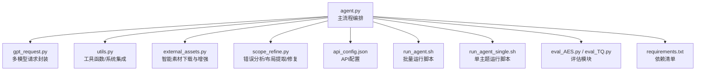
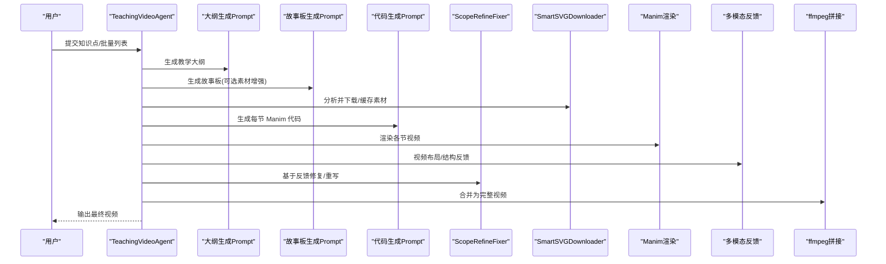
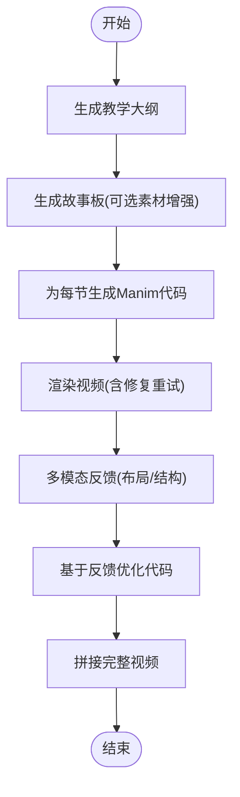
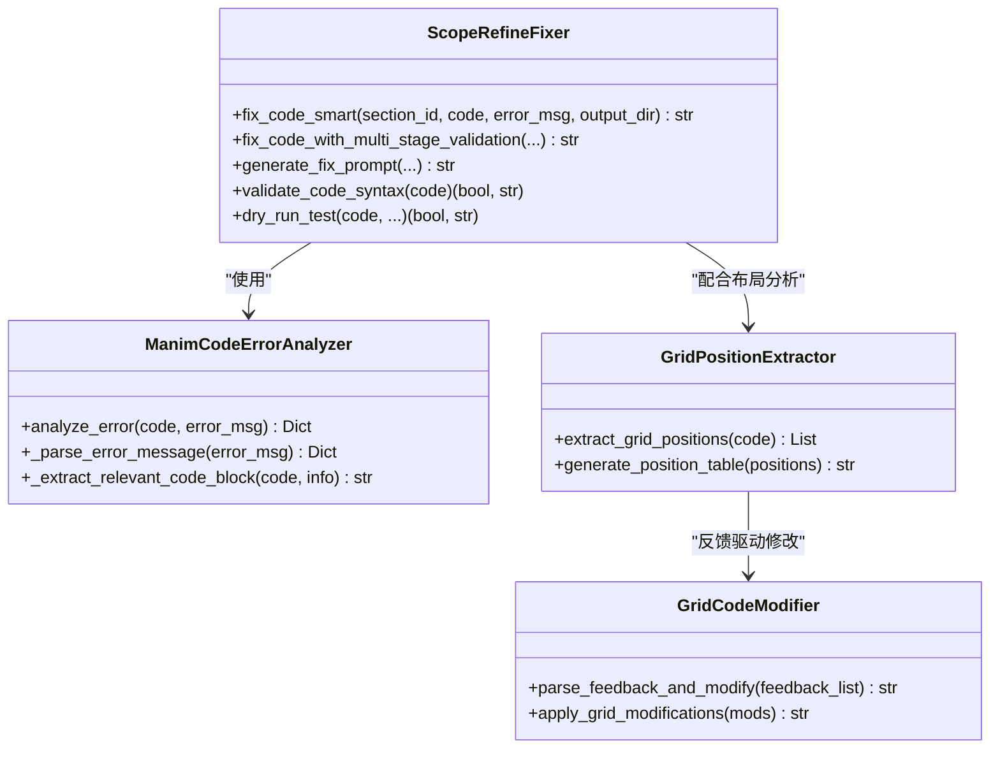
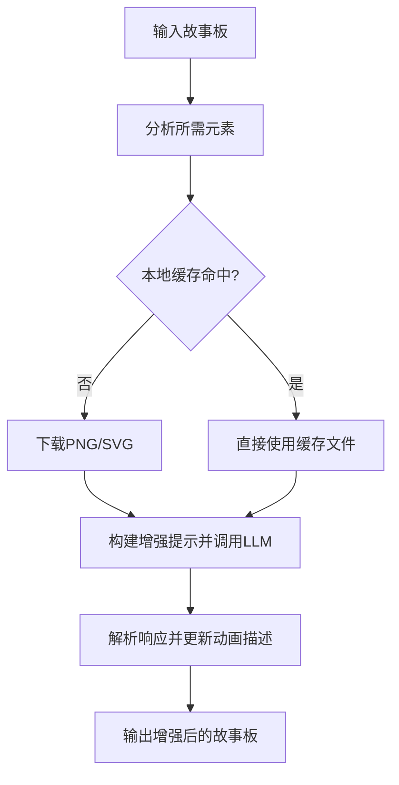
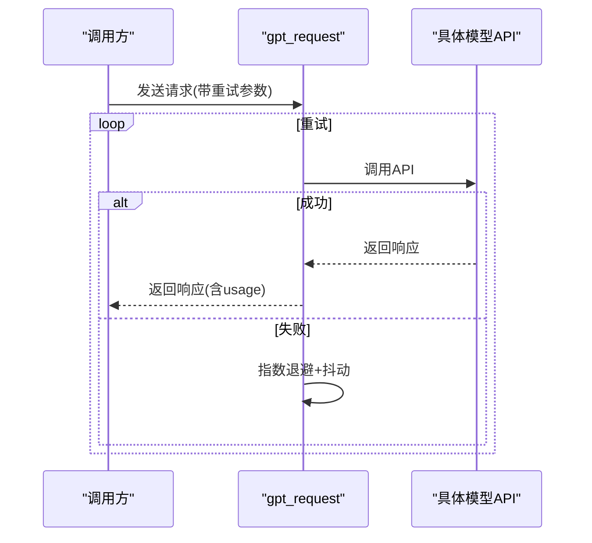
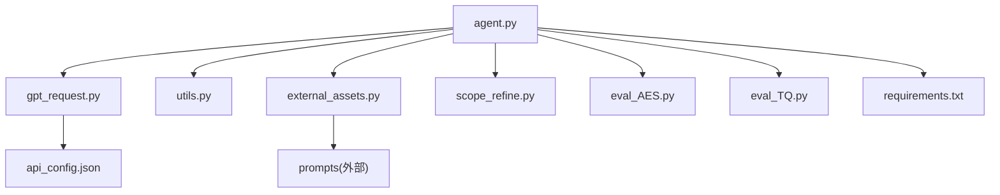

# 最佳实践

<cite>
**本文引用的文件**
- [agent.py](file://src/agent.py)
- [gpt_request.py](file://src/gpt_request.py)
- [utils.py](file://src/utils.py)
- [external_assets.py](file://src/external_assets.py)
- [scope_refine.py](file://src/scope_refine.py)
- [api_config.json](file://src/api_config.json)
- [run_agent.sh](file://src/run_agent.sh)
- [run_agent_single.sh](file://src/run_agent_single.sh)
- [requirements.txt](file://src/requirements.txt)
- [eval_AES.py](file://src/eval_AES.py)
- [eval_TQ.py](file://src/eval_TQ.py)
</cite>

## 目录
1. [简介](#简介)
2. [项目结构](#项目结构)
3. [核心组件](#核心组件)
4. [架构总览](#架构总览)
5. [详细组件分析](#详细组件分析)
6. [依赖关系分析](#依赖关系分析)
7. [性能考虑](#性能考虑)
8. [故障排查指南](#故障排查指南)
9. [结论](#结论)
10. [附录](#附录)

## 简介
本最佳实践旨在帮助用户最大化 Code2Video 工具的效能，覆盖提示词工程、学科模板、资源管理、性能优化、教育内容设计原则、多模态反馈利用以及真实项目案例与教训总结。通过深入分析代码库，我们将给出可操作的实践建议，并结合系统架构图与流程图，帮助不同技术背景的读者快速上手并稳定产出高质量教学视频。

## 项目结构
- 核心执行入口与流水线：agent.py
- 多模型请求封装：gpt_request.py
- 工具函数与系统集成：utils.py
- 外部资产下载与增强：external_assets.py
- 代码修复与布局分析：scope_refine.py
- 配置与运行脚本：api_config.json、run_agent.sh、run_agent_single.sh
- 评估模块：eval_AES.py、eval_TQ.py
- 依赖清单：requirements.txt

图表来源
- [agent.py](file://src/agent.py#L1-L120)
- [gpt_request.py](file://src/gpt_request.py#L1-L120)
- [utils.py](file://src/utils.py#L1-L120)
- [external_assets.py](file://src/external_assets.py#L1-L120)
- [scope_refine.py](file://src/scope_refine.py#L1-L120)
- [api_config.json](file://src/api_config.json#L1-L40)
- [run_agent.sh](file://src/run_agent.sh#L1-L40)
- [run_agent_single.sh](file://src/run_agent_single.sh#L1-L49)
- [eval_AES.py](file://src/eval_AES.py#L182-L246)
- [eval_TQ.py](file://src/eval_TQ.py#L177-L238)
- [requirements.txt](file://src/requirements.txt#L1-L60)

章节来源
- [agent.py](file://src/agent.py#L1-L120)
- [gpt_request.py](file://src/gpt_request.py#L1-L120)
- [utils.py](file://src/utils.py#L1-L120)
- [external_assets.py](file://src/external_assets.py#L1-L120)
- [scope_refine.py](file://src/scope_refine.py#L1-L120)
- [api_config.json](file://src/api_config.json#L1-L40)
- [run_agent.sh](file://src/run_agent.sh#L1-L40)
- [run_agent_single.sh](file://src/run_agent_single.sh#L1-L49)
- [eval_AES.py](file://src/eval_AES.py#L182-L246)
- [eval_TQ.py](file://src/eval_TQ.py#L177-L238)
- [requirements.txt](file://src/requirements.txt#L1-L60)

## 核心组件
- 教学视频代理（TeachingVideoAgent）：负责从知识点到视频的全流程编排，包括大纲生成、故事板生成、代码生成、渲染、反馈优化与合并。
- 多模型请求封装（gpt_request）：统一处理 Gemini、Claude、GPT-4o、o4-mini、GPT-5 等模型的请求、重试与令牌统计。
- 资源与系统工具（utils）：路径安全转换、并行进程数自适应、资源监控、Manim 渲染与视频拼接等。
- 智能素材下载与增强（external_assets）：基于故事板分析所需元素，优先本地缓存，缺失时自动下载并注入动画描述。
- 代码修复与布局分析（scope_refine）：解析 Manim 错误、定位修复范围、生成修复提示、提取网格布局并支持基于反馈的精准修改。
- 运行配置与脚本（api_config.json、run_agent.sh、run_agent_single.sh）：集中管理 API 密钥与模型配置，提供批量与单主题运行模式。
- 评估模块（eval_AES.py、eval_TQ.py）：提供结构化评分维度与多阶段评估流程，支持视频辅助学习效果对比。

章节来源
- [agent.py](file://src/agent.py#L43-L114)
- [gpt_request.py](file://src/gpt_request.py#L124-L273)
- [utils.py](file://src/utils.py#L53-L120)
- [external_assets.py](file://src/external_assets.py#L1-L120)
- [scope_refine.py](file://src/scope_refine.py#L1-L120)
- [api_config.json](file://src/api_config.json#L1-L40)
- [run_agent.sh](file://src/run_agent.sh#L1-L40)
- [run_agent_single.sh](file://src/run_agent_single.sh#L1-L49)
- [eval_AES.py](file://src/eval_AES.py#L182-L246)
- [eval_TQ.py](file://src/eval_TQ.py#L177-L238)

## 架构总览
下图展示从“知识点”到“最终视频”的端到端流程，以及关键组件之间的交互关系。

图表来源
- [agent.py](file://src/agent.py#L138-L272)
- [external_assets.py](file://src/external_assets.py#L1-L120)
- [scope_refine.py](file://src/scope_refine.py#L483-L573)
- [utils.py](file://src/utils.py#L139-L174)

## 详细组件分析

### 组件A：TeachingVideoAgent（全流程编排）
- 关键职责
  - 大纲生成：根据知识点生成教学主题、受众与分段。
  - 故事板生成：在参考图与外部映射的基础上生成动画描述；可选启用素材增强。
  - 代码生成：为每节生成 Manim 代码，支持多次重试与格式清洗。
  - 渲染与修复：本地渲染，失败时通过 ScopeRefineFixer 进行智能修复或完全重写。
  - 反馈优化：使用多模态模型对视频进行布局与结构反馈，解析建议并回写代码。
  - 合并输出：按顺序拼接各节视频为完整视频。
- 并发与批处理
  - 支持批内串行、批间并行，批大小与并发批数可配置。
  - 单节渲染采用进程池并行，提高吞吐量。
- 令牌统计与成本追踪
  - 统一记录 prompt/completion/total 令牌用量，便于成本控制。

图表来源
- [agent.py](file://src/agent.py#L138-L272)
- [agent.py](file://src/agent.py#L295-L354)
- [agent.py](file://src/agent.py#L356-L401)
- [agent.py](file://src/agent.py#L402-L506)
- [agent.py](file://src/agent.py#L667-L702)

章节来源
- [agent.py](file://src/agent.py#L138-L272)
- [agent.py](file://src/agent.py#L295-L354)
- [agent.py](file://src/agent.py#L356-L401)
- [agent.py](file://src/agent.py#L402-L506)
- [agent.py](file://src/agent.py#L667-L702)
- [agent.py](file://src/agent.py#L722-L800)

### 组件B：ScopeRefineFixer（智能修复与布局分析）
- 错误分析
  - 解析常见 Manim 错误类型（NameError、AttributeError、TypeError 等），定位行号、上下文与建议修复。
- 修复策略
  - 小范围修复：仅替换匹配的代码块，避免大改。
  - 全面审查：对整段代码进行语法与干跑测试。
  - 完全重写：当错误范围过大或修复失败时，生成全新修复提示。
- 布局分析
  - 提取 place_at_grid / place_in_area 的对象位置信息，生成表格供多模态模型分析。
- 反馈修改
  - 支持从反馈中解析“行号+新代码”，进行精准替换。

图表来源
- [scope_refine.py](file://src/scope_refine.py#L1-L120)
- [scope_refine.py](file://src/scope_refine.py#L250-L573)
- [scope_refine.py](file://src/scope_refine.py#L671-L751)
- [scope_refine.py](file://src/scope_refine.py#L753-L803)

章节来源
- [scope_refine.py](file://src/scope_refine.py#L1-L120)
- [scope_refine.py](file://src/scope_refine.py#L250-L573)
- [scope_refine.py](file://src/scope_refine.py#L671-L751)
- [scope_refine.py](file://src/scope_refine.py#L753-L803)

### 组件C：SmartSVGDownloader（智能素材下载与增强）
- 功能要点
  - 从故事板中抽取关键元素，优先检查本地缓存，缺失则自动下载 PNG/SVG。
  - 使用 LLM 对可用素材与动画描述进行匹配，增强动画描述。
- 缓存策略
  - 以元素名为键，优先命中 .png/.svg 文件，避免重复下载。
- 外部接口
  - 支持 Iconfinder 与 Iconify 两个来源，提升素材多样性与质量。

图表来源
- [external_assets.py](file://src/external_assets.py#L1-L120)
- [external_assets.py](file://src/external_assets.py#L128-L193)

章节来源
- [external_assets.py](file://src/external_assets.py#L1-L120)
- [external_assets.py](file://src/external_assets.py#L128-L193)

### 组件D：gpt_request（多模型请求封装）
- 统一入口
  - request_gemini、request_gpt4o、request_o4mini、request_gpt5、request_claude 等。
- 重试与退避
  - 指数退避 + 随机抖动，降低瞬时峰值压力。
- 令牌统计
  - 返回 completion.usage 信息，便于成本与配额管理。
- 多模态能力
  - 支持文本+视频/图像的多模态请求，用于布局与结构反馈。

图表来源
- [gpt_request.py](file://src/gpt_request.py#L124-L273)
- [gpt_request.py](file://src/gpt_request.py#L276-L366)
- [gpt_request.py](file://src/gpt_request.py#L368-L479)
- [gpt_request.py](file://src/gpt_request.py#L482-L613)
- [gpt_request.py](file://src/gpt_request.py#L616-L740)
- [gpt_request.py](file://src/gpt_request.py#L743-L800)

章节来源
- [gpt_request.py](file://src/gpt_request.py#L124-L273)
- [gpt_request.py](file://src/gpt_request.py#L276-L366)
- [gpt_request.py](file://src/gpt_request.py#L368-L479)
- [gpt_request.py](file://src/gpt_request.py#L482-L613)
- [gpt_request.py](file://src/gpt_request.py#L616-L740)
- [gpt_request.py](file://src/gpt_request.py#L743-L800)

### 组件E：utils（系统与工具）
- 路径与命名
  - 安全命名转换、输出目录生成、视频拼接文件名安全化。
- 并行与资源
  - 自适应计算最优并行进程数，监控 CPU/Memory 使用率。
- Manim/FFmpeg 集成
  - 执行渲染命令、拼接视频、错误捕获与日志输出。

章节来源
- [utils.py](file://src/utils.py#L176-L206)
- [utils.py](file://src/utils.py#L53-L71)
- [utils.py](file://src/utils.py#L139-L174)

## 依赖关系分析
- 第三方依赖集中在 LLM 客户端、图形与多媒体处理、Manim 渲染栈与评估工具链。
- 关键耦合点
  - agent.py 依赖 gpt_request、utils、external_assets、scope_refine。
  - gpt_request 依赖 api_config.json 中的密钥与模型配置。
  - external_assets 依赖 requests 与 prompts（外部接口）。
  - scope_refine 依赖正则与数据结构，与 agent 的反馈闭环紧密耦合。

图表来源
- [agent.py](file://src/agent.py#L1-L120)
- [gpt_request.py](file://src/gpt_request.py#L1-L120)
- [utils.py](file://src/utils.py#L1-L120)
- [external_assets.py](file://src/external_assets.py#L1-L120)
- [scope_refine.py](file://src/scope_refine.py#L1-L120)
- [api_config.json](file://src/api_config.json#L1-L40)
- [eval_AES.py](file://src/eval_AES.py#L182-L246)
- [eval_TQ.py](file://src/eval_TQ.py#L177-L238)
- [requirements.txt](file://src/requirements.txt#L1-L60)

章节来源
- [agent.py](file://src/agent.py#L1-L120)
- [gpt_request.py](file://src/gpt_request.py#L1-L120)
- [utils.py](file://src/utils.py#L1-L120)
- [external_assets.py](file://src/external_assets.py#L1-L120)
- [scope_refine.py](file://src/scope_refine.py#L1-L120)
- [api_config.json](file://src/api_config.json#L1-L40)
- [eval_AES.py](file://src/eval_AES.py#L182-L246)
- [eval_TQ.py](file://src/eval_TQ.py#L177-L238)
- [requirements.txt](file://src/requirements.txt#L1-L60)

## 性能考虑
- 并发与批处理
  - 批内串行、批间并行，合理设置批大小与并发批数，避免资源争用。
  - 单节渲染使用进程池并行，结合自适应 worker 数限制内存占用。
- 令牌与成本控制
  - 统一记录 prompt/completion/total 令牌用量，结合最大 token 长度参数控制成本。
  - 在多模态反馈阶段，优先使用轻量级提示词与参考图，减少冗余输入。
- 渲染参数调优
  - 使用低质量预览（-ql）快速迭代，正式导出前再切换到更高质量。
  - 控制场景复杂度与动画数量，避免超长渲染时间。
- 资源监控
  - 定期监控 CPU/Memory 使用率，必要时降低并行度或增加机器资源。
- 依赖与环境
  - 确保 Manim 与图形栈版本兼容，避免不必要的重装与重建。

章节来源
- [agent.py](file://src/agent.py#L596-L666)
- [utils.py](file://src/utils.py#L53-L71)
- [utils.py](file://src/utils.py#L139-L174)
- [gpt_request.py](file://src/gpt_request.py#L124-L273)

## 故障排查指南
- 常见问题与定位
  - API 请求失败：检查密钥、网络与重试策略；关注指数退避日志。
  - Manim 渲染失败：通过 ScopeRefineFixer 的错误分析与修复提示定位问题；必要时进行完全重写。
  - 多模态反馈解析失败：检查 JSON 结构与正则匹配，必要时降级为关键词解析。
  - 资源不足：监控 CPU/Memory，适当降低并行度或升级硬件。
- 快速恢复步骤
  - 重新生成代码并进行本地干跑测试，确保语法正确后再渲染。
  - 使用反馈优化功能，逐轮迭代改进布局与结构。
  - 若素材下载失败，检查缓存目录与网络访问权限。

章节来源
- [scope_refine.py](file://src/scope_refine.py#L1-L120)
- [scope_refine.py](file://src/scope_refine.py#L483-L573)
- [gpt_request.py](file://src/gpt_request.py#L124-L273)
- [utils.py](file://src/utils.py#L73-L90)

## 结论
通过将“提示词工程—智能素材—代码修复—多模态反馈—评估验证”串联为闭环，Code2Video 能够稳定产出高质量的教学视频。建议在实际项目中：
- 明确提示词目标与约束，结合学科特点定制模板；
- 建立本地缓存与外部资产版本控制策略；
- 合理调度批处理与并行度，平衡吞吐与稳定性；
- 利用多模态反馈持续优化布局与叙事结构；
- 建立评估体系，量化学习效果与视频质量。

## 附录

### A. 提示词工程最佳实践
- 清晰的知识点描述
  - 明确主题、受众、先修知识与预期学习成果。
  - 提供参考图或示例，帮助模型理解视觉锚点。
- 分层提示词
  - 大纲阶段：强调结构完整性与逻辑递进。
  - 故事板阶段：细化动画与讲解语句的对应关系。
  - 代码阶段：明确类定义、方法调用与布局约束。
- 多模态提示
  - 在反馈阶段加入网格布局表格与参考图，提升定位精度。

章节来源
- [agent.py](file://src/agent.py#L138-L272)
- [scope_refine.py](file://src/scope_refine.py#L671-L751)

### B. 学科模板建议
- 数学
  - 强调几何直观、坐标系与变换过程；使用向量/矩阵作为视觉隐喻。
  - 建议在故事板中突出“从抽象到具象”的过渡动画。
- 编程
  - 以“算法流程图—伪代码—代码—可视化执行”为主线。
  - 注重变量作用域、循环与条件分支的逐步展开。
- 物理
  - 以“现象—原理—公式—演示—应用”为线索。
  - 利用运动轨迹、能量转换与场线等可视化元素。

章节来源
- [agent.py](file://src/agent.py#L138-L272)
- [external_assets.py](file://src/external_assets.py#L48-L72)

### C. 资源管理经验
- 本地缓存策略
  - 以元素名作为键，优先命中 .png/.svg；定期清理过期缓存。
- 外部资产版本控制
  - 记录下载来源与版本号，必要时回滚到稳定版本。
- 路径与命名规范
  - 统一安全命名，避免特殊字符导致的渲染失败。

章节来源
- [external_assets.py](file://src/external_assets.py#L128-L193)
- [utils.py](file://src/utils.py#L176-L206)

### D. 性能优化建议
- 批量任务调度
  - 批内串行、批间并行；为不同主题设置延迟，避免 API 限流。
- LLM 选择策略
  - 代码生成阶段使用高推理能力模型；反馈阶段使用多模态模型。
- 渲染参数调优
  - 预览阶段使用低质量参数，正式导出前切换高质量参数。
- 并行度与资源监控
  - 自适应并行度，监控 CPU/Memory，动态调整。

章节来源
- [agent.py](file://src/agent.py#L722-L800)
- [utils.py](file://src/utils.py#L53-L71)
- [gpt_request.py](file://src/gpt_request.py#L124-L273)

### E. 教育内容设计原则
- 认知负荷管理
  - 控制每节信息密度，使用分步讲解与暂停机制。
- 视觉隐喻使用
  - 用图形、颜色与动画建立概念映射，降低文字负担。
- 叙事结构设计
  - 采用“问题—假设—验证—总结”的结构，增强连贯性。

章节来源
- [scope_refine.py](file://src/scope_refine.py#L671-L751)
- [eval_AES.py](file://src/eval_AES.py#L182-L246)
- [eval_TQ.py](file://src/eval_TQ.py#L177-L238)

### F. 多模态反馈的有效利用
- 反馈解析
  - 优先解析 JSON 结构，无法解析时使用正则关键词提取。
- 反馈落地
  - 将建议转化为具体的代码行修改，必要时进行局部修复或完全重写。
- 迭代优化
  - 多轮反馈，逐轮缩小问题范围，直至达到满意效果。

章节来源
- [agent.py](file://src/agent.py#L402-L506)
- [scope_refine.py](file://src/scope_refine.py#L753-L803)

### G. 真实项目中的成功案例与教训
- 成功案例
  - 通过智能素材增强与多模态反馈，显著提升了动画的视觉一致性与叙事流畅度。
  - 批量并行渲染与令牌统计，有效控制了成本与时间。
- 教训总结
  - 提示词需明确边界与约束，避免歧义导致的输出偏差。
  - 资源监控不可忽视，及时调整并行度可避免系统过载。
  - 多模态反馈应与代码修复闭环结合，形成“生成—反馈—修复—再生成”的迭代流程。

章节来源
- [agent.py](file://src/agent.py#L596-L666)
- [gpt_request.py](file://src/gpt_request.py#L124-L273)
- [external_assets.py](file://src/external_assets.py#L1-L120)