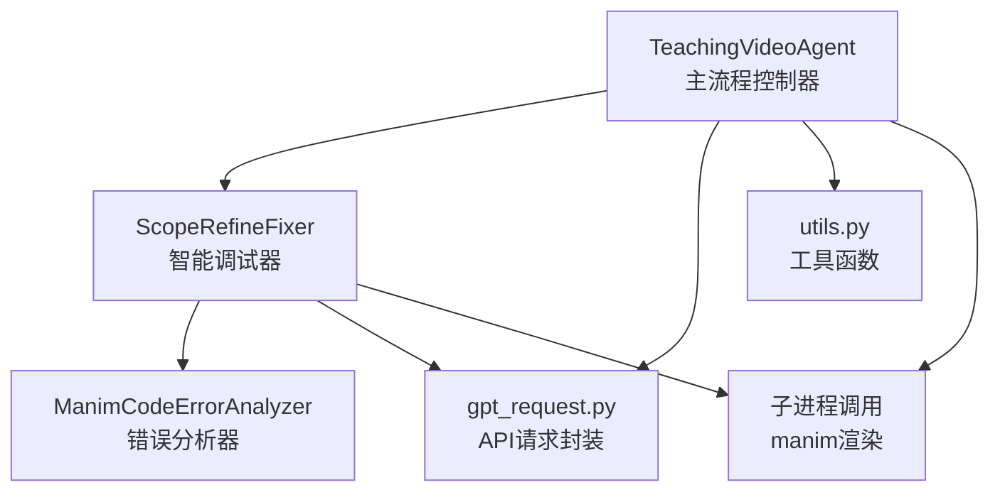
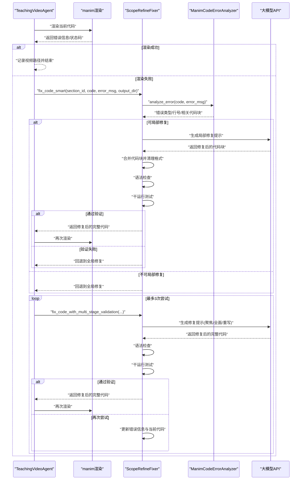
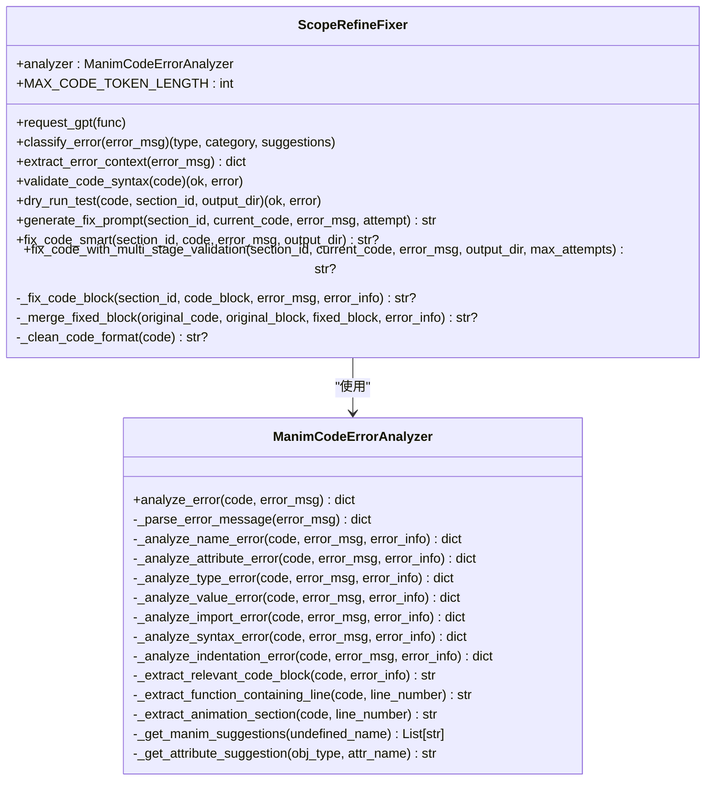
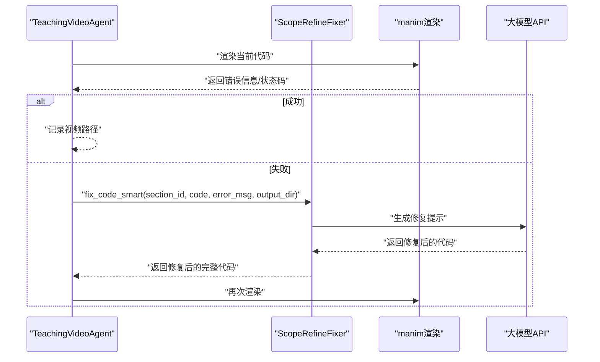
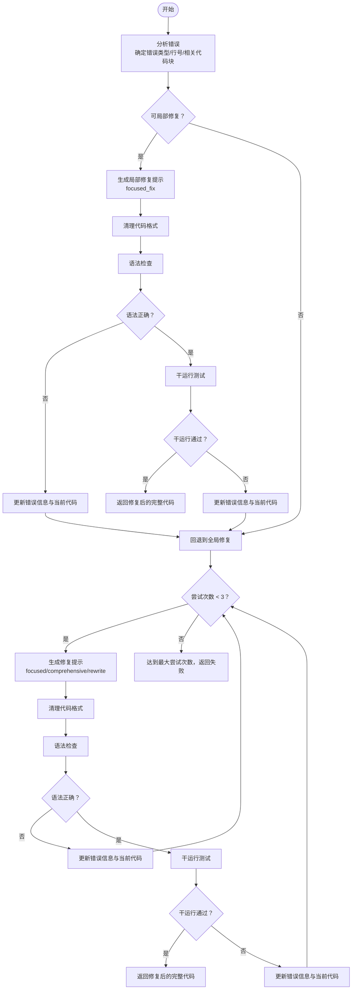
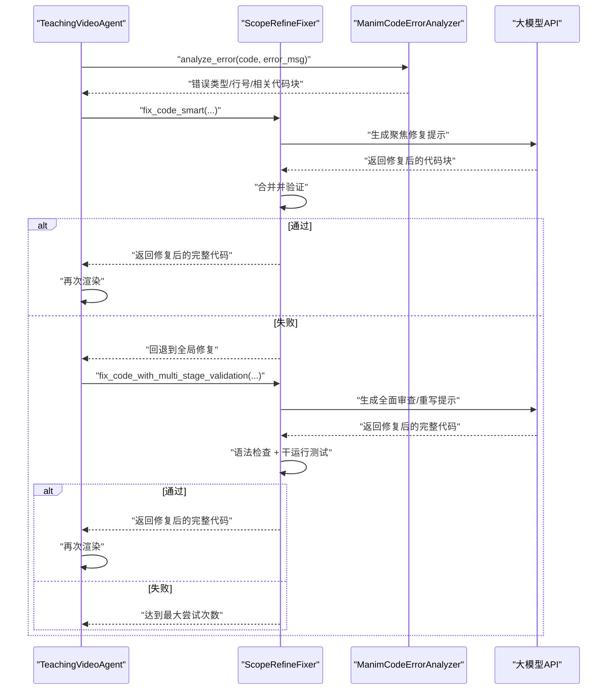
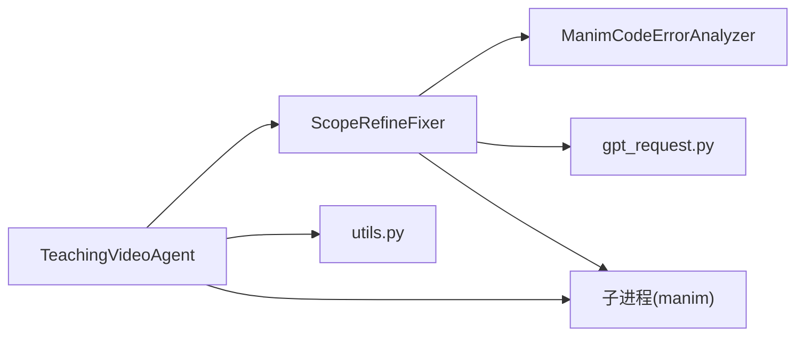

# Manim代码智能调试

<cite>
**本文引用的文件**
- [src/scope_refine.py](file://src/scope_refine.py)
- [src/agent.py](file://src/agent.py)
- [src/gpt_request.py](file://src/gpt_request.py)
- [src/utils.py](file://src/utils.py)
</cite>

## 目录
1. [简介](#简介)
2. [项目结构](#项目结构)
3. [核心组件](#核心组件)
4. [架构总览](#架构总览)
5. [详细组件分析](#详细组件分析)
6. [依赖关系分析](#依赖关系分析)
7. [性能考量](#性能考量)
8. [故障排查指南](#故障排查指南)
9. [结论](#结论)

## 简介
本文件围绕由 scope_refine.py 提供的智能调试能力展开，重点阐述 ScopeRefineFixer 类如何与 TeachingVideoAgent 集成，并通过 debug_and_fix_code() 方法实现自动化错误修复。文档深入解析其多阶段修复策略：
- 使用 ManimCodeErrorAnalyzer 对错误信息（如 NameError、AttributeError）进行智能分析，定位问题代码块；
- 基于错误严重程度与尝试次数，生成不同策略的修复提示（focused_fix、comprehensive_review、complete_rewrite）；
- 执行多阶段验证（语法检查、干运行测试）以确保修复后的代码可执行；
- 结合具体错误场景，展示从错误分析到成功修复的完整闭环。

## 项目结构
该仓库采用模块化设计，围绕“教学视频生成”流程组织代码：
- 教学视频主流程：TeachingVideoAgent 负责大纲生成、故事板生成、代码生成、渲染与合并等；
- 智能调试：ScopeRefineFixer 负责错误分析、修复策略生成与多阶段验证；
- 多模态反馈：TeachingVideoAgent 在渲染后使用 MLLM 进行布局与内容优化；
- API 请求封装：gpt_request.py 统一封装多种大模型请求接口；
- 工具函数：utils.py 提供通用工具（资源监控、路径处理、运行命令等）。

图表来源
- [src/agent.py](file://src/agent.py#L57-L120)
- [src/scope_refine.py](file://src/scope_refine.py#L250-L320)
- [src/gpt_request.py](file://src/gpt_request.py#L1-L120)
- [src/utils.py](file://src/utils.py#L138-L168)

章节来源
- [src/agent.py](file://src/agent.py#L57-L120)
- [src/scope_refine.py](file://src/scope_refine.py#L250-L320)
- [src/gpt_request.py](file://src/gpt_request.py#L1-L120)
- [src/utils.py](file://src/utils.py#L138-L168)

## 核心组件
- ScopeRefineFixer：面向 Manim 代码的智能修复器，负责错误分类、修复提示生成、多阶段验证与回退策略。
- ManimCodeErrorAnalyzer：面向 Manim 的错误分析器，解析错误类型、行号、上下文，并提取相关代码块。
- TeachingVideoAgent：教学视频生成主控制器，集成 ScopeRefineFixer，驱动渲染与多轮优化。
- gpt_request.py：统一的大模型请求封装，支持多种模型与令牌用量统计。
- utils.py：通用工具，包含运行 manim 的子进程调用、资源监控等。

章节来源
- [src/scope_refine.py](file://src/scope_refine.py#L18-L118)
- [src/scope_refine.py](file://src/scope_refine.py#L250-L320)
- [src/agent.py](file://src/agent.py#L57-L120)
- [src/gpt_request.py](file://src/gpt_request.py#L1-L120)
- [src/utils.py](file://src/utils.py#L138-L168)

## 架构总览
TeachingVideoAgent 在渲染阶段捕获 manim 渲染错误，交由 ScopeRefineFixer 进行智能修复。修复过程分为两层：
- 局部修复（smart fix）：基于错误分析器定位最小修复范围，优先在局部替换后进行语法与干运行验证；
- 全局修复（multi-stage validation）：当局部修复失败或错误范围过大时，按尝试次数生成不同强度的修复提示，依次进行语法校验与干运行测试。

图表来源
- [src/agent.py](file://src/agent.py#L356-L400)
- [src/scope_refine.py](file://src/scope_refine.py#L483-L572)
- [src/scope_refine.py](file://src/scope_refine.py#L331-L371)
- [src/scope_refine.py](file://src/scope_refine.py#L398-L482)

章节来源
- [src/agent.py](file://src/agent.py#L356-L400)
- [src/scope_refine.py](file://src/scope_refine.py#L331-L371)
- [src/scope_refine.py](file://src/scope_refine.py#L398-L482)
- [src/scope_refine.py](file://src/scope_refine.py#L483-L572)

## 详细组件分析

### ScopeRefineFixer 类
ScopeRefineFixer 是智能调试的核心，承担以下职责：
- 错误分析与分类：委托 ManimCodeErrorAnalyzer 完成错误类型识别、行号提取与相关代码块抽取；
- 修复策略生成：根据尝试次数与错误类别生成不同强度的修复提示（focused_fix/comprehensive_review/complete_rewrite）；
- 多阶段验证：先语法检查，再干运行测试，确保修复后的代码可执行；
- 回退机制：若局部修复失败或错误范围过大，则回退到全局修复流程。

图表来源
- [src/scope_refine.py](file://src/scope_refine.py#L18-L118)
- [src/scope_refine.py](file://src/scope_refine.py#L250-L320)
- [src/scope_refine.py](file://src/scope_refine.py#L331-L371)
- [src/scope_refine.py](file://src/scope_refine.py#L398-L482)
- [src/scope_refine.py](file://src/scope_refine.py#L483-L572)
- [src/scope_refine.py](file://src/scope_refine.py#L574-L669)

章节来源
- [src/scope_refine.py](file://src/scope_refine.py#L18-L118)
- [src/scope_refine.py](file://src/scope_refine.py#L250-L320)
- [src/scope_refine.py](file://src/scope_refine.py#L331-L371)
- [src/scope_refine.py](file://src/scope_refine.py#L398-L482)
- [src/scope_refine.py](file://src/scope_refine.py#L483-L572)
- [src/scope_refine.py](file://src/scope_refine.py#L574-L669)

### TeachingVideoAgent 与 ScopeRefineFixer 的集成
TeachingVideoAgent 在渲染阶段捕获 manim 的错误输出，调用 ScopeRefineFixer 的修复流程：
- debug_and_fix_code()：执行一次 manim 渲染，若失败则调用 fix_code_smart() 进行修复并重试；
- render_section()：在多次重试与反馈优化之间循环，确保最终可渲染出视频；
- optimize_with_feedback()：基于 MLLM 反馈优化代码，再次触发 debug_and_fix_code()。

图表来源
- [src/agent.py](file://src/agent.py#L356-L400)
- [src/scope_refine.py](file://src/scope_refine.py#L483-L572)

章节来源
- [src/agent.py](file://src/agent.py#L356-L400)
- [src/agent.py](file://src/agent.py#L527-L581)
- [src/agent.py](file://src/agent.py#L582-L666)

### 多阶段修复策略
ScopeRefineFixer 的修复策略随尝试次数递增而增强：
- 第1次尝试（focused_fix）：仅修复当前错误点，保持原结构，最小化变更；
- 第2次尝试（comprehensive_review）：审查整段代码，检查 API 兼容性、变量作用域、Scene 继承与动画时序；
- 第3次尝试（complete_rewrite）：以更稳健的方式重写场景，仅使用已验证的 API 特性，强调功能而非复杂度。

图表来源
- [src/scope_refine.py](file://src/scope_refine.py#L331-L371)
- [src/scope_refine.py](file://src/scope_refine.py#L398-L482)
- [src/scope_refine.py](file://src/scope_refine.py#L483-L572)

章节来源
- [src/scope_refine.py](file://src/scope_refine.py#L331-L371)
- [src/scope_refine.py](file://src/scope_refine.py#L398-L482)
- [src/scope_refine.py](file://src/scope_refine.py#L483-L572)

### 具体错误场景与修复闭环
- NameError：当未定义变量时，错误分析器会匹配常见 Manim 对象名并给出导入建议；修复器优先聚焦修复，必要时进行全面审查或重写；
- AttributeError：当对象缺少属性时，分析器给出常见属性修正建议；修复器在局部范围内进行替换，并通过语法与干运行验证；
- SyntaxError/IndentationError：分析器直接建议检查语法与缩进；修复器在聚焦修复阶段即进行严格语法检查；
- 导入错误：分析器建议检查导入语句；修复器在首次尝试中进行聚焦修复，若仍失败则进入全面审查或重写。

图表来源
- [src/scope_refine.py](file://src/scope_refine.py#L18-L118)
- [src/scope_refine.py](file://src/scope_refine.py#L483-L572)
- [src/agent.py](file://src/agent.py#L356-L400)

章节来源
- [src/scope_refine.py](file://src/scope_refine.py#L18-L118)
- [src/scope_refine.py](file://src/scope_refine.py#L483-L572)
- [src/agent.py](file://src/agent.py#L356-L400)

## 依赖关系分析
- TeachingVideoAgent 依赖 ScopeRefineFixer 进行错误修复，二者通过参数传递 API 函数与配置；
- ScopeRefineFixer 依赖 ManimCodeErrorAnalyzer 进行错误分析，并通过 gpt_request.py 的 API 封装调用大模型；
- TeachingVideoAgent 通过子进程调用 manim 进行渲染，同时使用 utils.run_manim_script() 作为底层执行工具；
- 两者之间的耦合度较低，主要通过函数参数与返回值交互，便于扩展与维护。

图表来源
- [src/agent.py](file://src/agent.py#L57-L120)
- [src/scope_refine.py](file://src/scope_refine.py#L250-L320)
- [src/gpt_request.py](file://src/gpt_request.py#L1-L120)
- [src/utils.py](file://src/utils.py#L138-L168)

章节来源
- [src/agent.py](file://src/agent.py#L57-L120)
- [src/scope_refine.py](file://src/scope_refine.py#L250-L320)
- [src/gpt_request.py](file://src/gpt_request.py#L1-L120)
- [src/utils.py](file://src/utils.py#L138-L168)

## 性能考量
- 修复策略的渐进式设计避免了不必要的大规模重写，减少大模型调用次数与令牌消耗；
- 干运行测试在不生成视频的前提下快速验证修复效果，显著降低渲染成本；
- 子进程超时控制与日志记录有助于在长时间渲染失败时及时止损；
- 资源监控工具可用于高负载环境下的自适应调整（如并发渲染进程数）。

[本节为通用指导，无需特定文件引用]

## 故障排查指南
- 渲染失败但修复未生效：检查 ScopeRefineFixer 的多阶段验证是否全部失败，确认错误信息是否被正确传递；
- 修复后仍报错：确认 dry_run_test 是否通过，必要时增加 comprehensive_review 或 complete_rewrite 尝试；
- API 调用异常：检查 gpt_request.py 的重试与超时设置，确保网络与密钥配置正确；
- manim 渲染超时：适当提高超时阈值或减少场景复杂度，必要时启用低质量渲染模式；
- 日志与统计：利用 TeachingVideoAgent 的令牌用量统计与调试输出定位瓶颈。

章节来源
- [src/scope_refine.py](file://src/scope_refine.py#L331-L371)
- [src/scope_refine.py](file://src/scope_refine.py#L483-L572)
- [src/gpt_request.py](file://src/gpt_request.py#L1-L120)
- [src/utils.py](file://src/utils.py#L138-L168)
- [src/agent.py](file://src/agent.py#L356-L400)

## 结论
ScopeRefineFixer 通过“智能错误分析 + 渐进式修复策略 + 多阶段验证”的闭环设计，有效提升了 Manim 代码的可修复性与稳定性。TeachingVideoAgent 将其无缝集成到渲染流程中，实现了从错误检测到自动修复再到最终可播放视频的完整自动化链路。配合多模态反馈与资源监控，整体系统具备良好的可扩展性与工程化落地能力。