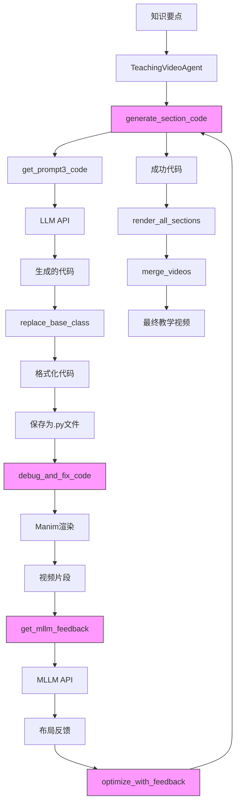

# Manim代码生成

<cite>
**本文档中引用的文件**
- [agent.py](file://src/agent.py)
- [gpt_request.py](file://src/gpt_request.py)
- [scope_refine.py](file://src/scope_refine.py)
- [utils.py](file://src/utils.py)
- [api_config.json](file://src/api_config.json)
</cite>

## 目录
1. [引言](#引言)
2. [核心流程概述](#核心流程概述)
3. [TeachingVideoAgent.generate_section_code()方法详解](#teachingvideoagentgenerate_section_codemethod详解)
4. [LLM提示词机制](#llm提示词机制)
5. [多轮尝试与错误处理](#多轮尝试与错误处理)
6. [多模态大模型反馈优化](#多模态大模型反馈优化)
7. [代码生成与格式化](#代码生成与格式化)
8. [系统架构与组件关系](#系统架构与组件关系)
9. [总结](#总结)

## 引言
本技术文档深入剖析了`TeachingVideoAgent.generate_section_code()`方法如何将教学视频的分镜脚本（Storyboard）中的每个章节（Section）转换为可执行的Manim Python代码。该过程是Code2Video项目的核心，它结合了大型语言模型（LLM）、多模态大模型（MLLM）的反馈以及智能错误修复机制，实现从知识要点到高质量动画视频的自动化生成。

文档将详细解释该方法如何利用精心设计的LLM提示词（如`get_prompt3_code`）来指导代码生成，如何通过`max_regenerate_tries`等配置实现多轮尝试以提高成功率，并如何处理来自多模态大模型（MLLM）的视觉反馈以进行代码优化。通过分析代码流程，我们将展示从知识要点到最终可执行Manim代码的完整转换路径。

## 核心流程概述
`TeachingVideoAgent`类的完整工作流程是一个多阶段的自动化管道，其核心目标是将一个知识要点（knowledge_point）转化为一段完整的教学视频。整个流程可以概括为以下几个关键步骤：

1.  **生成教学大纲 (Outline Generation)**：首先，系统根据输入的知识要点，调用LLM生成一个结构化的教学大纲，定义视频的整体结构和目标受众。
2.  **生成分镜脚本 (Storyboard Generation)**：在大纲的基础上，系统进一步生成详细的分镜脚本。这个脚本将视频分解为多个`Section`，每个`Section`包含标题、讲解词（lecture_lines）和动画指令（animations）。
3.  **生成Manim代码 (Code Generation)**：这是本文档的核心。`generate_section_code()`方法被调用，为分镜脚本中的每一个`Section`生成对应的Manim Python代码。
4.  **渲染视频片段 (Video Rendering)**：使用Manim引擎执行生成的代码，渲染出每个`Section`对应的视频片段。
5.  **多模态反馈与优化 (MLLM Feedback & Optimization)**：将渲染出的视频片段与参考网格图一起发送给多模态大模型（MLLM），获取关于布局、动画流畅度等方面的反馈。
6.  **迭代优化 (Iterative Optimization)**：根据MLLM的反馈，系统会尝试重新生成或修改代码，以优化视频的视觉效果。
7.  **合并最终视频 (Video Merging)**：将所有优化后的视频片段按顺序合并成一个完整的教学视频。

`generate_section_code()`方法是连接“内容规划”与“视觉实现”的关键桥梁，它负责将抽象的动画指令转化为具体的、可执行的编程代码。

**Section sources**
- [agent.py](file://src/agent.py#L57-L800)

## TeachingVideoAgent.generate_section_code()方法详解
`generate_section_code()`是`TeachingVideoAgent`类中的核心方法，其主要职责是为一个`Section`对象生成可执行的Manim代码。该方法的设计体现了容错性、迭代性和反馈驱动的特性。

### 方法签名与参数
```python
def generate_section_code(self, section: Section, attempt: int = 1, feedback_improvements=None) -> str:
```
- **`section`**: 一个`Section`对象，包含了该章节的所有信息，如ID、标题、讲解词和动画指令。
- **`attempt`**: 当前的生成尝试次数。首次调用为1，失败后会递增，用于控制重试逻辑。
- **`feedback_improvements`**: 一个来自MLLM的改进建议列表。当此参数不为空时，表示本次代码生成是基于反馈的优化尝试。

### 执行流程
该方法的执行流程可以分为以下几个关键阶段：

1.  **检查缓存**：方法首先检查是否存在已生成的代码文件。如果存在且不是在处理反馈，则直接读取并返回缓存的代码，避免重复生成。
2.  **处理反馈**：如果提供了`feedback_improvements`，系统会尝试使用`GridCodeModifier`类直接修改现有代码。如果修改失败，则会进入基于反馈的代码重生成流程。
3.  **生成提示词**：如果无需处理反馈或修改失败，系统会调用`get_prompt3_code()`函数，结合当前`Section`的信息和`regenerate_note`（用于告知LLM这是第几次重试）来构建一个详细的提示词。
4.  **调用LLM**：使用`_request_api_and_track_tokens()`方法，将构建好的提示词发送给配置的LLM API（如Gemini或GPT-4o）。
5.  **解析与清理响应**：从LLM的响应中提取出代码内容。该方法会处理不同格式的响应（如`response.candidates`或`response.choices`），并使用正则表达式从Markdown代码块（```python）中提取纯Python代码。
6.  **基础类替换**：调用`replace_base_class()`函数，将生成代码中的基础类（如`TeachingScene`）替换为项目配置中指定的正确基类。
7.  **保存与返回**：将处理后的代码保存到以`section.id`命名的`.py`文件中，并更新`self.section_codes`字典，最后返回生成的代码字符串。

该方法通过`attempt`参数和`feedback_improvements`参数，巧妙地统一了“首次生成”、“重试生成”和“反馈优化”三种场景，使得整个代码生成流程既灵活又健壮。

**Section sources**
- [agent.py](file://src/agent.py#L295-L354)

## LLM提示词机制
代码生成的质量高度依赖于提供给LLM的提示词（Prompt）的质量。`TeachingVideoAgent`通过一系列精心设计的提示词函数来引导LLM生成符合要求的Manim代码。

### `get_prompt3_code`函数
`get_prompt3_code`是生成Manim代码的核心提示词函数。虽然其具体实现位于未提供的`prompts.py`模块中，但通过分析`agent.py`中的调用方式，我们可以推断其设计原则：

- **输入参数**：该函数接收`regenerate_note`、`section`和`base_class`作为参数。
- **内容结构**：提示词会包含以下关键信息：
    - **任务指令**：明确要求LLM生成一个Manim Python脚本。
    - **章节信息**：传入`section`对象的标题、讲解词和动画指令，作为代码生成的依据。
    - **基础类定义**：指定`base_class`的内容，确保生成的代码继承正确的场景类。
    - **重试信息**：`regenerate_note`会告知LLM这是第几次尝试，例如“这是第2次尝试，请仔细检查之前的错误”，这有助于LLM在重试时避免重复犯错。
    - **格式要求**：可能包含对代码格式、注释、命名规范等的要求。
    - **上下文信息**：可能包含一些通用的Manim代码模板或最佳实践作为上下文。

这种结构化的提示词设计，使得LLM能够充分理解任务需求，从而生成更准确、更符合项目规范的代码。

### 其他相关提示词
系统中还定义了其他提示词函数，共同构成了一个完整的提示词体系：
- `get_prompt1_outline`: 用于生成教学大纲。
- `get_prompt2_storyboard`: 用于生成分镜脚本。
- `get_prompt4_layout_feedback`: 用于向MLLM请求视频布局反馈。

这些提示词共同确保了从内容规划到代码实现的每一步都受到精确的引导。

**Section sources**
- [agent.py](file://src/agent.py#L327-L328)

## 多轮尝试与错误处理
为了应对LLM生成结果的不确定性以及Manim代码运行时可能出现的错误，系统设计了一套完善的多轮尝试和错误处理机制。

### 配置参数
该机制由`RunConfig`类中的多个参数控制：
- `max_regenerate_tries`: 最大代码重生成尝试次数。当LLM生成的代码无效或无法通过初步检查时，系统会根据此参数进行重试。
- `max_fix_bug_tries`: 在调试和修复代码阶段，允许的最大修复尝试次数。
- `max_feedback_gen_code_tries`: 在收到MLLM反馈后，重新生成代码以进行优化的最大尝试次数。

### `debug_and_fix_code`方法
`generate_section_code()`生成代码后，`debug_and_fix_code()`方法负责验证和修复代码。其流程如下：
1.  **执行Manim命令**：在`output_dir`目录下，使用`subprocess.run()`调用`manim`命令来渲染视频。
2.  **检查返回码**：如果命令执行成功（`returncode == 0`），则说明代码无语法或运行时错误，流程结束。
3.  **智能错误修复**：如果执行失败，系统会捕获错误信息（`stderr`），并将其传递给`ScopeRefineFixer`实例。
4.  **多阶段修复**：`ScopeRefineFixer`会对错误进行智能分析（例如，是`NameError`还是`SyntaxError`），然后生成一个专门的修复提示词，再次调用LLM来生成修复后的代码。这个过程会根据尝试次数（`attempt`）调整修复策略，从“聚焦修复”到“全面审查”再到“完全重写”。
5.  **循环尝试**：上述过程会在`max_fix_attempts`的限制内循环进行，直到成功或耗尽所有尝试。

这种“生成-执行-反馈-修复”的循环机制，极大地提高了系统生成有效代码的鲁棒性。

**Section sources**
- [agent.py](file://src/agent.py#L356-L400)
- [agent.py](file://src/agent.py#L77-L78)
- [scope_refine.py](file://src/scope_refine.py#L250-L572)

## 多模态大模型反馈优化
在生成并渲染出视频片段后，系统利用多模态大模型（MLLM）的能力，对视频的视觉效果进行评估和优化，这是提升视频质量的关键一步。

### 反馈获取流程
1.  **调用`get_mllm_feedback`**：`render_section()`方法在渲染成功后，会调用`get_mllm_feedback()`。
2.  **构建分析提示词**：该方法会调用`get_prompt4_layout_feedback()`，并传入`section`信息和一个由`GridPositionExtractor`生成的`position_table`。这个表格列出了代码中所有对象的网格位置，为MLLM提供了布局分析的上下文。
3.  **多模态API调用**：系统调用`request_gemini_video_img()`，将视频文件、参考网格图（`GRID_IMG_PATH`）和分析提示词一同发送给MLLM（如Gemini）。
4.  **解析反馈**：收到响应后，系统会解析JSON格式的反馈，提取出`has_issues`（是否有问题）和`suggested_improvements`（改进建议列表）。

### 优化执行流程
1.  **调用`optimize_with_feedback`**：如果MLLM反馈存在问题，`render_section()`会调用`optimize_with_feedback()`。
2.  **重新生成代码**：该方法会备份原始代码，并调用`generate_section_code()`，传入`feedback_improvements`参数。
3.  **迭代优化**：`generate_section_code()`在收到反馈后，会尝试修改或重新生成代码。新代码会再次经过`debug_and_fix_code()`的验证。
4.  **保存优化结果**：如果优化成功，新的视频片段会被保存到`optimized_videos`目录下。

通过这一闭环，系统能够实现从“生成”到“评估”再到“改进”的自动化迭代，显著提升了最终视频的视觉质量和教学效果。

**Section sources**
- [agent.py](file://src/agent.py#L402-L505)
- [agent.py](file://src/agent.py#L549-L574)
- [gpt_request.py](file://src/gpt_request.py#L192-L273)

## 代码生成与格式化
在代码生成的最后阶段，系统会进行一系列的格式化和处理，以确保生成的代码可以直接被Manim引擎执行。

### 基础类替换 (`replace_base_class`)
`generate_section_code()`方法在获取LLM生成的代码后，会立即调用`utils.py`中的`replace_base_class()`函数。这个函数的作用是：
- **查找**：在代码中搜索`class TeachingScene(Scene):`的定义。
- **替换**：将其替换为项目配置中指定的`base_class`（例如，一个包含了特定初始化逻辑的自定义场景类）。
- **插入**：如果未找到`TeachingScene`，则会将`base_class`的定义插入到代码的开头。

这确保了所有生成的代码都继承了正确的、功能完整的基类。

### 代码清理
在从LLM响应中提取代码时，系统会自动移除Markdown代码块的标记（```python和```），并清理多余的空行，保证生成的代码文件是纯净的Python代码。

### 路径处理
`utils.py`中的`fix_png_path()`函数可以自动修正代码中PNG图片资源的路径，确保它们指向正确的`assets`目录，解决了资源加载的问题。

这些后处理步骤是自动化流程中不可或缺的一环，它们保证了生成代码的可用性和一致性。

**Section sources**
- [agent.py](file://src/agent.py#L347-L348)
- [utils.py](file://src/utils.py#L91-L128)
- [utils.py](file://src/utils.py#L31-L50)

## 系统架构与组件关系
下图展示了`TeachingVideoAgent`及其相关组件在代码生成过程中的交互关系。



**Diagram sources**
- [agent.py](file://src/agent.py#L295-L354)
- [agent.py](file://src/agent.py#L356-L400)
- [agent.py](file://src/agent.py#L402-L505)
- [agent.py](file://src/agent.py#L596-L665)
- [agent.py](file://src/agent.py#L667-L701)
- [utils.py](file://src/utils.py#L91-L128)

## 总结
`TeachingVideoAgent.generate_section_code()`方法是Code2Video项目实现自动化视频生成的核心引擎。它不仅仅是一个简单的代码生成器，而是一个集成了LLM提示工程、多轮容错机制、智能错误修复和多模态反馈优化的复杂系统。

该方法通过`get_prompt3_code`等提示词精准地引导LLM，利用`max_regenerate_tries`等参数实现稳健的重试策略，并通过与`ScopeRefineFixer`和MLLM的深度集成，形成了一个“生成-执行-评估-优化”的闭环。最终，它能够将分镜脚本中的抽象动画指令，可靠地转化为高质量、可执行的Manim代码，为自动化教学视频的生成奠定了坚实的基础。