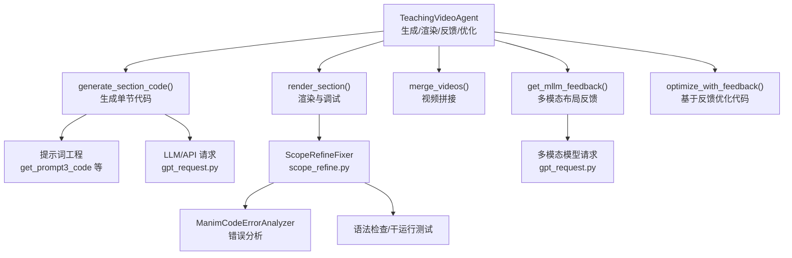
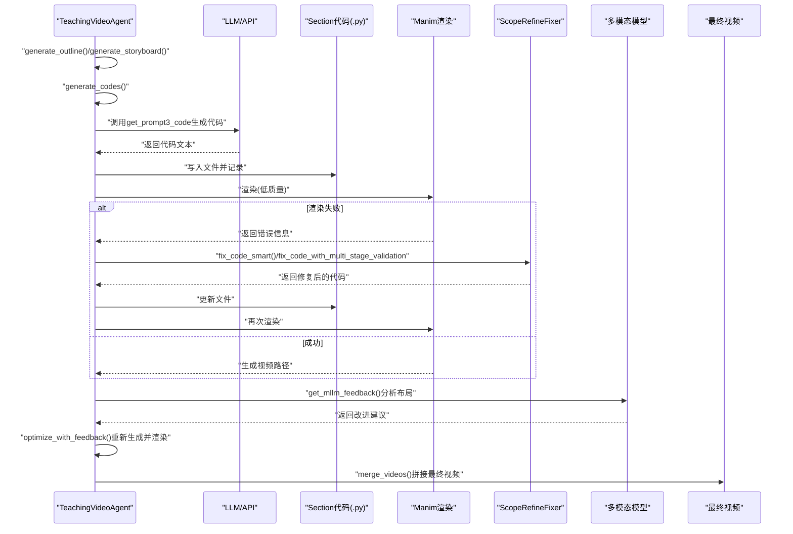
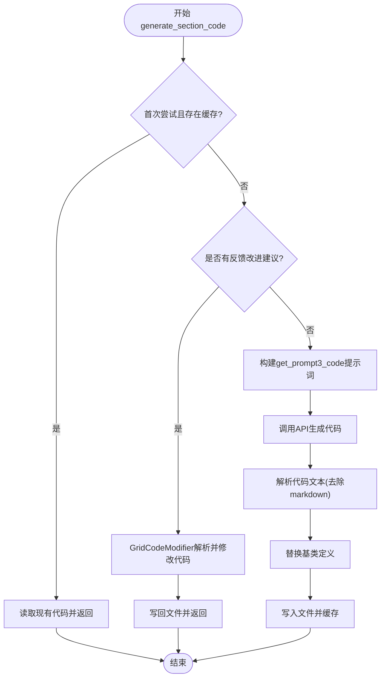
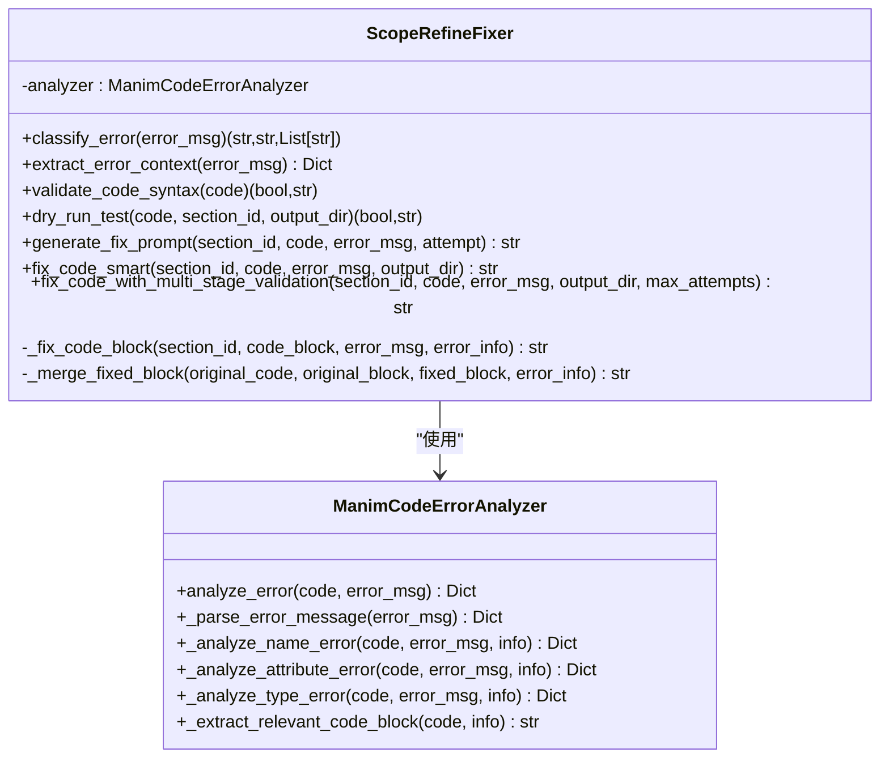
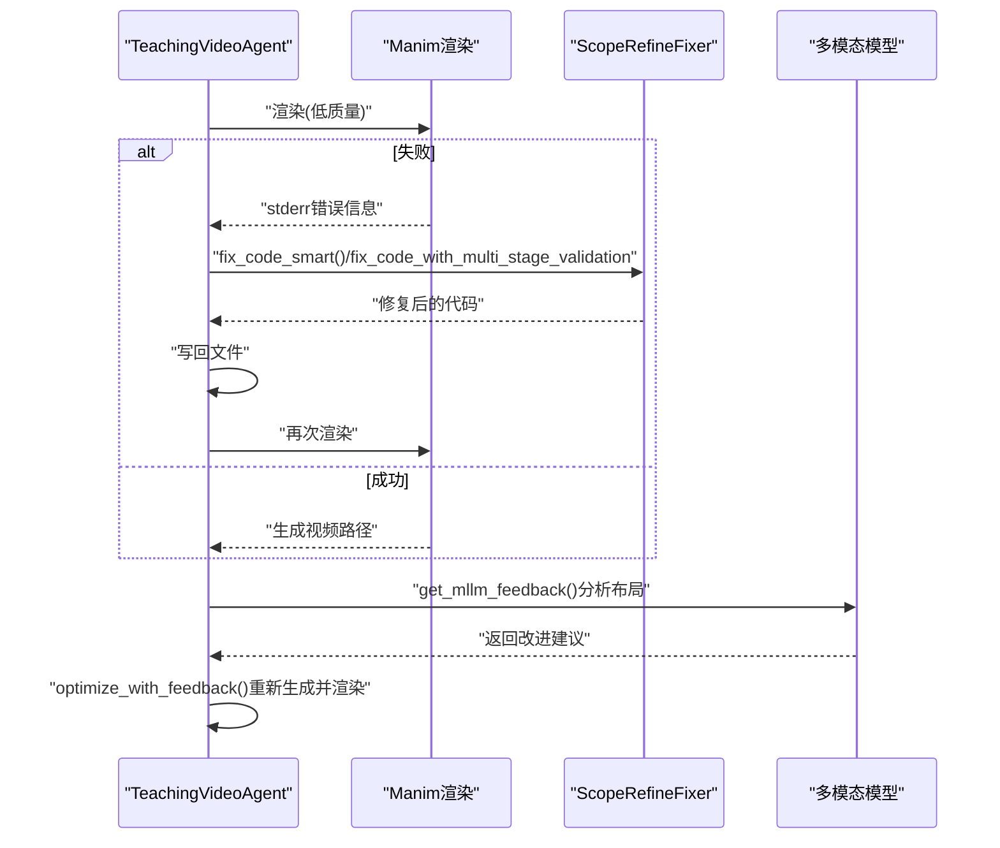
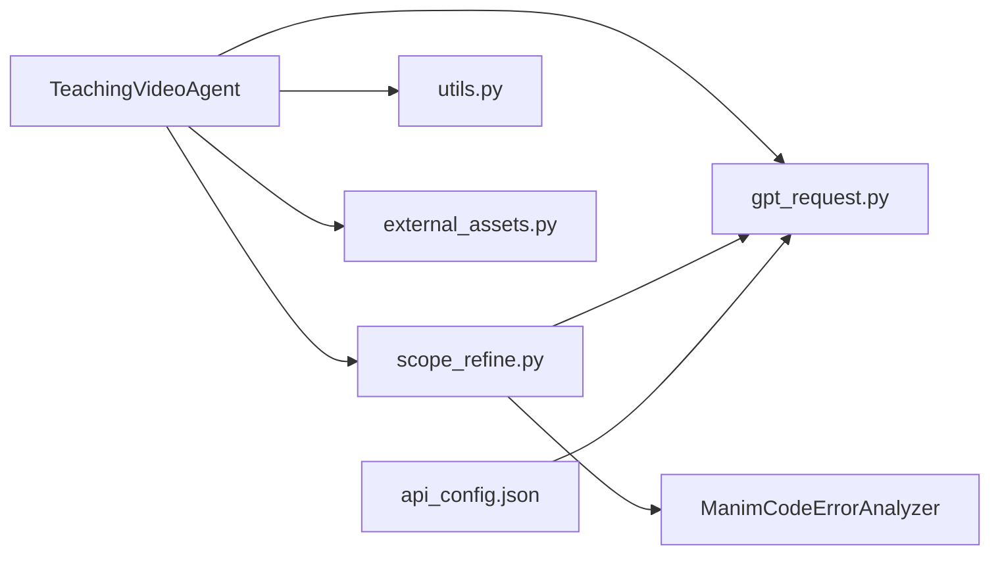

# Manim代码生成与调试

<cite>
**本文引用的文件列表**
- [agent.py](file://src/agent.py)
- [scope_refine.py](file://src/scope_refine.py)
- [utils.py](file://src/utils.py)
- [gpt_request.py](file://src/gpt_request.py)
- [external_assets.py](file://src/external_assets.py)
- [api_config.json](file://src/api_config.json)
</cite>

## 目录
1. [引言](#引言)
2. [项目结构](#项目结构)
3. [核心组件](#核心组件)
4. [架构总览](#架构总览)
5. [详细组件分析](#详细组件分析)
6. [依赖关系分析](#依赖关系分析)
7. [性能考量](#性能考量)
8. [故障排查指南](#故障排查指南)
9. [结论](#结论)

## 引言
本文件面向希望深入理解“代码转视频”系统中Manim代码生成与调试机制的读者。文档聚焦两个关键目标：
- 解释TeachingVideoAgent.generate_section_code()如何将故事板中的每个Section转换为可执行的Manim Python代码，包括提示词工程（get_prompt3_code）、多轮尝试（max_regenerate_tries）与多模态大模型（MLLM）反馈驱动的优化闭环。
- 深入介绍scope_refine.py提供的智能调试能力，重点说明ScopeRefineFixer类如何与TeachingVideoAgent集成，并通过debug_and_fix_code()方法实现自动化错误修复，涵盖多阶段修复策略（聚焦修复、全面审查、完全重写）与多阶段验证（语法检查、干运行测试）。

## 项目结构
系统采用模块化设计，围绕“生成-渲染-反馈-优化”的流水线组织：
- 顶层控制器：TeachingVideoAgent负责端到端流程编排（生成大纲、故事板、代码、渲染、合并视频、MLLM反馈与优化）。
- 提示词与外部接口：gpt_request.py封装多模型请求与重试逻辑；prompts模块提供各类提示词（此处通过from prompts import *导入）。
- 调试与修复：scope_refine.py提供智能错误分析与修复（ManimCodeErrorAnalyzer、ScopeRefineFixer）。
- 工具与资源：utils.py提供通用工具（替换基类、资源监控、视频拼接等）；external_assets.py负责智能素材下载与故事板增强；api_config.json提供模型配置。

图表来源
- [agent.py](file://src/agent.py#L295-L400)
- [scope_refine.py](file://src/scope_refine.py#L18-L216)
- [gpt_request.py](file://src/gpt_request.py#L1-L120)

章节来源
- [agent.py](file://src/agent.py#L1-L120)
- [gpt_request.py](file://src/gpt_request.py#L1-L120)
- [scope_refine.py](file://src/scope_refine.py#L1-L120)

## 核心组件
- TeachingVideoAgent：端到端控制器，负责大纲生成、故事板生成、代码生成、渲染、反馈与优化。
- ScopeRefineFixer：智能修复器，结合错误分析与多阶段验证，自动修复Manim代码。
- ManimCodeErrorAnalyzer：针对常见Manim错误类型（NameError、AttributeError、TypeError等）进行精准定位与建议。
- 工具函数：替换基类、资源监控、视频拼接、输出目录管理等。

章节来源
- [agent.py](file://src/agent.py#L57-L120)
- [scope_refine.py](file://src/scope_refine.py#L18-L120)
- [utils.py](file://src/utils.py#L90-L160)

## 架构总览
下图展示了从Section到可执行视频的完整闭环：生成阶段（LLM提示词+多轮尝试）、渲染阶段（Manim渲染+ScopeRefineFixer自动修复）、反馈阶段（MLLM分析布局并给出改进建议）、优化阶段（基于反馈重新生成代码并再次渲染）。

图表来源
- [agent.py](file://src/agent.py#L295-L400)
- [agent.py](file://src/agent.py#L402-L506)
- [agent.py](file://src/agent.py#L527-L666)
- [scope_refine.py](file://src/scope_refine.py#L398-L573)

## 详细组件分析

### 1) 代码生成：TeachingVideoAgent.generate_section_code()
- 输入：Section对象、当前尝试次数attempt、可选的反馈改进建议。
- 关键流程：
  - 若首次尝试且已有对应.py文件且无反馈，则直接读取缓存。
  - 否则根据是否传入反馈改进建议决定走“基于反馈改进”或“常规代码生成”路径。
  - 常规路径使用get_prompt3_code生成提示词，调用API生成代码，解析返回的代码文本（去除markdown标记），替换基类定义后写入文件。
  - 反馈路径优先尝试GridCodeModifier解析反馈并直接修改代码，若失败则回退到基于反馈的提示词重新生成。
- 多轮尝试：max_regenerate_tries控制最大重试次数，避免一次性LLM输出不稳定导致失败。
- 与ScopeRefine集成：生成的代码随后进入debug_and_fix_code()进行自动修复与验证。

图表来源
- [agent.py](file://src/agent.py#L295-L354)

章节来源
- [agent.py](file://src/agent.py#L295-L354)

### 2) 智能调试与修复：ScopeRefineFixer
ScopeRefineFixer与TeachingVideoAgent深度集成，通过debug_and_fix_code()在渲染失败时介入，形成“错误分析—修复—验证”的闭环。

- 错误分析（ManimCodeErrorAnalyzer）：
  - 解析错误消息，提取错误类型、行号、列号、问题代码片段。
  - 针对NameError、AttributeError、TypeError等常见错误类型提供具体建议与修复范围（单行、函数级、动画段落）。
  - 从错误上下文提取相关代码块，便于局部修复。
- 修复策略（多阶段）：
  - 尝试1：聚焦修复（focused_fix）。仅修复明确的错误点，保持原结构最小改动。
  - 尝试2：全面审查（comprehensive_review）。对整段代码进行审查，检查API兼容性、变量作用域、场景继承与方法、动画时序与顺序、必要时添加错误处理。
  - 尝试3：完全重写（complete_rewrite）。以更稳健的方式重写场景，仅使用已验证的Manim CE v0.19.0特性，强调功能而非复杂度。
- 多阶段验证：
  - 语法验证：compile校验，捕获语法错误与编译异常。
  - 干运行测试：构造一个快速退出的测试版本，仅执行construct入口以验证可运行性。
- 回退机制：若局部修复失败或错误范围过大，自动降级为完整修复流程。

图表来源
- [scope_refine.py](file://src/scope_refine.py#L18-L216)
- [scope_refine.py](file://src/scope_refine.py#L250-L573)

章节来源
- [scope_refine.py](file://src/scope_refine.py#L18-L216)
- [scope_refine.py](file://src/scope_refine.py#L250-L573)

### 3) 与TeachingVideoAgent的集成与闭环
- debug_and_fix_code()：每次渲染失败时，读取当前代码，调用ScopeRefineFixer修复，若修复成功则写回文件并再次渲染；最多max_fix_bug_tries次尝试。
- MLLM反馈与优化：
  - get_mllm_feedback()使用多模态模型分析视频，提取布局问题与改进建议。
  - optimize_with_feedback()基于建议重新生成代码并再次渲染，支持多次尝试（max_feedback_gen_code_tries）。
- 全流程闭环：生成→渲染→修复→反馈→优化→拼接。

图表来源
- [agent.py](file://src/agent.py#L356-L401)
- [agent.py](file://src/agent.py#L402-L506)
- [scope_refine.py](file://src/scope_refine.py#L398-L573)

章节来源
- [agent.py](file://src/agent.py#L356-L401)
- [agent.py](file://src/agent.py#L402-L506)
- [scope_refine.py](file://src/scope_refine.py#L398-L573)

### 4) 提示词工程与多模态反馈
- 提示词工程：generate_section_code()使用get_prompt3_code构建生成提示词，结合Section信息与可选的反馈改进建议，指导LLM生成高质量、可执行的Manim代码。
- 多模态反馈：get_mllm_feedback()使用request_gemini_video_img向多模态模型发送视频与参考图，解析布局问题并生成改进建议，用于后续优化。

章节来源
- [agent.py](file://src/agent.py#L295-L354)
- [agent.py](file://src/agent.py#L402-L460)
- [gpt_request.py](file://src/gpt_request.py#L192-L274)

## 依赖关系分析
- TeachingVideoAgent依赖：
  - gpt_request.py：统一的API请求封装与令牌统计。
  - scope_refine.py：智能修复器与错误分析器。
  - utils.py：通用工具（替换基类、资源监控、视频拼接等）。
  - external_assets.py：故事板素材增强。
- ScopeRefineFixer依赖：
  - ManimCodeErrorAnalyzer：错误类型识别与上下文提取。
  - gpt_request.py：在修复过程中二次调用LLM生成修复代码。
- 配置：
  - api_config.json：提供各模型的base_url、api_key、model等配置项。

图表来源
- [agent.py](file://src/agent.py#L1-L120)
- [scope_refine.py](file://src/scope_refine.py#L1-L120)
- [gpt_request.py](file://src/gpt_request.py#L1-L120)
- [api_config.json](file://src/api_config.json#L1-L40)

章节来源
- [agent.py](file://src/agent.py#L1-L120)
- [scope_refine.py](file://src/scope_refine.py#L1-L120)
- [gpt_request.py](file://src/gpt_request.py#L1-L120)
- [api_config.json](file://src/api_config.json#L1-L40)

## 性能考量
- 并行渲染：render_all_sections()使用进程池并行渲染多个Section，提升整体吞吐。
- 资源监控：get_optimal_workers()根据CPU核数自适应设置并行度，避免内存溢出。
- 令牌统计：_request_api_and_track_tokens与_gpt_request.py中的token返回，便于成本控制与上限管理。
- 干运行测试：dry_run_test通过构造快速退出的测试版本，降低全量渲染成本，提高修复迭代效率。

章节来源
- [agent.py](file://src/agent.py#L596-L666)
- [utils.py](file://src/utils.py#L53-L90)
- [scope_refine.py](file://src/scope_refine.py#L341-L371)

## 故障排查指南
- 生成阶段失败：
  - 检查API响应是否为空或格式不正确，确认max_regenerate_tries是否足够。
  - 确认提示词构建是否包含Section关键信息。
- 渲染阶段失败：
  - 查看stderr错误信息，确认ScopeRefineFixer是否正确分析并修复。
  - 若多次尝试仍失败，检查Manim版本兼容性与API使用方式。
- MLLM反馈无效：
  - 确认视频路径有效，参考图存在。
  - 检查JSON解析与正则匹配是否正确。
- 配置问题：
  - 确认api_config.json中各模型配置项正确，特别是base_url、api_key、model。

章节来源
- [agent.py](file://src/agent.py#L156-L188)
- [agent.py](file://src/agent.py#L223-L259)
- [agent.py](file://src/agent.py#L402-L460)
- [scope_refine.py](file://src/scope_refine.py#L398-L573)
- [api_config.json](file://src/api_config.json#L1-L40)

## 结论
本系统通过“提示词工程+多轮尝试+智能修复+多模态反馈”的闭环，实现了从故事板到可执行视频的高可靠自动化流程。TeachingVideoAgent负责端到端编排，ScopeRefineFixer提供强大的错误分析与修复能力，配合gpt_request与utils模块，既保证了生成质量，又提升了稳定性与可维护性。对于大规模批量任务，系统通过并行渲染与资源监控进一步优化性能与成本。