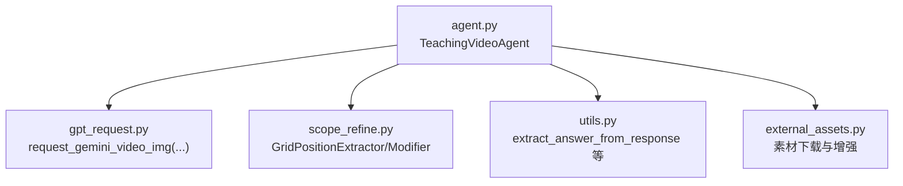
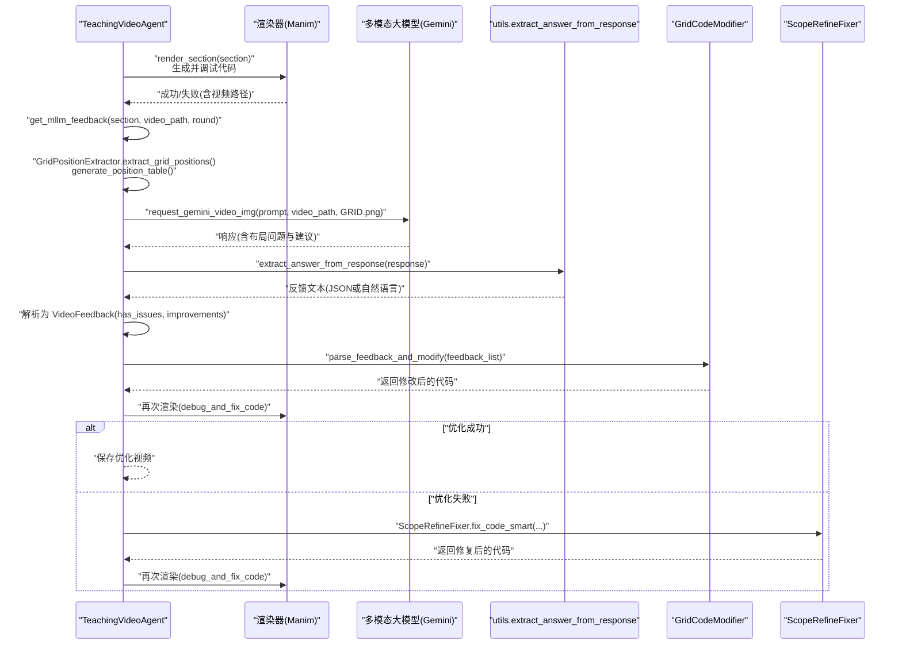
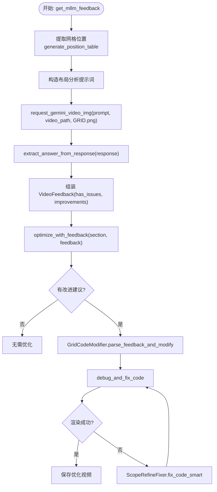
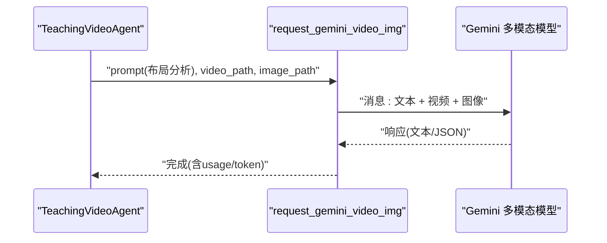
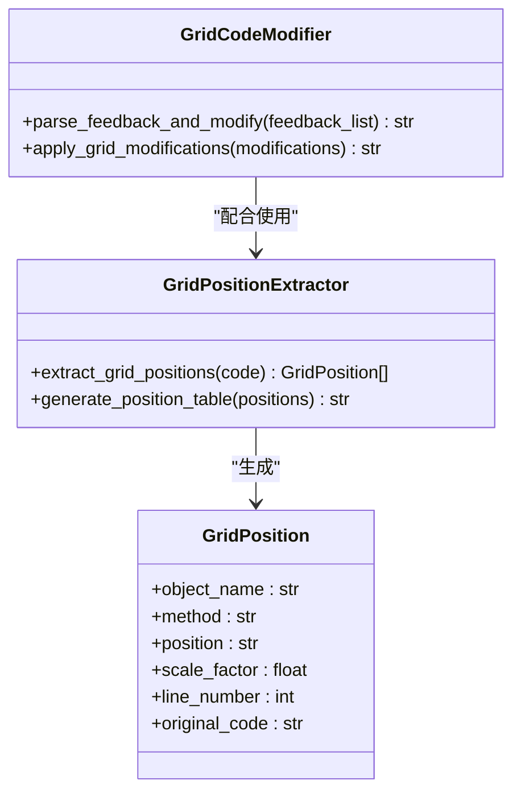
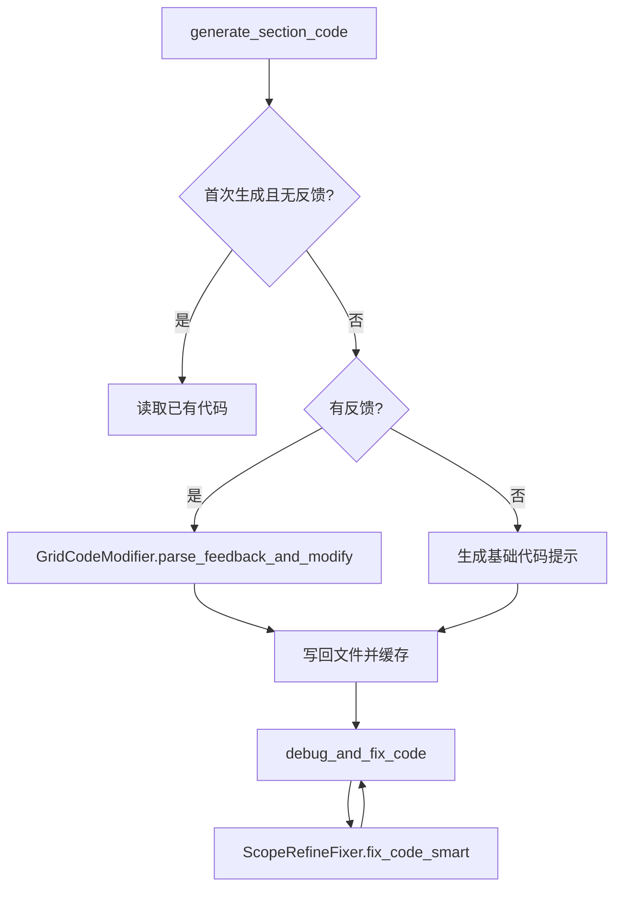
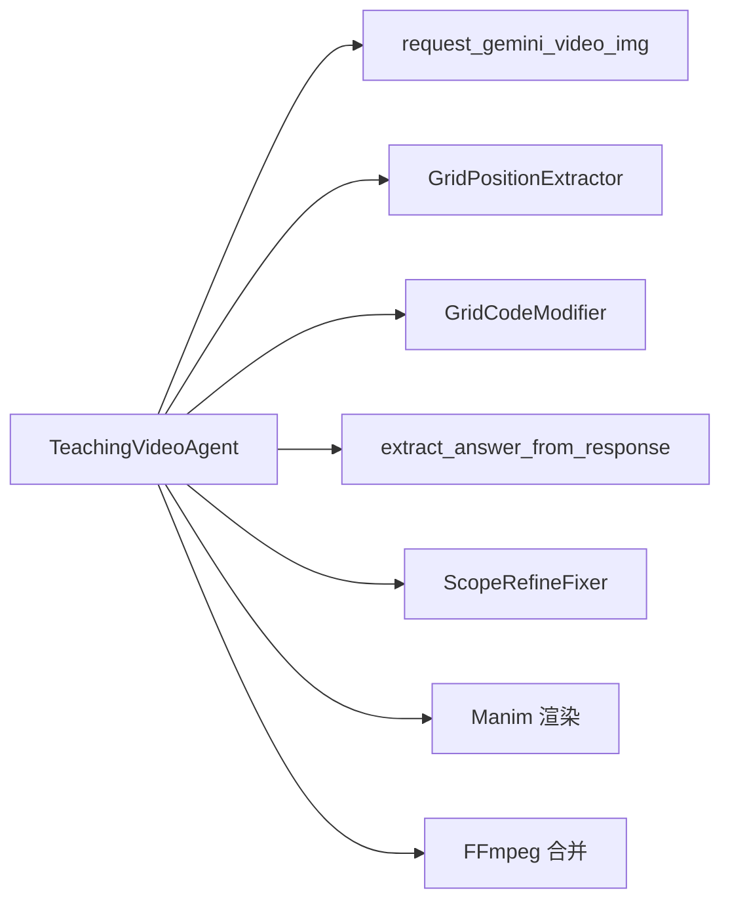

# 多模态反馈优化

<cite>
**本文引用的文件**
- [agent.py](file://src/agent.py)
- [gpt_request.py](file://src/gpt_request.py)
- [scope_refine.py](file://src/scope_refine.py)
- [utils.py](file://src/utils.py)
- [external_assets.py](file://src/external_assets.py)
</cite>

## 目录
1. [引言](#引言)
2. [项目结构](#项目结构)
3. [核心组件](#核心组件)
4. [架构总览](#架构总览)
5. [详细组件分析](#详细组件分析)
6. [依赖关系分析](#依赖关系分析)
7. [性能与资源控制](#性能与资源控制)
8. [故障排查指南](#故障排查指南)
9. [结论](#结论)

## 引言
本文件围绕“多模态反馈优化系统”的工作原理进行深入说明，重点阐释 TeachingVideoAgent 如何通过 get_mllm_feedback() 与 optimize_with_feedback() 构建“基于反馈的迭代优化循环”。文档详细描述以下流程：
- 渲染出视频片段后，系统如何调用 request_gemini_video_img() 将视频、参考图像（GRID.png）与布局分析提示词发送给多模态大模型（如 Gemini）；
- 多模态大模型如何分析视频的视觉布局、动画流畅度等，并生成 JSON 格式的改进建议；
- Agent 如何解析反馈（VideoFeedback 对象），并指导 generate_section_code() 重新生成代码；
- 配置参数 feedback_rounds 与 max_feedback_gen_code_tries 如何控制优化的深度与资源消耗；
- 该机制如何显著提升生成视频的教育质量与视觉效果，体现系统的智能化。

## 项目结构
本仓库采用模块化设计，围绕“智能体 + 多模态请求 + 代码修复 + 工具函数”组织代码：
- agent.py：核心智能体 TeachingVideoAgent，负责生成大纲、故事板、代码、渲染、合并视频以及多模态反馈优化循环；
- gpt_request.py：封装各类大模型请求（含 Gemini 的视频+图片+文本多模态接口）；
- scope_refine.py：包含网格位置提取、网格代码修改器、智能错误修复器等工具；
- utils.py：通用工具函数（如 JSON 提取、替换基类、资源监控等）；
- external_assets.py：外部素材下载与增强逻辑（与反馈优化无直接耦合，但体现系统对“内容增强”的整体能力）。

图表来源
- [agent.py](file://src/agent.py#L120-L140)
- [gpt_request.py](file://src/gpt_request.py#L192-L273)
- [scope_refine.py](file://src/scope_refine.py#L683-L802)
- [utils.py](file://src/utils.py#L11-L29)
- [external_assets.py](file://src/external_assets.py#L1-L120)

章节来源
- [agent.py](file://src/agent.py#L1-L120)
- [gpt_request.py](file://src/gpt_request.py#L192-L273)
- [scope_refine.py](file://src/scope_refine.py#L683-L802)
- [utils.py](file://src/utils.py#L11-L29)
- [external_assets.py](file://src/external_assets.py#L1-L120)

## 核心组件
- TeachingVideoAgent：主控制器，贯穿“生成-渲染-反馈-优化-合并”的全流程。
- request_gemini_video_img：多模态请求封装，支持视频+参考图+文本输入。
- GridPositionExtractor：从 Manim 代码中提取网格布局信息，生成表格供 MLLM 分析。
- GridCodeModifier：根据 MLLM 反馈中的“行号+新代码”进行精准替换。
- ManimCodeErrorAnalyzer/ScopeRefineFixer：在优化失败时提供智能修复路径。
- utils.extract_answer_from_response：统一从不同模型响应中抽取可解析文本。

章节来源
- [agent.py](file://src/agent.py#L402-L506)
- [gpt_request.py](file://src/gpt_request.py#L192-L273)
- [scope_refine.py](file://src/scope_refine.py#L683-L802)
- [utils.py](file://src/utils.py#L11-L29)

## 架构总览
下图展示了“多模态反馈优化循环”的端到端交互：

图表来源
- [agent.py](file://src/agent.py#L402-L506)
- [gpt_request.py](file://src/gpt_request.py#L192-L273)
- [scope_refine.py](file://src/scope_refine.py#L683-L802)
- [utils.py](file://src/utils.py#L11-L29)

## 详细组件分析

### 组件一：TeachingVideoAgent 的反馈循环
- get_mllm_feedback(section, video_path, round_number)：从当前代码中提取网格布局信息，构造布局分析提示词，调用 request_gemini_video_img() 请求 MLLM，解析响应为 VideoFeedback。
- optimize_with_feedback(section, feedback)：当存在布局问题与改进建议时，尝试使用 GridCodeModifier 应用反馈；若失败则回退至 ScopeRefineFixer 智能修复；最终重渲染并保存优化视频。

图表来源
- [agent.py](file://src/agent.py#L402-L506)
- [gpt_request.py](file://src/gpt_request.py#L192-L273)
- [scope_refine.py](file://src/scope_refine.py#L683-L802)
- [utils.py](file://src/utils.py#L11-L29)

章节来源
- [agent.py](file://src/agent.py#L402-L506)

### 组件二：多模态请求与响应解析
- request_gemini_video_img(prompt, video_path, image_path)：将视频与参考图编码为数据 URL，以多模态消息形式提交给 Gemini，支持重试与超时处理。
- extract_answer_from_response(response)：统一从不同模型响应中抽取可解析文本，便于后续 JSON 解析或正则提取。

图表来源
- [gpt_request.py](file://src/gpt_request.py#L192-L273)
- [utils.py](file://src/utils.py#L11-L29)

章节来源
- [gpt_request.py](file://src/gpt_request.py#L192-L273)
- [utils.py](file://src/utils.py#L11-L29)

### 组件三：网格布局提取与代码修改
- GridPositionExtractor：从 Manim 代码中识别 place_at_grid / place_in_area 调用，生成“对象-方法-位置-缩放-行号”的表格，作为 MLLM 分析的上下文。
- GridCodeModifier：从反馈中解析“行号 + 新代码”，按原缩进精确替换指定行，实现最小化、可追踪的代码修改。

图表来源
- [scope_refine.py](file://src/scope_refine.py#L683-L802)

章节来源
- [scope_refine.py](file://src/scope_refine.py#L683-L802)

### 组件四：代码生成与渲染
- generate_section_code(section, attempt, feedback_improvements)：根据反馈列表优先尝试 GridCodeModifier 修改；若失败则回退到“基于反馈改进的代码生成提示”。
- debug_and_fix_code(section_id, max_fix_attempts)：调用 Manim 渲染，捕获错误并交由 ScopeRefineFixer 进行多阶段修复。

图表来源
- [agent.py](file://src/agent.py#L295-L355)
- [scope_refine.py](file://src/scope_refine.py#L483-L573)

章节来源
- [agent.py](file://src/agent.py#L295-L355)
- [scope_refine.py](file://src/scope_refine.py#L483-L573)

## 依赖关系分析
- TeachingVideoAgent 依赖：
  - gpt_request.request_gemini_video_img：用于多模态反馈请求；
  - scope_refine.GridPositionExtractor/GridCodeModifier：用于从代码中提取布局并应用反馈；
  - utils.extract_answer_from_response：统一响应解析；
  - scope_refine.ScopeRefineFixer：在优化失败时提供修复路径。
- 外部依赖：
  - Manim：用于渲染视频；
  - ffmpeg：用于视频拼接；
  - Gemini 多模态 API：用于布局与流畅度分析。

图表来源
- [agent.py](file://src/agent.py#L120-L140)
- [gpt_request.py](file://src/gpt_request.py#L192-L273)
- [scope_refine.py](file://src/scope_refine.py#L483-L573)
- [utils.py](file://src/utils.py#L11-L29)

章节来源
- [agent.py](file://src/agent.py#L120-L140)
- [gpt_request.py](file://src/gpt_request.py#L192-L273)
- [scope_refine.py](file://src/scope_refine.py#L483-L573)
- [utils.py](file://src/utils.py#L11-L29)

## 性能与资源控制
- 并发与并行：
  - 多节段并行渲染：ProcessPoolExecutor 控制批处理并发；
  - 多线程生成代码：ThreadPoolExecutor 加速代码生成任务。
- 反馈优化的资源消耗：
  - feedback_rounds：控制 MLLM 反馈轮次上限，避免无限循环；
  - max_feedback_gen_code_tries：单轮内基于反馈重新生成代码的最大次数；
  - max_mllm_fix_bugs_tries：优化失败时，基于反馈的修复尝试次数；
  - max_regenerate_tries/max_fix_bug_tries：初始生成与修复的尝试上限。
- Token 用量统计：TeachingVideoAgent 内置 token_usage 字段，自动累加 prompt/completion/total tokens。

章节来源
- [agent.py](file://src/agent.py#L40-L55)
- [agent.py](file://src/agent.py#L507-L526)
- [agent.py](file://src/agent.py#L596-L666)

## 故障排查指南
- MLLM 响应解析失败：
  - 现象：JSON 解析异常或未按预期返回字段；
  - 处理：回退到正则匹配“Problem;Solution”或“Solution: ...”模式，保证反馈可用性。
- 代码修改失败：
  - 现象：GridCodeModifier 无法定位行号或新代码；
  - 处理：回退到“基于反馈改进的代码生成提示”，由 LLM 重新生成更优代码。
- 渲染失败：
  - 现象：Manim 渲染报错；
  - 处理：ScopeRefineFixer 多阶段修复（聚焦修复/全面审查/完整重写），并进行语法校验与快速干跑测试。
- 视频文件缺失：
  - 现象：优化后视频重命名失败或找不到原始视频；
  - 处理：检查 section_videos 映射与文件系统路径，确保渲染成功后再进行优化保存。

章节来源
- [agent.py](file://src/agent.py#L402-L506)
- [scope_refine.py](file://src/scope_refine.py#L483-L573)
- [utils.py](file://src/utils.py#L11-L29)

## 结论
多模态反馈优化系统通过“视频+参考图+布局提示”的组合，使多模态大模型能够从视觉层面评估教学动画的质量，并以结构化的 JSON 或自然语言形式给出可执行的改进建议。TeachingVideoAgent 将这些反馈转化为可追踪的代码修改，结合智能修复与多轮优化，显著提升了生成视频的教育质量与视觉效果。通过 feedback_rounds 与 max_feedback_gen_code_tries 等参数，系统在保证质量的同时有效控制资源消耗，体现了工程化与智能化的平衡。