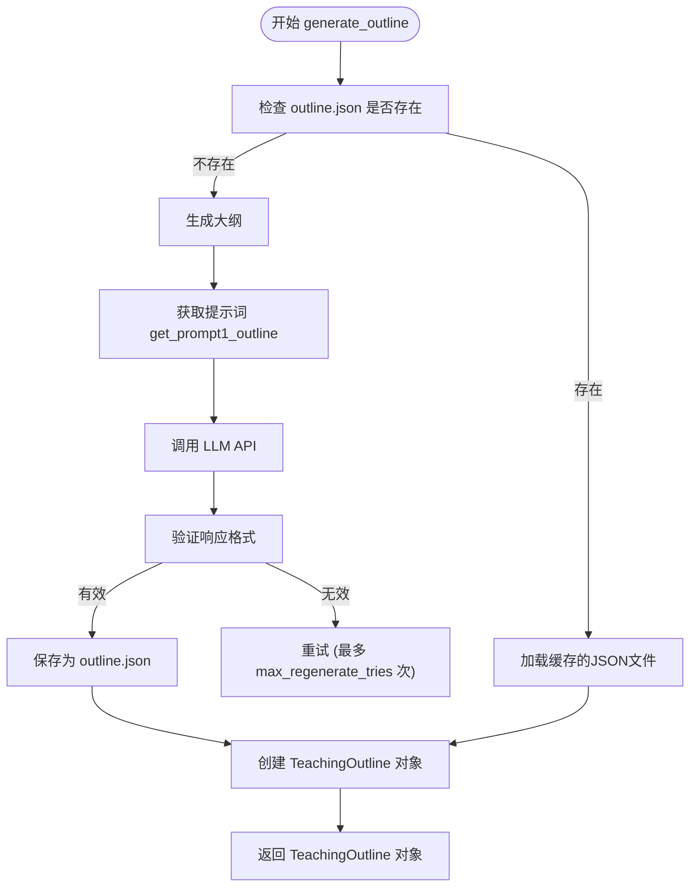

# 大纲生成

<cite>
**本文档引用的文件**   
- [agent.py](file://src/agent.py)
- [api_config.json](file://src/api_config.json)
- [gpt_request.py](file://src/gpt_request.py)
- [utils.py](file://src/utils.py)
</cite>

## 目录
1. [简介](#简介)
2. [大纲生成流程](#大纲生成流程)
3. [TeachingOutline数据结构](#teachingoutline数据结构)
4. [外部参考图像的集成](#外部参考图像的集成)
5. [API配置与LLM调用](#api配置与llm调用)
6. [缓存机制与JSON序列化](#缓存机制与json序列化)
7. [错误处理与重试逻辑](#错误处理与重试逻辑)
8. [示例输入与输出](#示例输入与输出)

## 简介

Code2Video项目中的大纲生成功能是整个视频生成流程的第一步，其核心是`TeachingVideoAgent.generate_outline()`方法。该方法负责将用户提供的知识要点（knowledge_point）转化为一个结构化的教学大纲（TeachingOutline），为后续的分镜生成、代码生成和视频渲染提供基础框架。此过程利用大型语言模型（LLM）的强大能力，结合外部参考图像和可配置的API服务，实现智能化、高质量的大纲生成。

**Section sources**
- [agent.py](file://src/agent.py#L138-L188)

## 大纲生成流程

`TeachingVideoAgent.generate_outline()`方法遵循一个清晰的流程来生成教学大纲。首先，它会检查输出目录中是否已存在`outline.json`文件。如果存在，则直接加载缓存的JSON数据，避免重复调用API，提高效率。如果文件不存在，则进入生成流程。

生成流程的核心是向LLM发送一个精心设计的提示词（prompt）。该提示词由`get_prompt1_outline()`函数生成，其中包含了用户输入的知识要点（`knowledge_point`）以及一个可选的参考图像路径。提示词的设计旨在引导LLM生成一个包含主题、目标受众和章节列表的JSON格式响应。

生成的响应经过处理后，会被解析并验证为有效的JSON格式。一旦成功解析，该数据将被序列化并保存为`outline.json`文件，同时被封装成一个`TeachingOutline`对象，供后续步骤使用。



**Diagram sources**
- [agent.py](file://src/agent.py#L138-L188)

**Section sources**
- [agent.py](file://src/agent.py#L138-L188)

## TeachingOutline数据结构

`TeachingOutline`是大纲生成的核心数据结构，它定义了教学大纲的最终形态。该结构由`@dataclass`装饰器定义，包含三个主要属性：

- **topic** (`str`): 一个字符串，表示本次教学的核心主题，通常与输入的`knowledge_point`相同。
- **target_audience** (`str`): 一个字符串，描述该教学大纲的目标受众，例如“初学者”、“高中生”或“数据科学从业者”。
- **sections** (`List[Dict[str, Any]]`): 一个字典列表，每个字典代表大纲中的一个章节。每个章节字典通常包含`id`（章节ID）、`title`（章节标题）等关键信息。

这个数据结构将非结构化的自然语言输入转化为一个结构化的、可编程的对象，使得后续的分镜生成和代码生成步骤能够程序化地遍历和处理每个章节。

**Section sources**
- [agent.py](file://src/agent.py#L27-L32)

## 外部参考图像的集成

为了增强LLM生成大纲的质量和相关性，系统引入了外部参考图像（External Reference Image）的概念。这一功能通过`KNOWLEDGE2PATH`映射实现。

`KNOWLEDGE2PATH`是一个从知识要点到图像文件名的JSON映射。在`TeachingVideoAgent`的初始化过程中，系统会从项目根目录下的`json_files/long_video_ref_mapping.json`文件中加载此映射。当`generate_outline()`方法执行时，它会查询此映射，以确定当前`knowledge_point`是否有关联的参考图像。

如果存在关联图像，系统会构建该图像在`assets/reference/`目录下的完整路径，并将其作为上下文信息传递给`get_prompt1_outline()`函数。这个参考图像路径会被嵌入到发送给LLM的提示词中，从而引导LLM在生成大纲时参考该图像的视觉内容，确保生成的大纲在视觉风格和内容上与参考图像保持一致。

**Section sources**
- [agent.py](file://src/agent.py#L94-L102)
- [agent.py](file://src/agent.py#L147-L151)

## API配置与LLM调用

系统通过`api_config.json`文件实现对不同LLM服务的灵活配置。该文件是一个JSON对象，为每个支持的LLM（如Gemini、GPT-4、Claude等）定义了其API的`base_url`、`api_version`、`api_key`和`model`名称。

`gpt_request.py`模块负责读取此配置文件，并根据配置动态创建API请求函数。例如，`request_gemini_token()`函数会从配置中读取Gemini服务的参数，并使用`openai.AzureOpenAI`客户端来发起请求。

在`TeachingVideoAgent`中，`RunConfig`对象的`api`字段被设置为这些预定义的请求函数之一（如`request_gemini_token`）。当`generate_outline()`方法需要调用LLM时，它会通过`_request_api_and_track_tokens()`方法间接调用这个`api`函数，从而实现对不同LLM服务的无缝切换。

```mermaid
classDiagram
class TeachingVideoAgent {
-cfg RunConfig
+generate_outline() TeachingOutline
}
class RunConfig {
+api Callable
}
class gpt_request {
+request_gemini_token(prompt) tuple
+request_gpt4o_token(prompt) tuple
+request_claude_token(prompt) tuple
}
class api_config_json {
gemini : { base_url, api_version, api_key, model }
gpt4o : { base_url, api_version, api_key, model }
claude : { base_url, api_key }
}
TeachingVideoAgent --> RunConfig : "使用"
RunConfig --> gpt_request : "调用"
gpt_request ..> api_config_json : "读取配置"
```

**Diagram sources**
- [api_config.json](file://src/api_config.json#L1-L40)
- [gpt_request.py](file://src/gpt_request.py#L1-L800)
- [agent.py](file://src/agent.py#L57-L80)

## 缓存机制与JSON序列化

为了提高效率和节省API调用成本，系统实现了强大的缓存机制。`generate_outline()`方法在开始生成前，会首先检查`self.output_dir / "outline.json"`文件是否存在。如果存在，则跳过所有LLM调用和生成步骤，直接从该文件中读取JSON数据并反序列化为`TeachingOutline`对象。

当需要生成新的大纲时，LLM返回的响应（通常是一个包含JSON代码块的字符串）会经过`extract_json_from_markdown()`函数的处理，以提取出纯JSON内容。随后，该JSON数据通过Python的`json`模块被写入`outline.json`文件，实现了持久化缓存。这种机制确保了即使程序中断或需要重新运行，只要大纲已生成，后续执行将非常迅速。

**Section sources**
- [agent.py](file://src/agent.py#L139-L145)
- [agent.py](file://src/agent.py#L174-L175)
- [utils.py](file://src/utils.py#L11-L16)

## 错误处理与重试逻辑

大纲生成过程可能因网络问题或LLM返回格式错误而失败。为此，系统实现了稳健的错误处理和重试机制。

该机制由`max_regenerate_tries`参数控制，该参数在`RunConfig`中定义，默认值为10。在`generate_outline()`方法中，有一个`for attempt in range(1, self.max_regenerate_tries + 1):`循环。在每次尝试中，系统会：
1.  调用LLM API。
2.  检查API响应是否为`None`（表示调用失败），如果是，则记录错误并进入下一次尝试。
3.  尝试从响应中提取文本内容。
4.  尝试将提取的文本解析为JSON对象。

如果在任何一步骤中失败（例如，`json.loads()`抛出`JSONDecodeError`），系统会打印一条警告信息，并继续下一次尝试。只有当所有重试次数都用尽后，系统才会抛出`ValueError`异常，终止流程。这种设计极大地提高了系统的鲁棒性。

**Section sources**
- [agent.py](file://src/agent.py#L156-L180)
- [agent.py](file://src/agent.py#L51-L52)

## 示例输入与输出

以下是一个简单的示例，展示从知识要点到教学大纲的完整转换过程。

**输入 (知识要点):**
```text
勾股定理
```

**预期输出 (TeachingOutline 对象的JSON表示):**
```json
{
  "topic": "勾股定理",
  "target_audience": "初中数学学生",
  "sections": [
    {
      "id": "introduction",
      "title": "引言：什么是勾股定理？"
    },
    {
      "id": "proof",
      "title": "证明：勾股定理的几种证明方法"
    },
    {
      "id": "application",
      "title": "应用：勾股定理在生活中的实际应用"
    }
  ]
}
```

在此示例中，LLM接收到“勾股定理”这一知识要点后，生成了一个包含主题、目标受众和三个逻辑章节（引言、证明、应用）的结构化大纲。这个大纲随后将被`TeachingVideoAgent`用于生成详细的分镜脚本。

**Section sources**
- [agent.py](file://src/agent.py#L182-L186)