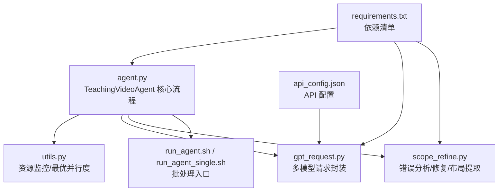
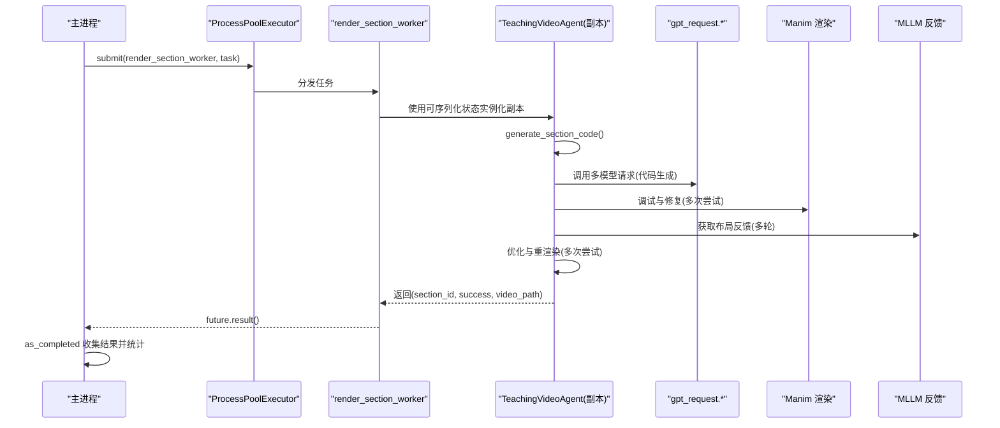
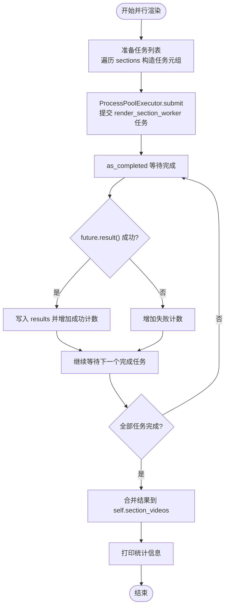
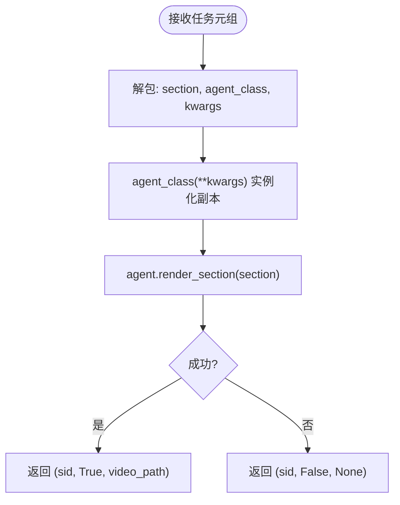
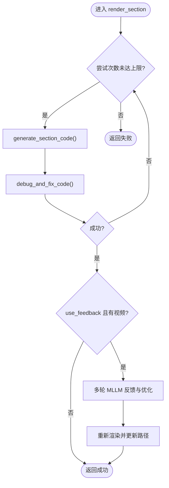
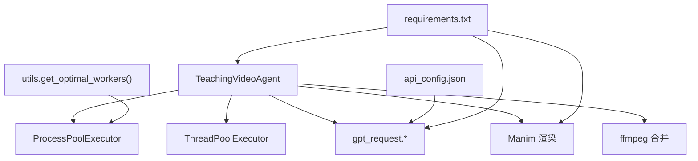

# 并行视频渲染

<cite>
**本文引用的文件**
- [agent.py](file://src/agent.py)
- [utils.py](file://src/utils.py)
- [gpt_request.py](file://src/gpt_request.py)
- [scope_refine.py](file://src/scope_refine.py)
- [run_agent.sh](file://src/run_agent.sh)
- [run_agent_single.sh](file://src/run_agent_single.sh)
- [requirements.txt](file://src/requirements.txt)
- [api_config.json](file://src/api_config.json)
</cite>

## 目录
1. [简介](#简介)
2. [项目结构](#项目结构)
3. [核心组件](#核心组件)
4. [架构总览](#架构总览)
5. [详细组件分析](#详细组件分析)
6. [依赖分析](#依赖分析)
7. [性能考量](#性能考量)
8. [故障排查指南](#故障排查指南)
9. [结论](#结论)
10. [附录](#附录)

## 简介
本文件聚焦于并行视频渲染能力，解释 TeachingVideoAgent.render_all_sections() 如何通过 Python 的 ProcessPoolExecutor 实现“真正的并行化”，并给出工作流、资源影响、性能对比与实践建议。文档同时解析 max_workers 参数对 CPU 与内存的影响，以及任务提交与结果收集的实现细节。

## 项目结构
该仓库采用模块化设计，围绕“教学视频生成流水线”组织代码：
- agent.py：定义 TeachingVideoAgent 及其渲染全流程（大纲生成、故事板、代码生成、渲染、反馈与优化、合并）
- utils.py：工具函数（资源监控、最优并行度、运行命令等）
- gpt_request.py：多模型 API 请求封装（含重试与令牌用量统计）
- scope_refine.py：错误分析与智能修复、网格布局提取与修改
- run_agent.sh/run_agent_single.sh：批处理与单主题运行脚本
- requirements.txt：依赖清单
- api_config.json：API 配置

图表来源
- [agent.py](file://src/agent.py#L1-L120)
- [utils.py](file://src/utils.py#L53-L71)
- [gpt_request.py](file://src/gpt_request.py#L1-L120)
- [scope_refine.py](file://src/scope_refine.py#L1-L60)
- [run_agent.sh](file://src/run_agent.sh#L1-L40)
- [run_agent_single.sh](file://src/run_agent_single.sh#L1-L49)
- [requirements.txt](file://src/requirements.txt#L1-L60)
- [api_config.json](file://src/api_config.json#L1-L40)

章节来源
- [agent.py](file://src/agent.py#L1-L120)
- [utils.py](file://src/utils.py#L53-L71)
- [gpt_request.py](file://src/gpt_request.py#L1-L120)
- [scope_refine.py](file://src/scope_refine.py#L1-L60)
- [run_agent.sh](file://src/run_agent.sh#L1-L40)
- [run_agent_single.sh](file://src/run_agent_single.sh#L1-L49)
- [requirements.txt](file://src/requirements.txt#L1-L60)
- [api_config.json](file://src/api_config.json#L1-L40)

## 核心组件
- TeachingVideoAgent：负责从“主题”到“完整视频”的端到端流程，包括 outline、storyboard、代码生成、渲染、MLLM 反馈与优化、最终合并。
- render_all_sections(max_workers)：并行渲染所有分段的核心方法，使用 ProcessPoolExecutor 提交任务并在 as_completed 中收集结果。
- render_section_worker(section_data)：每个子进程中的工作器，负责实例化新的 TeachingVideoAgent 副本并执行 render_section。
- render_section(section)：单个分段的完整渲染流程（含多次尝试、调试修复、MLLM 反馈与优化）。
- utils.get_optimal_workers()：基于 CPU 核心数自适应计算最优并行进程数，兼顾内存压力。
- gpt_request.*：封装多模型请求与重试，支持令牌用量统计，贯穿代码生成与反馈阶段。

章节来源
- [agent.py](file://src/agent.py#L518-L666)
- [agent.py](file://src/agent.py#L582-L595)
- [agent.py](file://src/agent.py#L527-L577)
- [utils.py](file://src/utils.py#L53-L71)
- [gpt_request.py](file://src/gpt_request.py#L1-L120)

## 架构总览
并行渲染的总体流程如下：
- 主进程将每个 Section 封装为任务元组（section, agent_class, serializable_state），提交给 ProcessPoolExecutor
- 子进程接收任务后，反序列化状态并实例化新的 TeachingVideoAgent 副本
- 新副本调用 render_section 完成该 Section 的全流程（代码生成、调试修复、MLLM 反馈与优化）
- 主进程通过 as_completed 顺序获取已完成任务的结果，汇总成功/失败计数并更新全局结果字典

图表来源
- [agent.py](file://src/agent.py#L596-L666)
- [agent.py](file://src/agent.py#L582-L595)
- [agent.py](file://src/agent.py#L527-L577)
- [gpt_request.py](file://src/gpt_request.py#L1-L120)

## 详细组件分析

### render_all_sections 并行渲染
- 任务准备：遍历 self.sections，构造 (section, self.__class__, self.get_serializable_state()) 作为任务数据
- 执行策略：使用 ProcessPoolExecutor(max_workers)，逐个 executor.submit，记录 future 到 section_id 的映射
- 结果收集：遍历 as_completed(future_to_section)，按序取 future.result(timeout=300)，更新 results 字典
- 统计输出：打印成功/失败数量与成功率，最终合并到 self.section_videos

图表来源
- [agent.py](file://src/agent.py#L596-L666)

章节来源
- [agent.py](file://src/agent.py#L596-L666)

### render_section_worker 工作器
- 接收任务元组 (section, agent_class, kwargs)
- 使用 agent_class(**kwargs) 实例化新的 TeachingVideoAgent 副本
- 调用 agent.render_section(section)，返回 (section_id, success, video_path)

图表来源
- [agent.py](file://src/agent.py#L582-L595)

章节来源
- [agent.py](file://src/agent.py#L582-L595)

### render_section 渲染流程
- 多次尝试生成代码与调试修复，直至成功或达到最大尝试次数
- 若启用 MLLM 反馈，则循环多轮，基于布局反馈优化代码并重新渲染
- 最终将成功视频路径写入 agent.section_videos

图表来源
- [agent.py](file://src/agent.py#L527-L577)

章节来源
- [agent.py](file://src/agent.py#L527-L577)

### 代码生成与调试修复
- 代码生成：调用 gpt_request.* 生成 Manim 代码，支持多种模型与重试
- 调试修复：调用 Manim 渲染，捕获错误并通过 ScopeRefineFixer 进行智能修复，必要时回退到完整重写
- 令牌用量：在 API 调用中自动累加 prompt/completion/total tokens

章节来源
- [agent.py](file://src/agent.py#L115-L133)
- [gpt_request.py](file://src/gpt_request.py#L1-L120)
- [scope_refine.py](file://src/scope_refine.py#L250-L573)

### MLLM 反馈与优化
- 布局反馈：提取代码中的网格位置信息，生成表格供 MLLM 分析
- 反馈解析：支持 JSON 与关键词解析，提取问题与解决方案
- 优化策略：基于反馈生成新代码并再次调试修复，最多尝试若干轮

章节来源
- [agent.py](file://src/agent.py#L402-L460)
- [scope_refine.py](file://src/scope_refine.py#L683-L751)
- [scope_refine.py](file://src/scope_refine.py#L753-L803)

### 合并视频
- 生成 video_list.txt，使用 ffmpeg 拼接所有分段视频为最终 MP4

章节来源
- [agent.py](file://src/agent.py#L667-L702)

## 依赖分析
- 并行执行器：ProcessPoolExecutor（跨进程）、ThreadPoolExecutor（单进程内并行生成代码）
- 外部依赖：openai、google-genai、manim、psutil、moviepy 等
- API 配置：api_config.json 提供各模型的 base_url、api_version、api_key、model

图表来源
- [agent.py](file://src/agent.py#L518-L666)
- [utils.py](file://src/utils.py#L53-L71)
- [gpt_request.py](file://src/gpt_request.py#L1-L120)
- [api_config.json](file://src/api_config.json#L1-L40)
- [requirements.txt](file://src/requirements.txt#L1-L60)

章节来源
- [agent.py](file://src/agent.py#L518-L666)
- [utils.py](file://src/utils.py#L53-L71)
- [gpt_request.py](file://src/gpt_request.py#L1-L120)
- [api_config.json](file://src/api_config.json#L1-L40)
- [requirements.txt](file://src/requirements.txt#L1-L60)

## 性能考量
- 并行度与 CPU/内存
  - max_workers 决定同时运行的子进程数，直接影响 CPU 并发与内存占用峰值
  - utils.get_optimal_workers() 建议：CPU 核心数减一，若核心数超过阈值则限制在一定上限，避免内存溢出
  - 单个进程内包含 Manim 渲染与 API 请求，属于 CPU 密集型与 I/O 密集混合负载
- 与单线程渲染的对比
  - 单线程：串行处理，吞吐低但资源占用稳定
  - 多进程并行：显著缩短总处理时间，但需注意系统资源上限与进程间调度开销
- 任务提交与结果收集
  - executor.submit：异步提交任务，返回 Future
  - as_completed：按完成顺序获取结果，适合长尾任务快速回收
  - 超时控制：future.result(timeout=300) 防止阻塞导致的资源泄漏

章节来源
- [agent.py](file://src/agent.py#L596-L666)
- [utils.py](file://src/utils.py#L53-L71)

## 故障排查指南
- 常见异常与定位
  - API 请求失败：检查 api_config.json 的密钥与 base_url，确认网络连通性
  - Manim 渲染超时：增大超时或减少复杂度，检查场景代码语法与依赖
  - MLLM 反馈解析失败：确认视频路径存在与大小限制，检查提示词格式
- 资源监控
  - utils.monitor_system_resources() 输出 CPU 与内存使用率，高占用时应降低 max_workers
- 日志与统计
  - render_all_sections 打印成功/失败计数与成功率，便于快速评估整体健康度

章节来源
- [gpt_request.py](file://src/gpt_request.py#L1-L120)
- [scope_refine.py](file://src/scope_refine.py#L250-L573)
- [utils.py](file://src/utils.py#L73-L89)
- [agent.py](file://src/agent.py#L596-L666)

## 结论
TeachingVideoAgent.render_all_sections() 通过 ProcessPoolExecutor 将“每个 Section 的完整渲染流程”拆分为独立进程任务，配合 render_section_worker 在子进程中实例化新的 TeachingVideoAgent 副本，有效避免状态共享带来的竞态与冲突。借助 as_completed 的结果收集机制与合理的 max_workers 设置，系统在 CPU 与内存之间取得平衡，显著提升批量处理效率。结合 utils.get_optimal_workers() 与资源监控，用户可根据硬件配置动态调整并行度，获得更优的吞吐与稳定性。

## 附录
- 建议的并行度选择
  - 低配机器：max_workers ≈ CPU 核心数 - 2 或更低
  - 中配机器：max_workers ≈ CPU 核心数 - 1
  - 高配机器：max_workers ≤ 16（避免内存压力）
- 运行脚本
  - 批量模式：run_agent.sh 支持并行组数与知识点列表
  - 单主题模式：run_agent_single.sh 支持默认主题与参数覆盖

章节来源
- [utils.py](file://src/utils.py#L53-L71)
- [run_agent.sh](file://src/run_agent.sh#L1-L40)
- [run_agent_single.sh](file://src/run_agent_single.sh#L1-L49)