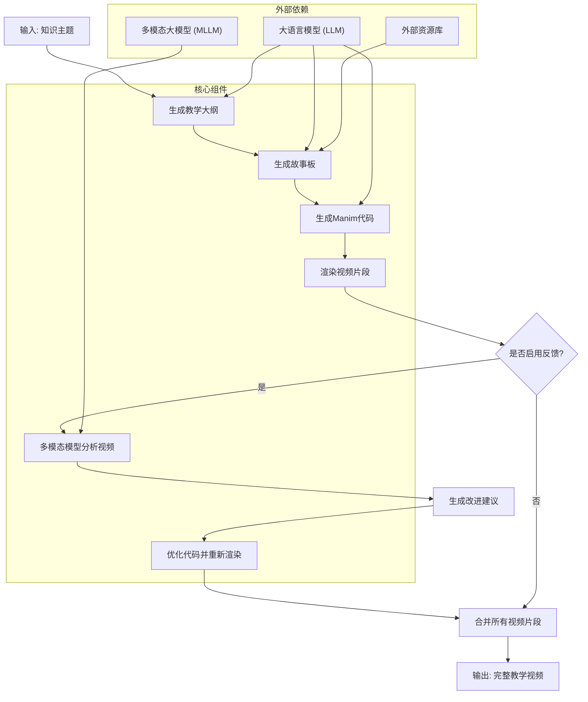
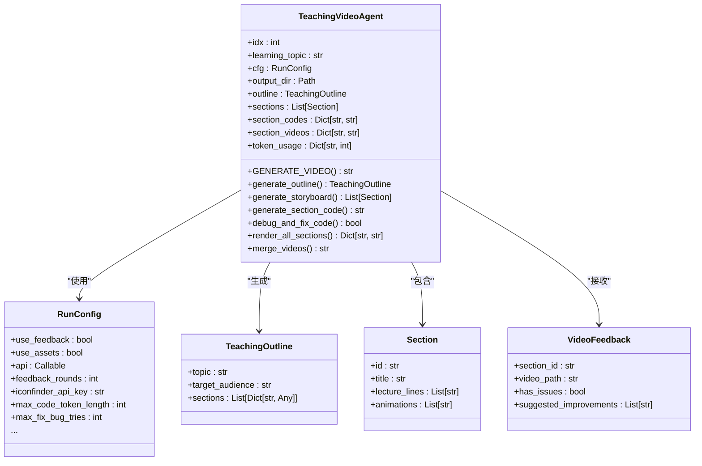
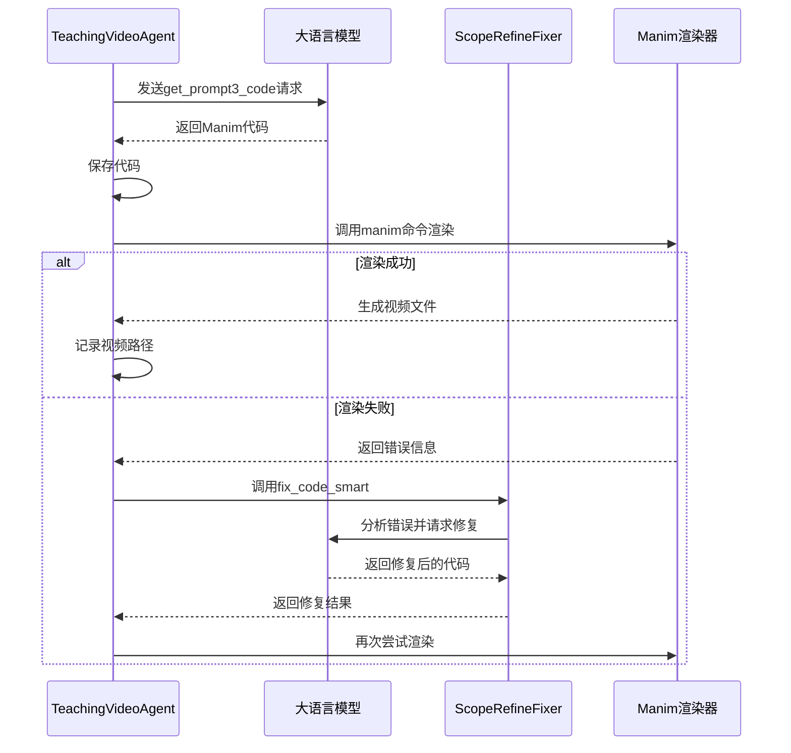
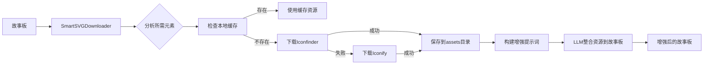
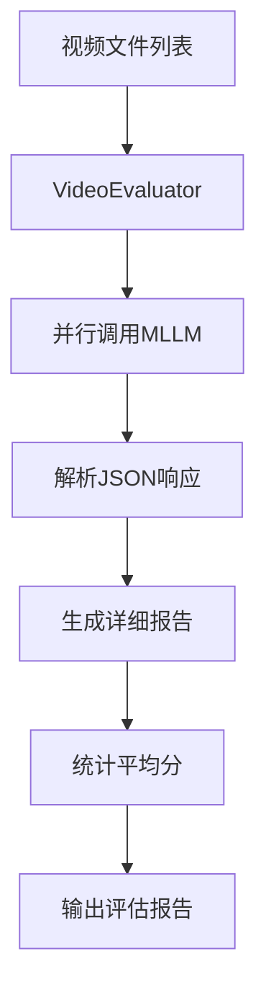
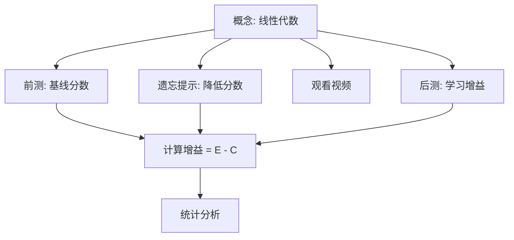

# 提示词工程

<cite>
**本文档中引用的文件**   
- [prompts.py](file://src/prompts.py)
- [agent.py](file://src/agent.py)
- [gpt_request.py](file://src/gpt_request.py)
- [scope_refine.py](file://src/scope_refine.py)
- [utils.py](file://src/utils.py)
- [external_assets.py](file://src/external_assets.py)
- [api_config.json](file://src/api_config.json)
- [eval_AES.py](file://src/eval_AES.py)
- [eval_TQ.py](file://src/eval_TQ.py)
- [run_agent.sh](file://src/run_agent.sh)
- [run_agent_single.sh](file://src/run_agent_single.sh)
</cite>

## 目录
1. [项目概述](#项目概述)
2. [核心架构与工作流程](#核心架构与工作流程)
3. [提示词系统设计](#提示词系统设计)
4. [智能体核心组件分析](#智能体核心组件分析)
5. [外部资源集成](#外部资源集成)
6. [API请求与配置管理](#api请求与配置管理)
7. [视频评估系统](#视频评估系统)
8. [系统配置与启动脚本](#系统配置与启动脚本)
9. [性能与资源管理](#性能与资源管理)

## 项目概述

本项目是一个基于大模型的自动化教学视频生成系统，其核心目标是通过多阶段的提示词工程，将一个知识主题（Knowledge Point）自动转化为高质量的Manim动画教学视频。系统采用模块化设计，集成了提示词生成、大纲规划、故事板设计、代码生成、视频渲染、多模态反馈优化和效果评估等完整流程。整个系统以`TeachingVideoAgent`为核心，通过精心设计的提示词（Prompts）引导大模型（LLM/MLLM）完成从内容设计到代码实现的复杂任务，并利用多轮反馈机制持续优化视频质量。

**Section sources**
- [agent.py](file://src/agent.py#L57-L800)
- [prompts.py](file://src/prompts.py#L6-L141)

## 核心架构与工作流程

该系统遵循一个清晰的流水线式工作流程，从知识主题输入开始，经过多个阶段的处理，最终输出完整的教学视频。其核心架构由一个主智能体（`TeachingVideoAgent`）驱动，该智能体协调调用多个子系统和工具。



**Diagram sources**
- [agent.py](file://src/agent.py#L703-L719)
- [prompts.py](file://src/prompts.py#L6-L141)

## 提示词系统设计

系统的灵魂在于其精心设计的提示词（Prompts）模块。该模块定义了与大模型交互的“语言”，通过结构化的指令引导模型完成特定任务。每个提示词都针对一个明确的阶段，确保了任务的原子性和可追溯性。

### 核心提示词功能

| 提示词函数 | 输入参数 | 输出目标 | 主要用途 |
| :--- | :--- | :--- | :--- |
| `get_prompt1_outline` | 主题, 受众 | JSON格式的教学大纲 | 规划课程的整体结构和学习目标 |
| `get_prompt2_storyboard` | 大纲, 章节 | JSON格式的故事板 | 设计每个章节的讲解内容和视觉元素 |
| `get_prompt3_code` | 章节信息, 基础类 | 可运行的Manim代码 | 将视觉设计转化为具体的动画代码 |
| `get_prompt4_feedback` | 章节, 视频路径 | JSON格式的评估反馈 | 利用MLLM分析视频质量并提出改进建议 |
| `get_prompt5_debug` | 错误信息, 原始代码 | 修复后的代码 | 调试和修复生成的代码中的错误 |
| `get_prompt6_assets` | 故事板 | JSON格式的资源建议 | 为故事板中的元素推荐合适的外部图片或图标 |

**Section sources**
- [prompts.py](file://src/prompts.py#L6-L141)

## 智能体核心组件分析

`TeachingVideoAgent`类是整个系统的执行引擎，它封装了状态、配置和所有核心方法。其设计体现了面向对象的封装思想和流程控制的严谨性。

### 核心数据结构

系统使用了多个`@dataclass`来定义关键的数据结构，保证了数据的一致性和可读性。



**Diagram sources**
- [agent.py](file://src/agent.py#L19-L55)
- [agent.py](file://src/agent.py#L57-L800)

### 代码生成与调试流程

代码生成和调试是系统中最关键的环节，它确保了从文本描述到可执行代码的可靠转换。该流程采用了多阶段的容错和优化策略。



**Diagram sources**
- [agent.py](file://src/agent.py#L295-L400)
- [scope_refine.py](file://src/scope_refine.py#L250-L572)

## 外部资源集成

为了提升视频的视觉吸引力，系统集成了外部资源（如图标、图片）的自动下载和整合功能。这通过`external_assets.py`模块实现，它利用`Iconfinder`和`Iconify`等API来获取高质量的SVG/PNG资源。



**Diagram sources**
- [external_assets.py](file://src/external_assets.py#L10-L220)

## API请求与配置管理

系统通过`gpt_request.py`模块统一管理对不同大模型API的调用。该模块提供了重试机制、指数退避和日志追踪，确保了网络请求的稳定性和可调试性。API的配置信息（如URL、密钥、模型名称）被集中存储在`api_config.json`文件中，实现了配置与代码的分离。

```mermaid
classDiagram
class gpt_request {
+request_gemini(prompt, video_path) Response
+request_claude(prompt) Response
+request_gpt4o(prompt) Response
+request_gemini_token(prompt, video_path) tuple[Response, Usage]
+cfg(svc, key) str
+generate_log_id() str
}
class api_config {
+gemini : {base_url, api_version, api_key, model}
+gpt41 : {base_url, api_version, api_key, model}
+claude : {base_url, api_key}
+iconfinder : {api_key}
}
gpt_request --> api_config : "读取配置"
```

**Diagram sources**
- [gpt_request.py](file://src/gpt_request.py#L1-L800)
- [api_config.json](file://src/api_config.json#L1-L40)

## 视频评估系统

项目提供了两个独立的评估脚本，用于量化生成视频的教学效果。

### AES评估系统

`eval_AES.py`脚本使用多模态大模型（MLLM）对视频进行多维度的美学和教学性评估，包括元素布局、吸引力、逻辑流、准确深度和视觉一致性。



**Diagram sources**
- [eval_AES.py](file://src/eval_AES.py#L1-L353)

### TQ评估系统

`eval_TQ.py`脚本采用“选择性知识遗忘”（Selective Knowledge Unlearning, SKU）的评估范式。它通过设计前测、遗忘后测和观看视频后测，来科学地衡量视频带来的学习增益。



**Diagram sources**
- [eval_TQ.py](file://src/eval_TQ.py#L1-L366)

## 系统配置与启动脚本

系统通过Shell脚本提供便捷的启动方式。`run_agent.sh`用于批量处理多个知识主题，而`run_agent_single.sh`则用于单个主题的快速测试和调试。这些脚本将复杂的Python命令行参数封装起来，简化了用户的操作。

**Section sources**
- [run_agent.sh](file://src/run_agent.sh#L1-L40)
- [run_agent_single.sh](file://src/run_agent_single.sh#L1-L49)

## 性能与资源管理

系统在`utils.py`中包含了对系统资源的监控和优化。`get_optimal_workers()`函数会根据CPU核心数自动计算最优的并行进程数，通常设置为CPU核心数减一，以避免系统过载。`monitor_system_resources()`函数则可以实时监控CPU和内存的使用情况，为大规模渲染任务提供保障。

**Section sources**
- [utils.py](file://src/utils.py#L53-L88)