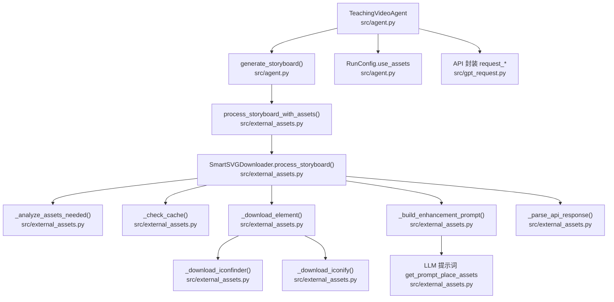
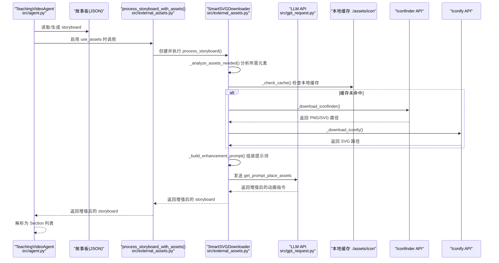
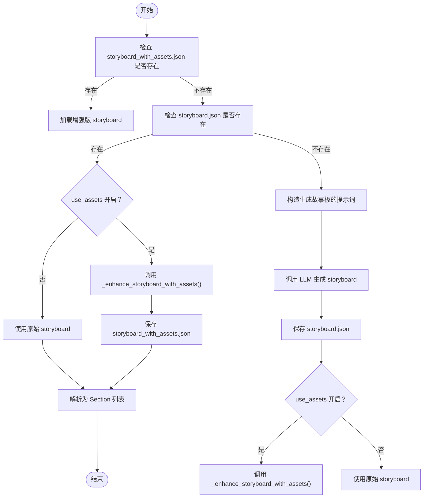
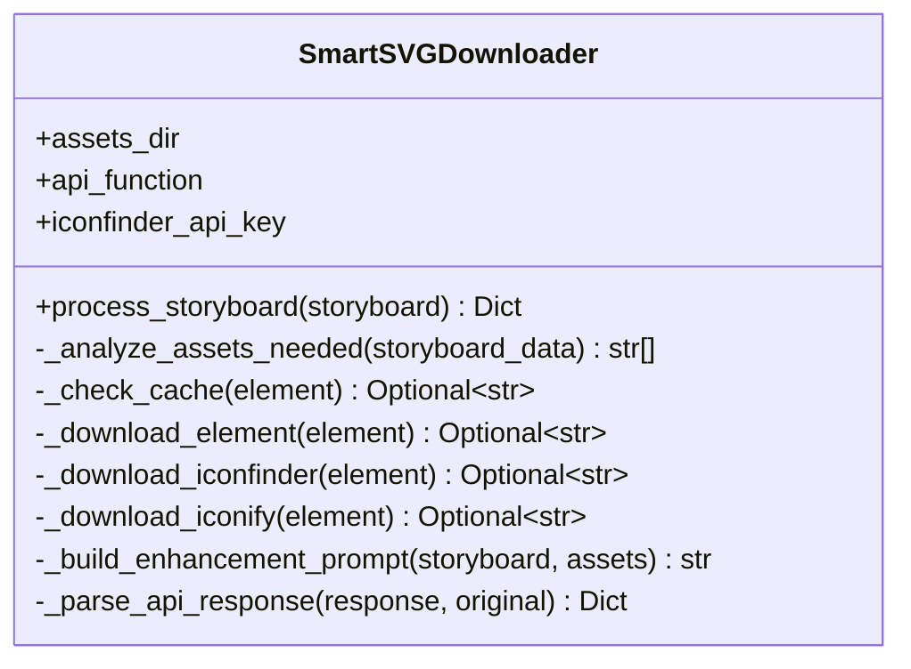
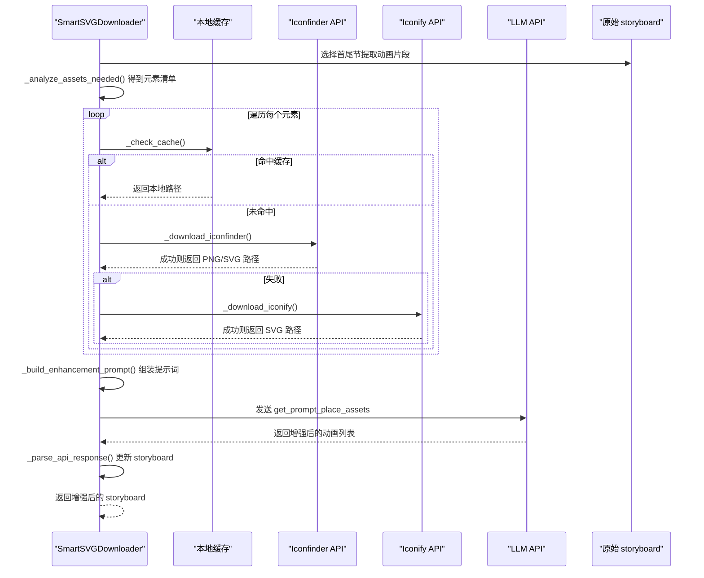
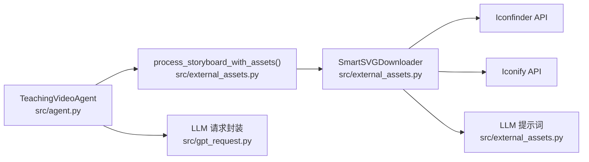

# 智能故事板设计

<cite>
**本文引用的文件**
- [agent.py](file://src/agent.py)
- [external_assets.py](file://src/external_assets.py)
- [gpt_request.py](file://src/gpt_request.py)
</cite>

## 目录
1. [简介](#简介)
2. [项目结构](#项目结构)
3. [核心组件](#核心组件)
4. [架构总览](#架构总览)
5. [详细组件分析](#详细组件分析)
6. [依赖关系分析](#依赖关系分析)
7. [性能考量](#性能考量)
8. [故障排查指南](#故障排查指南)
9. [结论](#结论)

## 简介
本文件系统性阐述“智能故事板设计”能力，覆盖从教学大纲生成到故事板、再到外部资源智能下载与注入的完整流程。重点包括：
- TeachingVideoAgent.generate_storyboard() 如何基于已生成的教学大纲，调用 LLM 生成包含动画指令的详细故事板（Section 对象列表）
- external_assets.py 中 SmartSVGDownloader 类如何实现资源的智能分析与下载
- 其工作流程：1) 分析故事板中需要的视觉元素；2) 优先检查本地缓存；3) 若未命中则通过 Iconfinder 或 Iconify API 下载；4) 最后通过 LLM 提示词将下载的资源路径智能注入到故事板的动画指令中
- process_storyboard_with_assets 函数如何协调上述步骤
- use_assets 配置项的开关控制及其对最终视频视觉丰富度的影响

## 项目结构
本功能涉及三个关键文件：
- src/agent.py：教学视频 Agent 的主流程，负责生成教学大纲与故事板，并在启用 use_assets 时调用外部资产增强流程
- src/external_assets.py：外部资源下载与注入逻辑，提供 SmartSVGDownloader 类与 process_storyboard_with_assets 协调函数
- src/gpt_request.py：统一的 LLM 请求封装，为 Agent 和外部资产模块提供 API 调用能力

图表来源
- [agent.py](file://src/agent.py#L189-L271)
- [external_assets.py](file://src/external_assets.py#L16-L190)
- [gpt_request.py](file://src/gpt_request.py#L420-L479)

章节来源
- [agent.py](file://src/agent.py#L189-L271)
- [external_assets.py](file://src/external_assets.py#L16-L190)
- [gpt_request.py](file://src/gpt_request.py#L420-L479)

## 核心组件
- TeachingVideoAgent.generate_storyboard()
  - 基于教学大纲生成故事板；若启用 use_assets，则进一步调用增强流程
  - 支持从缓存加载已有 storyboard 或 storyboard_with_assets
- SmartSVGDownloader
  - 负责分析所需资源、检查本地缓存、下载资源、构建注入提示词、解析 LLM 返回并更新动画指令
- process_storyboard_with_assets
  - 外部资产增强的入口函数，创建 SmartSVGDownloader 并执行完整流程

章节来源
- [agent.py](file://src/agent.py#L189-L271)
- [external_assets.py](file://src/external_assets.py#L16-L190)

## 架构总览
下图展示了“智能故事板设计”的端到端流程，从教学大纲到增强后的动画指令。

图表来源
- [agent.py](file://src/agent.py#L189-L271)
- [external_assets.py](file://src/external_assets.py#L16-L190)
- [gpt_request.py](file://src/gpt_request.py#L420-L479)

## 详细组件分析

### TeachingVideoAgent.generate_storyboard() 流程
- 输入：已生成的教学大纲 TeachingOutline
- 输出：Section 对象列表（包含 lecture_lines 与 animations）
- 关键行为：
  - 优先尝试加载 storyboard_with_assets.json 或 storyboard.json
  - 若未生成且启用 use_assets，则调用 _enhance_storyboard_with_assets()
  - 将增强后的 storyboard 写入 storyboard_with_assets.json
  - 解析为 Section 列表返回

图表来源
- [agent.py](file://src/agent.py#L189-L271)

章节来源
- [agent.py](file://src/agent.py#L189-L271)

### SmartSVGDownloader 工作流与数据流
- 资源分析：从故事板中抽取首尾若干节的动画片段，调用 _analyze_assets_needed() 获取所需元素清单
- 缓存检查：_check_cache() 优先返回本地已存在的 PNG/SVG 文件
- 下载策略：若缓存未命中，先尝试 Iconfinder，再回退 Iconify；成功后写入 assets 目录
- 注入提示词：_build_enhancement_prompt() 将可用资源映射与目标动画结构拼接为提示词
- LLM 解析：_parse_api_response() 解析 LLM 返回的 JSON 结构，按 section_index 更新 animations 字段
- 最终返回：增强后的 storyboard

图表来源
- [external_assets.py](file://src/external_assets.py#L16-L190)

章节来源
- [external_assets.py](file://src/external_assets.py#L16-L190)

### 资源下载与注入序列

图表来源
- [external_assets.py](file://src/external_assets.py#L16-L190)

章节来源
- [external_assets.py](file://src/external_assets.py#L16-L190)

### use_assets 配置与影响
- 配置位置：RunConfig.use_assets 控制是否启用外部资源增强
- 行为差异：
  - 关闭：generate_storyboard() 直接使用原始 storyboard，不调用外部资产增强
  - 开启：调用 _enhance_storyboard_with_assets()，进而执行 SmartSVGDownloader 的完整流程
- 视觉影响：
  - 开启后，动画指令中会注入资源路径，提升画面表现力与一致性
  - 若网络受限或 API 密钥缺失，可能降级为仅使用缓存或不注入资源

章节来源
- [agent.py](file://src/agent.py#L43-L55)
- [agent.py](file://src/agent.py#L189-L271)

## 依赖关系分析
- TeachingVideoAgent 依赖：
  - 外部资产模块：调用 process_storyboard_with_assets()
  - LLM 请求封装：通过 API 属性统一调用 request_* 方法
- SmartSVGDownloader 依赖：
  - 外部资源 API：Iconfinder 与 Iconify
  - LLM 提示词：get_prompt_download_assets、get_prompt_place_assets
  - 本地缓存目录：assets/icon

图表来源
- [agent.py](file://src/agent.py#L189-L271)
- [external_assets.py](file://src/external_assets.py#L16-L190)
- [gpt_request.py](file://src/gpt_request.py#L420-L479)

章节来源
- [agent.py](file://src/agent.py#L189-L271)
- [external_assets.py](file://src/external_assets.py#L16-L190)
- [gpt_request.py](file://src/gpt_request.py#L420-L479)

## 性能考量
- 资源下载成本：
  - Iconfinder 与 Iconify 均有超时限制，建议在批量场景中合理设置重试与并发
  - 本地缓存命中可显著降低网络开销
- LLM 调用：
  - _analyze_assets_needed() 与 _build_enhancement_prompt() 仅在 use_assets 开启时触发
  - 建议控制提示词长度与最大 token，避免不必要的长文本传输
- I/O 与磁盘：
  - assets/icon 目录需具备写权限；建议定期清理无用资源以减少体积

## 故障排查指南
- 无法生成 storyboard
  - 检查教学大纲是否存在；确认 API 可用且返回格式正确
  - 查看重试次数与错误日志
- use_assets 启用但未注入资源
  - 检查 assets/icon 目录权限与空间
  - 确认 Iconfinder API Key 正确；若失败，Iconify 作为回退仍可能成功
  - 若 LLM 返回 JSON 解析失败，将回退为原始 storyboard
- LLM 调用异常
  - 使用 gpt_request.py 中的 request_* 方法进行独立验证
  - 关注超时与重试策略，必要时调整 max_retries 与超时参数

章节来源
- [agent.py](file://src/agent.py#L189-L271)
- [external_assets.py](file://src/external_assets.py#L16-L190)
- [gpt_request.py](file://src/gpt_request.py#L420-L479)

## 结论
“智能故事板设计”通过 TeachingVideoAgent 与 SmartSVGDownloader 的协同，实现了从教学大纲到富含外部资源的故事板自动化增强。其核心价值在于：
- 自动识别所需视觉元素并优先复用本地缓存，降低外部依赖
- 在可用时通过 Iconfinder/Iconify 下载高质量 SVG/PNG 资源
- 利用 LLM 将资源路径智能注入动画指令，提升最终视频的视觉丰富度
- 通过 use_assets 配置灵活控制增强开关，兼顾性能与效果