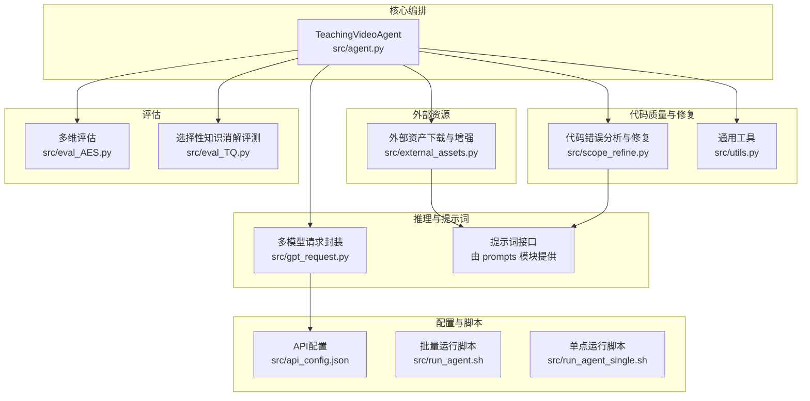
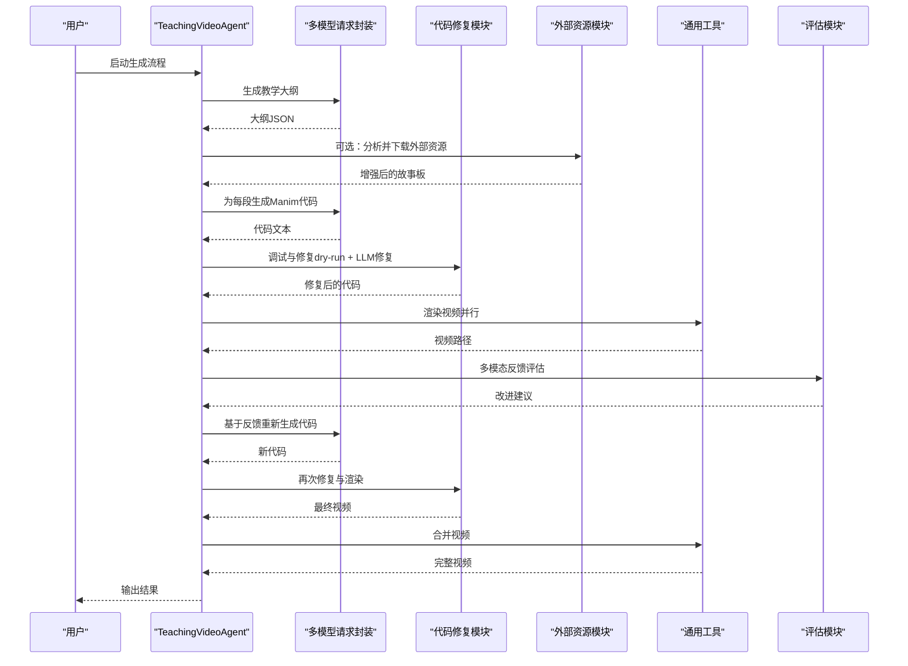
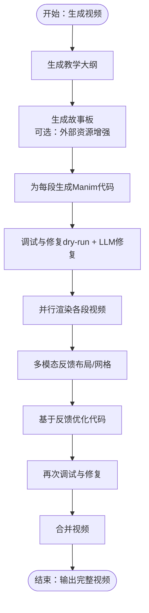
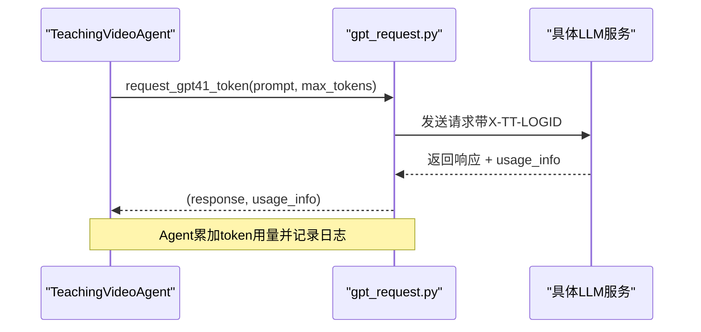
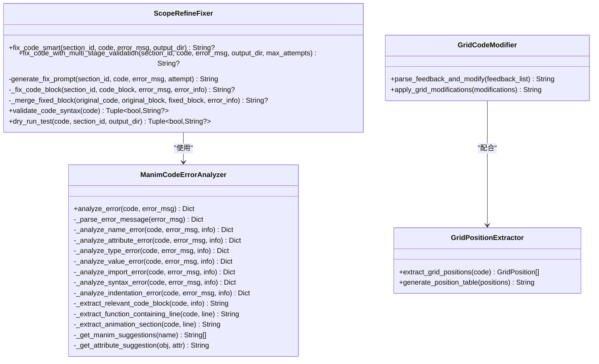
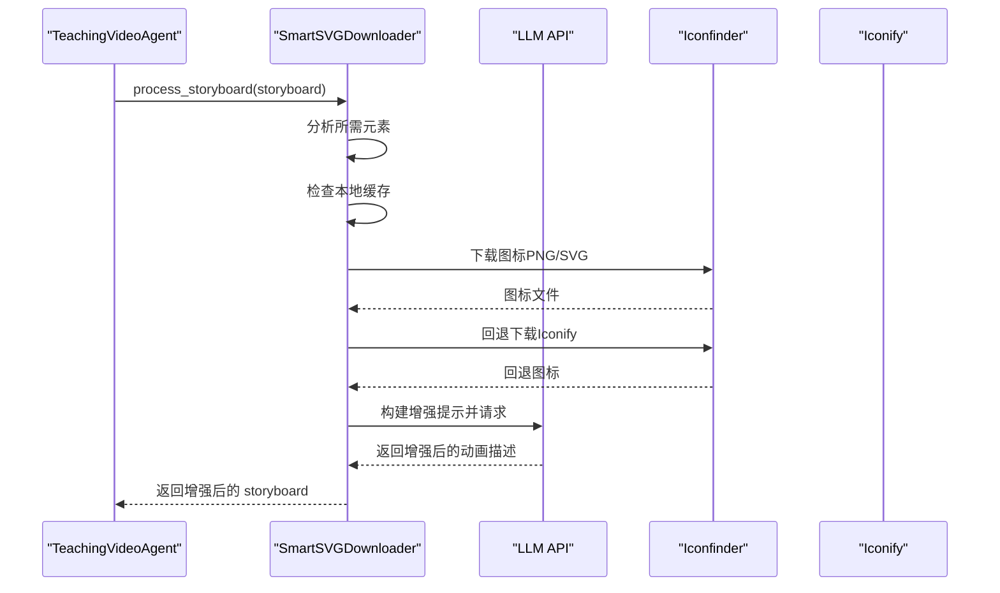
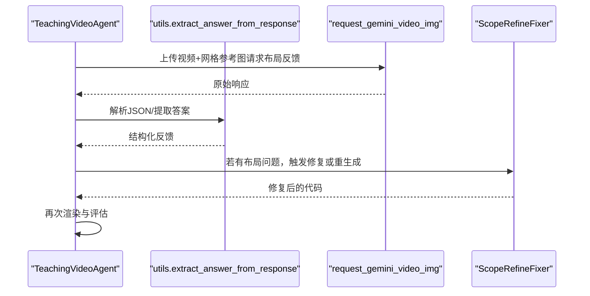
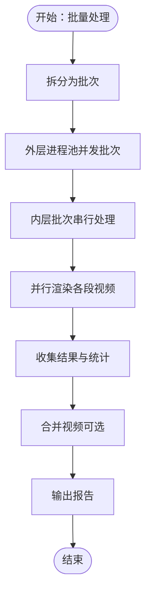
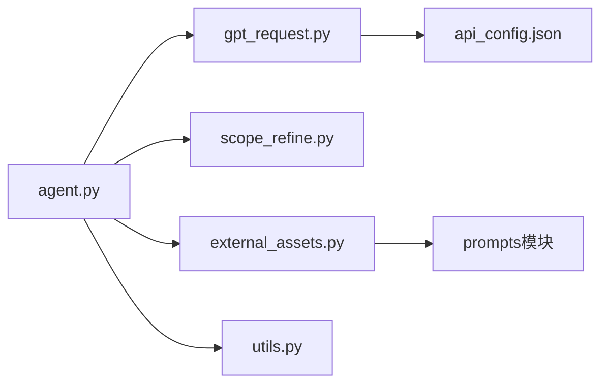

# 核心功能

<cite>
**本文引用的文件**
- [agent.py](file://src/agent.py)
- [gpt_request.py](file://src/gpt_request.py)
- [scope_refine.py](file://src/scope_refine.py)
- [external_assets.py](file://src/external_assets.py)
- [utils.py](file://src/utils.py)
- [eval_AES.py](file://src/eval_AES.py)
- [eval_TQ.py](file://src/eval_TQ.py)
- [run_agent.sh](file://src/run_agent.sh)
- [run_agent_single.sh](file://src/run_agent_single.sh)
- [api_config.json](file://src/api_config.json)
</cite>

## 目录
1. [引言](#引言)
2. [项目结构](#项目结构)
3. [核心组件](#核心组件)
4. [架构总览](#架构总览)
5. [详细组件分析](#详细组件分析)
6. [依赖关系分析](#依赖关系分析)
7. [性能考量](#性能考量)
8. [故障排查指南](#故障排查指南)
9. [结论](#结论)
10. [附录](#附录)

## 引言
本文件系统性阐述 Code2Video 的核心功能模块，围绕“自动化大纲生成、智能故事板设计、Manim 代码生成与调试、多模态反馈优化、并行视频渲染”展开，解释 TeachingVideoAgent 如何协调这些阶段，并通过 gpt_request.py 调用不同 LLM 实现任务分解；scope_refine.py 如何实现 Manim 代码的自动错误检测与修复；external_assets.py 如何集成 Iconfinder 等外部资源服务以丰富视觉表现；并结合实际代码片段路径展示各阶段的数据传递过程（如 TeachingOutline 到 Section 的转换），解释智能反馈循环如何利用 LLM 评估中间产物并驱动迭代优化，讨论并行处理机制如何提升批量生成效率，并给出使用场景示例与性能影响分析。

## 项目结构
- 模块划分清晰：agent.py 作为编排器，gpt_request.py 提供多模型统一请求封装，scope_refine.py 负责代码修复与范围提取，external_assets.py 负责外部资源下载与增强，utils.py 提供通用工具函数，eval_* 提供评估能力。
- 配置集中于 api_config.json，便于切换不同 LLM 与外部服务。
- 运行脚本 run_agent.sh 与 run_agent_single.sh 提供批处理与单知识点运行入口。

图表来源
- [agent.py](file://src/agent.py#L1-L120)
- [gpt_request.py](file://src/gpt_request.py#L1-L120)
- [scope_refine.py](file://src/scope_refine.py#L1-L120)
- [external_assets.py](file://src/external_assets.py#L1-L80)
- [utils.py](file://src/utils.py#L1-L80)
- [eval_AES.py](file://src/eval_AES.py#L1-L60)
- [eval_TQ.py](file://src/eval_TQ.py#L1-L60)
- [api_config.json](file://src/api_config.json#L1-L40)
- [run_agent.sh](file://src/run_agent.sh#L1-L40)
- [run_agent_single.sh](file://src/run_agent_single.sh#L1-L49)

章节来源
- [agent.py](file://src/agent.py#L1-L120)
- [api_config.json](file://src/api_config.json#L1-L40)

## 核心组件
- TeachingVideoAgent：贯穿全流程的编排器，负责大纲生成、故事板生成与增强、代码生成、调试修复、多模态反馈、优化重渲染、合并视频与统计输出。
- 多模型请求封装（gpt_request.py）：统一管理不同 LLM 的访问、重试、指数退避、日志追踪与 token 统计。
- 代码修复与范围提取（scope_refine.py）：基于错误分析与上下文定位，进行局部修复或完整重写，并支持干跑验证。
- 外部资源增强（external_assets.py）：从 Iconfinder/Iconify 等服务下载图标，构建增强提示并回填动画描述。
- 通用工具（utils.py）：JSON 解析、类定义替换、系统资源监控、并行进程数自适应、视频拼接等。
- 评估模块（eval_AES.py、eval_TQ.py）：多维评分与选择性知识消解评测，支撑反馈闭环。

章节来源
- [agent.py](file://src/agent.py#L57-L120)
- [gpt_request.py](file://src/gpt_request.py#L1-L120)
- [scope_refine.py](file://src/scope_refine.py#L1-L120)
- [external_assets.py](file://src/external_assets.py#L1-L80)
- [utils.py](file://src/utils.py#L1-L120)
- [eval_AES.py](file://src/eval_AES.py#L1-L80)
- [eval_TQ.py](file://src/eval_TQ.py#L1-L80)

## 架构总览
TeachingVideoAgent 将教学主题分解为若干阶段：
- 自动化大纲生成：根据主题生成教学大纲（包含目标受众与分段）。
- 智能故事板设计：在大纲基础上生成故事板，可选地增强外部资源。
- Manim 代码生成：为每一段生成可执行的动画代码。
- 调试与修复：本地 dry-run 与 LLM 辅助修复，确保可渲染。
- 多模态反馈优化：以视频+布局参考图进行反馈，提取问题并驱动代码优化。
- 并行视频渲染：多进程并行渲染各段，最终合并为完整视频。

图表来源
- [agent.py](file://src/agent.py#L138-L272)
- [gpt_request.py](file://src/gpt_request.py#L368-L479)
- [scope_refine.py](file://src/scope_refine.py#L356-L573)
- [external_assets.py](file://src/external_assets.py#L17-L111)
- [utils.py](file://src/utils.py#L138-L174)
- [eval_AES.py](file://src/eval_AES.py#L34-L99)

## 详细组件分析

### TeachingVideoAgent 编排与数据流
- 数据结构
  - TeachingOutline：包含主题、目标受众、分段列表。
  - Section：包含段落标识、标题、讲授语句、动画描述。
  - VideoFeedback：记录某段视频的反馈结果（是否存在问题、改进建议、原始响应）。
- 关键流程
  - 自动生成大纲：调用 get_prompt1_outline，解析 JSON，持久化 outline.json。
  - 自动生成故事板：调用 get_prompt2_storyboard，解析 JSON，若启用资源增强则调用 external_assets。
  - 代码生成：调用 get_prompt3_code，解析代码块，替换基类定义，保存为 .py。
  - 调试修复：调用 manim -ql 执行 dry-run，失败时交由 ScopeRefineFixer 分析并修复。
  - 多模态反馈：以视频+网格参考图请求 request_gemini_video_img，解析布局反馈，驱动代码优化。
  - 并行渲染：ProcessPoolExecutor 并行渲染各段，收集成功/失败统计。
  - 合并视频：生成 video_list.txt，调用 ffmpeg 合并。
- 数据传递示例
  - TeachingOutline -> Section：在生成故事板后，将增强后的 sections 转换为 Section 对象列表，用于后续逐段渲染。
  - Section -> 代码：将 Section 传入 get_prompt3_code 生成对应段落的 Manim 代码。
  - 代码 -> 视频：将 .py 文件与 Scene 名称传给 manim 渲染，产出 mp4。
  - 视频 -> 反馈：将视频路径与网格参考图传给 request_gemini_video_img，得到布局建议。
  - 反馈 -> 代码：将建议交给 GridCodeModifier 或重新生成代码，再进入修复与渲染。

图表来源
- [agent.py](file://src/agent.py#L138-L272)
- [agent.py](file://src/agent.py#L295-L355)
- [agent.py](file://src/agent.py#L356-L401)
- [agent.py](file://src/agent.py#L402-L506)
- [agent.py](file://src/agent.py#L527-L666)
- [agent.py](file://src/agent.py#L667-L702)

章节来源
- [agent.py](file://src/agent.py#L138-L272)
- [agent.py](file://src/agent.py#L295-L355)
- [agent.py](file://src/agent.py#L356-L401)
- [agent.py](file://src/agent.py#L402-L506)
- [agent.py](file://src/agent.py#L527-L666)
- [agent.py](file://src/agent.py#L667-L702)

### gpt_request.py：多模型统一请求与重试
- 功能要点
  - 统一配置加载：从 api_config.json 读取各模型的 base_url、api_version、api_key、model。
  - 日志追踪：生成 X-TT-LOGID，便于链路追踪。
  - 多模型封装：request_claude、request_gemini、request_gpt4o、request_o4mini、request_gpt5 等，均支持最大重试次数与指数退避。
  - 多模态支持：request_gemini_with_video、request_gemini_video_img 支持视频+图片输入。
  - Token 统计：多数函数返回 usage_info，便于成本控制与审计。
- 使用场景
  - 大纲生成、故事板生成、代码生成、反馈解析、评估打分等均通过该模块完成。

图表来源
- [gpt_request.py](file://src/gpt_request.py#L1-L120)
- [gpt_request.py](file://src/gpt_request.py#L368-L479)
- [gpt_request.py](file://src/gpt_request.py#L482-L613)
- [gpt_request.py](file://src/gpt_request.py#L616-L740)
- [gpt_request.py](file://src/gpt_request.py#L743-L803)

章节来源
- [gpt_request.py](file://src/gpt_request.py#L1-L120)
- [gpt_request.py](file://src/gpt_request.py#L368-L479)
- [gpt_request.py](file://src/gpt_request.py#L482-L613)
- [gpt_request.py](file://src/gpt_request.py#L616-L740)
- [gpt_request.py](file://src/gpt_request.py#L743-L803)

### scope_refine.py：Manim 代码自动错误检测与修复
- 错误分析器（ManimCodeErrorAnalyzer）
  - 解析错误类型（NameError、AttributeError、TypeError、ValueError、ImportError、SyntaxError、IndentationError）。
  - 提取行号、列号、问题代码、上下文行、相关代码块。
  - 针对常见 Manim 对象与属性提供修复建议。
- 修复器（ScopeRefineFixer）
  - 分类错误与模式匹配，生成修复策略（聚焦修复、全面审查、完整重写）。
  - 多阶段验证：语法校验 -> dry-run 测试 -> 返回修复后的代码。
  - 局部修复优先：根据错误范围提取相关代码块，尝试最小化修改；失败则降级为完整重写。
  - 干跑测试：在临时文件中注入快速退出逻辑，避免长时间渲染。
- 网格位置提取与修改（GridPositionExtractor/GridCodeModifier）
  - 从代码中提取 place_at_grid/place_in_area 的调用位置，生成表格供 MLLM 分析。
  - 基于反馈解析出的行号与新代码，精确替换指定行，保证最小改动。
- 使用场景
  - 在调试阶段自动定位并修复语法、导入、API 不兼容等问题，显著提升生成稳定性。

图表来源
- [scope_refine.py](file://src/scope_refine.py#L13-L216)
- [scope_refine.py](file://src/scope_refine.py#L250-L573)
- [scope_refine.py](file://src/scope_refine.py#L671-L751)
- [scope_refine.py](file://src/scope_refine.py#L753-L803)

章节来源
- [scope_refine.py](file://src/scope_refine.py#L13-L216)
- [scope_refine.py](file://src/scope_refine.py#L250-L573)
- [scope_refine.py](file://src/scope_refine.py#L671-L803)

### external_assets.py：外部资源集成与增强
- 功能要点
  - SmartSVGDownloader：分析故事板所需元素，先查本地缓存，缺失则下载至 assets 目录。
  - 资源下载：优先 Iconfinder，失败则回退 Iconify；支持 PNG/SVG。
  - 增强提示：构建 Available Assets 列表与关键段落动画结构，调用 API 生成增强后的动画描述。
  - 结果解析：从响应中抽取 JSON，更新 storyboard 的对应段落动画列表。
- 使用场景
  - 在生成故事板后，自动下载与标注图标，提升视觉表达与一致性。

图表来源
- [external_assets.py](file://src/external_assets.py#L17-L111)
- [external_assets.py](file://src/external_assets.py#L112-L200)

章节来源
- [external_assets.py](file://src/external_assets.py#L1-L111)
- [external_assets.py](file://src/external_assets.py#L112-L200)

### 多模态反馈优化与智能反馈循环
- 反馈来源
  - request_gemini_video_img：以视频+网格参考图请求布局反馈，解析 JSON 或关键字提取，形成问题与解决方案列表。
- 优化流程
  - 若存在布局问题，将建议交给 GridCodeModifier 或重新生成代码，随后再次调试与渲染，直至稳定。
- 使用场景
  - 通过 MLLM 对中间产物进行评估，驱动迭代优化，提升最终视频质量与教学效果。

图表来源
- [agent.py](file://src/agent.py#L402-L460)
- [utils.py](file://src/utils.py#L19-L29)

章节来源
- [agent.py](file://src/agent.py#L402-L460)
- [utils.py](file://src/utils.py#L19-L29)

### 并行视频渲染与批量处理
- 多进程并行
  - render_all_sections 使用 ProcessPoolExecutor 并行渲染各段，每个子进程独立实例化 TeachingVideoAgent，提交任务并收集结果。
- 批处理策略
  - run_Code2Video 将知识点分批，外层 ProcessPoolExecutor 控制批次并发，内层按批次串行处理，批次间随机延迟避免限流。
- 性能与稳定性
  - 并行度受 CPU 核心数限制，避免内存溢出；同时通过超时与异常捕获保障整体鲁棒性。

图表来源
- [agent.py](file://src/agent.py#L596-L666)
- [agent.py](file://src/agent.py#L722-L800)
- [utils.py](file://src/utils.py#L53-L71)

章节来源
- [agent.py](file://src/agent.py#L596-L666)
- [agent.py](file://src/agent.py#L722-L800)
- [utils.py](file://src/utils.py#L53-L71)

## 依赖关系分析
- 组件耦合
  - TeachingVideoAgent 依赖 gpt_request.py（多模型）、scope_refine.py（修复）、external_assets.py（资源）、utils.py（工具）。
  - gpt_request.py 依赖 api_config.json 提供的配置。
  - external_assets.py 依赖 prompts 模块提供的提示词函数。
- 外部依赖
  - LLM 服务（Azure OpenAI 兼容接口）、Iconfinder/Iconify、manim、ffmpeg。
- 循环依赖
  - 未发现直接循环依赖；模块间通过函数调用与数据传递解耦。

图表来源
- [agent.py](file://src/agent.py#L1-L120)
- [gpt_request.py](file://src/gpt_request.py#L1-L120)
- [external_assets.py](file://src/external_assets.py#L1-L40)
- [api_config.json](file://src/api_config.json#L1-L40)

章节来源
- [agent.py](file://src/agent.py#L1-L120)
- [gpt_request.py](file://src/gpt_request.py#L1-L120)
- [external_assets.py](file://src/external_assets.py#L1-L40)
- [api_config.json](file://src/api_config.json#L1-L40)

## 性能考量
- 代码生成与修复
  - 通过 dry-run 快速失败，减少无效渲染时间；多阶段修复降低反复重试成本。
- 并行渲染
  - 外层批次并行与内层段落并行结合，充分利用 CPU；get_optimal_workers 限制进程数避免内存压力。
- 多模态反馈
  - 视频+图像输入会增加 token 与耗时，建议仅在必要段落使用；可通过 feedback_rounds 控制迭代轮次。
- 外部资源
  - Iconfinder/Iconify 有速率限制，建议合理设置重试与缓存策略；assets 目录本地缓存可显著降低重复下载开销。
- 评估模块
  - eval_AES 与 eval_TQ 支持并行评估，但需注意 API 调用频率与并发度平衡。

[本节为通用指导，不直接分析具体文件]

## 故障排查指南
- API 请求失败
  - 检查 api_config.json 中的 base_url、api_key、model 是否正确；确认网络连通性。
  - 查看 gpt_request.py 的重试与指数退避日志，定位超时或限流问题。
- 代码渲染失败
  - 使用 scope_refine.py 的 dry-run 与修复流程；关注错误类型与建议修复方案。
  - 若多次修复仍失败，考虑降低复杂度或切换更稳定的 LLM。
- 外部资源下载失败
  - 检查 Iconfinder/Iconify 的 API Key；确认网络可用；查看缓存目录权限。
- 并行渲染异常
  - 调整 max_workers 与批次大小；检查 ffmpeg 是否安装；监控系统资源占用。
- 评估结果异常
  - 确认视频路径与知识点映射；检查 eval_AES/eval_TQ 的并发参数与超时设置。

章节来源
- [gpt_request.py](file://src/gpt_request.py#L1-L120)
- [scope_refine.py](file://src/scope_refine.py#L356-L573)
- [external_assets.py](file://src/external_assets.py#L135-L183)
- [agent.py](file://src/agent.py#L596-L666)
- [eval_AES.py](file://src/eval_AES.py#L1-L80)
- [eval_TQ.py](file://src/eval_TQ.py#L1-L80)

## 结论
Code2Video 通过 TeachingVideoAgent 将“大纲-故事板-代码-修复-反馈-渲染-合并”的完整链路自动化，借助 gpt_request.py 的多模型统一接入、scope_refine.py 的智能修复、external_assets.py 的外部资源增强，以及多模态反馈优化，实现了高质量、高稳定性的教学视频生成。并行渲染与批处理机制有效提升了批量生成效率。建议在生产环境中结合资源监控与合理的并发策略，持续优化生成质量与吞吐量。

[本节为总结性内容，不直接分析具体文件]

## 附录
- 使用场景示例
  - 自动化生成数学概念教学视频：输入主题（如“线性变换与矩阵”），自动产出分段动画与最终视频。
  - 多模态反馈优化：对生成的视频进行布局与一致性评估，自动修正网格位置与动画顺序。
  - 批量生成：对多个知识点进行并行处理，快速产出系列课程视频。
- 性能影响分析
  - 代码修复与 dry-run 显著降低无效渲染次数，提高成功率。
  - 并行渲染与批处理在多核环境下收益明显，但需注意内存与 I/O 限制。
  - 外部资源下载与评估模块会引入额外网络与计算开销，应合理配置并发与缓存策略。

[本节为通用指导，不直接分析具体文件]