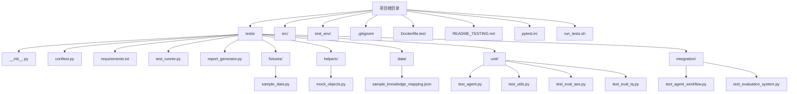
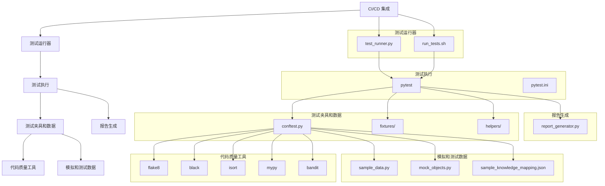
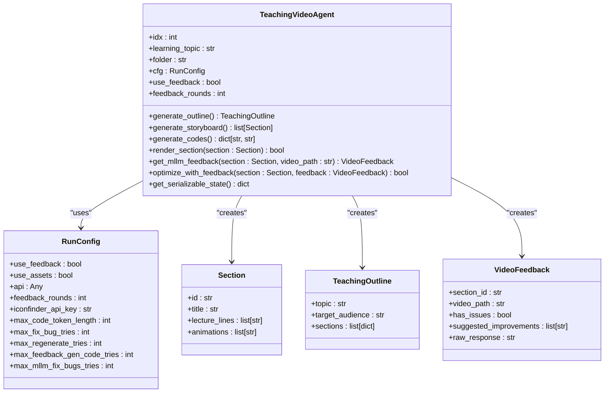
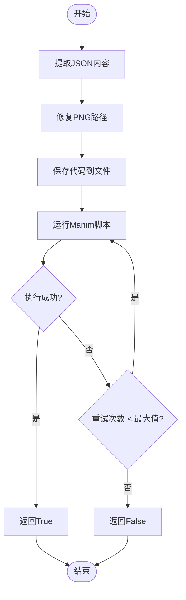
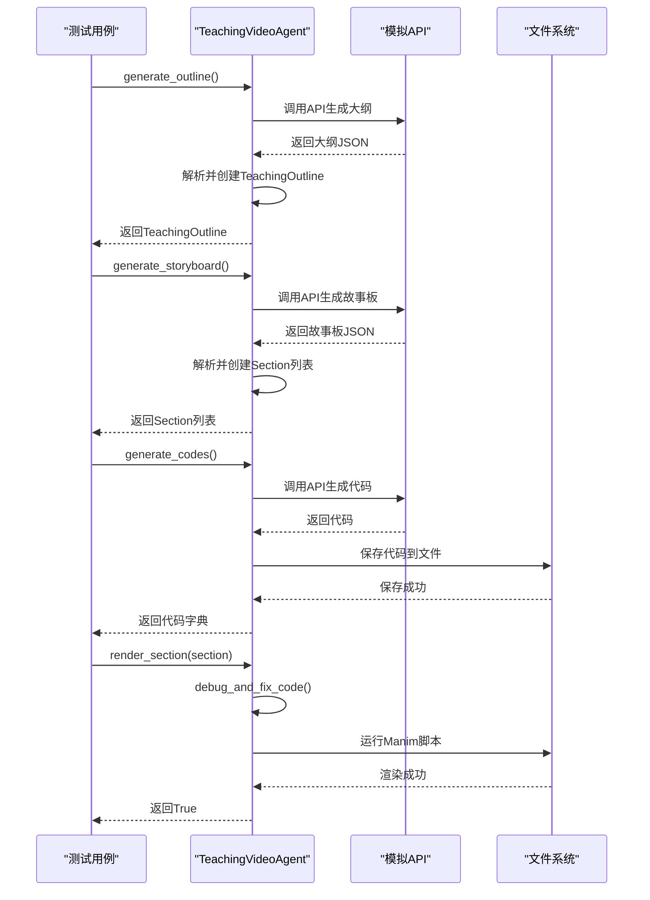
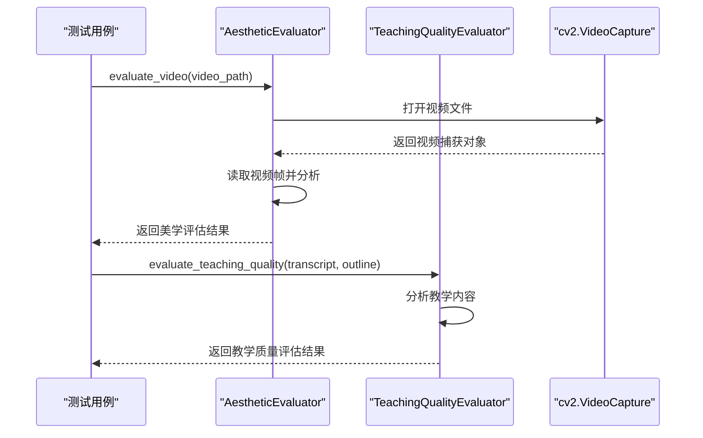
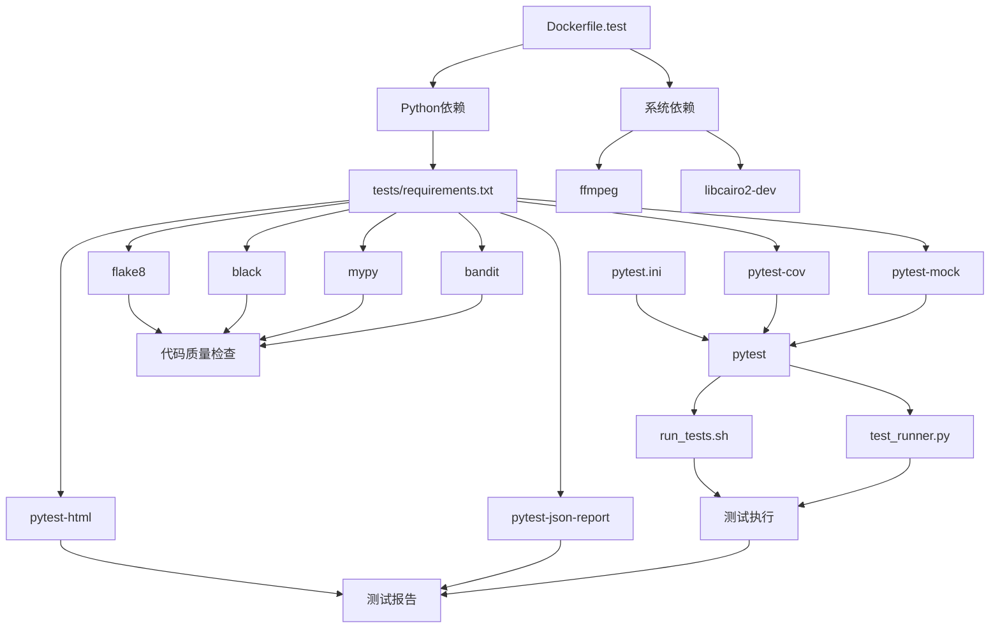

# 测试框架

<cite>
**本文档引用的文件**   
- [README_TESTING.md](file://README_TESTING.md)
- [pytest.ini](file://pytest.ini)
- [run_tests.sh](file://run_tests.sh)
- [Dockerfile.test](file://Dockerfile.test)
- [conftest.py](file://tests/conftest.py)
- [test_runner.py](file://tests/test_runner.py)
- [report_generator.py](file://tests/report_generator.py)
- [sample_data.py](file://tests/fixtures/sample_data.py)
- [mock_objects.py](file://tests/helpers/mock_objects.py)
- [sample_knowledge_mapping.json](file://tests/data/sample_knowledge_mapping.json)
- [test_agent.py](file://tests/unit/test_agent.py)
- [test_utils.py](file://tests/unit/test_utils.py)
- [test_agent_workflow.py](file://tests/integration/test_agent_workflow.py)
- [test_evaluation_system.py](file://tests/integration/test_evaluation_system.py)
</cite>

## 目录
1. [简介](#简介)
2. [项目结构](#项目结构)
3. [核心组件](#核心组件)
4. [架构概述](#架构概述)
5. [详细组件分析](#详细组件分析)
6. [依赖分析](#依赖分析)
7. [性能考虑](#性能考虑)
8. [故障排除指南](#故障排除指南)
9. [结论](#结论)

## 简介
Code2Video 项目现在拥有完整的测试套件，包括单元测试、集成测试和详细的测试报告系统。测试套件旨在确保代码质量、功能正确性和系统稳定性。该测试框架基于 pytest 构建，支持多种测试类型和标记，包括单元测试、集成测试、慢速测试、API 测试和性能基准测试。测试套件还集成了代码质量检查工具（如 flake8、black、mypy 和 bandit），确保代码风格一致性和安全性。CI/CD 流水线配置了 GitHub Actions，支持多 Python 版本测试、并行测试执行和自动报告生成。

**Section sources**
- [README_TESTING.md](file://README_TESTING.md#L1-L304)

## 项目结构
Code2Video 项目的测试结构清晰，分为多个目录和文件，便于管理和执行不同类型的测试。测试套件位于 `tests/` 目录下，包含单元测试、集成测试、测试夹具、辅助工具和测试数据。`tests/unit/` 目录包含针对单个模块的单元测试，而 `tests/integration/` 目录包含端到端的集成测试。`tests/fixtures/` 目录提供测试数据工厂，`tests/helpers/` 目录包含模拟对象和工具。`tests/data/` 目录存储测试数据文件。此外，项目根目录包含 `pytest.ini` 配置文件、`run_tests.sh` 测试执行脚本和 `Dockerfile.test` 测试环境 Docker 镜像定义。

**Diagram sources**
- [README_TESTING.md](file://README_TESTING.md#L7-L30)

**Section sources**
- [README_TESTING.md](file://README_TESTING.md#L7-L30)

## 核心组件
测试框架的核心组件包括 pytest 测试框架、测试运行器、报告生成器和各种测试夹具。`test_runner.py` 是高级测试运行器，提供灵活的测试配置和执行选项，支持安装依赖、运行测试、执行代码质量检查、类型检查和安全检查。`report_generator.py` 生成详细的 HTML、JSON 和文本格式的测试报告，包含测试执行统计、失败/错误详情、代码覆盖率分析和性能基准数据。`conftest.py` 提供 pytest 配置和共享夹具，如临时目录、模拟 API 响应、示例运行配置等。`run_tests.sh` 是 shell 脚本，提供便捷的测试执行和报告生成功能，支持运行所有测试、特定类型测试和生成测试报告。

**Section sources**
- [test_runner.py](file://tests/test_runner.py#L1-L347)
- [report_generator.py](file://tests/report_generator.py#L1-L598)
- [conftest.py](file://tests/conftest.py#L1-L249)
- [run_tests.sh](file://run_tests.sh#L1-L318)

## 架构概述
Code2Video 测试框架采用分层架构，从底层的测试执行到上层的报告生成和 CI/CD 集成。测试执行层基于 pytest 框架，通过 `pytest.ini` 配置文件定义测试路径、文件模式、类和函数命名约定以及命令行选项。测试运行器层由 `test_runner.py` 和 `run_tests.sh` 组成，提供高级测试执行功能，如依赖管理、代码质量检查和测试报告生成。测试夹具和数据层由 `conftest.py`、`fixtures/` 和 `helpers/` 目录组成，提供共享配置、测试数据和模拟对象。报告生成层由 `report_generator.py` 实现，生成多种格式的测试报告。CI/CD 集成层通过 GitHub Actions 实现，支持多 Python 版本测试、并行测试执行和自动报告上传。

**Diagram sources**
- [README_TESTING.md](file://README_TESTING.md#L96-L110)
- [pytest.ini](file://pytest.ini#L1-L38)
- [test_runner.py](file://tests/test_runner.py#L1-L347)
- [report_generator.py](file://tests/report_generator.py#L1-L598)

## 详细组件分析

### 单元测试分析
单元测试位于 `tests/unit/` 目录下，针对单个模块进行测试，确保每个函数和类的行为符合预期。`test_agent.py` 测试 `agent.py` 模块的核心功能，包括 `Section`、`TeachingOutline`、`VideoFeedback` 和 `RunConfig` 数据类的创建和属性验证，以及 `TeachingVideoAgent` 类的初始化、大纲生成、故事板生成、代码生成、调试和反馈优化等方法。`test_utils.py` 测试 `utils.py` 模块的工具函数，包括 JSON 提取、API 响应解析、PNG 路径修复、主题名称安全转换、输出目录创建、代码文件保存、Manim 脚本执行、最优工作线程数计算、视频拼接和基类替换等。

#### 单元测试类图

**Diagram sources**
- [test_agent.py](file://tests/unit/test_agent.py#L29-L438)

#### 工具函数测试流程图

**Diagram sources**
- [test_utils.py](file://tests/unit/test_utils.py#L83-L480)

**Section sources**
- [test_agent.py](file://tests/unit/test_agent.py#L29-L438)
- [test_utils.py](file://tests/unit/test_utils.py#L83-L480)

### 集成测试分析
集成测试位于 `tests/integration/` 目录下，验证多个组件协同工作的端到端流程。`test_agent_workflow.py` 测试 `TeachingVideoAgent` 的完整工作流，包括大纲生成、故事板生成、代码生成、渲染章节、反馈优化和状态序列化。测试覆盖成功工作流、需要调试的工作流、带反馈优化的工作流、并行代码生成和错误处理恢复等场景。`test_evaluation_system.py` 测试评估系统的集成功能，包括美学评估和教学质量评估的组合工作流、评估一致性、跨领域评估、错误处理和性能评估。

#### 代理工作流集成测试序列图

**Diagram sources**
- [test_agent_workflow.py](file://tests/integration/test_agent_workflow.py#L17-L572)

#### 评估系统集成测试序列图

**Diagram sources**
- [test_evaluation_system.py](file://tests/integration/test_evaluation_system.py#L22-L494)

**Section sources**
- [test_agent_workflow.py](file://tests/integration/test_agent_workflow.py#L17-L572)
- [test_evaluation_system.py](file://tests/integration/test_evaluation_system.py#L22-L494)

## 依赖分析
测试框架的依赖关系清晰，通过 `pytest.ini` 配置文件和 `requirements.txt` 文件管理。`pytest.ini` 定义了测试路径、文件模式、类和函数命名约定以及命令行选项，确保测试发现和执行的一致性。`tests/requirements.txt` 列出了测试所需的 Python 包，包括 pytest 框架、代码质量工具、模拟工具和报告生成工具。`Dockerfile.test` 定义了测试环境的 Docker 镜像，安装系统依赖（如 ffmpeg、libcairo2-dev）和 Python 依赖，确保测试环境的一致性和可重复性。`run_tests.sh` 脚本和 `test_runner.py` 模块依赖这些配置和依赖文件，协调测试执行和报告生成。

**Diagram sources**
- [pytest.ini](file://pytest.ini#L1-L38)
- [tests/requirements.txt](file://tests/requirements.txt#L1-L30)
- [Dockerfile.test](file://Dockerfile.test#L1-L46)

**Section sources**
- [pytest.ini](file://pytest.ini#L1-L38)
- [tests/requirements.txt](file://tests/requirements.txt#L1-L30)
- [Dockerfile.test](file://Dockerfile.test#L1-L46)

## 性能考虑
测试框架在性能方面进行了优化，支持并行测试执行和性能基准测试。`pytest.ini` 配置文件通过 `--cov` 和 `--cov-report` 选项启用代码覆盖率分析，`--html` 和 `--json-report` 选项生成测试报告。`test_runner.py` 支持并行执行测试，通过 `-n auto` 选项利用多核 CPU 加速测试执行。`report_generator.py` 生成详细的性能基准数据，包括测试执行时间、代码覆盖率和质量评估结果。`test_agent_workflow.py` 包含性能和可扩展性测试，验证大型项目处理和状态序列化的性能。`test_evaluation_system.py` 包含性能评估测试，验证大量视频帧处理的性能。

**Section sources**
- [pytest.ini](file://pytest.ini#L1-L38)
- [test_runner.py](file://tests/test_runner.py#L71-L126)
- [report_generator.py](file://tests/report_generator.py#L1-L598)
- [test_agent_workflow.py](file://tests/integration/test_agent_workflow.py#L497-L572)
- [test_evaluation_system.py](file://tests/integration/test_evaluation_system.py#L304-L361)

## 故障排除指南
测试框架提供了详细的故障排除指南，帮助开发者调试和解决测试问题。`README_TESTING.md` 文档包含调试失败测试的命令，如运行特定测试、使用 pdb 调试、显示详细输出和只运行失败的测试。`run_tests.sh` 脚本提供颜色编码的消息，便于识别信息、成功、警告和错误。`test_runner.py` 模块在执行命令时显示详细输出，包括执行的命令、输出和错误信息。`conftest.py` 提供共享夹具和配置，确保测试环境的一致性。`mock_objects.py` 提供模拟对象和工具，便于隔离外部依赖进行测试。

**Section sources**
- [README_TESTING.md](file://README_TESTING.md#L204-L228)
- [run_tests.sh](file://run_tests.sh#L1-L318)
- [test_runner.py](file://tests/test_runner.py#L33-L52)
- [conftest.py](file://tests/conftest.py#L1-L249)
- [mock_objects.py](file://tests/helpers/mock_objects.py#L1-L436)

## 结论
Code2Video 测试框架是一个全面、可扩展和易于使用的测试系统，确保代码质量和系统稳定性。它基于 pytest 构建，支持多种测试类型和标记，集成代码质量检查工具，生成详细的测试报告，并通过 CI/CD 流水线实现自动化。测试框架的分层架构清晰，核心组件包括测试运行器、报告生成器、测试夹具和数据。单元测试和集成测试覆盖了核心功能和端到端工作流，确保系统的正确性和可靠性。性能优化和故障排除指南进一步增强了测试框架的实用性和可维护性。