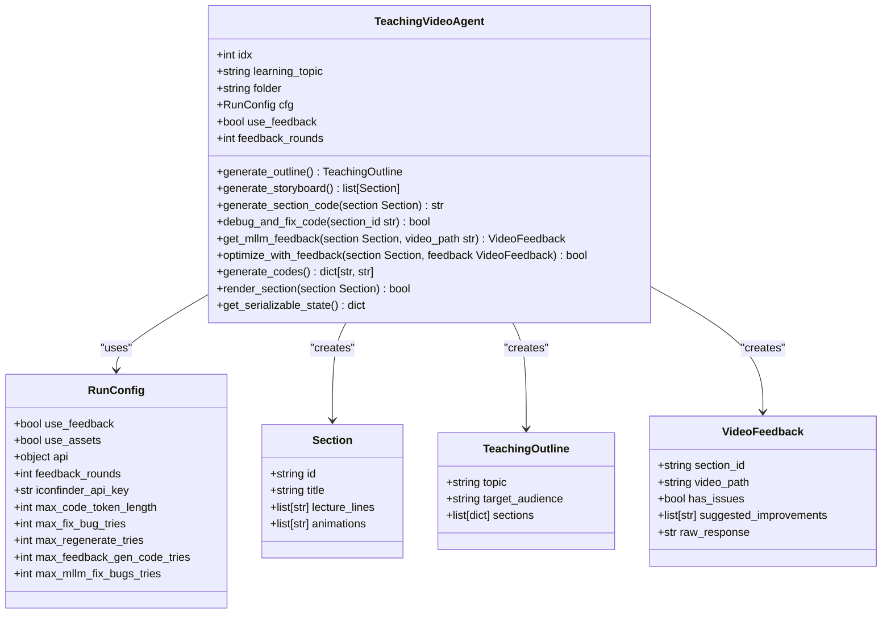
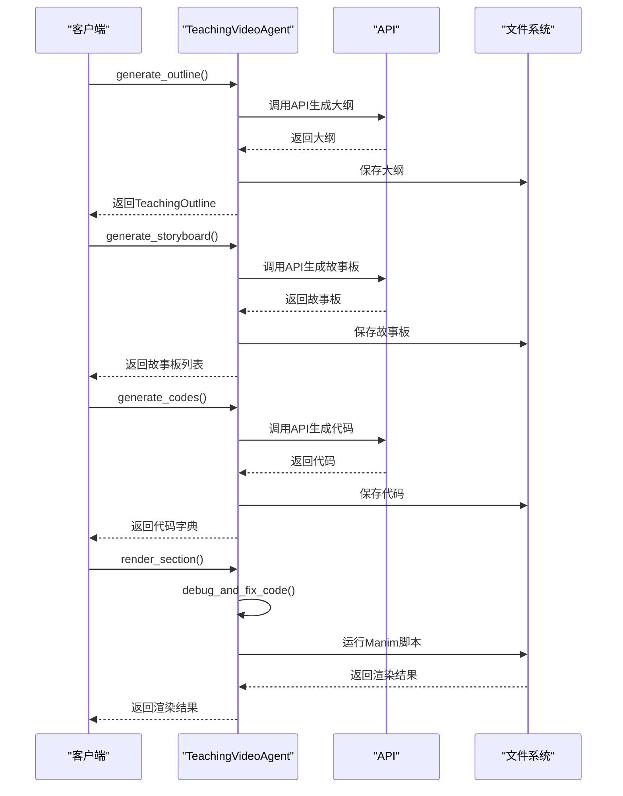

# 测试环境

<cite>
**本文档引用的文件**   
- [README_TESTING.md](file://README_TESTING.md)
- [Dockerfile.test](file://Dockerfile.test)
- [pytest.ini](file://pytest.ini)
- [run_tests.sh](file://run_tests.sh)
- [test_env/pyvenv.cfg](file://test_env/pyvenv.cfg)
- [tests/conftest.py](file://tests/conftest.py)
- [tests/test_runner.py](file://tests/test_runner.py)
- [tests/report_generator.py](file://tests/report_generator.py)
- [tests/requirements.txt](file://tests/requirements.txt)
- [tests/fixtures/sample_data.py](file://tests/fixtures/sample_data.py)
- [tests/unit/test_agent.py](file://tests/unit/test_agent.py)
- [tests/unit/test_utils.py](file://tests/unit/test_utils.py)
- [tests/integration/test_agent_workflow.py](file://tests/integration/test_agent_workflow.py)
- [tests/data/sample_knowledge_mapping.json](file://tests/data/sample_knowledge_mapping.json)
- [tests/helpers/mock_objects.py](file://tests/helpers/mock_objects.py)
</cite>

## 目录
1. [简介](#简介)
2. [测试结构](#测试结构)
3. [测试执行](#测试执行)
4. [测试配置](#测试配置)
5. [测试报告](#测试报告)
6. [测试夹具和数据](#测试夹具和数据)
7. [单元测试分析](#单元测试分析)
8. [集成测试分析](#集成测试分析)
9. [测试环境配置](#测试环境配置)
10. [CI/CD 集成](#cicd-集成)

## 简介

Code2Video 项目包含一个全面的测试套件，旨在确保代码质量、功能正确性和系统稳定性。测试套件包括单元测试、集成测试以及详细的测试报告系统。测试框架基于 pytest，支持多种测试类型和标记，包括单元测试、集成测试、慢速测试、API 测试和性能基准测试。

**Section sources**
- [README_TESTING.md](file://README_TESTING.md#L1-L304)

## 测试结构

测试套件的结构清晰，分为多个目录和文件，便于组织和管理不同类型的测试：

```
tests/
├── __init__.py                    # 测试包初始化
├── conftest.py                   # pytest配置和共享夹具
├── requirements.txt               # 测试依赖
├── test_runner.py                # Python测试运行器
├── report_generator.py           # 测试报告生成器
├── fixtures/                     # 测试夹具和数据
│   └── sample_data.py           # 示例测试数据工厂
├── helpers/                      # 测试辅助工具
│   └── mock_objects.py          # 模拟对象和工具
├── data/                         # 测试数据
│   └── sample_knowledge_mapping.json
├── unit/                         # 单元测试
│   ├── test_agent.py            # 核心代理测试
│   ├── test_utils.py            # 工具函数测试
│   ├── test_eval_aes.py         # 美学评估测试
│   └── test_eval_tq.py          # 教学质量评估测试
└── integration/                  # 集成测试
    ├── test_agent_workflow.py   # 代理工作流测试
    └── test_evaluation_system.py # 评估系统测试
```

**Section sources**
- [README_TESTING.md](file://README_TESTING.md#L7-L30)

## 测试执行

测试可以通过多种方式执行，包括使用 shell 脚本、Python 测试运行器或直接使用 pytest 命令。

### 运行所有测试

```bash
# 使用shell脚本
./run_tests.sh

# 或使用Python测试运行器
python tests/test_runner.py test

# 或直接使用pytest
python -m pytest tests/ -v
```

### 运行特定类型的测试

```bash
# 只运行单元测试
./run_tests.sh unit

# 只运行集成测试
./run_tests.sh integration

# 运行慢速测试
./run_tests.sh slow
```

### 生成测试报告

```bash
# 运行测试并生成报告
./run_tests.sh all

# 生成详细报告
python tests/report_generator.py
```

**Section sources**
- [README_TESTING.md](file://README_TESTING.md#L32-L68)
- [run_tests.sh](file://run_tests.sh#L1-L318)
- [tests/test_runner.py](file://tests/test_runner.py#L1-L347)

## 测试配置

### pytest 配置

主要配置在 `pytest.ini` 文件中：

```ini
[tool:pytest]
testpaths = tests
python_files = test_*.py *_test.py
python_classes = Test*
python_functions = test_*
addopts = -v --tb=short --strict-markers --cov=src --cov-report=html:htmlcov --cov-report=term-missing --cov-report=xml --cov-fail-under=80 --html=reports/pytest_report.html --self-contained-html --json-report --json-report-file=reports/pytest_report.json
markers =
    unit: 单元测试
    integration: 集成测试
    slow: 慢速测试 (运行时间 > 1秒)
    api: 需要API调用的测试
    benchmark: 性能基准测试
```

### 测试标记

- `@pytest.mark.unit`: 单元测试
- `@pytest.mark.integration`: 集成测试
- `@pytest.mark.slow`: 慢速测试（>1秒）
- `@pytest.mark.api`: 需要API调用的测试
- `@pytest.mark.benchmark`: 性能基准测试

**Section sources**
- [pytest.ini](file://pytest.ini#L1-L38)
- [README_TESTING.md](file://README_TESTING.md#L86-L92)

## 测试报告

测试套件会生成多种格式的报告：

1. **HTML报告**: `reports/comprehensive_test_report.html`
2. **JSON报告**: `reports/test_report.json`
3. **摘要报告**: `reports/test_summary.txt`
4. **覆盖率报告**: `htmlcov/index.html`
5. **JUnit XML**: `reports/junit.xml`

### 报告内容

- 测试执行统计
- 失败/错误详情
- 代码覆盖率分析
- 性能基准数据
- 质量评估结果

**Section sources**
- [README_TESTING.md](file://README_TESTING.md#L118-L135)
- [tests/report_generator.py](file://tests/report_generator.py#L1-L598)

## 测试夹具和数据

### 共享夹具

`conftest.py` 文件中定义了多个共享夹具，用于提供测试所需的模拟对象和配置：

- `temp_dir`: 创建临时目录
- `mock_api_response`: 模拟API响应
- `sample_run_config`: 示例运行配置
- `sample_section`: 示例章节
- `sample_teaching_outline`: 示例教学大纲
- `sample_video_feedback`: 示例视频反馈
- `mock_knowledge_mapping`: 模拟知识映射
- `sample_manim_code`: 示例Manim代码
- `mock_prompts`: 模拟提示词
- `test_data_dir`: 测试数据目录
- `sample_storyboard_data`: 示例故事板数据
- `mock_json_response`: 模拟JSON响应

### 测试数据

`tests/data/` 目录包含测试所需的示例数据，如 `sample_knowledge_mapping.json`，用于模拟知识映射。

**Section sources**
- [tests/conftest.py](file://tests/conftest.py#L1-L249)
- [tests/data/sample_knowledge_mapping.json](file://tests/data/sample_knowledge_mapping.json#L1-L104)

## 单元测试分析

### agent.py 单元测试

`tests/unit/test_agent.py` 文件包含对 `agent.py` 模块的单元测试，覆盖了 `Section`、`TeachingOutline`、`VideoFeedback`、`RunConfig` 和 `TeachingVideoAgent` 类。

#### 测试内容

- `TestSection`: 测试 `Section` 数据类的创建和属性
- `TestTeachingOutline`: 测试 `TeachingOutline` 数据类的创建和属性
- `TestVideoFeedback`: 测试 `VideoFeedback` 数据类的创建和属性
- `TestRunConfig`: 测试 `RunConfig` 数据类的默认值和自定义值
- `TestTeachingVideoAgent`: 测试 `TeachingVideoAgent` 类的初始化、生成大纲、生成故事板、生成代码、调试和修复代码、获取MLLM反馈、优化反馈、并行生成代码、渲染章节、获取可序列化状态等方法



**Diagram sources**
- [tests/unit/test_agent.py](file://tests/unit/test_agent.py#L1-L438)
- [src/agent.py](file://src/agent.py)

**Section sources**
- [tests/unit/test_agent.py](file://tests/unit/test_agent.py#L1-L438)

### utils.py 单元测试

`tests/unit/test_utils.py` 文件包含对 `utils.py` 模块的单元测试，覆盖了多个工具函数。

#### 测试内容

- `TestExtractJsonFromMarkdown`: 测试从 Markdown 中提取 JSON
- `TestExtractAnswerFromResponse`: 测试从响应中提取答案
- `TestFixPngPath`: 测试修复 PNG 路径
- `TestTopicToSafeName`: 测试将主题转换为安全名称
- `TestGetOutputDir`: 测试获取输出目录
- `TestSaveCodeToFile`: 测试保存代码到文件
- `TestRunManimScript`: 测试运行 Manim 脚本
- `TestGetOptimalWorkers`: 测试获取最优工作线程数
- `TestStitchVideos`: 测试拼接视频
- `TestReplaceBaseClass`: 测试替换基类
- `TestUtilsIntegration`: 测试工具函数的集成使用

**Section sources**
- [tests/unit/test_utils.py](file://tests/unit/test_utils.py#L1-L480)

## 集成测试分析

### 代理工作流集成测试

`tests/integration/test_agent_workflow.py` 文件包含对 `TeachingVideoAgent` 完整工作流的集成测试。

#### 测试内容

- `TestTeachingVideoAgentWorkflow`: 测试完整的成功工作流、需要调试的工作流、带反馈优化的工作流、并行代码生成、错误处理和恢复、状态序列化
- `TestPerformanceAndScalability`: 测试大型项目处理的性能和可扩展性



**Diagram sources**
- [tests/integration/test_agent_workflow.py](file://tests/integration/test_agent_workflow.py#L1-L572)

**Section sources**
- [tests/integration/test_agent_workflow.py](file://tests/integration/test_agent_workflow.py#L1-L572)

## 测试环境配置

### Docker 测试环境

`Dockerfile.test` 文件定义了测试环境的 Docker 镜像：

```dockerfile
# 测试环境的Docker镜像
FROM python:3.9-slim

# 设置工作目录
WORKDIR /app

# 安装系统依赖
RUN apt-get update && apt-get install -y \
    ffmpeg \
    libcairo2-dev \
    libpango1.0-dev \
    libglib2.0-dev \
    libgtk-3-dev \
    libgirepository1.0-dev \
    xvfb \
    && rm -rf /var/lib/apt/lists/*

# 复制requirements文件
COPY src/requirements.txt .
COPY tests/requirements.txt .

# 安装Python依赖
RUN pip install --no-cache-dir -r src/requirements.txt
RUN pip install --no-cache-dir -r tests/requirements.txt

# 复制源代码
COPY src/ ./src/
COPY tests/ ./tests/
COPY pytest.ini .
COPY run_tests.sh .

# 设置权限
RUN chmod +x run_tests.sh

# 创建报告目录
RUN mkdir -p reports htmlcov

# 设置环境变量
ENV PYTHONPATH=/app/src
ENV DISPLAY=:99

# 启动虚拟显示器（用于图形测试）
RUN Xvfb :99 -screen 0 1024x768x24 &

# 默认命令
CMD ["./run_tests.sh", "all"]
```

### 虚拟环境配置

`test_env/pyvenv.cfg` 文件定义了测试虚拟环境的配置：

```ini
home = /opt/homebrew/opt/python@3.13/bin
include-system-site-packages = false
version = 3.13.3
executable = /opt/homebrew/Cellar/python@3.13/3.13.3_1/Frameworks/Python.framework/Versions/3.13/bin/python3.13
command = /opt/homebrew/opt/python@3.13/bin/python3.13 -m venv test_env
```

**Section sources**
- [Dockerfile.test](file://Dockerfile.test#L1-L46)
- [test_env/pyvenv.cfg](file://test_env/pyvenv.cfg#L1-L6)

## CI/CD 集成

项目配置了完整的CI/CD流水线，包括：

- **GitHub Actions**: 自动化测试和部署
- **多Python版本**: 3.8, 3.9, 3.10, 3.11
- **并行测试**: 加快执行速度
- **自动报告**: 生成和上传测试报告

### CI流水线步骤

1. 代码质量检查 (lint, format, type-check, security)
2. 依赖安装
3. 单元测试执行
4. 集成测试执行
5. 覆盖率报告生成
6. 性能测试
7. 报告上传和存档

**Section sources**
- [README_TESTING.md](file://README_TESTING.md#L136-L153)