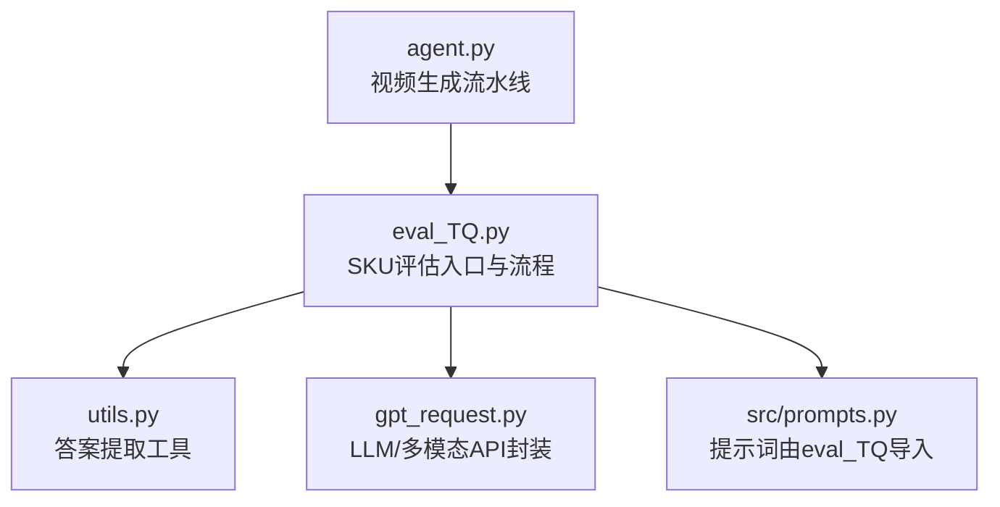
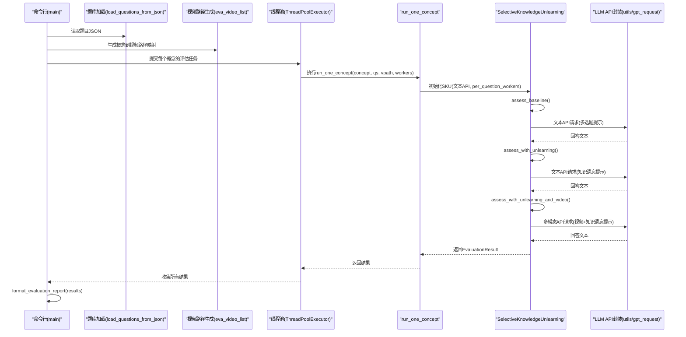
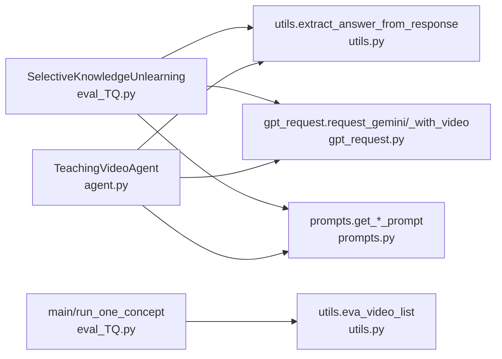

# 教学效果(TQ)评估

<cite>
**本文引用的文件列表**
- [eval_TQ.py](file://src/eval_TQ.py)
- [utils.py](file://src/utils.py)
- [gpt_request.py](file://src/gpt_request.py)
- [agent.py](file://src/agent.py)
</cite>

## 目录
1. [简介](#简介)
2. [项目结构](#项目结构)
3. [核心组件](#核心组件)
4. [架构总览](#架构总览)
5. [详细组件分析](#详细组件分析)
6. [依赖关系分析](#依赖关系分析)
7. [性能与并发特性](#性能与并发特性)
8. [故障排查指南](#故障排查指南)
9. [结论](#结论)
10. [附录](#附录)

## 简介
本文件围绕教学效果(TQ)评估机制，聚焦于 eval_TQ.py 中的 SelectiveKnowledgeUnlearning 类，系统阐述“选择性知识遗忘”(SKU) 框架如何量化视频的教学价值。该框架通过三阶段测试衡量学习增益：
- 基线测试（Baseline）：无知识遗忘、无视频输入，用于建立初始水平。
- 知识遗忘测试（Unlearning-only）：使用特定提示引导模型进行知识遗忘，评估其对错误先验的影响。
- 结合视频的学习测试（Unlearning + Video）：在知识遗忘后，结合视频输入再次评估，计算学习增益。

评估采用多选题（MCQ）与大语言模型/多模态API（LLM API）交互，通过评分与统计分析（t检验、Cohen’s d效应量）形成综合报告。

## 项目结构
- 核心评估逻辑位于 src/eval_TQ.py，包含问题加载、SKU评估器、并行执行与报告生成。
- 工具函数位于 src/utils.py，负责从API响应中提取答案文本等。
- 多模态请求封装位于 src/gpt_request.py，提供文本与带视频的请求接口。
- 视频生成流水线位于 src/agent.py，为SKU评估提供视频输入来源。

图表来源
- [eval_TQ.py](file://src/eval_TQ.py#L1-L366)
- [utils.py](file://src/utils.py#L1-L210)
- [gpt_request.py](file://src/gpt_request.py#L1-L1063)
- [agent.py](file://src/agent.py#L1-L913)

章节来源
- [eval_TQ.py](file://src/eval_TQ.py#L1-L366)
- [utils.py](file://src/utils.py#L1-L210)
- [gpt_request.py](file://src/gpt_request.py#L1-L1063)
- [agent.py](file://src/agent.py#L1-L913)

## 核心组件
- Question 数据类：承载每道题目的题干、选项、正确答案与难度。
- EvaluationResult 数据类：记录一次概念评估的全部结果，包括三阶段得分、学习增益、知识遗忘是否成功及各阶段详细回答。
- SelectiveKnowledgeUnlearning 类：实现SKU评估器，包含三阶段评估方法与评分逻辑。
- 并行执行与报告：run_one_concept 与 main 函数分别负责单概念评估与跨概念并行调度；format_evaluation_report 生成统计分析报告。

章节来源
- [eval_TQ.py](file://src/eval_TQ.py#L40-L215)
- [eval_TQ.py](file://src/eval_TQ.py#L217-L287)
- [eval_TQ.py](file://src/eval_TQ.py#L289-L366)

## 架构总览
SKU评估的整体流程如下：
- 加载题库（按概念分组）。
- 为每个概念准备视频路径（来自agent生成的视频目录）。
- 对每个概念并行执行三阶段评估：Baseline → Unlearning-only → Unlearning + Video。
- 汇总结果并生成统计报告（含t检验、Cohen’s d、置信区间等）。

图表来源
- [eval_TQ.py](file://src/eval_TQ.py#L296-L366)
- [eval_TQ.py](file://src/eval_TQ.py#L289-L366)
- [eval_TQ.py](file://src/eval_TQ.py#L120-L215)
- [utils.py](file://src/utils.py#L18-L28)
- [gpt_request.py](file://src/gpt_request.py#L124-L191)

## 详细组件分析

### Question 与 EvaluationResult 数据类
- Question 字段：题干、选项列表、正确答案、难度等级。
- EvaluationResult 字段：概念名、三阶段得分、知识遗忘是否成功、学习增益、各阶段详细回答字典。

用途：
- 作为SKU评估器的输入与输出载体，确保评估流程可追踪、可复现，并便于后续统计分析。

章节来源
- [eval_TQ.py](file://src/eval_TQ.py#L40-L61)

### SelectiveKnowledgeUnlearning 类
职责与方法：
- 构造函数：接收一个通用的MLLM API函数与每题并发工作数。
- _format_mcq_prompt_block：格式化单题提示块（题号、题干、选项）。
- _grade_batch：批处理评分，基于模型回答中的字母选项匹配正确答案，计算准确率并保留详细回答。
- _assess_stage_parallel：在某阶段内对一组题并行请求LLM，收集回答后统一评分。
- assess_baseline：基线阶段，直接给出多选题提示。
- assess_with_unlearning：知识遗忘阶段，使用“知识遗忘提示”。
- assess_with_unlearning_and_video：结合视频的遗忘+学习阶段，使用“知识遗忘+视频学习提示”，并调用多模态API。
- evaluate_educational_video：串联三阶段，计算学习增益，构造EvaluationResult。

评分与判别：
- 学习增益 = Unlearning + Video 得分 − Unlearning-only 得分。
- 知识遗忘成功与否采用启发式：Unlearning-only 得分 ≤ Baseline 得分。

章节来源
- [eval_TQ.py](file://src/eval_TQ.py#L120-L215)

### run_one_concept 与 main 的并行执行逻辑
- run_one_concept：
  - 为文本与视频分别构建API函数（make_mllm_api）。
  - 初始化SKU，传入文本API与每题并发工作数。
  - 调用SKU.evaluate_educational_video，返回EvaluationResult。
- main：
  - 解析参数：跨概念并发数、每概念每阶段并发数、题库JSON、概念子集、基础目录、最大概念数。
  - 加载题库并筛选概念。
  - 生成概念到视频路径的映射（基于agent生成的视频目录）。
  - 使用线程池对每个概念提交run_one_concept任务，收集结果。
  - 调用format_evaluation_report生成报告。

并发层次：
- 外层：跨概念并发（concept_workers）。
- 内层：每概念每阶段内的问题级并发（per_question_workers）。

章节来源
- [eval_TQ.py](file://src/eval_TQ.py#L289-L366)

### format_evaluation_report 报告生成
功能：
- 统计维度：概念总数、成功知识遗忘率、三阶段平均得分、平均学习增益。
- 详细结果：逐概念展示基线、遗忘后、视频后得分与学习增益，并给出视频有效性评级。
- 统计分析（仅对成功遗忘的概念）：
  - 学习增益分布（均值、标准差、样本量）。
  - 单样本t检验（零假设：无学习增益）。
  - Cohen’s d 效应量。
  - 95%置信区间。

章节来源
- [eval_TQ.py](file://src/eval_TQ.py#L217-L287)

### 评估流程与MCQ/LLM API交互
- MCQ评分：从模型回答中提取首字母选项，与正确答案比对，计算准确率。
- LLM API：
  - 文本API：request_gemini。
  - 多模态API：request_gemini_with_video（带视频输入）。
  - 答案提取：utils.extract_answer_from_response，兼容不同客户端响应结构。

章节来源
- [eval_TQ.py](file://src/eval_TQ.py#L101-L118)
- [eval_TQ.py](file://src/eval_TQ.py#L143-L179)
- [utils.py](file://src/utils.py#L18-L28)
- [gpt_request.py](file://src/gpt_request.py#L124-L191)

## 依赖关系分析
- eval_TQ.py 依赖：
  - utils.extract_answer_from_response：统一从LLM响应中提取文本。
  - gpt_request.request_gemini/request_gemini_with_video：文本与多模态请求封装。
  - prompts.get_unlearning_and_video_learning_prompt/get_unlearning_prompt：提示词（由eval_TQ导入）。
- agent.py 依赖：
  - gpt_request、utils、prompts 等，用于生成视频并提供SKU评估所需的视频输入。
- 间接依赖：
  - eva_video_list：根据概念名称与基础目录生成视频路径，供SKU评估使用。

图表来源
- [eval_TQ.py](file://src/eval_TQ.py#L1-L366)
- [utils.py](file://src/utils.py#L1-L210)
- [gpt_request.py](file://src/gpt_request.py#L1-L1063)
- [agent.py](file://src/agent.py#L1-L913)

章节来源
- [eval_TQ.py](file://src/eval_TQ.py#L1-L366)
- [utils.py](file://src/utils.py#L1-L210)
- [gpt_request.py](file://src/gpt_request.py#L1-L1063)
- [agent.py](file://src/agent.py#L1-L913)

## 性能与并发特性
- 每概念内并行：
  - 每阶段对同一概念下的问题使用ThreadPoolExecutor并行请求LLM，提升吞吐。
  - 并发度受 per_question_workers 控制，避免过度占用资源。
- 跨概念并行：
  - main 使用 ThreadPoolExecutor 对不同概念并行评估，加速整体流程。
- 错误恢复：
  - _assess_stage_parallel 在任务失败时以空字符串占位，保证评分稳健性。
  - 重试装饰器用于API调用失败时的指数退避重试。
- I/O与外部依赖：
  - 视频文件存在性检查，缺失时发出警告但继续执行，避免中断评估。
  - 多模态API对视频编码与大小有建议，需遵循以减少失败概率。

章节来源
- [eval_TQ.py](file://src/eval_TQ.py#L143-L179)
- [eval_TQ.py](file://src/eval_TQ.py#L296-L366)
- [eval_TQ.py](file://src/eval_TQ.py#L19-L38)
- [gpt_request.py](file://src/gpt_request.py#L124-L191)

## 故障排查指南
- 题目加载异常：
  - 检查题库JSON格式与字段一致性（题干、选项、答案字母）。
  - 若答案字母不在A-D或索引越界，会跳过并打印警告。
- 视频路径问题：
  - 确认 base_dir 与概念名称对应，视频文件存在。
  - 缺失时会打印警告，评估仍继续，但多模态API可能失败。
- API调用失败：
  - 检查API配置与网络连通性。
  - 重试装饰器会自动指数退避重试，若仍失败，需检查服务端状态。
- 评分异常：
  - 确认模型回答格式符合“首行字母+简要解释”的约定。
  - 若无法解析字母选项，将被计为错误，导致准确率下降。

章节来源
- [eval_TQ.py](file://src/eval_TQ.py#L63-L98)
- [eval_TQ.py](file://src/eval_TQ.py#L296-L366)
- [gpt_request.py](file://src/gpt_request.py#L124-L191)
- [utils.py](file://src/utils.py#L18-L28)

## 结论
SKU评估机制通过三阶段测试与统计分析，提供了可量化的教学效果评估方案。SelectiveKnowledgeUnlearning 类将MCQ与LLM API有机结合，实现了高效、可扩展的评估流程；并行策略显著提升了吞吐能力；format_evaluation_report 则为决策提供了坚实的统计依据。结合agent生成的视频输入，该框架能够系统地衡量视频在知识遗忘与学习增益方面的实际价值。

## 附录
- 术语说明：
  - SKU（Selective Knowledge Unlearning）：选择性知识遗忘，旨在消除错误先验，提升后续学习效果。
  - 学习增益：Unlearning + Video 得分减去 Unlearning-only 得分。
  - Cohen’s d：标准化效应量，用于衡量学习增益的显著程度。
- 使用建议：
  - 合理设置 per_question_workers 与 concept_workers，平衡吞吐与稳定性。
  - 确保题库质量与视频完整性，必要时增加重试与降级策略。
  - 关注统计分析结果，结合业务阈值判定视频有效性。