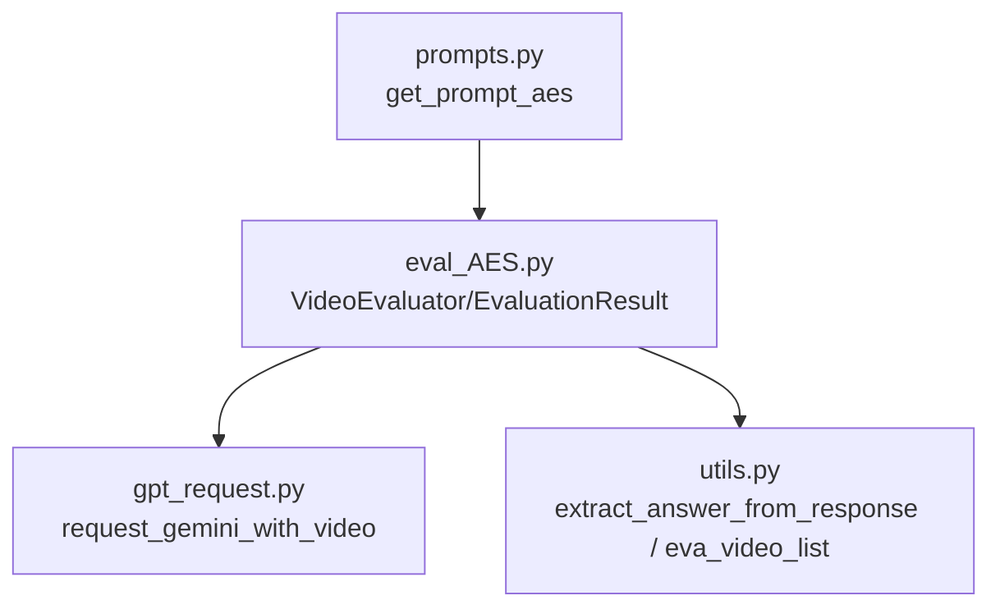
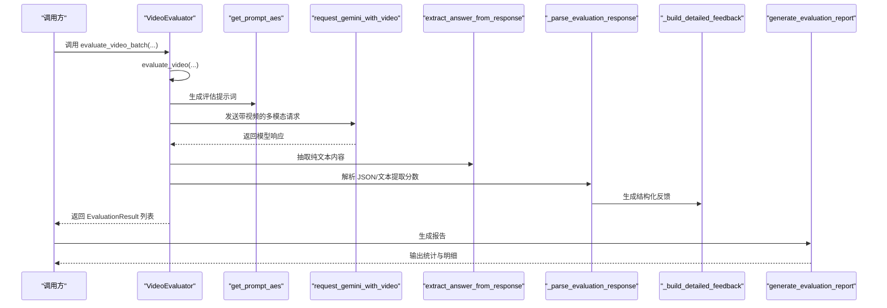
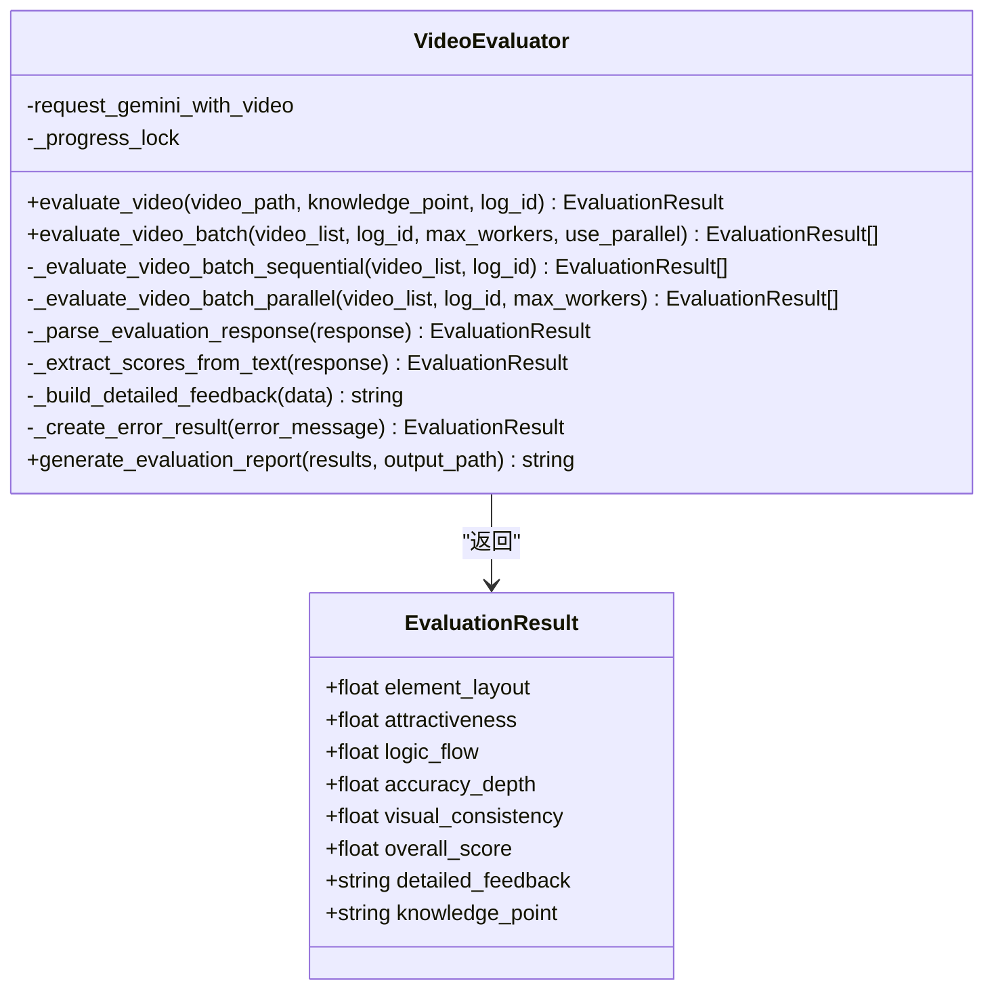
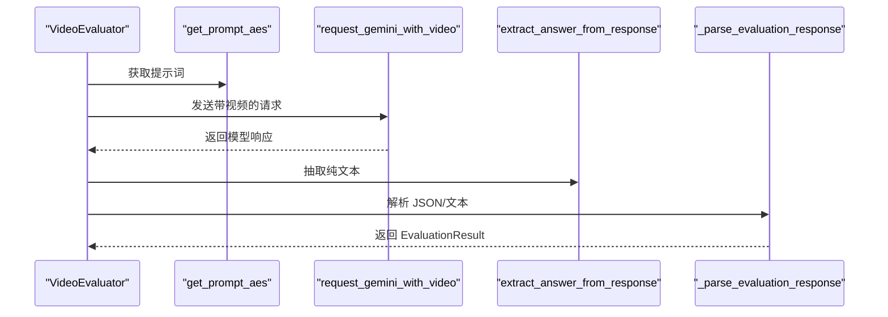
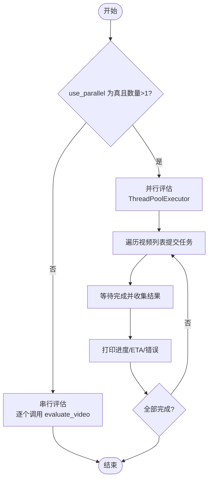
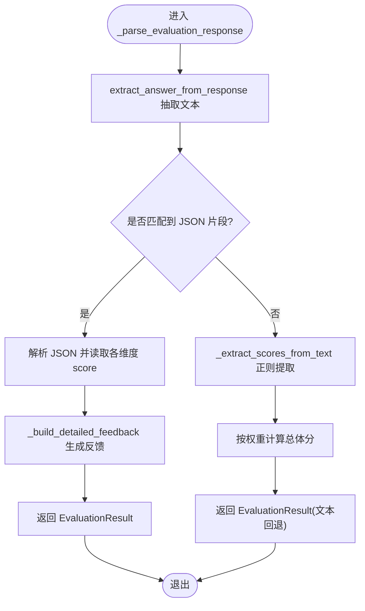
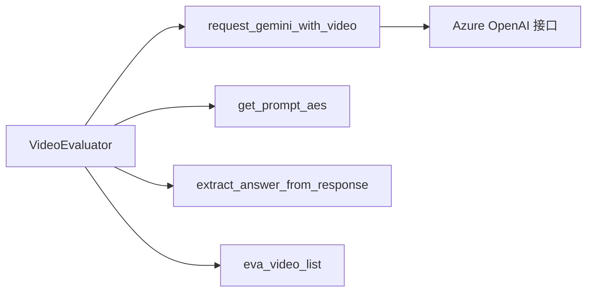

# 美学评分(AES)评估

<cite>
**本文引用的文件列表**
- [eval_AES.py](file://src/eval_AES.py)
- [gpt_request.py](file://src/gpt_request.py)
- [utils.py](file://src/utils.py)
</cite>

## 目录
1. [简介](#简介)
2. [项目结构](#项目结构)
3. [核心组件](#核心组件)
4. [架构总览](#架构总览)
5. [详细组件分析](#详细组件分析)
6. [依赖关系分析](#依赖关系分析)
7. [性能考量](#性能考量)
8. [故障排查指南](#故障排查指南)
9. [结论](#结论)
10. [附录：使用示例与最佳实践](#附录使用示例与最佳实践)

## 简介
本文件围绕教学视频的美学评分(AES)评估机制展开，重点解析 eval_AES.py 中的 VideoEvaluator 类。该系统基于多模态大模型（MLLM）对教学视频进行视觉美学评估，覆盖以下五个维度：
- 构图（Element Layout）
- 吸引力（Attractiveness）
- 逻辑流（Logic Flow）
- 准确深度（Accuracy & Depth）
- 视觉一致性（Visual Consistency）

文档将深入说明：
- evaluate_video 与 evaluate_video_batch 的实现细节与串行/并行处理模式
- _parse_evaluation_response 的解析逻辑，以及从 JSON 或文本响应中提取分数的方法
- _build_detailed_feedback 如何生成结构化反馈
- EvaluationResult 数据类的结构与 generate_evaluation_report 报告生成流程
- 实际调用示例、错误处理策略与常见问题排查

## 项目结构
本节概览与 AES 评估相关的核心文件及其职责：
- eval_AES.py：定义 VideoEvaluator 类与 EvaluationResult 数据类，负责调用 MLLM 进行评估、解析响应、生成报告
- gpt_request.py：封装多模态请求函数，如 request_gemini_with_video，用于向 Gemini 发送带视频的请求
- utils.py：提供通用工具，如 extract_answer_from_response（从多模型响应中抽取纯文本内容）、eva_video_list（构造视频清单）

图表来源
- [eval_AES.py](file://src/eval_AES.py#L1-L353)
- [gpt_request.py](file://src/gpt_request.py#L124-L191)
- [utils.py](file://src/utils.py#L19-L28)

章节来源
- [eval_AES.py](file://src/eval_AES.py#L1-L353)
- [gpt_request.py](file://src/gpt_request.py#L124-L191)
- [utils.py](file://src/utils.py#L19-L28)

## 核心组件
- EvaluationResult：承载单个视频的五维评分、总体分与详细反馈等信息
- VideoEvaluator：
  - evaluate_video：对单个视频进行评估
  - evaluate_video_batch：批量评估，支持串行与并行两种模式
  - _parse_evaluation_response：解析 MLLM 响应，优先尝试 JSON 提取，失败则回退到正则提取
  - _build_detailed_feedback：将各维度反馈整合为结构化报告段落
  - generate_evaluation_report：汇总统计并生成可读报告

章节来源
- [eval_AES.py](file://src/eval_AES.py#L13-L22)
- [eval_AES.py](file://src/eval_AES.py#L33-L58)
- [eval_AES.py](file://src/eval_AES.py#L59-L77)
- [eval_AES.py](file://src/eval_AES.py#L79-L96)
- [eval_AES.py](file://src/eval_AES.py#L98-L160)
- [eval_AES.py](file://src/eval_AES.py#L163-L200)
- [eval_AES.py](file://src/eval_AES.py#L201-L236)
- [eval_AES.py](file://src/eval_AES.py#L238-L268)
- [eval_AES.py](file://src/eval_AES.py#L281-L328)

## 架构总览
下图展示了从输入视频到最终报告的整体流程：

图表来源
- [eval_AES.py](file://src/eval_AES.py#L33-L58)
- [eval_AES.py](file://src/eval_AES.py#L59-L77)
- [eval_AES.py](file://src/eval_AES.py#L163-L200)
- [eval_AES.py](file://src/eval_AES.py#L238-L268)
- [eval_AES.py](file://src/eval_AES.py#L281-L328)
- [gpt_request.py](file://src/gpt_request.py#L124-L191)
- [utils.py](file://src/utils.py#L19-L28)

## 详细组件分析

### VideoEvaluator 类与 EvaluationResult 数据类
VideoEvaluator 是整个评估流程的核心，EvaluationResult 作为结果载体，包含以下字段：
- element_layout：构图得分
- attractiveness：吸引力得分
- logic_flow：逻辑流得分
- accuracy_depth：准确深度得分
- visual_consistency：视觉一致性得分
- overall_score：总体分（由五维相加或按权重计算）
- detailed_feedback：结构化反馈文本
- knowledge_point：学习主题（可选）

图表来源
- [eval_AES.py](file://src/eval_AES.py#L13-L22)
- [eval_AES.py](file://src/eval_AES.py#L26-L327)

章节来源
- [eval_AES.py](file://src/eval_AES.py#L13-L22)
- [eval_AES.py](file://src/eval_AES.py#L26-L327)

### evaluate_video 单视频评估流程
- 依据知识点生成评估提示词
- 调用 request_gemini_with_video 发起多模态请求（视频+文本）
- 使用 extract_answer_from_response 抽取纯文本
- 交由 _parse_evaluation_response 解析分数与反馈
- 将 knowledge_point 回填至结果对象

图表来源
- [eval_AES.py](file://src/eval_AES.py#L33-L58)
- [gpt_request.py](file://src/gpt_request.py#L124-L191)
- [utils.py](file://src/utils.py#L19-L28)

章节来源
- [eval_AES.py](file://src/eval_AES.py#L33-L58)
- [gpt_request.py](file://src/gpt_request.py#L124-L191)
- [utils.py](file://src/utils.py#L19-L28)

### evaluate_video_batch 批量评估：串行与并行
- 当 use_parallel 为 False 或仅有一个视频时，走串行路径
- 并行模式使用线程池并发执行，每个线程独立调用 evaluate_video，并在完成后更新进度与 ETA
- 并行过程中对异常进行捕获，保证整体任务不中断

图表来源
- [eval_AES.py](file://src/eval_AES.py#L59-L77)
- [eval_AES.py](file://src/eval_AES.py#L79-L96)
- [eval_AES.py](file://src/eval_AES.py#L98-L160)

章节来源
- [eval_AES.py](file://src/eval_AES.py#L59-L77)
- [eval_AES.py](file://src/eval_AES.py#L79-L96)
- [eval_AES.py](file://src/eval_AES.py#L98-L160)

### _parse_evaluation_response 解析逻辑
- 首先调用 extract_answer_from_response 抽取纯文本
- 正则匹配最外层大括号内的 JSON 片段并解析
- 从 JSON 中读取各维度的 score 字段，计算总体分
- 通过 _build_detailed_feedback 生成结构化反馈
- 若未找到 JSON，则回退到 _extract_scores_from_text，使用正则从文本中提取各维度分数，并按固定权重计算总体分
- 解析异常时返回错误结果

图表来源
- [eval_AES.py](file://src/eval_AES.py#L163-L200)
- [eval_AES.py](file://src/eval_AES.py#L201-L236)
- [eval_AES.py](file://src/eval_AES.py#L238-L268)
- [utils.py](file://src/utils.py#L19-L28)

章节来源
- [eval_AES.py](file://src/eval_AES.py#L163-L200)
- [eval_AES.py](file://src/eval_AES.py#L201-L236)
- [eval_AES.py](file://src/eval_AES.py#L238-L268)
- [utils.py](file://src/utils.py#L19-L28)

### _build_detailed_feedback 结构化反馈
- 遍历五个维度，拼接“维度名(分数)：反馈”段落
- 可选地追加 summary、strengths、improvements 等顶层信息
- 返回完整结构化反馈字符串

章节来源
- [eval_AES.py](file://src/eval_AES.py#L238-L268)

### generate_evaluation_report 报告生成
- 计算各维度与总体的平均分
- 汇总每个视频的学习主题、各维度换算百分比与总体分
- 支持输出到文件或直接返回字符串

章节来源
- [eval_AES.py](file://src/eval_AES.py#L281-L328)

## 依赖关系分析
- VideoEvaluator 依赖：
  - request_gemini_with_video：发起多模态请求
  - get_prompt_aes：生成针对知识点的评估提示词
  - extract_answer_from_response：统一抽取模型响应文本
  - eva_video_list：构造视频清单（路径与知识点）
- gpt_request.request_gemini_with_video：
  - 负责加载本地视频并编码为 base64，组装消息体，调用 Azure OpenAI 兼容接口
  - 包含指数退避重试与日志追踪头
- utils.extract_answer_from_response：
  - 兼容不同模型响应格式（候选内容/choices），并清理 Markdown 包裹的 JSON

图表来源
- [eval_AES.py](file://src/eval_AES.py#L1-L353)
- [gpt_request.py](file://src/gpt_request.py#L124-L191)
- [utils.py](file://src/utils.py#L19-L28)

章节来源
- [eval_AES.py](file://src/eval_AES.py#L1-L353)
- [gpt_request.py](file://src/gpt_request.py#L124-L191)
- [utils.py](file://src/utils.py#L19-L28)

## 性能考量
- 并行度建议：默认最大工作线程数为 3，避免触发 API 频率限制；可根据环境调整
- 串行模式适合小规模或需要稳定顺序的场景
- 多模态请求耗时主要受视频大小与网络延迟影响，建议控制视频体积并合理设置 max_tokens
- 错误重试采用指数退避，有助于缓解瞬时服务波动

章节来源
- [eval_AES.py](file://src/eval_AES.py#L59-L77)
- [gpt_request.py](file://src/gpt_request.py#L124-L191)

## 故障排查指南
- 视频文件缺失：request_gemini_with_video 在找不到视频时抛出 FileNotFoundError，需检查路径
- 模型响应异常：_parse_evaluation_response 捕获解析异常并返回错误结果，同时打印错误信息
- 缺失知识点：evaluate_video_batch 在缺少 knowledge_point 时会打印警告，可能影响评估准确性
- 并行异常：并行评估中单个任务异常会被转换为错误结果，不影响其他任务继续执行

章节来源
- [gpt_request.py](file://src/gpt_request.py#L155-L162)
- [eval_AES.py](file://src/eval_AES.py#L113-L116)
- [eval_AES.py](file://src/eval_AES.py#L197-L200)

## 结论
VideoEvaluator 以清晰的模块化设计实现了教学视频的多模态美学评估，具备：
- 明确的五维评分体系与结构化反馈
- 串行/并行双通道批处理能力
- 强健的响应解析与回退机制
- 可读性强的统计报告生成

在实际应用中，建议：
- 为每个视频提供明确的知识点描述，提升评估针对性
- 控制并行度与视频体积，平衡吞吐与稳定性
- 关注模型响应格式变化，必要时扩展解析逻辑

## 附录：使用示例与最佳实践
- 单视频评估
  - 调用 evaluate_video，传入视频路径与知识点
  - 可选传入 log_id 便于追踪
  - 返回 EvaluationResult，其中包含 detailed_feedback 与 knowledge_point
- 批量评估
  - 使用 evaluate_video_batch，传入视频清单（每项包含 path 与 knowledge_point）
  - 可选择 use_parallel=True 启用并行，max_workers 控制并发度
  - 串行模式适用于小规模或需要严格顺序的场景
- 生成报告
  - 调用 generate_evaluation_report，可直接输出字符串或写入文件
  - 报告包含每个视频的学习主题、各维度换算百分比与总体分，以及平均统计

章节来源
- [eval_AES.py](file://src/eval_AES.py#L33-L58)
- [eval_AES.py](file://src/eval_AES.py#L59-L77)
- [eval_AES.py](file://src/eval_AES.py#L281-L328)
- [utils.py](file://src/utils.py#L195-L205)