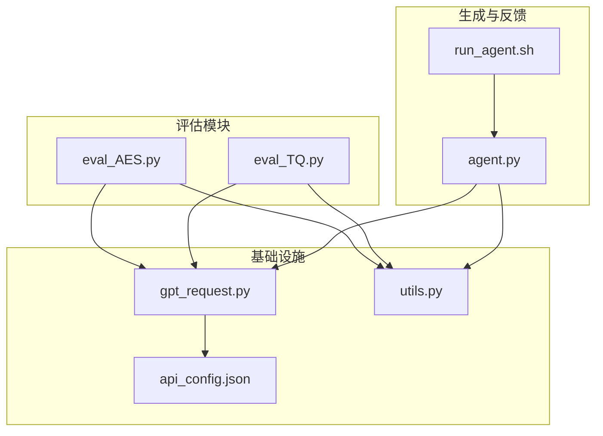
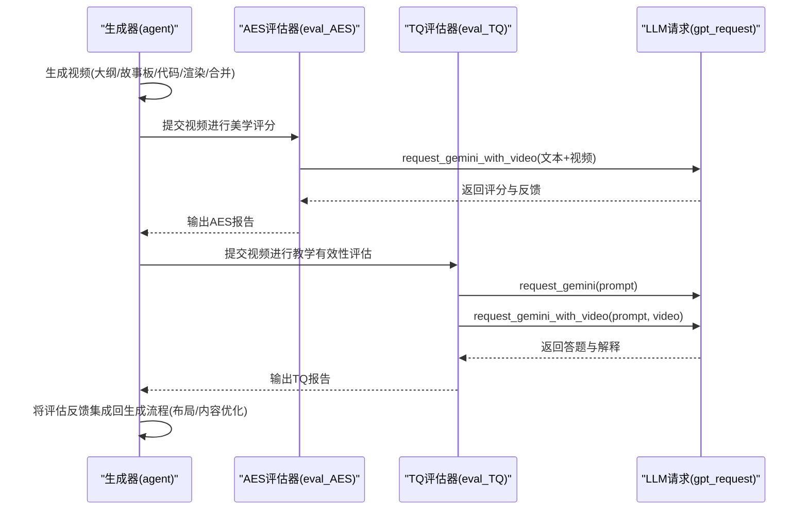
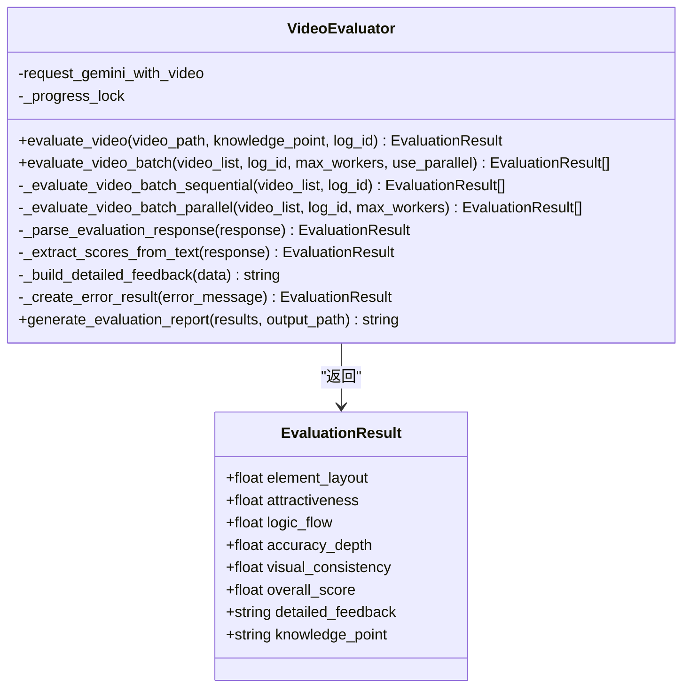
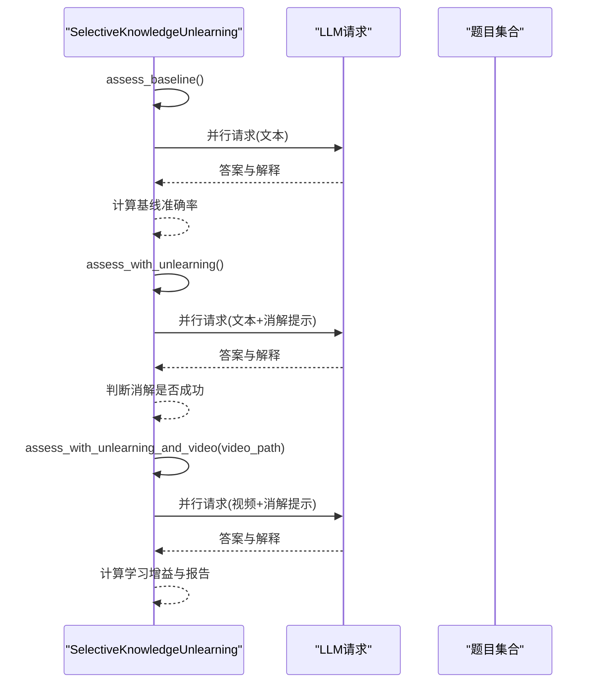
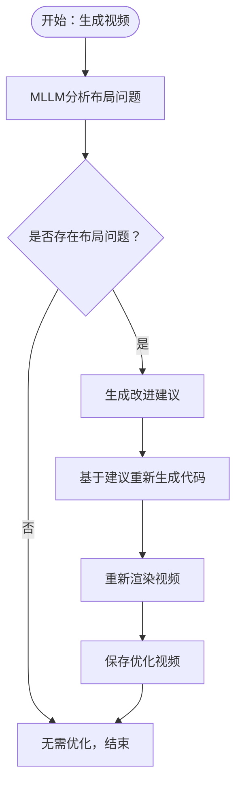
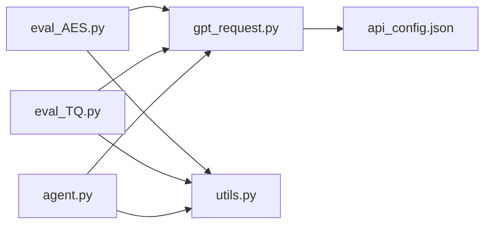

# 评估系统

<cite>
**本文引用的文件**
- [eval_AES.py](file://src/eval_AES.py)
- [eval_TQ.py](file://src/eval_TQ.py)
- [gpt_request.py](file://src/gpt_request.py)
- [utils.py](file://src/utils.py)
- [agent.py](file://src/agent.py)
- [api_config.json](file://src/api_config.json)
- [run_agent.sh](file://src/run_agent.sh)
</cite>

## 目录
1. [简介](#简介)
2. [项目结构](#项目结构)
3. [核心组件](#核心组件)
4. [架构总览](#架构总览)
5. [详细组件分析](#详细组件分析)
6. [依赖分析](#依赖分析)
7. [性能考虑](#性能考虑)
8. [故障排查指南](#故障排查指南)
9. [结论](#结论)
10. [附录](#附录)

## 简介
本评估系统围绕两类教学视频质量评估维度展开：
- AES（美学评分）：从视觉美学角度对生成视频进行多维评分，包括元素布局、吸引力、逻辑流、准确性与深度、视觉一致性等，并给出总体得分与详细反馈。
- TQ（教学质量）：通过“选择性知识消解”（SKU）范式，结合多轮问答测试，评估视频对学习者知识掌握的影响，计算未消解基线、仅消解、消解+视频三阶段的前后对比，得到学习增益与有效性指标。

系统采用多模态大模型（LLM）作为评估引擎，通过精心设计的提示词与评分规则，实现可复现、可量化的教学视频质量评估；并通过报告汇总与统计显著性检验，为生成流程提供闭环反馈。

## 项目结构
该仓库采用按功能分层的组织方式，核心评估相关文件集中在 src 目录中，主要文件职责如下：
- eval_AES.py：AES 维度的视频评估器，支持单视频与批量评估、并行处理、结果解析与报告生成。
- eval_TQ.py：TQ 维度的评估器，实现 SKU 流程（基线、消解、消解+视频），并进行统计分析与报告汇总。
- gpt_request.py：统一的 LLM 请求封装，支持文本与视频多模态请求，内置重试与指数退避策略。
- utils.py：通用工具函数，包括响应内容提取、视频路径构造、资源监控等。
- agent.py：主流程编排，负责从主题到视频的完整生成与反馈优化链路，便于将评估反馈集成回生成流程。
- api_config.json：API 配置文件，集中管理各模型服务端点、版本与密钥。
- run_agent.sh：一键运行脚本，用于启动生成流程。

图表来源
- [eval_AES.py](file://src/eval_AES.py#L1-L353)
- [eval_TQ.py](file://src/eval_TQ.py#L1-L366)
- [gpt_request.py](file://src/gpt_request.py#L1-L200)
- [utils.py](file://src/utils.py#L1-L210)
- [agent.py](file://src/agent.py#L1-L200)
- [api_config.json](file://src/api_config.json#L1-L40)
- [run_agent.sh](file://src/run_agent.sh#L1-L39)

章节来源
- [eval_AES.py](file://src/eval_AES.py#L1-L353)
- [eval_TQ.py](file://src/eval_TQ.py#L1-L366)
- [gpt_request.py](file://src/gpt_request.py#L1-L200)
- [utils.py](file://src/utils.py#L1-L210)
- [agent.py](file://src/agent.py#L1-L200)
- [api_config.json](file://src/api_config.json#L1-L40)
- [run_agent.sh](file://src/run_agent.sh#L1-L39)

## 核心组件
- AES 评估器（VideoEvaluator）
  - 单视频评估：调用多模态 LLM 对视频进行评分，解析 JSON 或文本中的分数与反馈。
  - 批量评估：支持顺序与并行两种模式，内置进度与 ETA 计算、错误结果兜底。
  - 结果聚合：计算平均分与总体报告，支持导出到文件。
- TQ 评估器（SelectiveKnowledgeUnlearning）
  - 三阶段评估：基线（无消解、无视频）、仅消解（引导学习者消除旧干扰）、消解+视频（在视频辅助下再次评估）。
  - 并行打分：每个概念的题目在阶段内并行评估，提高吞吐。
  - 统计分析：计算学习增益分布、显著性检验（t 检验）、效应量（Cohen’s d）与置信区间。
- LLM 请求封装（request_gemini_with_video 等）
  - 多模态请求：支持文本+视频或文本+视频+参考图的组合输入。
  - 重试与退避：指数退避与抖动，避免 API 频率限制导致失败。
- 工具函数（utils）
  - 响应提取：从不同客户端返回体中抽取文本内容，兼容多种模型输出格式。
  - 视频列表构造：根据知识点与目录结构生成视频路径清单，便于批量评估。
- 生成与反馈（agent）
  - 将评估反馈集成回生成流程：在渲染后使用 MLLM 分析布局问题并生成改进建议，再重新生成代码并渲染，形成闭环优化。

章节来源
- [eval_AES.py](file://src/eval_AES.py#L26-L353)
- [eval_TQ.py](file://src/eval_TQ.py#L1-L215)
- [gpt_request.py](file://src/gpt_request.py#L124-L191)
- [utils.py](file://src/utils.py#L11-L29)
- [utils.py](file://src/utils.py#L195-L206)
- [agent.py](file://src/agent.py#L402-L460)

## 架构总览
评估系统由“生成—评估—反馈—再生成”的闭环构成：
- 生成阶段：agent 负责从主题到视频的全流程，包括大纲、故事板、代码生成、渲染与合并。
- 评估阶段：AES 与 TQ 分别独立评估，也可并行执行。
- 反馈阶段：将评估结果转化为可操作建议，回写到生成流程中进行迭代优化。
- 数据与接口：gpt_request 提供统一的 LLM 接口；utils 提供通用工具；api_config 统一配置。

图表来源
- [agent.py](file://src/agent.py#L402-L460)
- [eval_AES.py](file://src/eval_AES.py#L34-L93)
- [eval_TQ.py](file://src/eval_TQ.py#L101-L118)
- [gpt_request.py](file://src/gpt_request.py#L124-L191)

## 详细组件分析

### AES 评估器（VideoEvaluator）
- 评估维度与评分
  - 元素布局、吸引力、逻辑流、准确性与深度、视觉一致性，均以数值形式给出；总体分为五维分数之和或加权平均。
  - 详细反馈包含每维评分与评语摘要，以及整体总结、优势与改进项。
- 解析与容错
  - 优先解析 JSON 字符串，若失败则回退到正则提取各维度分数。
  - 错误时返回零分并记录错误信息，保证批处理稳定性。
- 批处理与并行
  - 支持顺序与并行两种模式；并行模式下使用线程池，带锁保护进度输出与 ETA 计算。
- 报告生成
  - 计算各维度与总体平均分，输出 Markdown 报告，支持落盘。

图表来源
- [eval_AES.py](file://src/eval_AES.py#L14-L23)
- [eval_AES.py](file://src/eval_AES.py#L26-L161)
- [eval_AES.py](file://src/eval_AES.py#L163-L237)
- [eval_AES.py](file://src/eval_AES.py#L238-L280)
- [eval_AES.py](file://src/eval_AES.py#L281-L329)

章节来源
- [eval_AES.py](file://src/eval_AES.py#L14-L353)

### TQ 评估器（SelectiveKnowledgeUnlearning）
- 评估流程
  - 基线：不使用任何消解与视频，直接评估学习者当前水平。
  - 仅消解：引导学习者消除旧有干扰，评估其“消解”效果（启发式判断是否成功）。
  - 消解+视频：在视频辅助下再次评估，计算学习增益。
- 打分与并发
  - 每个概念的题目在阶段内并行评估，使用线程池提交任务，失败响应记为空字符串，计入错误。
  - 使用正则提取答题选项（A-D），匹配正确答案计算准确率。
- 报告与统计
  - 输出每个概念的基线、消解后、视频后得分与学习增益，并进行显著性检验（单样本 t 检验）、效应量与置信区间计算。
  - 汇总统计包括成功率、平均得分与学习增益百分比。

图表来源
- [eval_TQ.py](file://src/eval_TQ.py#L120-L215)
- [eval_TQ.py](file://src/eval_TQ.py#L143-L168)
- [eval_TQ.py](file://src/eval_TQ.py#L169-L215)
- [eval_TQ.py](file://src/eval_TQ.py#L217-L287)

章节来源
- [eval_TQ.py](file://src/eval_TQ.py#L1-L366)

### LLM 请求与提示词设计
- 请求封装
  - 文本与视频多模态请求：将视频编码为 data URL，支持附加参考图像；统一设置日志 ID 与重试策略。
  - 重试机制：指数退避与抖动，避免 API 频率限制导致失败。
- 响应提取
  - 从不同客户端返回体中抽取文本内容，兼容 JSON 代码块与纯文本。
- 提示词来源
  - AES：通过提示词模块加载针对视觉美学的提示，指导模型从多维度评分与反馈。
  - TQ：通过提示词模块加载“消解”与“消解+视频”的提示，确保评估流程一致。

章节来源
- [gpt_request.py](file://src/gpt_request.py#L124-L191)
- [gpt_request.py](file://src/gpt_request.py#L368-L419)
- [utils.py](file://src/utils.py#L11-L29)

### 评估结果输出与解读
- AES 报告字段
  - 学习主题、总体得分（满分 100）、各维度得分（按比例换算）、详细反馈（含优势与改进项）、统计摘要。
- TQ 报告字段
  - 概念名称、未消解成功标记、三阶段得分、学习增益、有效性评级（高/中/低）、统计分析（μ、σ、n、显著性、效应量、CI）。
- 解读建议
  - AES：关注视觉一致性与逻辑流，若某维度长期偏低，需调整动画节奏与信息密度。
  - TQ：关注学习增益是否显著且为正值，若未消解成功，需检查提示词与题目难度匹配度。

章节来源
- [eval_AES.py](file://src/eval_AES.py#L281-L329)
- [eval_TQ.py](file://src/eval_TQ.py#L217-L287)

### 评估反馈集成回生成流程
- 布局反馈与优化
  - 渲染完成后，使用 MLLM 分析视频布局，提取问题与解决方案建议，回写到代码生成流程，重新渲染并保存优化后的视频。
- 闭环优化
  - 通过多轮反馈与再生成，逐步提升视频的视觉与教学质量。

图表来源
- [agent.py](file://src/agent.py#L402-L460)
- [agent.py](file://src/agent.py#L461-L506)

章节来源
- [agent.py](file://src/agent.py#L402-L506)

## 依赖分析
- 外部依赖
  - openai、google-genai：多模态与文本请求客户端。
  - numpy、scipy：统计分析（TQ 的显著性检验与效应量）。
  - psutil：系统资源监控。
  - manim、moviepy、opencv-python 等：视频生成与处理。
- 内部依赖
  - eval_AES 与 eval_TQ 依赖 gpt_request 进行 LLM 请求，依赖 utils 进行响应提取与视频路径构造。
  - agent 在生成流程中调用 gpt_request 与 utils，并将评估反馈集成回生成链路。

图表来源
- [eval_AES.py](file://src/eval_AES.py#L1-L30)
- [eval_TQ.py](file://src/eval_TQ.py#L1-L20)
- [gpt_request.py](file://src/gpt_request.py#L1-L20)
- [utils.py](file://src/utils.py#L1-L20)
- [agent.py](file://src/agent.py#L1-L20)
- [api_config.json](file://src/api_config.json#L1-L40)

章节来源
- [requirements.txt](file://src/requirements.txt#L1-L139)

## 性能考虑
- 并行策略
  - AES：并行评估时建议控制工作线程数，避免 API 调用频率过高导致限流。
  - TQ：概念级并行与题级并行相结合，合理设置 per_question_workers 以平衡吞吐与稳定性。
- 重试与退避
  - LLM 请求默认最多重试若干次，指数退避与抖动降低突发压力。
- 资源监控
  - 可使用 utils 中的资源监控函数观察 CPU 与内存占用，避免渲染阶段资源耗尽。

章节来源
- [eval_AES.py](file://src/eval_AES.py#L60-L161)
- [eval_TQ.py](file://src/eval_TQ.py#L143-L168)
- [gpt_request.py](file://src/gpt_request.py#L124-L191)
- [utils.py](file://src/utils.py#L73-L90)

## 故障排查指南
- LLM 请求失败
  - 检查 api_config.json 中的 base_url、api_version、api_key 是否正确配置。
  - 关注重试日志，确认网络与服务端可用性。
- 视频文件缺失
  - AES/TQ 的 eva_video_list 会根据知识点与目录构造视频路径，若文件不存在，评估会跳过或报错，需检查 CASES 目录结构与命名规范。
- 响应解析异常
  - utils.extract_answer_from_response 会尝试多种返回体格式，若仍失败，检查模型输出是否符合预期格式。
- 生成流程中断
  - agent 在渲染阶段可能因超时或错误退出，检查 manim 渲染命令与依赖安装情况。

章节来源
- [api_config.json](file://src/api_config.json#L1-L40)
- [utils.py](file://src/utils.py#L11-L29)
- [utils.py](file://src/utils.py#L195-L206)
- [agent.py](file://src/agent.py#L356-L401)

## 结论
本评估系统通过 AES 与 TQ 两大维度，结合多模态 LLM 与严谨的统计方法，实现了对教学视频的全面质量评估。AES 关注视觉美学与一致性，TQ 关注教学有效性与学习增益。系统支持批量评估、并行加速与统计显著性分析，并可通过 agent 将评估反馈集成回生成流程，形成闭环优化，持续提升视频质量与教学效果。

## 附录
- 实际评估案例与分数分析示例
  - AES：某视频在“逻辑流”与“视觉一致性”维度得分较低，建议调整动画节奏与色彩一致性；总体得分低于阈值，建议进行二次优化。
  - TQ：某概念学习增益显著且为正值，但未消解成功，建议调整消解提示词或题目难度，确保学习者能有效清除旧干扰后再评估。
- 使用建议
  - 合理设置并行度与重试参数，避免 API 限流。
  - 在 CASES 目录中按知识点组织视频，确保路径与命名规范一致。
  - 定期更新提示词与评分规则，保持评估一致性与可解释性。