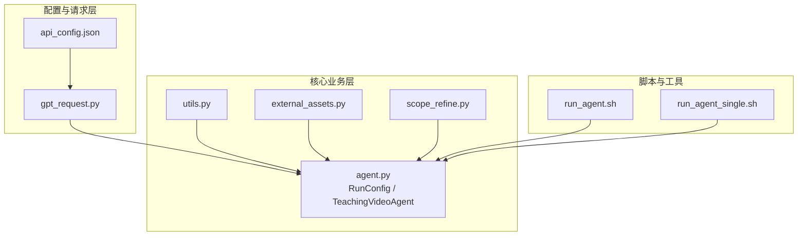
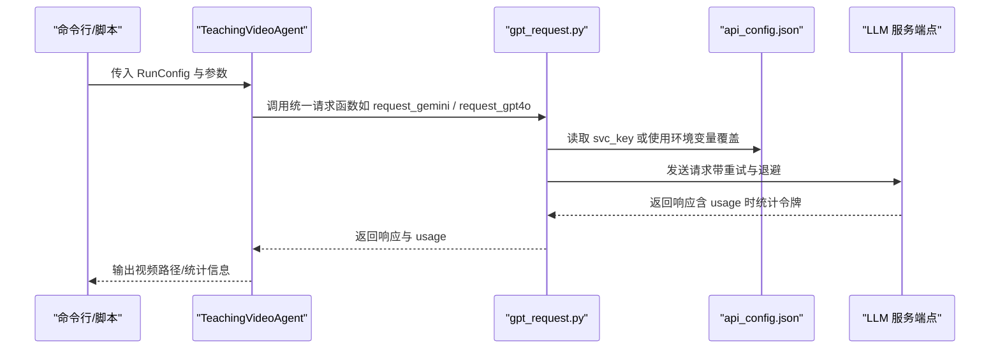
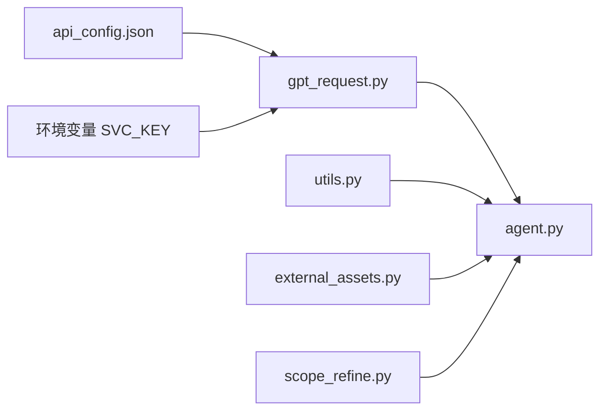

# 配置指南

<cite>
**本文引用的文件**
- [api_config.json](file://src/api_config.json)
- [gpt_request.py](file://src/gpt_request.py)
- [agent.py](file://src/agent.py)
- [utils.py](file://src/utils.py)
- [run_agent.sh](file://src/run_agent.sh)
- [run_agent_single.sh](file://src/run_agent_single.sh)
- [external_assets.py](file://src/external_assets.py)
- [scope_refine.py](file://src/scope_refine.py)
</cite>

## 目录
1. [简介](#简介)
2. [项目结构](#项目结构)
3. [核心组件](#核心组件)
4. [架构总览](#架构总览)
5. [详细组件分析](#详细组件分析)
6. [依赖关系分析](#依赖关系分析)
7. [性能考量](#性能考量)
8. [故障排查指南](#故障排查指南)
9. [结论](#结论)
10. [附录](#附录)

## 简介
本指南面向需要在本地或云端部署“代码转视频”工作流的用户，系统性解析以下内容：
- api_config.json 的结构与字段含义：LLM 服务端点、API 密钥、模型选择策略、请求重试与令牌统计等。
- RunConfig 类中各参数的作用：视频生成流程控制、资源与并发策略、反馈优化轮次等。
- 如何通过环境变量覆盖默认配置，实现灵活部署与多环境适配。
- 多种配置场景示例：高性能模式、低成本模式、离线调试模式。
- 不同 LLM（GPT-4、Gemini、Claude）的配置差异与性能对比要点。
- 自定义提示词模板的方法，以适配特定教学风格。
- 配置验证方法与常见配置错误的解决方案。

## 项目结构
该仓库采用“按职责分层”的组织方式：
- 配置与请求层：api_config.json 提供 LLM 供应商配置；gpt_request.py 封装统一的请求接口与重试逻辑。
- 核心业务层：agent.py 定义 RunConfig、TeachingVideoAgent 等核心类，串联大纲生成、故事板、代码生成、渲染与合并等流程。
- 工具与脚本：utils.py 提供通用工具函数；run_agent*.sh 提供便捷的批量/单次执行入口。
- 资源与外部能力：external_assets.py 支持图标下载增强；scope_refine.py 提供代码级错误诊断与修复建议。

图表来源
- [api_config.json](file://src/api_config.json#L1-L40)
- [gpt_request.py](file://src/gpt_request.py#L1-L120)
- [agent.py](file://src/agent.py#L43-L122)
- [utils.py](file://src/utils.py#L1-L90)
- [external_assets.py](file://src/external_assets.py#L135-L166)
- [scope_refine.py](file://src/scope_refine.py#L45-L131)
- [run_agent.sh](file://src/run_agent.sh#L1-L40)
- [run_agent_single.sh](file://src/run_agent_single.sh#L1-L49)

章节来源
- [api_config.json](file://src/api_config.json#L1-L40)
- [gpt_request.py](file://src/gpt_request.py#L1-L120)
- [agent.py](file://src/agent.py#L43-L122)
- [utils.py](file://src/utils.py#L1-L90)
- [external_assets.py](file://src/external_assets.py#L135-L166)
- [scope_refine.py](file://src/scope_refine.py#L45-L131)
- [run_agent.sh](file://src/run_agent.sh#L1-L40)
- [run_agent_single.sh](file://src/run_agent_single.sh#L1-L49)

## 核心组件
- api_config.json：集中管理各 LLM 供应商的基础地址、版本、密钥与模型名称，支持通过环境变量覆盖。
- gpt_request.py：封装统一的请求函数族，负责读取配置、构造客户端、发送请求、指数退避重试、统计令牌用量。
- agent.py：定义 RunConfig 数据类与 TeachingVideoAgent 主流程类，贯穿“大纲-故事板-代码-渲染-合并”全流程，并支持 MLLM 反馈优化。
- utils.py：提供资源监控、输出目录生成、Manim/FFmpeg 执行等辅助能力。
- run_agent*.sh：提供批量与单次执行的默认参数与入口。

章节来源
- [api_config.json](file://src/api_config.json#L1-L40)
- [gpt_request.py](file://src/gpt_request.py#L1-L120)
- [agent.py](file://src/agent.py#L43-L122)
- [utils.py](file://src/utils.py#L1-L90)
- [run_agent.sh](file://src/run_agent.sh#L1-L40)
- [run_agent_single.sh](file://src/run_agent_single.sh#L1-L49)

## 架构总览
下图展示从配置到请求再到业务流程的关键交互路径。

图表来源
- [agent.py](file://src/agent.py#L115-L133)
- [gpt_request.py](file://src/gpt_request.py#L18-L20)
- [api_config.json](file://src/api_config.json#L1-L40)

## 详细组件分析

### api_config.json 结构与字段说明
- 结构概览
  - 每个供应商键下包含基础地址、API 版本、密钥与模型名等字段。
  - 供应商键包括：gemini、gpt41、gpt5、gpto4mini、gpt4o、claude、iconfinder。
- 字段含义
  - base_url：供应商服务端点地址。
  - api_version：Azure OpenAI 兼容接口的 API 版本。
  - api_key：访问密钥。
  - model：具体使用的模型名称。
  - iconfinder.api_key：外部图标资源服务密钥（用于资产增强）。
- 环境变量覆盖机制
  - gpt_request.py 中的 cfg 函数优先读取环境变量 SVC_KEY（大写），否则回退到 api_config.json 对应键值。
  - 示例：若存在环境变量 GEMINI_BASE_URL，则覆盖 gemini.base_url。
- 请求超时与重试
  - gpt_request.py 内部对各请求函数实现了最大重试次数与指数退避延迟，提升稳定性。
- 令牌统计
  - 部分请求函数会返回 usage 信息，便于成本与用量统计。

章节来源
- [api_config.json](file://src/api_config.json#L1-L40)
- [gpt_request.py](file://src/gpt_request.py#L18-L20)
- [gpt_request.py](file://src/gpt_request.py#L368-L479)
- [gpt_request.py](file://src/gpt_request.py#L482-L613)
- [gpt_request.py](file://src/gpt_request.py#L616-L740)
- [gpt_request.py](file://src/gpt_request.py#L743-L854)
- [gpt_request.py](file://src/gpt_request.py#L857-L968)

### RunConfig 参数详解
- 作用域与默认值
  - use_feedback：是否启用 MLLM 反馈优化，默认开启。
  - use_assets：是否启用外部资产增强（图标下载等）。
  - api：注入的统一请求函数（由命令行参数选择）。
  - feedback_rounds：MLLM 反馈优化轮次。
  - iconfinder_api_key：外部图标服务密钥。
  - max_code_token_length：生成代码时的最大令牌长度。
  - max_fix_bug_tries：ScopeRefine 修复失败尝试次数。
  - max_regenerate_tries：重新生成失败尝试次数。
  - max_feedback_gen_code_tries：基于反馈生成代码的尝试次数。
  - max_mllm_fix_bugs_tries：MLLM 修复失败尝试次数。
- 在 TeachingVideoAgent 中的使用
  - 初始化时将 RunConfig 的字段赋给实例属性，贯穿后续流程。
  - 通过 _request_api_and_track_tokens 统计令牌用量，便于成本控制。

章节来源
- [agent.py](file://src/agent.py#L43-L55)
- [agent.py](file://src/agent.py#L70-L80)
- [agent.py](file://src/agent.py#L115-L133)

### 环境变量覆盖与灵活部署
- 覆盖规则
  - gpt_request.cfg(svc, key) 会优先读取环境变量 SVC_KEY（大写），否则回退到 api_config.json 中的 svc.key。
- 常见覆盖项
  - GEMINI_BASE_URL、GEMINI_API_VERSION、GEMINI_API_KEY、GEMINI_MODEL
  - GPT41_BASE_URL、GPT41_API_VERSION、GPT41_API_KEY、GPT41_MODEL
  - GPT5_BASE_URL、GPT5_API_VERSION、GPT5_API_KEY、GPT5_MODEL
  - GPT4OMINI_BASE_URL、GPT4OMINI_API_VERSION、GPT4OMINI_API_KEY、GPT4OMINI_MODEL
  - GPT4O_BASE_URL、GPT4O_API_VERSION、GPT4O_API_KEY、GPT4O_MODEL
  - CLAUDE_BASE_URL、CLAUDE_API_KEY
  - ICONFINDER_API_KEY
- 部署建议
  - 生产环境建议通过环境变量注入密钥与端点，避免将敏感信息提交到仓库。
  - 使用不同环境变量组合快速切换供应商与模型，便于灰度与压测。

章节来源
- [gpt_request.py](file://src/gpt_request.py#L18-L20)
- [api_config.json](file://src/api_config.json#L1-L40)

### 多配置场景示例
- 高性能模式
  - 选择高吞吐/高分辨率模型（如 gpt-4o、gpt-5、gemini-2.5-pro-preview-05-06）。
  - 增大 max_code_token_length 以支持更复杂的动画生成。
  - 启用 use_feedback 并适当提高 feedback_rounds。
  - 并发参数：根据机器核数调整并行组数与最大并发。
- 低成本模式
  - 选择轻量模型（如 o4-mini-2025-04-16）。
  - 降低 max_code_token_length，减少上下文开销。
  - 关闭 use_assets 或减少反馈轮次。
- 离线调试模式
  - 仅使用本地可用的最小化流程，关闭外部资产下载与 MLLM 反馈。
  - 通过命令行参数或脚本默认值快速启动单知识点测试。

章节来源
- [run_agent.sh](file://src/run_agent.sh#L1-L40)
- [run_agent_single.sh](file://src/run_agent_single.sh#L1-L49)
- [agent.py](file://src/agent.py#L842-L912)

### 不同 LLM 的配置差异与性能对比要点
- Gemini
  - 适用：多模态输入（视频+图片+文本）与高分辨率输出。
  - 配置：base_url、api_version、api_key、model。
  - 特性：支持 request_gemini_video_img 等多模态请求，便于 MLLM 视频反馈。
- GPT-4 系列
  - gpt-4o：适合通用对话与代码生成，支持多模态。
  - gpt-5：较新模型，适合复杂任务。
  - gpt-o4mini：轻量模型，适合快速迭代与低成本实验。
  - gpt-4.1：兼容旧版接口，适合迁移阶段。
- Claude
  - 适用：长文本与结构化输出，支持自定义头部。
  - 配置：base_url、api_key。
- 性能对比要点（基于实现与调用方式）
  - 多模态能力：Gemini 在视频+图像输入方面具备优势。
  - 令牌统计：部分请求函数返回 usage，便于成本评估。
  - 重试策略：均采用指数退避，提升稳定性。

章节来源
- [gpt_request.py](file://src/gpt_request.py#L124-L273)
- [gpt_request.py](file://src/gpt_request.py#L368-L479)
- [gpt_request.py](file://src/gpt_request.py#L482-L613)
- [gpt_request.py](file://src/gpt_request.py#L616-L740)
- [gpt_request.py](file://src/gpt_request.py#L743-L854)
- [gpt_request.py](file://src/gpt_request.py#L857-L968)

### 自定义提示词模板与教学风格适配
- 教学风格适配思路
  - 将教学目标、受众、知识背景等信息注入提示词，引导模型生成符合风格的动画与讲解。
  - 在生成代码前，先通过“大纲生成”和“故事板生成”阶段明确结构与节奏，再进入代码生成与渲染。
- 实现路径
  - 通过命令行参数传递知识主题与输出目录，结合 RunConfig 控制流程。
  - 若需深度定制，可在上游提示词构建模块中扩展模板变量与约束条件。

章节来源
- [agent.py](file://src/agent.py#L138-L188)
- [agent.py](file://src/agent.py#L190-L272)
- [agent.py](file://src/agent.py#L274-L294)

### 配置验证方法与常见错误
- 配置验证
  - 环境变量覆盖：确认 SVC_KEY 是否正确设置且大小写一致。
  - 基础连通性：检查 base_url 与 api_key 是否有效。
  - 令牌统计：通过返回的 usage 字段核对成本预算。
- 常见错误与解决
  - 环境变量未生效：检查大小写与命名格式（SVC_KEY）。
  - 视频/图片缺失：多模态请求要求本地存在对应文件，确保路径正确。
  - 渲染超时：适当增大超时时间或降低并发，检查系统资源占用。
  - 代码语法错误：借助 scope_refine 的错误分类与修复建议进行定位与修正。

章节来源
- [gpt_request.py](file://src/gpt_request.py#L18-L20)
- [gpt_request.py](file://src/gpt_request.py#L124-L191)
- [gpt_request.py](file://src/gpt_request.py#L192-L273)
- [scope_refine.py](file://src/scope_refine.py#L45-L131)
- [scope_refine.py](file://src/scope_refine.py#L257-L339)

## 依赖关系分析
- 组件耦合
  - gpt_request.py 依赖 api_config.json 与环境变量，向上游提供统一请求接口。
  - agent.py 依赖 gpt_request.py 的 api 函数与 utils 工具，向下协调渲染与合并。
  - external_assets.py 依赖 iconfinder 接口与 agent 注入的 api 函数，用于资产增强。
- 外部依赖
  - OpenAI 客户端、Azure OpenAI 兼容接口、Google GenAI 客户端等。

图表来源
- [api_config.json](file://src/api_config.json#L1-L40)
- [gpt_request.py](file://src/gpt_request.py#L1-L120)
- [agent.py](file://src/agent.py#L43-L122)
- [utils.py](file://src/utils.py#L1-L90)
- [external_assets.py](file://src/external_assets.py#L135-L166)
- [scope_refine.py](file://src/scope_refine.py#L45-L131)

## 性能考量
- 并发与资源
  - utils.get_optimal_workers 会根据 CPU 核心数动态计算最优并行进程数，避免内存溢出。
  - run_agent*.sh 提供并行组数与最大并发参数，便于批处理调度。
- 令牌与成本
  - 多数请求函数返回 usage，可用于成本估算与预算控制。
- 渲染质量与速度
  - 通过降低 max_code_token_length 与减少反馈轮次可显著降低成本与耗时。
  - 在保证质量的前提下，适度降低渲染分辨率与帧率可缩短生成时间。

章节来源
- [utils.py](file://src/utils.py#L53-L70)
- [run_agent.sh](file://src/run_agent.sh#L1-L40)
- [run_agent_single.sh](file://src/run_agent_single.sh#L1-L49)
- [gpt_request.py](file://src/gpt_request.py#L102-L107)
- [gpt_request.py](file://src/gpt_request.py#L462-L466)
- [gpt_request.py](file://src/gpt_request.py#L596-L600)
- [gpt_request.py](file://src/gpt_request.py#L723-L727)
- [gpt_request.py](file://src/gpt_request.py#L852-L854)

## 故障排查指南
- 环境变量未生效
  - 确认变量名格式为 SVC_KEY（大写），并与 api_config.json 中的键一致。
- 视频/图片文件缺失
  - 多模态请求要求本地存在对应文件，检查路径与权限。
- 渲染超时
  - 适当降低并发或增大超时时间；监控系统资源使用情况。
- 代码生成失败
  - 查看错误日志与 traceback，结合 scope_refine 的错误分类与修复建议进行修正。
- 成本异常
  - 核对 usage 字段与 max_code_token_length 设置，避免不必要的长上下文。

章节来源
- [gpt_request.py](file://src/gpt_request.py#L18-L20)
- [gpt_request.py](file://src/gpt_request.py#L124-L191)
- [gpt_request.py](file://src/gpt_request.py#L192-L273)
- [scope_refine.py](file://src/scope_refine.py#L291-L339)
- [utils.py](file://src/utils.py#L73-L89)

## 结论
通过 api_config.json 与 gpt_request.py 的统一配置与请求封装，结合 agent.py 的 RunConfig 与流程编排，本项目提供了灵活、可扩展的“代码转视频”工作流。利用环境变量覆盖与脚本默认参数，可在不同场景下快速切换供应商与模型，平衡性能与成本。配合令牌统计与错误诊断工具，可实现稳定可控的生产级部署。

## 附录
- 快速对照表（环境变量命名）
  - GEMINI_BASE_URL、GEMINI_API_VERSION、GEMINI_API_KEY、GEMINI_MODEL
  - GPT41_BASE_URL、GPT41_API_VERSION、GPT41_API_KEY、GPT41_MODEL
  - GPT5_BASE_URL、GPT5_API_VERSION、GPT5_API_KEY、GPT5_MODEL
  - GPT4OMINI_BASE_URL、GPT4OMINI_API_VERSION、GPT4OMINI_API_KEY、GPT4OMINI_MODEL
  - GPT4O_BASE_URL、GPT4O_API_VERSION、GPT4O_API_KEY、GPT4O_MODEL
  - CLAUDE_BASE_URL、CLAUDE_API_KEY
  - ICONFINDER_API_KEY