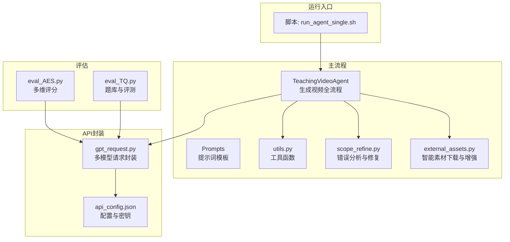
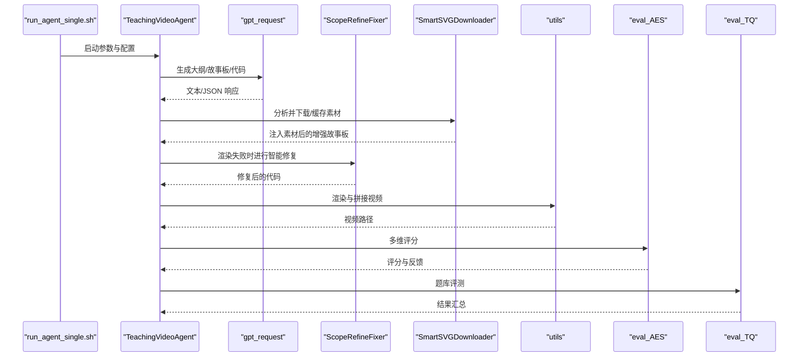
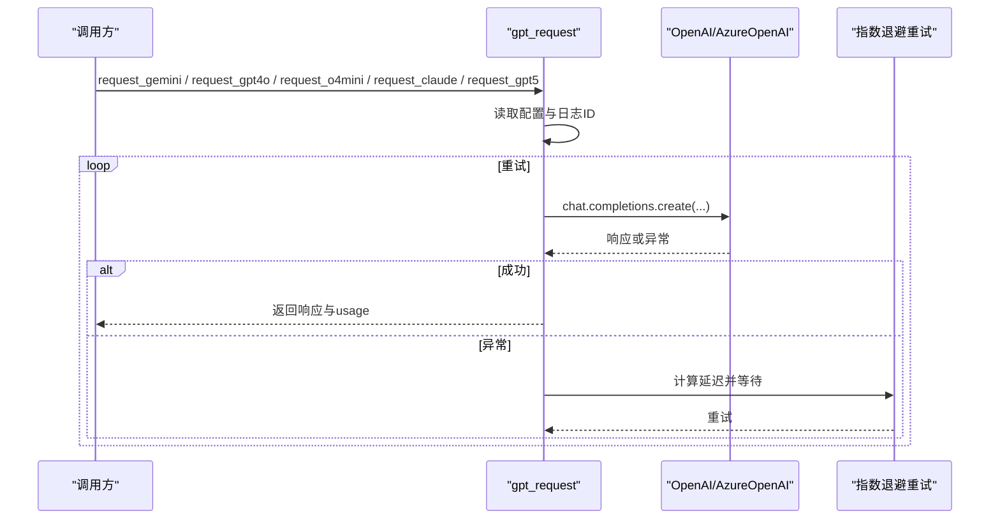
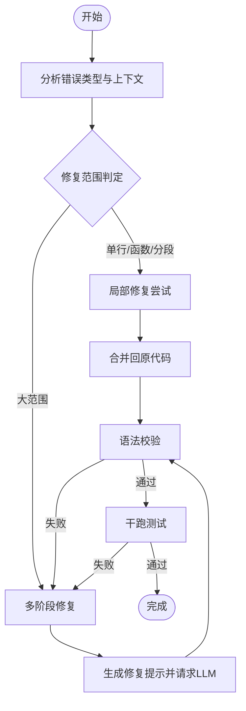
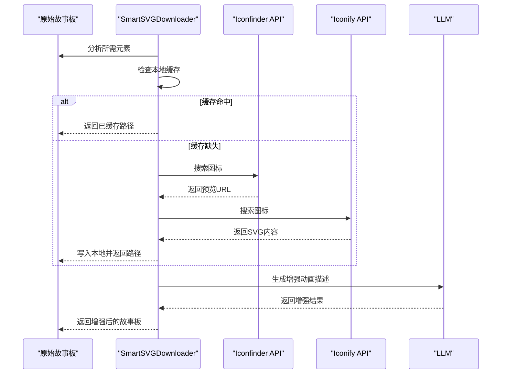
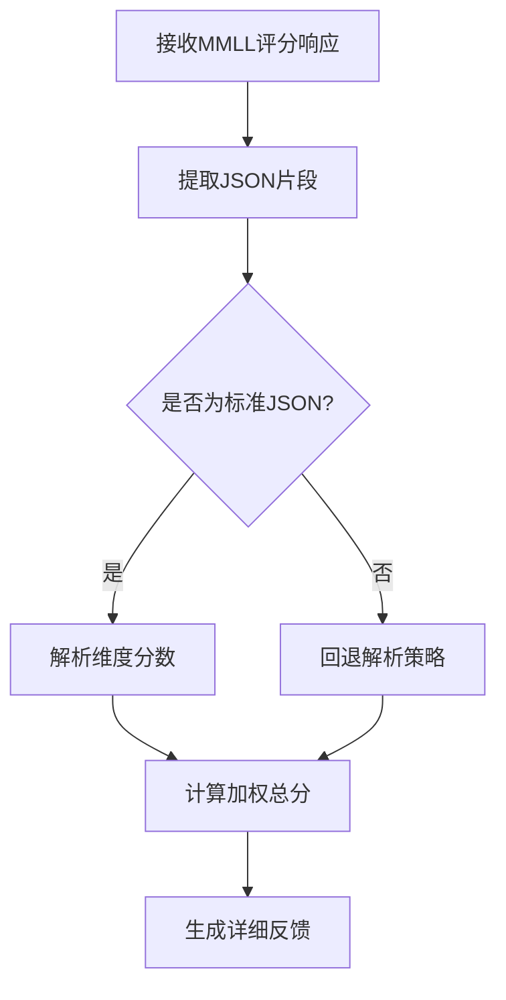
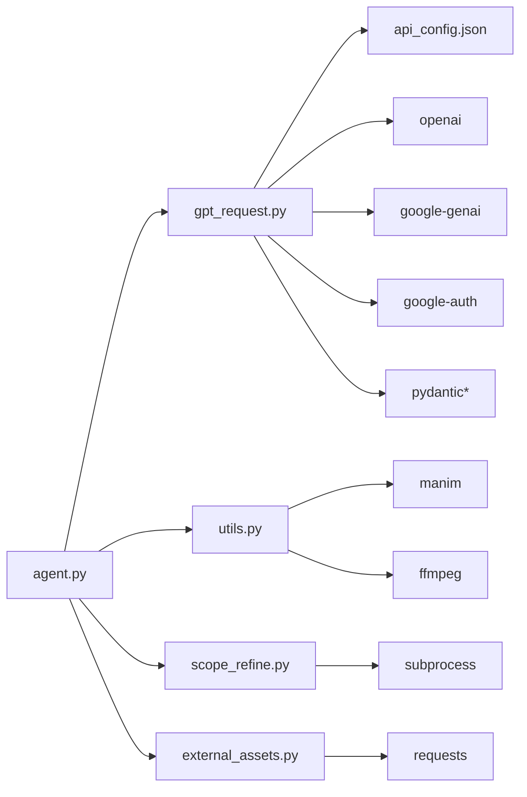

# 附录

<cite>
**本文引用的文件列表**
- [requirements.txt](file://src/requirements.txt)
- [gpt_request.py](file://src/gpt_request.py)
- [agent.py](file://src/agent.py)
- [utils.py](file://src/utils.py)
- [scope_refine.py](file://src/scope_refine.py)
- [external_assets.py](file://src/external_assets.py)
- [run_agent_single.sh](file://src/run_agent_single.sh)
- [api_config.json](file://src/api_config.json)
- [eval_AES.py](file://src/eval_AES.py)
- [eval_TQ.py](file://src/eval_TQ.py)
</cite>

## 目录
1. [简介](#简介)
2. [项目结构](#项目结构)
3. [核心组件](#核心组件)
4. [架构总览](#架构总览)
5. [详细组件分析](#详细组件分析)
6. [依赖关系分析](#依赖关系分析)
7. [性能考量](#性能考量)
8. [故障排查指南](#故障排查指南)
9. [结论](#结论)
10. [附录：补充资料](#附录补充资料)

## 简介
本附录面向项目维护者与使用者，提供补充性参考资料。内容包括：
- requirements.txt 中所有依赖包及其版本要求与核心作用说明
- 版本历史与升级注意事项（基于仓库内版本标注与依赖清单）
- 贡献指南（如何提交问题与改进）
- 第三方服务与许可信息
- 术语表与常见缩写对照
- 外部学习资源链接

## 项目结构
本项目采用“按功能模块划分”的组织方式，核心流程围绕“教学主题 -> 大纲 -> 故事板 -> 代码生成 -> 渲染 -> 合成视频”展开；同时集成多模态大模型（LLM/MMLL）进行布局反馈与评估。

图表来源
- [run_agent_single.sh](file://src/run_agent_single.sh#L1-L48)
- [agent.py](file://src/agent.py#L1-L120)
- [gpt_request.py](file://src/gpt_request.py#L1-L120)
- [api_config.json](file://src/api_config.json#L1-L39)
- [utils.py](file://src/utils.py#L1-L120)
- [scope_refine.py](file://src/scope_refine.py#L1-L120)
- [external_assets.py](file://src/external_assets.py#L1-L120)
- [eval_AES.py](file://src/eval_AES.py#L161-L183)
- [eval_TQ.py](file://src/eval_TQ.py#L101-L124)

章节来源
- [run_agent_single.sh](file://src/run_agent_single.sh#L1-L48)
- [agent.py](file://src/agent.py#L1-L120)

## 核心组件
- TeachingVideoAgent：主控制器，负责从主题到最终视频的全链路编排，含大纲生成、故事板增强、代码生成、渲染、反馈优化与视频合并。
- gpt_request：统一的多模型请求封装，支持 Gemini、Claude、GPT-4o、o4-mini、gpt-5 等，内置重试与令牌用量统计。
- scope_refine：智能代码错误分析与修复，支持逐行/函数/分段修复与多阶段验证。
- external_assets：智能素材下载与增强，支持 Iconfinder 与 Iconify，自动缓存与资产注入。
- utils：通用工具，如 JSON 提取、资源监控、并行策略、ffmpeg 拼接等。
- 评估模块：eval_AES 与 eval_TQ，分别用于多维评分与选择性知识消解评测。

章节来源
- [agent.py](file://src/agent.py#L1-L120)
- [gpt_request.py](file://src/gpt_request.py#L1-L120)
- [scope_refine.py](file://src/scope_refine.py#L1-L120)
- [external_assets.py](file://src/external_assets.py#L1-L120)
- [utils.py](file://src/utils.py#L1-L120)
- [eval_AES.py](file://src/eval_AES.py#L161-L183)
- [eval_TQ.py](file://src/eval_TQ.py#L101-L124)

## 架构总览
下图展示从脚本入口到渲染与评估的关键交互路径。

图表来源
- [run_agent_single.sh](file://src/run_agent_single.sh#L1-L48)
- [agent.py](file://src/agent.py#L120-L260)
- [gpt_request.py](file://src/gpt_request.py#L1-L120)
- [scope_refine.py](file://src/scope_refine.py#L480-L573)
- [external_assets.py](file://src/external_assets.py#L1-L120)
- [utils.py](file://src/utils.py#L138-L174)
- [eval_AES.py](file://src/eval_AES.py#L161-L183)
- [eval_TQ.py](file://src/eval_TQ.py#L101-L124)

## 详细组件分析

### 组件A：依赖清单与版本要求
本节对 requirements.txt 中的依赖进行分类与作用说明，并给出版本历史与升级注意事项。

- 核心 API 与数据处理
  - openai==1.90.0：LLM API 调用（GPT、Claude、Gemini 等）
  - requests==2.32.4：HTTP 请求，用于素材下载
  - numpy==2.2.6、scipy==1.15.3：数值计算与统计
  - psutil==7.0.0：系统资源监控
  - python-dotenv==1.1.0：环境变量管理

- Manim 动画框架（核心）
  - manim==0.19.0：核心动画库
  - ManimPango==0.6.0：文本渲染

- 图形与多媒体
  - pillow==11.2.1：图像处理
  - opencv-python==4.12.0.88：视频/图像处理
  - moviepy==2.2.1：视频操作
  - imageio==2.37.0、imageio-ffmpeg==0.6.0：图像 I/O 与 FFmpeg 封装
  - pydub==0.25.1：音频处理

- 3D 图形与渲染（Manim 依赖）
  - moderngl==5.12.0、moderngl-window==3.1.1、glcontext==3.0.0：OpenGL 渲染管线
  - pyglet==2.1.6：窗口与多媒体
  - PyOpenGL==3.1.9、pycairo==1.28.0：OpenGL 绑定与矢量图形
  - skia-pathops==0.8.0.post2、svgelements==1.9.6、mapbox_earcut==1.0.3、isosurfaces==0.1.2：路径运算、SVG 元素、三角剖分、3D 表面

- CLI 与终端工具
  - click==8.2.1、cloup==3.0.7：命令行接口
  - rich==14.0.0：终端格式化
  - tqdm==4.67.1：进度条
  - watchdog==6.0.0：文件系统监控

- 数学与科学计算
  - networkx==3.5、sympy==1.14.0、mpmath==1.3.0：图论、符号数学、高精度数学

- 数据解析与序列化
  - beautifulsoup4==4.13.4、PyYAML==6.0.2、regex==2025.7.34：HTML/XML 解析、YAML、正则

- HTTP 与网络栈
  - certifi==2025.6.15、charset-normalizer==3.4.3、idna==3.10、urllib3==2.5.0、h11==0.16.0、httpcore==1.0.9、httpx==0.28.1、anyio==4.9.0、sniffio==1.3.1：现代 HTTP 客户端栈

- API 客户端依赖（间接依赖 openai/google-genai）
  - google-genai==1.32.0、google-auth==2.40.3：Google Gemini 客户端与认证
  - pydantic==2.11.7、pydantic_core==2.33.2、annotated-types==0.7.0、typing_extensions==4.14.0、jiter==0.10.0：数据校验与类型支持
  - pyasn1==0.6.1、pyasn1_modules==0.4.2、rsa==4.9.1、cachetools==5.5.2：ASN.1、RSA 加密、缓存

- 模板与标记处理
  - Jinja2==3.1.6、MarkupSafe==3.0.2、markdown-it-py==3.0.0、mdurl==0.1.2、Pygments==2.19.1：模板引擎、安全字符串、Markdown 解析与语法高亮

- 实用工具
  - decorator==5.2.1、packaging==25.0：装饰器、版本解析

- 已移除依赖（说明）
  - 机器学习/深度学习：未使用，移除
  - NVIDIA CUDA：无 GPU 运行需求，移除
  - Hugging Face 生态：未使用，移除
  - 其他未使用工具：av、s-tui、urwid、websockets、yt-dlp、srt、proglog、Cython、distro、filelock、fsspec、tenacity、screeninfo、pyglm 等

版本历史与升级注意事项
- 最后更新时间：2025-11-05
- 重要依赖版本与用途：
  - openai==1.90.0：用于多模型统一调用（AzureOpenAI），需配合 api_config.json 的 base_url、api_version、api_key、model 字段
  - google-genai==1.32.0：Gemini 客户端，需 google-auth 与 pydantic 系列支持
  - manim==0.19.0：与 ManimPango、OpenGL/窗口相关依赖配套使用
  - httpx==0.28.1、httpcore==1.0.9、anyio==4.9.0：现代异步 HTTP 客户端栈，确保与 openai 的兼容
  - tqdm==4.67.1、rich==14.0.0：终端体验友好
  - psutil==7.0.0：在高并发渲染场景下监控系统负载
- 升级建议：
  - openai/gemini 客户端升级需同步检查 AzureOpenAI 参数与响应结构
  - manim 与 OpenGL 依赖升级需验证渲染稳定性与兼容性
  - httpx 及其子依赖升级需关注异步行为变化
  - 若更换模型或服务端点，务必更新 api_config.json 对应字段

章节来源
- [requirements.txt](file://src/requirements.txt#L1-L139)
- [gpt_request.py](file://src/gpt_request.py#L1-L120)
- [api_config.json](file://src/api_config.json#L1-L39)

### 组件B：API 请求封装与重试机制
- 支持模型：Gemini、Claude、GPT-4o、o4-mini、gpt-5
- 统一重试策略：指数退避 + 抖动，最大重试次数可配置
- 令牌用量统计：通过 completion.usage 返回值累加 prompt/completion/total tokens
- 日志追踪：X-TT-LOGID 头部便于跨服务追踪

图表来源
- [gpt_request.py](file://src/gpt_request.py#L1-L120)
- [gpt_request.py](file://src/gpt_request.py#L368-L419)
- [gpt_request.py](file://src/gpt_request.py#L482-L543)
- [gpt_request.py](file://src/gpt_request.py#L545-L613)
- [gpt_request.py](file://src/gpt_request.py#L616-L673)
- [gpt_request.py](file://src/gpt_request.py#L675-L740)
- [gpt_request.py](file://src/gpt_request.py#L743-L800)

章节来源
- [gpt_request.py](file://src/gpt_request.py#L1-L120)
- [gpt_request.py](file://src/gpt_request.py#L368-L419)
- [gpt_request.py](file://src/gpt_request.py#L482-L543)
- [gpt_request.py](file://src/gpt_request.py#L545-L613)
- [gpt_request.py](file://src/gpt_request.py#L616-L673)
- [gpt_request.py](file://src/gpt_request.py#L675-L740)
- [gpt_request.py](file://src/gpt_request.py#L743-L800)

### 组件C：智能代码修复与干跑测试
- 错误分析：根据错误类型（NameError、AttributeError、TypeError 等）定位行号、上下文、建议修复
- 修复策略：优先局部修复（单行/函数/分段），失败则多阶段验证修复（语法校验 -> 干跑测试 -> 返回修复代码）
- 干跑测试：构造最小可执行场景快速验证修复有效性

图表来源
- [scope_refine.py](file://src/scope_refine.py#L1-L120)
- [scope_refine.py](file://src/scope_refine.py#L480-L573)
- [scope_refine.py](file://src/scope_refine.py#L574-L670)

章节来源
- [scope_refine.py](file://src/scope_refine.py#L1-L120)
- [scope_refine.py](file://src/scope_refine.py#L480-L573)
- [scope_refine.py](file://src/scope_refine.py#L574-L670)

### 组件D：智能素材下载与增强
- 自动分析故事板所需元素，优先本地缓存，缺失时调用 Iconfinder 或 Iconify 下载 PNG/SVG
- 将可用素材注入到故事板动画描述中，再请求 LLM 生成最终动画描述

图表来源
- [external_assets.py](file://src/external_assets.py#L1-L120)
- [external_assets.py](file://src/external_assets.py#L128-L183)

章节来源
- [external_assets.py](file://src/external_assets.py#L1-L120)
- [external_assets.py](file://src/external_assets.py#L128-L183)

### 组件E：评估模块（多维评分与题库评测）
- eval_AES：解析多维评分 JSON，计算加权总分并生成详细反馈
- eval_TQ：基于题库与评测 API，构建选择性知识消解评测流程

图表来源
- [eval_AES.py](file://src/eval_AES.py#L161-L183)
- [eval_AES.py](file://src/eval_AES.py#L212-L246)
- [eval_TQ.py](file://src/eval_TQ.py#L101-L124)

章节来源
- [eval_AES.py](file://src/eval_AES.py#L161-L183)
- [eval_AES.py](file://src/eval_AES.py#L212-L246)
- [eval_TQ.py](file://src/eval_TQ.py#L101-L124)

## 依赖关系分析
- 直接依赖：agent.py 导入 gpt_request、utils、scope_refine、external_assets
- 间接依赖：gpt_request 依赖 openai、google-genai、google-auth、pydantic 等
- 渲染与媒体：utils 调用 manim 与 ffmpeg，scope_refine 调用 subprocess
- 素材下载：external_assets 使用 requests 与 api_config.json 中的 Iconfinder 密钥

图表来源
- [agent.py](file://src/agent.py#L1-L120)
- [gpt_request.py](file://src/gpt_request.py#L1-L120)
- [utils.py](file://src/utils.py#L138-L174)
- [scope_refine.py](file://src/scope_refine.py#L1-L120)
- [external_assets.py](file://src/external_assets.py#L1-L120)
- [api_config.json](file://src/api_config.json#L1-L39)

章节来源
- [agent.py](file://src/agent.py#L1-L120)
- [gpt_request.py](file://src/gpt_request.py#L1-L120)
- [utils.py](file://src/utils.py#L138-L174)
- [scope_refine.py](file://src/scope_refine.py#L1-L120)
- [external_assets.py](file://src/external_assets.py#L1-L120)
- [api_config.json](file://src/api_config.json#L1-L39)

## 性能考量
- 并发与资源：get_optimal_workers 基于 CPU 核心数动态调整进程数，避免内存溢出
- 渲染质量：命令行参数可切换低/中/高质量渲染，平衡速度与效果
- I/O 与网络：素材下载与 API 请求均具备超时与重试策略
- 评估开销：多维评分与题库评测建议串行或小批量执行，避免模型限流

章节来源
- [utils.py](file://src/utils.py#L53-L90)
- [utils.py](file://src/utils.py#L138-L174)
- [gpt_request.py](file://src/gpt_request.py#L1-L120)

## 故障排查指南
- API 调用失败
  - 检查 api_config.json 的 base_url、api_version、api_key、model 是否正确
  - 查看 X-TT-LOGID 以便定位日志
  - 关注重试次数与延迟，必要时降低并发
- 渲染失败
  - 使用 scope_refine 的智能修复与干跑测试定位问题
  - 检查 manim 版本与 OpenGL 依赖是否匹配
- 素材下载失败
  - 检查 Iconfinder API Key 与网络连通性
  - 切换 Iconify 作为备选
- 评估异常
  - 确认 JSON 解析逻辑与正则匹配是否覆盖所有响应格式

章节来源
- [api_config.json](file://src/api_config.json#L1-L39)
- [gpt_request.py](file://src/gpt_request.py#L1-L120)
- [scope_refine.py](file://src/scope_refine.py#L480-L573)
- [external_assets.py](file://src/external_assets.py#L128-L183)
- [eval_AES.py](file://src/eval_AES.py#L161-L183)

## 结论
本附录梳理了项目的依赖清单、版本与用途、关键流程与组件交互、评估与评测模块，并提供了故障排查与性能优化建议。建议在升级依赖前先验证渲染与 API 调用的兼容性，并完善配置文件与密钥管理。

## 附录：补充资料

### 依赖清单与核心作用（摘要）
- openai==1.90.0：统一 LLM 客户端，支持 AzureOpenAI
- google-genai==1.32.0、google-auth==2.40.3：Gemini 客户端与认证
- manim==0.19.0、ManimPango==0.6.0：动画渲染与文本渲染
- moderngl/pyglet/PyOpenGL 等：OpenGL 渲染管线
- requests==2.32.4：素材下载
- moviepy==2.2.1、imageio==2.37.0、imageio-ffmpeg==0.6.0：视频/图像处理
- tqdm==4.67.1、rich==14.0.0：终端体验
- psutil==7.0.0：系统资源监控
- pydantic*：数据校验与类型支持
- httpx/httpcore/anyio：现代异步 HTTP 客户端栈

章节来源
- [requirements.txt](file://src/requirements.txt#L1-L139)
- [gpt_request.py](file://src/gpt_request.py#L1-L120)

### 版本历史与升级注意事项
- 最后更新：2025-11-05
- 升级要点：
  - openai/gemini 客户端升级需同步检查 AzureOpenAI 参数与响应结构
  - manim 与 OpenGL 依赖升级需验证渲染稳定性
  - httpx 及其子依赖升级需关注异步行为变化
  - 更换模型或服务端点时，务必更新 api_config.json

章节来源
- [requirements.txt](file://src/requirements.txt#L1-L139)
- [gpt_request.py](file://src/gpt_request.py#L1-L120)
- [api_config.json](file://src/api_config.json#L1-L39)

### 贡献指南
- 提交问题（Bug 报告）
  - 在仓库 Issues 中创建新 Issue，附带：
    - 环境信息（Python 版本、操作系统、manim/openai/gemini 版本）
    - 复现步骤与期望/实际结果
    - 相关日志（含 X-TT-LOGID）
    - 最小可复现示例（尽量精简）
- 功能请求（Feature Request）
  - 描述背景、目标与预期收益
  - 提供可能的实现思路或替代方案
- 代码贡献（Pull Request）
  - 遵循现有代码风格与模块职责
  - 新增功能需附带单元测试或演示用例
  - 更新依赖或配置时，明确说明影响范围与升级注意事项
  - 提交前确保本地渲染与 API 调用正常

[本节为通用指南，不直接分析具体文件，故无章节来源]

### 第三方服务与许可信息
- Iconfinder API：需要有效 API Key 才能下载 PNG；服务条款与许可以官方为准
- Iconify API：免费搜索与获取 SVG；服务条款与许可以官方为准
- Gemini API：通过 google-genai 与 google-auth 访问；服务条款与许可以官方为准
- 其他依赖均为开源项目，遵循各自许可证；请在发布前核对许可证兼容性

章节来源
- [external_assets.py](file://src/external_assets.py#L128-L183)
- [api_config.json](file://src/api_config.json#L1-L39)

### 术语表
- LLM：大语言模型
- MLLM：多模态大模型（支持文本/图像/视频等）
- Manim：数学动画渲染框架
- SVG：可缩放矢量图形
- AES：多维评分（Element Layout、Attractiveness、Logic Flow、Accuracy & Depth、Visual Consistency）
- TQ：题库评测（Test & Question）

章节来源
- [eval_AES.py](file://src/eval_AES.py#L161-L183)
- [eval_AES.py](file://src/eval_AES.py#L212-L246)
- [eval_TQ.py](file://src/eval_TQ.py#L101-L124)

### 常见缩写对照
- LLM：大语言模型
- MLLM：多模态大模型
- Manim：动画渲染框架
- SVG：可缩放矢量图形
- AES：多维评分
- TQ：题库评测
- API：应用程序接口
- CLI：命令行界面
- GPU：图形处理器
- FFmpeg：音视频处理工具链

[本节为概念性汇总，不直接分析具体文件，故无章节来源]

### 外部学习资源链接
- Manim 官方文档与教程
- OpenAI API 文档与示例
- Google Gemini 官方文档与认证指南
- FFmpeg 官方文档与常用命令
- Python requests 库文档
- Jinja2 模板引擎文档
- Pydantic 数据验证文档

[本节为概念性汇总，不直接分析具体文件，故无章节来源]