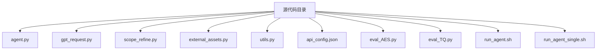
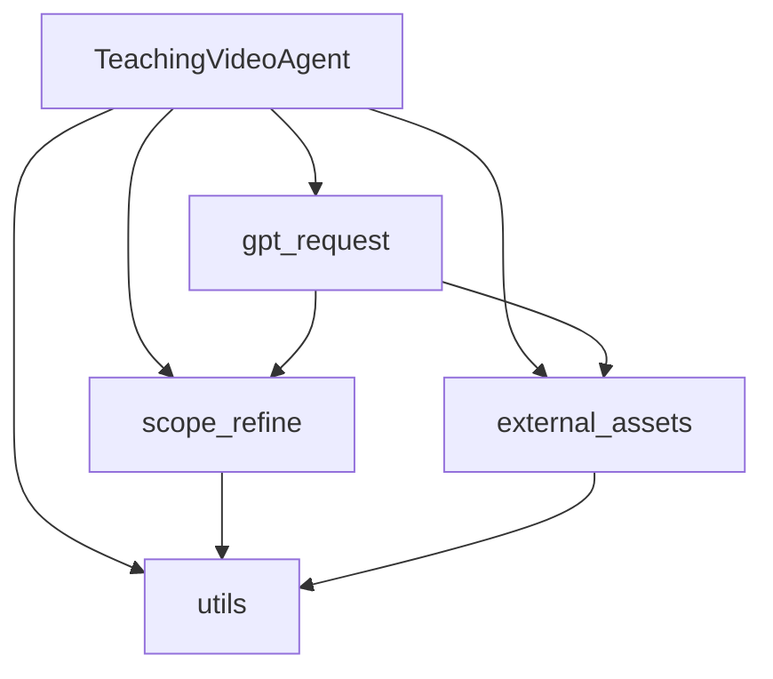
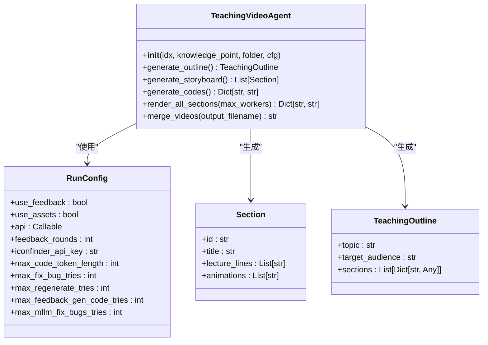
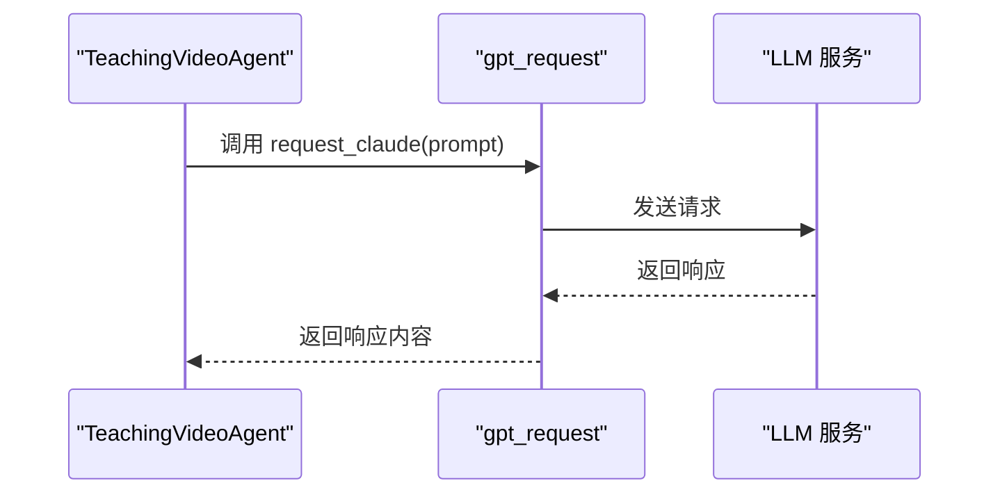
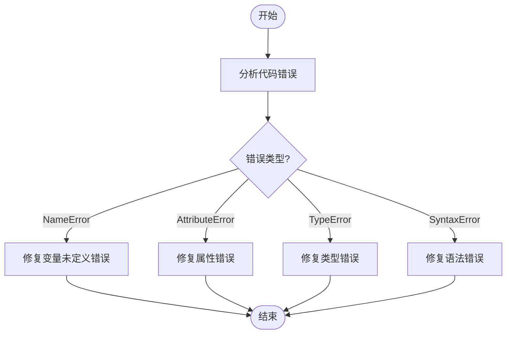
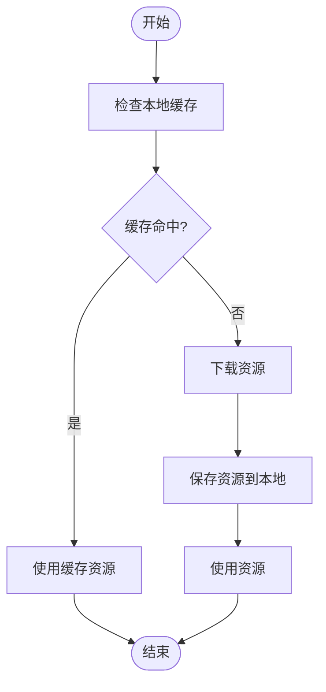
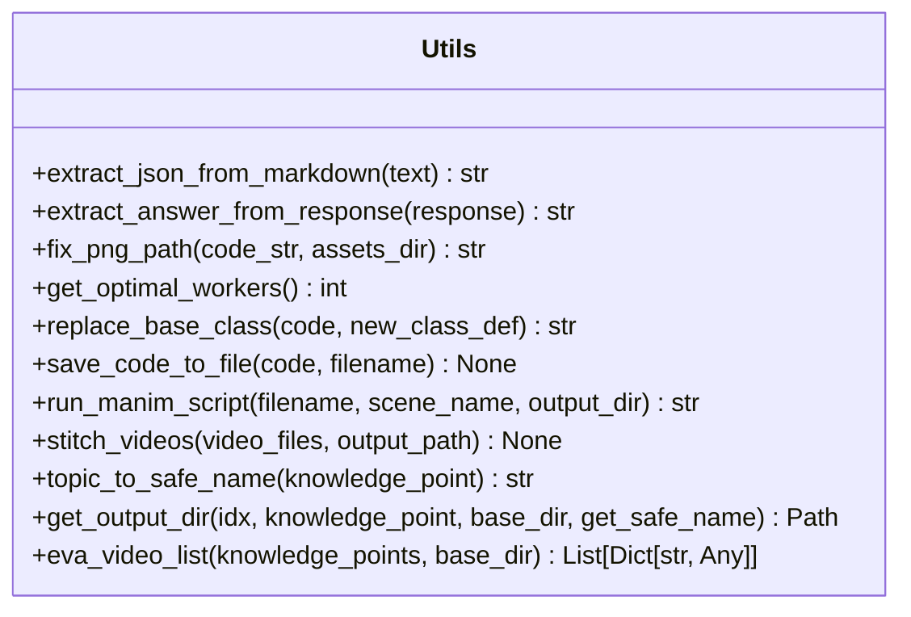
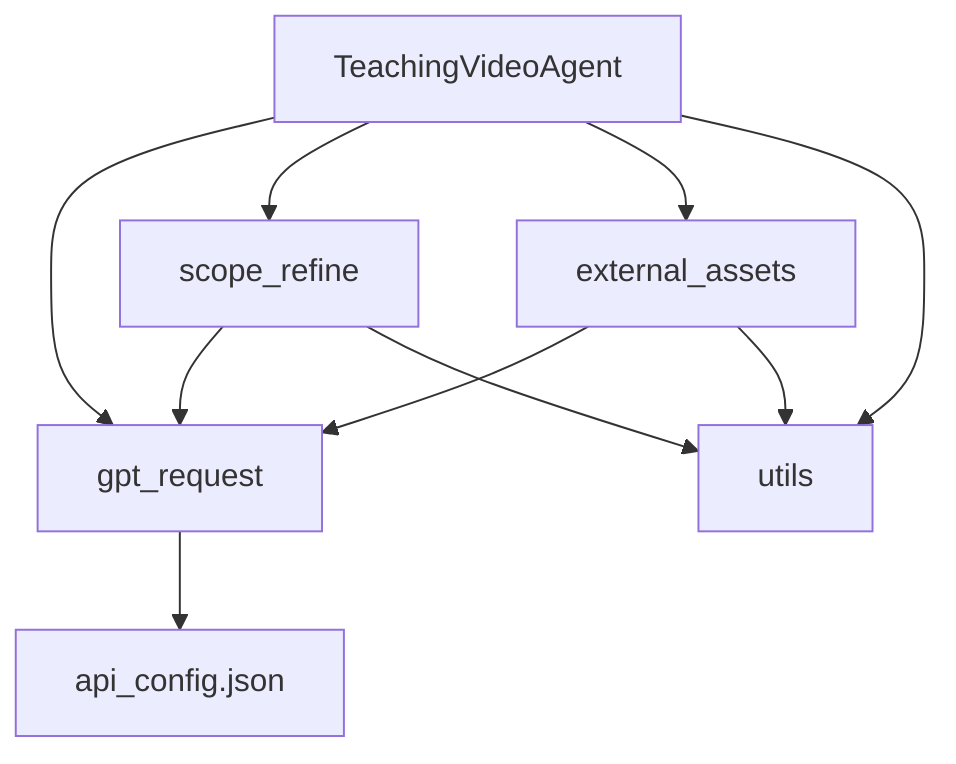

# 项目概述

<cite>
**本文档引用的文件**   
- [agent.py](file://src/agent.py)
- [gpt_request.py](file://src/gpt_request.py)
- [scope_refine.py](file://src/scope_refine.py)
- [external_assets.py](file://src/external_assets.py)
- [utils.py](file://src/utils.py)
- [api_config.json](file://src/api_config.json)
- [eval_AES.py](file://src/eval_AES.py)
- [eval_TQ.py](file://src/eval_TQ.py)
- [run_agent.sh](file://src/run_agent.sh)
</cite>

## 目录
1. [引言](#引言)
2. [项目结构](#项目结构)
3. [核心组件](#核心组件)
4. [系统架构概述](#系统架构概述)
5. [详细组件分析](#详细组件分析)
6. [依赖关系分析](#依赖关系分析)
7. [性能考量](#性能考量)
8. [故障排除指南](#故障排除指南)
9. [结论](#结论)

## 引言
Code2Video 是一个创新的自动化教学视频生成工具，旨在通过结合大型语言模型（LLM）与 Manim 动画框架，将知识要点自动转化为高质量的教育视频。该项目的核心目标是为教育内容创作者、开发者和研究人员提供一个高效、智能的解决方案，以简化教学视频的制作流程。通过自动化生成视频内容，Code2Video 不仅能够显著降低制作成本和时间，还能确保视频内容的准确性和一致性。该工具特别适用于需要频繁更新或大规模生产的教育内容场景，如在线课程、MOOCs 和企业培训。

## 项目结构
Code2Video 项目的目录结构清晰，主要由 `src` 目录下的多个 Python 文件组成，每个文件负责不同的功能模块。`src` 目录包含了核心的 `agent.py` 文件，它是整个系统的主控模块，负责协调各个组件的工作。此外，还有 `gpt_request.py` 用于处理与 LLM 的 API 请求，`scope_refine.py` 用于代码错误分析和修复，`external_assets.py` 用于下载和管理外部资源，`utils.py` 提供了各种实用函数，`api_config.json` 存储了 API 配置信息，`eval_AES.py` 和 `eval_TQ.py` 用于视频评估，以及 `run_agent.sh` 和 `run_agent_single.sh` 脚本用于启动和运行代理。

**图源**
- [agent.py](file://src/agent.py)
- [gpt_request.py](file://src/gpt_request.py)
- [scope_refine.py](file://src/scope_refine.py)
- [external_assets.py](file://src/external_assets.py)
- [utils.py](file://src/utils.py)
- [api_config.json](file://src/api_config.json)
- [eval_AES.py](file://src/eval_AES.py)
- [eval_TQ.py](file://src/eval_TQ.py)
- [run_agent.sh](file://src/run_agent.sh)
- [run_agent_single.sh](file://src/run_agent_single.sh)

## 核心组件
Code2Video 的核心组件包括 `TeachingVideoAgent` 类，它负责整个视频生成流程的管理和协调。`TeachingVideoAgent` 通过调用 `gpt_request.py` 中的函数与 LLM 进行交互，获取生成视频所需的代码和内容。`scope_refine.py` 模块中的 `ScopeRefineFixer` 类负责分析和修复生成的 Manim 代码中的错误，确保代码的正确性。`external_assets.py` 模块中的 `SmartSVGDownloader` 类负责下载和管理外部资源，如图标和图片，以增强视频的视觉效果。`utils.py` 模块提供了各种实用函数，如代码格式化、资源路径处理等，支持其他模块的功能实现。

**组件源**
- [agent.py](file://src/agent.py#L57-L800)
- [gpt_request.py](file://src/gpt_request.py#L1-L800)
- [scope_refine.py](file://src/scope_refine.py#L250-L800)
- [external_assets.py](file://src/external_assets.py#L10-L220)
- [utils.py](file://src/utils.py#L1-L210)

## 系统架构概述
Code2Video 的系统架构设计为模块化和分层结构，确保了系统的可扩展性和维护性。系统的主要组件包括 `TeachingVideoAgent`、`gpt_request`、`scope_refine`、`external_assets` 和 `utils`。`TeachingVideoAgent` 作为主控模块，负责协调各个组件的工作。`gpt_request` 模块处理与 LLM 的 API 请求，获取生成视频所需的代码和内容。`scope_refine` 模块负责分析和修复生成的 Manim 代码中的错误。`external_assets` 模块负责下载和管理外部资源，以增强视频的视觉效果。`utils` 模块提供了各种实用函数，支持其他模块的功能实现。

**图源**
- [agent.py](file://src/agent.py#L57-L800)
- [gpt_request.py](file://src/gpt_request.py#L1-L800)
- [scope_refine.py](file://src/scope_refine.py#L250-L800)
- [external_assets.py](file://src/external_assets.py#L10-L220)
- [utils.py](file://src/utils.py#L1-L210)

## 详细组件分析
### TeachingVideoAgent 分析
`TeachingVideoAgent` 类是 Code2Video 的核心组件，负责整个视频生成流程的管理和协调。它通过调用 `gpt_request.py` 中的函数与 LLM 进行交互，获取生成视频所需的代码和内容。`TeachingVideoAgent` 的主要方法包括 `generate_outline`、`generate_storyboard`、`generate_codes`、`render_all_sections` 和 `merge_videos`，这些方法分别负责生成教学大纲、故事板、代码、渲染视频和合并视频。

#### 类图

**图源**
- [agent.py](file://src/agent.py#L57-L800)

### gpt_request 模块分析
`gpt_request.py` 模块负责处理与 LLM 的 API 请求，获取生成视频所需的代码和内容。该模块提供了多个函数，如 `request_claude`、`request_gemini`、`request_gpt4o` 等，用于与不同的 LLM 服务进行交互。这些函数通过配置文件 `api_config.json` 中的 API 密钥和端点信息，发送请求并接收响应。

#### 序列图

**图源**
- [gpt_request.py](file://src/gpt_request.py#L1-L800)

### scope_refine 模块分析
`scope_refine.py` 模块负责分析和修复生成的 Manim 代码中的错误。该模块中的 `ScopeRefineFixer` 类通过调用 `ManimCodeErrorAnalyzer` 类，智能地分析代码错误并提供修复建议。`ScopeRefineFixer` 类还提供了 `fix_code_smart` 方法，用于尝试修复代码中的错误。

#### 流程图

**图源**
- [scope_refine.py](file://src/scope_refine.py#L250-L800)

### external_assets 模块分析
`external_assets.py` 模块负责下载和管理外部资源，如图标和图片，以增强视频的视觉效果。该模块中的 `SmartSVGDownloader` 类通过调用 `Iconfinder` 和 `Iconify` API，下载所需的资源并保存到本地目录。

#### 流程图

**图源**
- [external_assets.py](file://src/external_assets.py#L10-L220)

### utils 模块分析
`utils.py` 模块提供了各种实用函数，支持其他模块的功能实现。这些函数包括 `extract_json_from_markdown`、`extract_answer_from_response`、`fix_png_path`、`get_optimal_workers` 等，用于处理 JSON 数据、提取响应内容、修复 PNG 路径和计算最优工作线程数。

#### 类图

**图源**
- [utils.py](file://src/utils.py#L1-L210)

## 依赖关系分析
Code2Video 项目的各个模块之间存在紧密的依赖关系。`TeachingVideoAgent` 依赖于 `gpt_request`、`scope_refine`、`external_assets` 和 `utils` 模块，这些模块共同支持视频生成流程的各个阶段。`gpt_request` 模块依赖于 `api_config.json` 文件中的 API 配置信息，`scope_refine` 模块依赖于 `gpt_request` 模块来获取 LLM 的响应，`external_assets` 模块依赖于 `gpt_request` 模块来下载外部资源，`utils` 模块则为其他模块提供通用的实用函数。

**图源**
- [agent.py](file://src/agent.py#L57-L800)
- [gpt_request.py](file://src/gpt_request.py#L1-L800)
- [scope_refine.py](file://src/scope_refine.py#L250-L800)
- [external_assets.py](file://src/external_assets.py#L10-L220)
- [utils.py](file://src/utils.py#L1-L210)
- [api_config.json](file://src/api_config.json)

## 性能考量
Code2Video 在设计时充分考虑了性能优化。`TeachingVideoAgent` 使用多线程和多进程技术，以并行方式处理多个知识要点的视频生成任务，显著提高了处理效率。`get_optimal_workers` 函数根据系统的 CPU 核心数和负载情况，动态计算最优的工作线程数，确保资源的高效利用。此外，`external_assets` 模块通过缓存机制，避免重复下载相同的资源，进一步提升了性能。

## 故障排除指南
在使用 Code2Video 时，可能会遇到一些常见的问题。以下是一些故障排除建议：

1. **API 请求失败**：检查 `api_config.json` 文件中的 API 密钥和端点信息是否正确。
2. **代码生成失败**：确保 LLM 服务正常运行，并检查生成的代码是否存在语法错误。
3. **资源下载失败**：检查网络连接是否正常，并确保 `Iconfinder` 和 `Iconify` API 密钥有效。
4. **视频渲染失败**：检查 Manim 安装是否正确，并确保系统有足够的内存和 CPU 资源。

**组件源**
- [agent.py](file://src/agent.py#L57-L800)
- [gpt_request.py](file://src/gpt_request.py#L1-L800)
- [scope_refine.py](file://src/scope_refine.py#L250-L800)
- [external_assets.py](file://src/external_assets.py#L10-L220)
- [utils.py](file://src/utils.py#L1-L210)

## 结论
Code2Video 是一个强大的自动化教学视频生成工具，通过结合 LLM 和 Manim 动画框架，实现了从知识要点到高质量教育视频的自动化转换。该项目的模块化和分层架构设计，确保了系统的可扩展性和维护性。通过详细的组件分析和性能优化，Code2Video 能够高效地生成教学视频，满足教育内容创作者、开发者和研究人员的需求。未来，可以进一步优化多模态反馈机制和自动化故事板设计，提升视频生成的质量和效率。