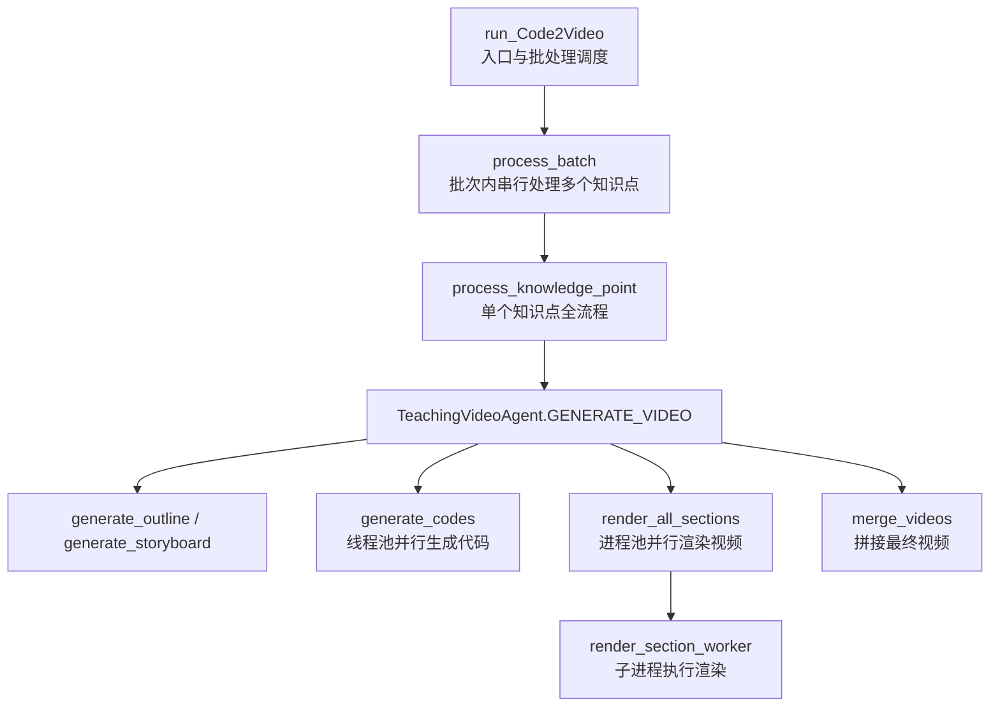
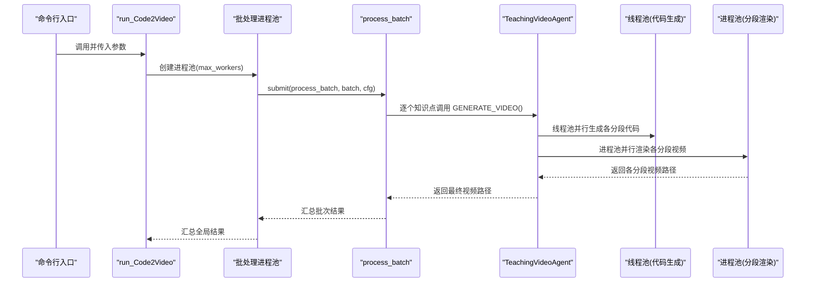
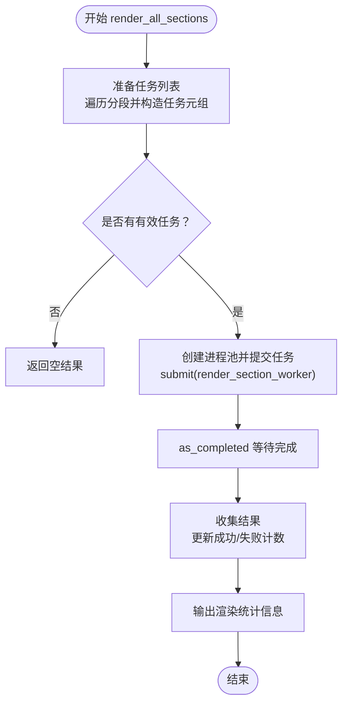
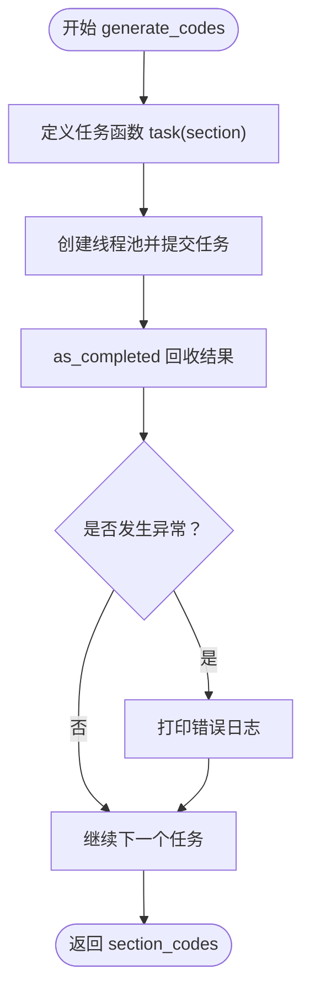
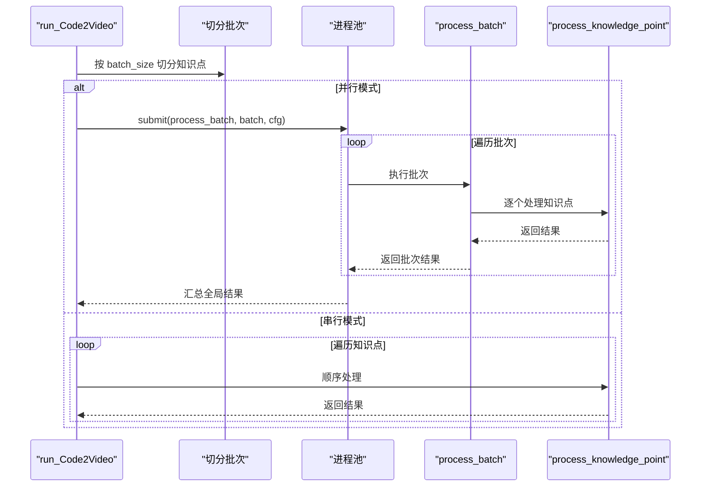
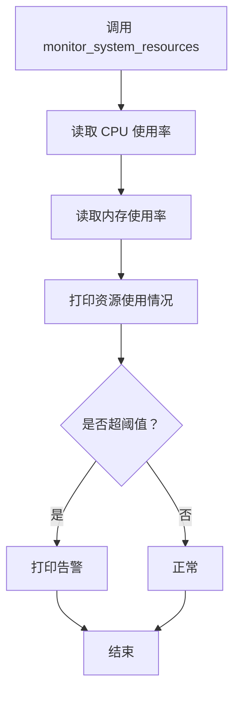
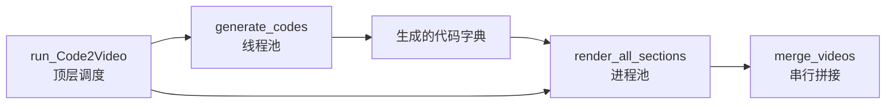

# 并行处理

<cite>
**本文引用的文件列表**
- [agent.py](file://src/agent.py)
- [utils.py](file://src/utils.py)
</cite>

## 目录
1. [引言](#引言)
2. [项目结构](#项目结构)
3. [核心组件](#核心组件)
4. [架构总览](#架构总览)
5. [详细组件分析](#详细组件分析)
6. [依赖关系分析](#依赖关系分析)
7. [性能考量](#性能考量)
8. [故障排查指南](#故障排查指南)
9. [结论](#结论)
10. [附录](#附录)

## 引言
本技术文档聚焦于系统在“批量渲染”场景下的并行处理机制，围绕以下关键点展开：
- render_all_sections 方法中 ProcessPoolExecutor 的使用：包括 max_workers 参数配置、任务分发与结果收集流程。
- generate_codes 方法中 ThreadPoolExecutor 在“代码生成阶段”的并行优化。
- 结合 run_Code2Video 函数中的批量处理逻辑，阐述串行与并行模式的选择策略。
- 性能监控建议：通过 monitor_system_resources 实时跟踪 CPU 与内存使用。
- 提供可操作的实践建议，指导用户根据硬件环境调整工作进程数量。

## 项目结构
本项目采用“功能模块化 + 工具库”的组织方式，核心并行逻辑集中在 agent.py 中，通用工具函数集中在 utils.py 中。整体流程从“知识点”到“视频”的端到端执行由 run_Code2Video 驱动，内部通过批处理与多进程/线程池实现高效并行。

图表来源
- [agent.py](file://src/agent.py#L760-L913)
- [agent.py](file://src/agent.py#L518-L717)
- [agent.py](file://src/agent.py#L596-L717)

章节来源
- [agent.py](file://src/agent.py#L760-L913)

## 核心组件
- TeachingVideoAgent：负责从“教学大纲”到“视频”的完整流水线，包含代码生成、调试修复、MLLM 反馈优化、分段渲染与合并等步骤。
- ProcessPoolExecutor：用于跨进程并行渲染，适合 CPU 密集型的 Manim 渲染任务。
- ThreadPoolExecutor：用于同进程内的线程并行，加速“代码生成”阶段（LLM 请求与解析）。
- run_Code2Video：顶层调度器，支持串行与并行两种模式；并行模式下按 batch 切分，再对 batch 进行并发处理。

章节来源
- [agent.py](file://src/agent.py#L518-L717)
- [agent.py](file://src/agent.py#L596-L717)
- [agent.py](file://src/agent.py#L760-L913)

## 架构总览
系统采用“两级并行”设计：
- 第一级：run_Code2Video 将多个知识点划分为若干 batch，并行处理多个 batch（进程池）。
- 第二级：每个 batch 内部串行处理多个知识点，但每个知识点内部的“代码生成”阶段使用线程池并行；“渲染”阶段使用进程池并行。

图表来源
- [agent.py](file://src/agent.py#L760-L913)
- [agent.py](file://src/agent.py#L518-L717)
- [agent.py](file://src/agent.py#L596-L717)

## 详细组件分析

### render_all_sections：进程池并行渲染
该方法将“分段渲染”作为独立任务提交给进程池，每个任务在独立进程中执行 render_section_worker，从而充分利用多核 CPU 并行渲染。

- 任务准备
  - 遍历 self.sections，构造任务数据元组（包含分段对象、类类型、可序列化状态），加入待执行队列。
  - 若无有效任务则直接返回空结果。
- 任务提交
  - 使用 ProcessPoolExecutor(max_workers=...) 提交 render_section_worker 任务。
  - 为每个 future 建立“future -> 分段ID”的映射，便于结果回填。
- 结果收集
  - 使用 as_completed 顺序等待完成，获取 (分段ID, 成功标志, 视频路径)。
  - 对成功结果更新 self.section_videos，并统计成功/失败计数。
  - 统一输出渲染统计信息（总数、成功率）。
- 错误处理
  - 单个任务提交失败或执行异常均计入失败计数并打印告警。
  - 外层 try-except 捕获进程池初始化/提交阶段的异常。

图表来源
- [agent.py](file://src/agent.py#L596-L717)

章节来源
- [agent.py](file://src/agent.py#L596-L717)

### generate_codes：线程池并行生成代码
该方法在“代码生成”阶段使用 ThreadPoolExecutor，将多个分段的 LLM 请求与解析并行化，缩短整体等待时间。

- 任务封装
  - 定义内部 task(section)：调用 generate_section_code 并返回 (分段ID, 异常)。
- 执行与回收
  - 使用 ThreadPoolExecutor(max_workers=6) 提交所有任务。
  - 使用 as_completed 顺序回收结果，遇到异常打印错误日志。
- 返回值
  - 返回 self.section_codes 字典，供后续渲染阶段使用。

图表来源
- [agent.py](file://src/agent.py#L518-L525)

章节来源
- [agent.py](file://src/agent.py#L518-L525)

### run_Code2Video：串行与并行模式选择
该函数作为顶层调度器，支持串行与并行两种模式，并内置批处理策略：

- 并行模式
  - 将知识点列表按 batch_size 切分为多个批次。
  - 使用 ProcessPoolExecutor(max_workers=...) 并行处理多个批次，每个批次内部串行处理。
  - 每个批次通过 process_batch 包装，返回批次索引与批次结果。
- 串行模式
  - 直接按顺序处理每个知识点，适用于小规模或资源受限场景。
- 统计汇总
  - 计算成功运行数量、平均耗时与平均 token 消耗，输出总体统计。

图表来源
- [agent.py](file://src/agent.py#L760-L913)

章节来源
- [agent.py](file://src/agent.py#L760-L913)

### 性能监控：monitor_system_resources
该函数通过 psutil 实时采集 CPU 与内存使用率，便于在大规模渲染时观察系统负载，及时发现过载风险。

- 功能要点
  - 采样间隔短（0.1 秒），避免阻塞主流程。
  - 当 CPU 使用率超过阈值或内存使用率超过阈值时打印告警提示。
  - 异常捕获保证监控不影响主流程稳定性。

图表来源
- [utils.py](file://src/utils.py#L73-L90)

章节来源
- [utils.py](file://src/utils.py#L73-L90)

## 依赖关系分析
- 并行执行器
  - ThreadPoolExecutor：用于 generate_codes 的“代码生成阶段”，提升 I/O 密集型（LLM 请求）吞吐。
  - ProcessPoolExecutor：用于 render_all_sections 的“分段渲染阶段”，利用多核 CPU 并行渲染。
- 任务边界
  - 代码生成与渲染属于不同阶段，分别采用线程池与进程池，避免 GIL 与进程隔离带来的开销。
- 批处理与顶层调度
  - run_Code2Video 将“知识点级”并行与“批次级”并行解耦，便于控制整体并发度与资源占用。

图表来源
- [agent.py](file://src/agent.py#L518-L717)
- [agent.py](file://src/agent.py#L596-L717)
- [agent.py](file://src/agent.py#L760-L913)

章节来源
- [agent.py](file://src/agent.py#L518-L717)
- [agent.py](file://src/agent.py#L596-L717)
- [agent.py](file://src/agent.py#L760-L913)

## 性能考量
- 进程池 vs 线程池选择
  - 渲染阶段（Manim）为 CPU 密集型，应使用进程池以绕过 GIL 并充分利用多核。
  - 代码生成阶段主要受网络 I/O 与模型响应影响，使用线程池可提升吞吐。
- worker 数量配置
  - render_all_sections 默认 max_workers=6，可根据 CPU 核心数动态调整。
  - run_Code2Video 的 batch 级并发由其进程池的 max_workers 控制，通常与 CPU 核心数相关。
  - utils.get_optimal_workers 提供自适应策略：优先取 CPU 核心数减一，高配机器限制最大并发以避免内存溢出。
- 资源监控
  - 在大规模渲染前/中调用 monitor_system_resources，观察 CPU 与内存使用，必要时降低并发度。
- I/O 与超时
  - render_all_sections 对 future.result 设置超时，避免个别任务卡死拖慢整体进度。
  - 合理设置 batch_size，避免单批次内任务过多导致上下文切换与锁竞争。

章节来源
- [agent.py](file://src/agent.py#L596-L717)
- [agent.py](file://src/agent.py#L760-L913)
- [utils.py](file://src/utils.py#L53-L90)

## 故障排查指南
- 渲染失败
  - render_all_sections 中对每个 future 的异常进行捕获与计数，同时打印告警；检查对应分段的代码生成与调试修复阶段是否成功。
- 代码生成异常
  - generate_codes 对每个线程任务的结果进行检查，若出现异常会打印错误日志；检查 LLM 接口可用性与网络状况。
- 进程池提交失败
  - render_all_sections 在提交任务时捕获异常并增加失败计数；检查任务数据构造是否正确、序列化状态是否可传递。
- 资源过载
  - 使用 monitor_system_resources 观察 CPU 与内存使用；必要时降低 max_workers 或 batch_size。
- 合并失败
  - merge_videos 使用 ffmpeg 拼接，若失败需检查视频列表文件与 ffmpeg 安装状态。

章节来源
- [agent.py](file://src/agent.py#L518-L717)
- [agent.py](file://src/agent.py#L596-L717)
- [utils.py](file://src/utils.py#L73-L90)

## 结论
本系统通过“线程池 + 进程池”的双层并行设计，在“代码生成”和“视频渲染”两个关键阶段分别优化吞吐与计算能力，结合批处理与顶层调度实现了高效的批量渲染。配合自适应 worker 数量与资源监控，可在不同硬件环境下取得稳定且高效的性能表现。

## 附录

### 实战建议：如何根据硬件环境调整 worker 数量
- CPU 核心数较少（≤8）
  - render_all_sections：max_workers 建议设置为 CPU 核心数减一（保留 1 核给系统）。
  - run_Code2Video：batch 级并发建议不超过 2~3，避免过度抢占。
- CPU 核心数较多（>8）
  - render_all_sections：可考虑使用 get_optimal_workers 自动计算最优值，或手动设置为 CPU 核心数减一。
  - run_Code2Video：batch 级并发可适当提高至 3~5，但仍需结合内存与 I/O 能力评估。
- 高负载/内存紧张
  - 降低 max_workers，或限制 batch_size，减少同时渲染的视频数量。
- 开启资源监控
  - 在渲染前/中定期调用 monitor_system_resources，观察 CPU 与内存使用，必要时动态降速。

章节来源
- [utils.py](file://src/utils.py#L53-L90)
- [agent.py](file://src/agent.py#L760-L913)
- [agent.py](file://src/agent.py#L596-L717)