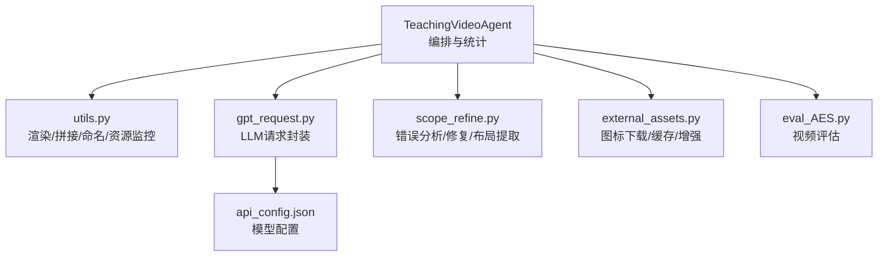
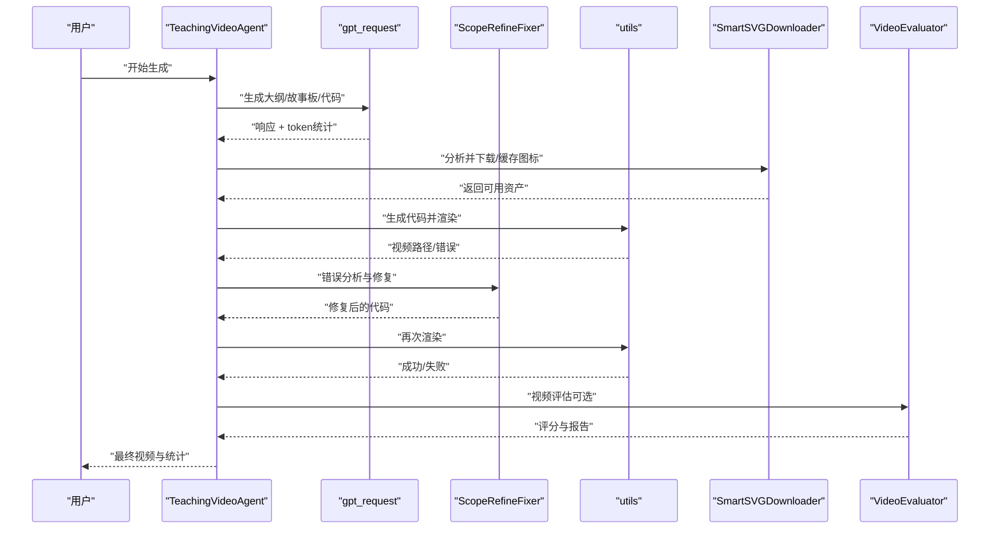
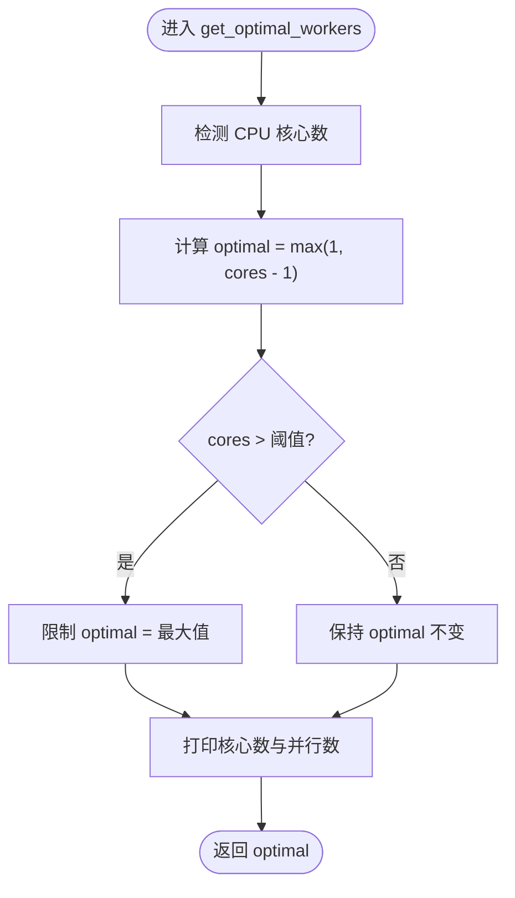
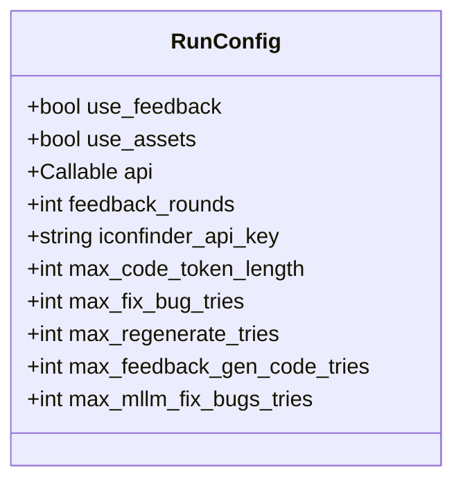
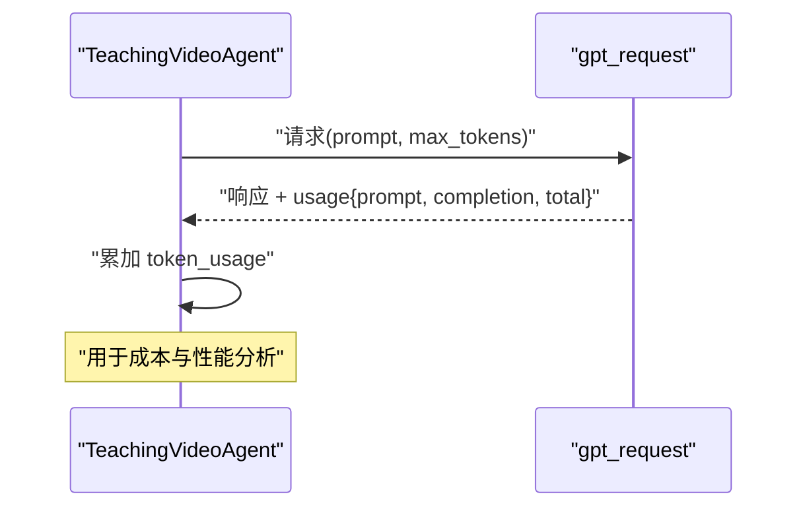
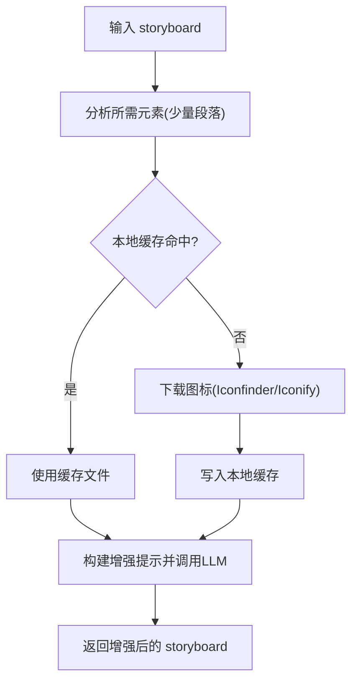
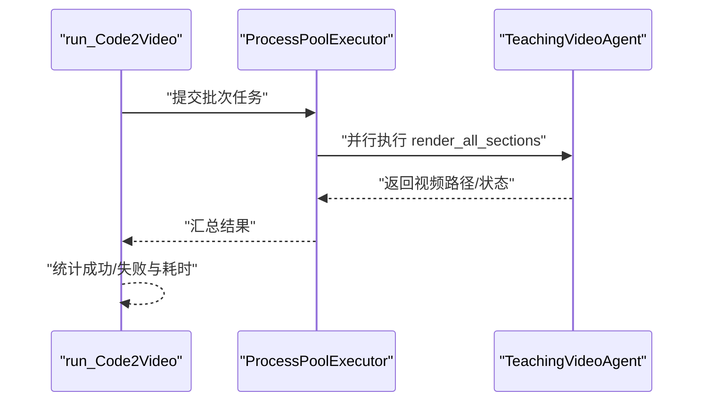
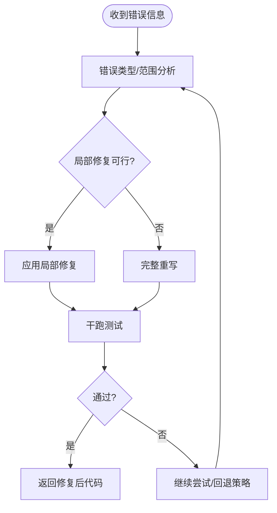
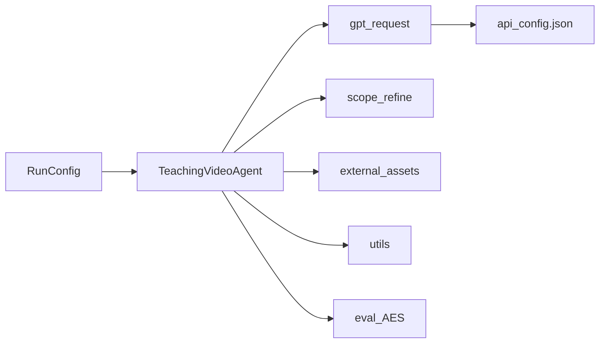

# 性能优化

<cite>
**本文引用的文件**
- [src/utils.py](file://src/utils.py)
- [src/gpt_request.py](file://src/gpt_request.py)
- [src/agent.py](file://src/agent.py)
- [src/scope_refine.py](file://src/scope_refine.py)
- [src/external_assets.py](file://src/external_assets.py)
- [src/api_config.json](file://src/api_config.json)
- [src/run_agent.sh](file://src/run_agent.sh)
- [src/run_agent_single.sh](file://src/run_agent_single.sh)
- [src/eval_AES.py](file://src/eval_AES.py)
</cite>

## 目录
1. [引言](#引言)
2. [项目结构](#项目结构)
3. [核心组件](#核心组件)
4. [架构总览](#架构总览)
5. [详细组件分析](#详细组件分析)
6. [依赖关系分析](#依赖关系分析)
7. [性能考量](#性能考量)
8. [故障排查指南](#故障排查指南)
9. [结论](#结论)
10. [附录](#附录)

## 引言
本技术文档聚焦于视频生成流水线中的性能优化策略，系统梳理影响生成效率的关键因素，并给出可操作的调优方法。重点覆盖以下方面：
- 动态工作进程数：get_optimal_workers 如何基于 CPU 核心数自适应选择并限制并发，避免内存溢出与系统过载。
- 参数权衡：RunConfig 中 max_code_token_length 与 feedback_rounds 对生成质量与速度的影响及调优建议。
- LLM 调用参数优化：通过 temperature、max_tokens 等参数在稳定性和吞吐量之间取得平衡。
- 资源缓存：外部图标下载的本地缓存策略，减少重复网络请求。
- 大规模部署：API 频率控制、GPU/进程并行调度、批处理优化与成本控制。
- 性能监控：利用 token_usage 统计进行瓶颈定位与容量规划。

## 项目结构
整体采用“代理-请求-工具-评估”分层组织，核心流程为：代理生成教学大纲与故事板，调用 LLM 生成代码，渲染视频，MLLM 反馈优化，最终合并视频。关键文件职责如下：
- utils.py：通用工具（动态工作进程、资源监控、Manim 渲染、视频拼接、命名安全化等）
- gpt_request.py：多模型统一请求封装，含重试、指数退避、token 使用统计
- agent.py：主流程编排（大纲/故事板/代码/渲染/反馈/合并），参数配置与统计
- scope_refine.py：错误分析与修复、网格布局提取与修改
- external_assets.py：智能图标下载与缓存、资产增强提示构建
- api_config.json：各模型/服务的基础配置
- run_agent*.sh：批量运行脚本，设置默认超参
- eval_AES.py：视频质量评估（可作为性能后置验证）

图表来源
- [src/agent.py](file://src/agent.py#L1-L120)
- [src/utils.py](file://src/utils.py#L139-L174)
- [src/gpt_request.py](file://src/gpt_request.py#L1-L120)
- [src/scope_refine.py](file://src/scope_refine.py#L1-L120)
- [src/external_assets.py](file://src/external_assets.py#L1-L120)
- [src/eval_AES.py](file://src/eval_AES.py#L1-L80)
- [src/api_config.json](file://src/api_config.json#L1-L40)

章节来源
- [src/agent.py](file://src/agent.py#L1-L120)
- [src/utils.py](file://src/utils.py#L139-L174)
- [src/gpt_request.py](file://src/gpt_request.py#L1-L120)
- [src/scope_refine.py](file://src/scope_refine.py#L1-L120)
- [src/external_assets.py](file://src/external_assets.py#L1-L120)
- [src/eval_AES.py](file://src/eval_AES.py#L1-L80)
- [src/api_config.json](file://src/api_config.json#L1-L40)

## 核心组件
- 动态工作进程：get_optimal_workers 基于 CPU 核心数计算最优并行进程数，高配机器限制最大值以避免内存压力。
- 请求封装：gpt_request 提供多模型统一接口，内置指数退避重试与 token 使用统计，便于成本与性能双监控。
- 编排器：TeachingVideoAgent 将流程拆分为大纲、故事板、代码、渲染、反馈、合并六个阶段，支持多轮反馈与并行渲染。
- 错误修复：ScopeRefineFixer 通过多阶段修复与干跑测试，降低渲染失败率，提升吞吐。
- 资产增强：SmartSVGDownloader 智能分析所需元素，先查本地缓存再按需下载，减少网络开销。
- 评估与报告：eval_AES 提供并行评估能力与评分汇总，辅助性能回归验证。

章节来源
- [src/utils.py](file://src/utils.py#L53-L71)
- [src/gpt_request.py](file://src/gpt_request.py#L1-L120)
- [src/agent.py](file://src/agent.py#L43-L55)
- [src/scope_refine.py](file://src/scope_refine.py#L250-L371)
- [src/external_assets.py](file://src/external_assets.py#L1-L120)
- [src/eval_AES.py](file://src/eval_AES.py#L1-L80)

## 架构总览
下图展示从知识点到最终视频的端到端流程，以及关键性能控制点（并行、缓存、重试、统计）。

图表来源
- [src/agent.py](file://src/agent.py#L138-L210)
- [src/gpt_request.py](file://src/gpt_request.py#L1-L120)
- [src/scope_refine.py](file://src/scope_refine.py#L483-L573)
- [src/utils.py](file://src/utils.py#L139-L174)
- [src/external_assets.py](file://src/external_assets.py#L1-L120)
- [src/eval_AES.py](file://src/eval_AES.py#L1-L80)

## 详细组件分析

### 动态工作进程：get_optimal_workers
- 目标：在保证系统稳定的同时最大化吞吐，避免 CPU/内存过载。
- 策略：
  - 优先使用 CPU 核心数减一作为并行度，保留 1 个核心用于系统与其它任务。
  - 当核心数超过阈值时，限制最大并行度，防止内存溢出。
  - 打印检测到的核心数与实际使用的并行数，便于运维观察。
- 适用场景：渲染阶段（ProcessPoolExecutor）与批量任务（ProcessPoolExecutor）。

图表来源
- [src/utils.py](file://src/utils.py#L53-L71)

章节来源
- [src/utils.py](file://src/utils.py#L53-L71)

### RunConfig 参数与权衡
- max_code_token_length：控制一次请求生成的代码长度上限，直接影响 LLM 输出复杂度与 token 成本。较长的代码可能提升质量但增加成本与时间；较短的代码更易控制，但可能牺牲细节。
- feedback_rounds：MLLM 反馈优化的轮次。更多轮次通常带来更高质量的视频，但显著增加 API 调用次数与总耗时。建议在质量与成本间折中，例如 2 轮为常见起点。
- 其他关键参数：
  - max_regenerate_tries/max_feedback_gen_code_tries/max_mllm_fix_bugs_tries：决定失败重试与修复尝试次数，影响稳定性与总时间。
  - use_feedback/use_assets：是否启用反馈与资产增强，前者提升质量但增加评估与调用，后者提升视觉效果但增加网络与存储。

图表来源
- [src/agent.py](file://src/agent.py#L43-L55)

章节来源
- [src/agent.py](file://src/agent.py#L43-L55)

### LLM 调用参数优化实践
- max_tokens：控制单次响应的最大 token 数，直接决定生成长度与成本。建议：
  - 代码生成阶段：根据 max_code_token_length 控制，避免过长导致超时或成本过高。
  - 评估/反馈阶段：适度提高以获得更完整的 JSON 结构与建议，但注意总 token 上限。
- temperature：控制采样随机性。较低温度更稳定、可复现；较高温度更具创造性但不稳定。建议：
  - 代码生成：使用较低温度，确保一致性与可调试性。
  - 评估/反馈：可适当提高以获得多样化建议，但需配合 max_tokens 限制。
- 重试与退避：gpt_request 内置指数退避与抖动，避免瞬时峰值导致的失败放大，提升整体成功率与稳定性。
- token 统计：所有请求封装均返回 usage 信息，TeachingVideoAgent 自动累加 prompt/completion/total tokens，便于成本与性能双监控。

图表来源
- [src/agent.py](file://src/agent.py#L115-L133)
- [src/gpt_request.py](file://src/gpt_request.py#L1-L120)

章节来源
- [src/agent.py](file://src/agent.py#L115-L133)
- [src/gpt_request.py](file://src/gpt_request.py#L1-L120)

### 资源缓存机制：外部图标下载
- 智能分析：仅对首尾少量段落进行资产需求分析，减少不必要的 API 调用。
- 本地缓存：先查本地缓存命中，未命中才发起网络请求。
- 多源回退：Iconfinder 失败时自动回退至 Iconify，提高成功率。
- 资产增强：将可用资产路径注入到故事板动画描述中，指导后续代码生成。

图表来源
- [src/external_assets.py](file://src/external_assets.py#L1-L120)
- [src/external_assets.py](file://src/external_assets.py#L128-L193)

章节来源
- [src/external_assets.py](file://src/external_assets.py#L1-L120)
- [src/external_assets.py](file://src/external_assets.py#L128-L193)

### 并行渲染与批处理优化
- 进程并行：render_all_sections 使用 ProcessPoolExecutor 并行渲染不同章节，显著缩短总时长。
- 批次控制：run_Code2Video 支持批次并行（多个批次同时执行），并通过随机延迟缓解 API 频率压力。
- 线程并行：generate_codes 使用 ThreadPoolExecutor 并行生成各章节代码，降低等待时间。
- 超时与统计：渲染过程设置超时，聚合成功/失败统计，便于快速定位问题。

图表来源
- [src/agent.py](file://src/agent.py#L596-L717)
- [src/agent.py](file://src/agent.py#L760-L800)

章节来源
- [src/agent.py](file://src/agent.py#L596-L717)
- [src/agent.py](file://src/agent.py#L760-L800)

### 错误修复与干跑测试
- 多阶段修复：先局部修复，再全面审查，最后完整重写，逐步提升修复成功率。
- 干跑测试：在不渲染视频的前提下快速验证语法与逻辑，提前发现潜在问题。
- 与 LLM 协作：通过结构化提示引导修复，减少无效迭代。

图表来源
- [src/scope_refine.py](file://src/scope_refine.py#L483-L573)
- [src/scope_refine.py](file://src/scope_refine.py#L518-L573)

章节来源
- [src/scope_refine.py](file://src/scope_refine.py#L483-L573)
- [src/scope_refine.py](file://src/scope_refine.py#L518-L573)

## 依赖关系分析
- 模块耦合：
  - agent.py 依赖 gpt_request、utils、scope_refine、external_assets，形成主流程闭环。
  - gpt_request 依赖 api_config.json 提供模型配置，内部封装统一的请求与统计。
  - external_assets 依赖 prompts（通过 get_prompt_* 函数）与网络接口，实现资产增强。
- 关键依赖链：
  - RunConfig → TeachingVideoAgent → gpt_request → api_config.json
  - TeachingVideoAgent → scope_refine → gpt_request
  - TeachingVideoAgent → external_assets → gpt_request

图表来源
- [src/agent.py](file://src/agent.py#L43-L55)
- [src/gpt_request.py](file://src/gpt_request.py#L1-L120)
- [src/api_config.json](file://src/api_config.json#L1-L40)
- [src/scope_refine.py](file://src/scope_refine.py#L1-L120)
- [src/external_assets.py](file://src/external_assets.py#L1-L120)
- [src/utils.py](file://src/utils.py#L139-L174)
- [src/eval_AES.py](file://src/eval_AES.py#L1-L80)

章节来源
- [src/agent.py](file://src/agent.py#L43-L55)
- [src/gpt_request.py](file://src/gpt_request.py#L1-L120)
- [src/api_config.json](file://src/api_config.json#L1-L40)
- [src/scope_refine.py](file://src/scope_refine.py#L1-L120)
- [src/external_assets.py](file://src/external_assets.py#L1-L120)
- [src/utils.py](file://src/utils.py#L139-L174)
- [src/eval_AES.py](file://src/eval_AES.py#L1-L80)

## 性能考量
- CPU/内存与并行度
  - 使用 get_optimal_workers 动态确定并行度，避免过度并行导致内存不足。
  - 在高核数服务器上显式限制最大并行度，防止渲染队列堆积。
- LLM 调用成本与稳定性
  - 合理设置 max_tokens 与 temperature，在质量与成本之间平衡。
  - 利用指数退避与抖动提升成功率，减少重试风暴。
- 渲染与 I/O
  - 优先使用低质量预览参数进行快速验证，正式渲染再切换到高质量。
  - 合理安排视频拼接与中间文件清理，避免磁盘空间压力。
- 资源复用
  - 启用外部资产缓存，减少重复下载与网络波动。
  - 对热点知识点建立本地缓存目录，缩短首次生成时间。
- 批处理与频率控制
  - 批次内串行、批次间并行，配合随机延迟缓解 API 限流。
  - 评估阶段限制并发线程数，避免 API 频率过高。
- 监控与分析
  - 通过 token_usage 统计总成本与各阶段消耗，识别瓶颈环节。
  - 记录渲染成功/失败率与平均耗时，持续优化参数与策略。

[本节为通用指导，无需列出具体文件来源]

## 故障排查指南
- 渲染失败
  - 使用 scope_refine 的干跑测试快速定位语法/逻辑问题。
  - 多轮修复与局部修复相结合，避免无效重试。
- API 调用异常
  - 检查指数退避是否生效，确认网络与鉴权配置。
  - 通过 token_usage 定位高成本阶段，必要时降低 max_tokens 或减少 feedback_rounds。
- 图标下载失败
  - 检查缓存目录权限与磁盘空间。
  - 回退到备用源（Iconify），或手动下载后放入缓存。
- 并发问题
  - 降低并行度或批次大小，观察系统资源使用率。
  - 设置合理的超时与重试上限，避免长时间阻塞。

章节来源
- [src/scope_refine.py](file://src/scope_refine.py#L341-L371)
- [src/agent.py](file://src/agent.py#L596-L717)
- [src/external_assets.py](file://src/external_assets.py#L128-L193)
- [src/gpt_request.py](file://src/gpt_request.py#L1-L120)

## 结论
通过动态工作进程、参数权衡、缓存与重试策略、并行渲染与批处理优化，以及 token_usage 统计监控，可以在保证生成质量的前提下显著提升整体吞吐与稳定性。建议在生产环境中：
- 默认启用反馈与资产增强，但根据预算与 SLA 调整 feedback_rounds 与 max_code_token_length。
- 使用 get_optimal_workers 与 run_Code2Video 的批处理模式，结合随机延迟与超时控制。
- 建立完善的缓存与日志体系，持续跟踪 token 使用与渲染成功率，迭代优化参数。

[本节为总结性内容，无需列出具体文件来源]

## 附录
- 常用脚本与默认参数
  - run_agent.sh：批量模式默认参数（如 max_code_token_length、feedback_rounds、并行组数等）。
  - run_agent_single.sh：单知识点模式默认参数与默认知识点。
- API 配置
  - api_config.json：包含各模型的 base_url、api_version、api_key、model 等基础配置，便于集中管理与切换。

章节来源
- [src/run_agent.sh](file://src/run_agent.sh#L1-L40)
- [src/run_agent_single.sh](file://src/run_agent_single.sh#L1-L49)
- [src/api_config.json](file://src/api_config.json#L1-L40)