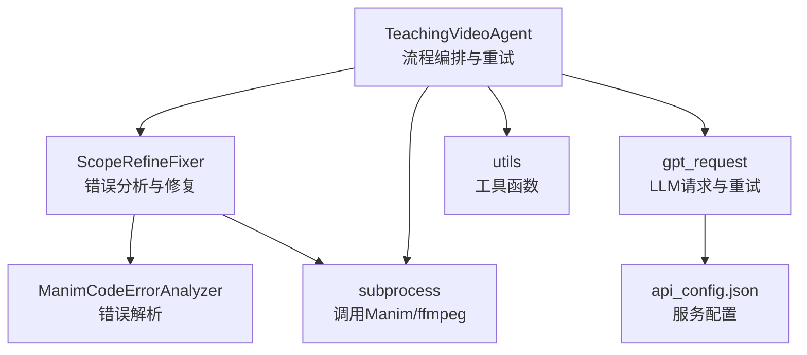
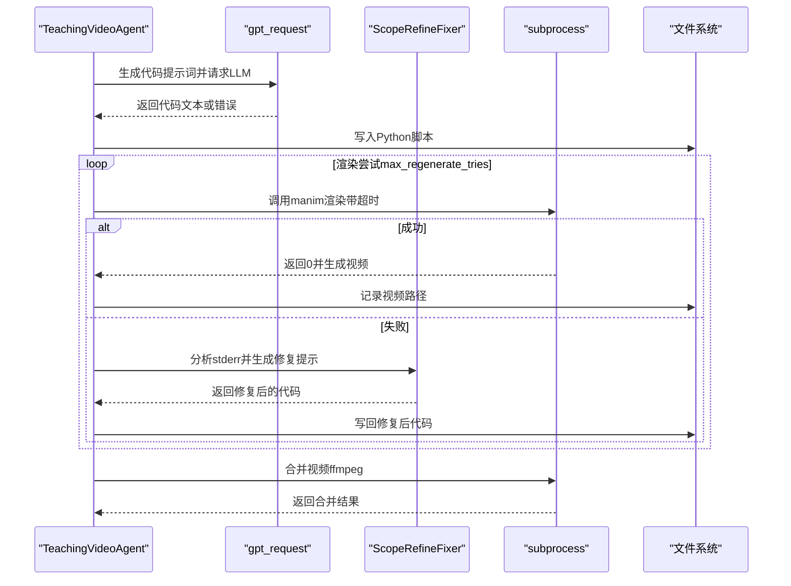
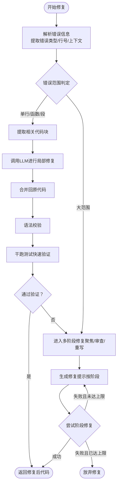
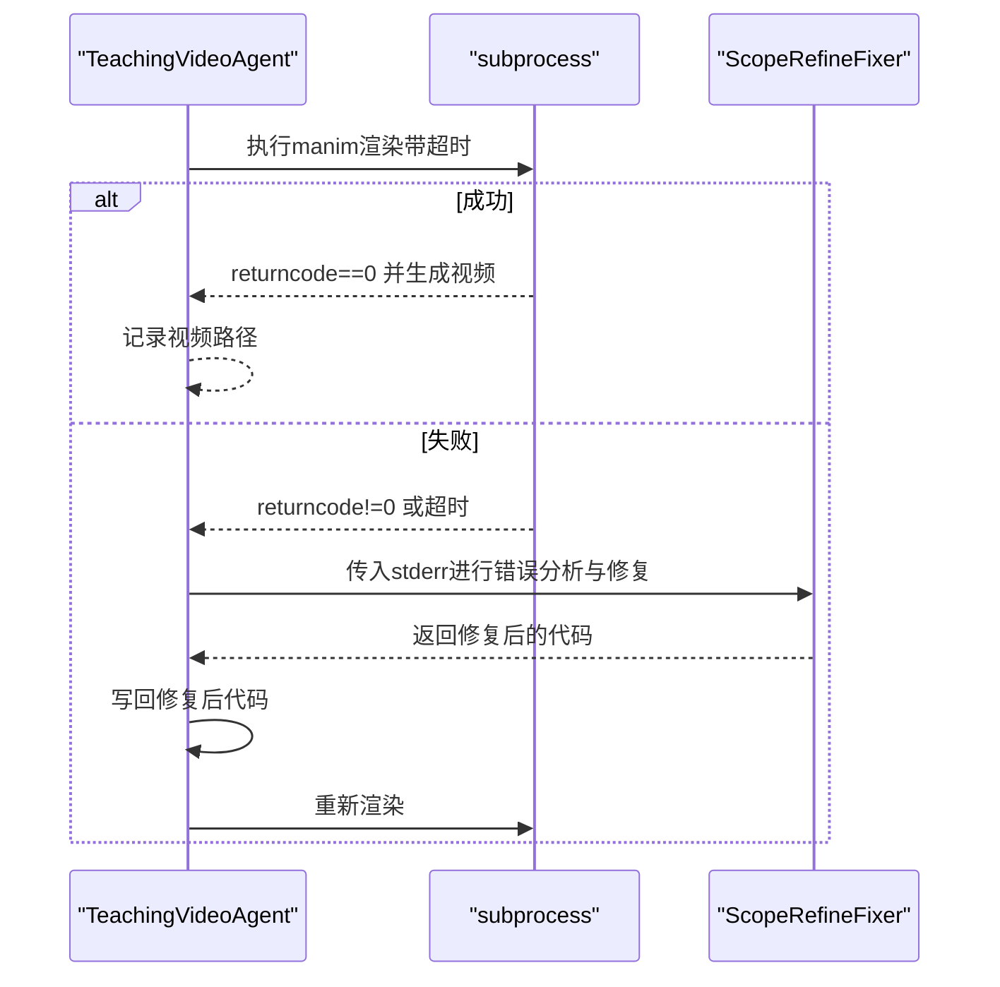
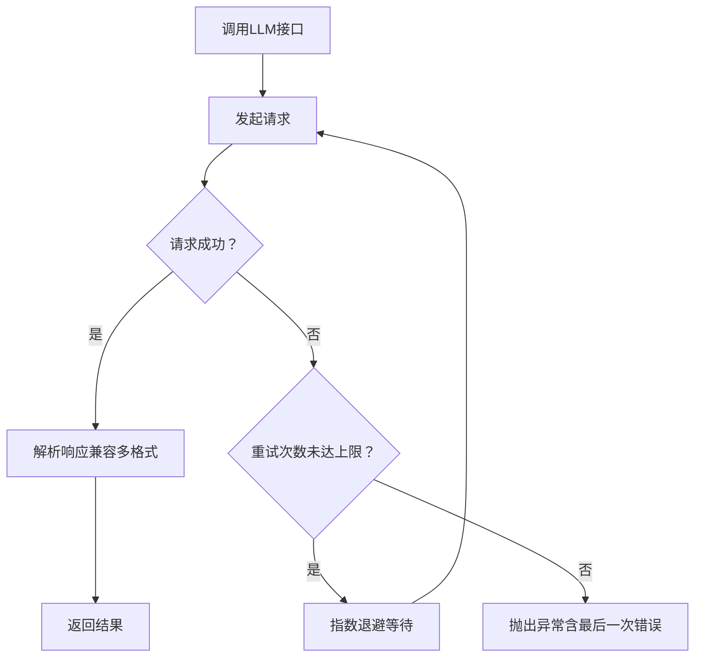
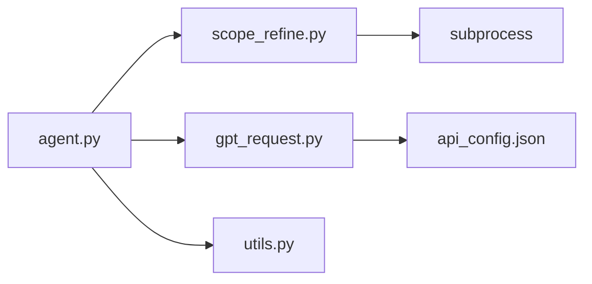

# 错误处理

<cite>
**本文引用的文件**
- [agent.py](file://src/agent.py)
- [scope_refine.py](file://src/scope_refine.py)
- [gpt_request.py](file://src/gpt_request.py)
- [utils.py](file://src/utils.py)
- [api_config.json](file://src/api_config.json)
</cite>

## 目录
1. [简介](#简介)
2. [项目结构](#项目结构)
3. [核心组件](#核心组件)
4. [架构总览](#架构总览)
5. [详细组件分析](#详细组件分析)
6. [依赖关系分析](#依赖关系分析)
7. [性能考量](#性能考量)
8. [故障排查指南](#故障排查指南)
9. [结论](#结论)

## 简介
本技术文档聚焦于系统在Manim代码生成与渲染失败时的错误处理与恢复策略，围绕以下关键点展开：
- TeachingVideoAgent中的重试参数max_regenerate_tries、max_fix_bug_tries等的作用机制与使用场景
- ScopeRefineFixer对编译/运行时错误的智能分析与修复流程
- debug_and_fix_code方法中结合subprocess调用Manim的异常捕获与超时控制
- LLM API调用失败时的退化策略（多轮重试、格式错误恢复）
- 常见错误类型（渲染超时、API配额耗尽、依赖缺失）的诊断与解决建议

## 项目结构
系统采用分层设计：Agent负责端到端流程编排与重试；ScopeRefine模块负责错误分析与修复；gpt_request封装LLM请求与指数退避重试；utils提供通用工具函数。

图表来源
- [agent.py](file://src/agent.py#L43-L114)
- [scope_refine.py](file://src/scope_refine.py#L1-L120)
- [gpt_request.py](file://src/gpt_request.py#L1-L120)
- [utils.py](file://src/utils.py#L1-L60)
- [api_config.json](file://src/api_config.json#L1-L50)

章节来源
- [agent.py](file://src/agent.py#L43-L114)
- [scope_refine.py](file://src/scope_refine.py#L1-L120)
- [gpt_request.py](file://src/gpt_request.py#L1-L120)
- [utils.py](file://src/utils.py#L1-L60)

## 核心组件
- TeachingVideoAgent：贯穿“大纲生成—故事板—代码生成—渲染—反馈优化—合并视频”的全流程，并内置多级重试与回退策略。
- ScopeRefineFixer：基于错误消息与上下文进行分类、定位与修复，支持局部修复与完整重写两条路径。
- gpt_request：统一的LLM请求封装，包含指数退避重试、日志追踪与令牌用量统计。
- utils：提供资源监控、文件操作、命令行调用等基础能力。

章节来源
- [agent.py](file://src/agent.py#L43-L114)
- [scope_refine.py](file://src/scope_refine.py#L250-L370)
- [gpt_request.py](file://src/gpt_request.py#L27-L121)
- [utils.py](file://src/utils.py#L138-L174)

## 架构总览
下图展示从代码生成到渲染的关键交互与错误处理路径：

图表来源
- [agent.py](file://src/agent.py#L356-L401)
- [agent.py](file://src/agent.py#L527-L581)
- [scope_refine.py](file://src/scope_refine.py#L398-L573)
- [utils.py](file://src/utils.py#L138-L174)

## 详细组件分析

### TeachingVideoAgent中的重试参数与恢复策略
- max_regenerate_tries：用于“大纲/故事板/代码生成”阶段的多轮重试，避免单次API波动导致失败。
- max_fix_bug_tries：用于单个Section渲染阶段的本地修复尝试次数，结合ScopeRefineFixer进行迭代修复。
- max_feedback_gen_code_tries：MLLM布局反馈驱动的代码再生成尝试次数。
- max_mllm_fix_bugs_tries：MLLM反馈驱动的Bug修复尝试次数。
- 使用位置与行为要点：
  - 生成大纲/故事板：循环尝试，失败则记录并最多重试指定次数，超过阈值抛出异常。
  - 生成代码：通过API请求获取代码文本，提取JSON并落盘；若失败返回空字符串，上层继续重试。
  - 渲染阶段：先尝试生成代码（可多次），再调用debug_and_fix_code进行修复与验证；若仍失败则跳过该Section。
  - MLLM反馈优化：根据布局问题建议，回滚原代码并重新生成，随后再次调试修复；失败则记录并继续。

章节来源
- [agent.py](file://src/agent.py#L43-L56)
- [agent.py](file://src/agent.py#L156-L181)
- [agent.py](file://src/agent.py#L223-L259)
- [agent.py](file://src/agent.py#L295-L355)
- [agent.py](file://src/agent.py#L527-L581)
- [agent.py](file://src/agent.py#L667-L702)

### ScopeRefineFixer：编译/运行时错误的智能修复
- 错误分析器（ManimCodeErrorAnalyzer）：
  - 解析错误类型、行号、列号、问题代码片段，提取相关上下文块（单行/函数/动画段）。
  - 针对NameError、AttributeError、TypeError、ImportError、SyntaxError等给出具体建议。
- 修复策略（ScopeRefineFixer）：
  - 局部修复优先：根据错误范围提取相关代码块，调用LLM进行精准修复，再合并回原代码。
  - 多阶段验证：语法校验→干跑测试（不生成视频，快速验证）→返回修复后代码。
  - 完整重写兜底：若局部修复失败，则生成多阶段修复提示（聚焦修复、全面审查、完全重写），逐次尝试直至成功或达到上限。
- 与Agent协作：
  - 在debug_and_fix_code中被调用，将stderr传入以驱动修复流程，并将修复后的代码写回文件。

图表来源
- [scope_refine.py](file://src/scope_refine.py#L18-L82)
- [scope_refine.py](file://src/scope_refine.py#L250-L370)
- [scope_refine.py](file://src/scope_refine.py#L398-L573)
- [scope_refine.py](file://src/scope_refine.py#L574-L670)

章节来源
- [scope_refine.py](file://src/scope_refine.py#L18-L82)
- [scope_refine.py](file://src/scope_refine.py#L250-L370)
- [scope_refine.py](file://src/scope_refine.py#L398-L573)
- [scope_refine.py](file://src/scope_refine.py#L574-L670)

### debug_and_fix_code：子进程调用与超时/异常处理
- 关键流程：
  - 以subprocess调用manim进行渲染，设置超时时间，避免长时间卡死。
  - 若返回码为0且检测到视频产物存在，则认为渲染成功。
  - 若失败，调用ScopeRefineFixer分析stderr并生成修复后的代码，写回文件后重试。
  - 捕获TimeoutExpired、其他异常并记录，超过最大尝试次数后返回失败。
- 与Agent协作：
  - render_section在多次重试后仍失败会跳过该Section，保证整体流程继续执行。

图表来源
- [agent.py](file://src/agent.py#L356-L401)
- [scope_refine.py](file://src/scope_refine.py#L398-L573)

章节来源
- [agent.py](file://src/agent.py#L356-L401)
- [scope_refine.py](file://src/scope_refine.py#L398-L573)

### LLM API调用失败的退化策略与格式恢复
- 统一重试机制：
  - gpt_request中所有模型请求均实现指数退避重试（含抖动），默认最多重试若干次。
  - 对于需要令牌用量统计的接口，返回usage信息，便于成本控制与审计。
- 格式错误恢复：
  - 代理层对API响应进行兼容性处理：优先读取candidates[0].content.parts[0].text，其次choices[0].message.content，最后回退为字符串。
  - 对Markdown包裹的JSON进行提取，确保后续解析稳定。
- 退化策略：
  - 当API连续失败达到阈值时，抛出明确异常；上层根据max_regenerate_tries等参数决定是否重试或终止。
  - 对于视频/图像多模态请求，若文件不存在会直接抛出异常，避免静默失败。

图表来源
- [gpt_request.py](file://src/gpt_request.py#L27-L121)
- [gpt_request.py](file://src/gpt_request.py#L124-L274)
- [gpt_request.py](file://src/gpt_request.py#L368-L479)
- [gpt_request.py](file://src/gpt_request.py#L482-L613)
- [gpt_request.py](file://src/gpt_request.py#L616-L740)
- [gpt_request.py](file://src/gpt_request.py#L743-L968)
- [agent.py](file://src/agent.py#L115-L133)
- [agent.py](file://src/agent.py#L223-L259)

章节来源
- [gpt_request.py](file://src/gpt_request.py#L27-L121)
- [gpt_request.py](file://src/gpt_request.py#L124-L274)
- [gpt_request.py](file://src/gpt_request.py#L368-L479)
- [gpt_request.py](file://src/gpt_request.py#L482-L613)
- [gpt_request.py](file://src/gpt_request.py#L616-L740)
- [gpt_request.py](file://src/gpt_request.py#L743-L968)
- [agent.py](file://src/agent.py#L115-L133)
- [agent.py](file://src/agent.py#L223-L259)

## 依赖关系分析
- TeachingVideoAgent依赖ScopeRefineFixer进行错误修复，依赖gpt_request进行代码生成与反馈分析，依赖utils进行系统资源监控与命令行调用。
- ScopeRefineFixer内部依赖subprocess调用manim进行干跑测试，依赖LLM接口进行修复提示生成。
- gpt_request依赖api_config.json读取各服务的base_url、api_key、model等配置。

图表来源
- [agent.py](file://src/agent.py#L1-L20)
- [scope_refine.py](file://src/scope_refine.py#L1-L20)
- [gpt_request.py](file://src/gpt_request.py#L1-L20)
- [utils.py](file://src/utils.py#L1-L20)
- [api_config.json](file://src/api_config.json#L1-L50)

章节来源
- [agent.py](file://src/agent.py#L1-L20)
- [scope_refine.py](file://src/scope_refine.py#L1-L20)
- [gpt_request.py](file://src/gpt_request.py#L1-L20)
- [utils.py](file://src/utils.py#L1-L20)
- [api_config.json](file://src/api_config.json#L1-L50)

## 性能考量
- 并发与资源：
  - 采用ProcessPoolExecutor并行渲染多个Section，同时通过get_optimal_workers动态确定最优并发数，避免CPU/Mem压力过大。
  - render_all_sections对每个任务设置超时，防止长尾任务阻塞。
- 渲染效率：
  - debug_and_fix_code中先进行干跑测试（快速退出），减少无效渲染开销。
  - 合并视频使用ffmpeg拼接，避免重复编码。
- LLM成本控制：
  - 统一使用带usage统计的接口，便于跟踪token消耗与成本预算。

章节来源
- [agent.py](file://src/agent.py#L596-L702)
- [utils.py](file://src/utils.py#L53-L71)
- [utils.py](file://src/utils.py#L138-L174)
- [gpt_request.py](file://src/gpt_request.py#L80-L121)

## 故障排查指南

### 渲染超时
- 现象：debug_and_fix_code中subprocess超时，或渲染长时间无响应。
- 排查步骤：
  - 检查manim命令是否正确（场景名、文件路径）。
  - 查看ScopeRefineFixer生成的修复提示是否合理，必要时降低动画复杂度。
  - 减少并发或提高超时阈值，观察系统资源占用。
- 参考实现位置：
  - [agent.py](file://src/agent.py#L356-L401)
  - [scope_refine.py](file://src/scope_refine.py#L398-L573)

### API配额耗尽/网络波动
- 现象：gpt_request抛出异常，或返回None但usage信息为空。
- 排查步骤：
  - 检查api_config.json中的服务配置是否正确。
  - 观察指数退避日志，确认是否因频繁重试导致限流。
  - 适当降低max_regenerate_tries、max_feedback_gen_code_tries等参数，缓解请求压力。
- 参考实现位置：
  - [gpt_request.py](file://src/gpt_request.py#L27-L121)
  - [gpt_request.py](file://src/gpt_request.py#L857-L968)
  - [api_config.json](file://src/api_config.json#L1-L50)

### 依赖缺失（模块导入错误）
- 现象：ScopeRefineFixer识别到ImportError或NameError，建议检查导入语句或变量声明。
- 排查步骤：
  - 根据错误类别与建议，补充缺失的from manim import语句或修正变量名。
  - 若为版本不兼容，参考修复提示调整API使用方式。
- 参考实现位置：
  - [scope_refine.py](file://src/scope_refine.py#L18-L82)
  - [scope_refine.py](file://src/scope_refine.py#L250-L370)

### 视频合并失败
- 现象：ffmpeg拼接失败，返回非零码或报错。
- 排查步骤：
  - 检查video_list.txt中路径是否正确，确认视频文件存在。
  - 确认ffmpeg可用且版本兼容。
- 参考实现位置：
  - [agent.py](file://src/agent.py#L667-L702)
  - [utils.py](file://src/utils.py#L163-L174)

### 常见错误代码与建议
- NameError/AttributeError：检查对象与属性是否匹配，参考修复建议。
- TypeError/ValueError：核对参数数量与类型，必要时简化逻辑。
- ImportError/SyntaxError/IndentationError：检查导入与语法，参考修复提示。
- 渲染超时：降低复杂度、减少并发、启用干跑测试。

章节来源
- [scope_refine.py](file://src/scope_refine.py#L18-L82)
- [scope_refine.py](file://src/scope_refine.py#L250-L370)
- [agent.py](file://src/agent.py#L667-L702)
- [utils.py](file://src/utils.py#L163-L174)

## 结论
本系统通过“参数化重试 + 智能错误分析 + 多阶段修复 + 统一LLM退避”的组合策略，有效提升了在Manim代码生成与渲染过程中的鲁棒性。TeachingVideoAgent作为编排核心，结合ScopeRefineFixer与gpt_request实现了从错误检测到自动修复再到回退的闭环；配合utils的资源监控与命令行工具，能够在复杂环境下保持稳定产出。建议在生产环境中：
- 合理设置max_regenerate_tries、max_fix_bug_tries等参数，平衡质量与成本。
- 为不同服务配置独立的重试上限与退避策略，避免相互影响。
- 在出现大规模失败时，优先检查API配置与网络连通性，再逐步缩小到代码层面的问题。