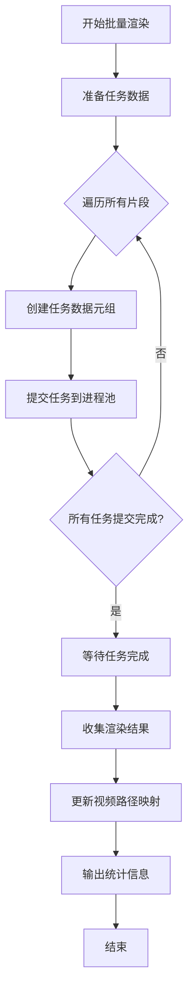
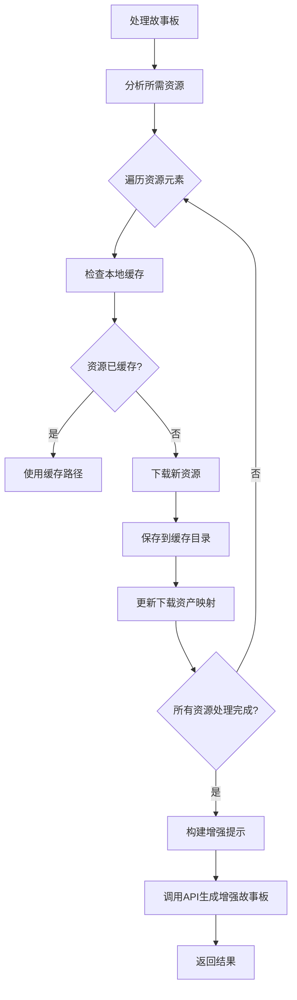
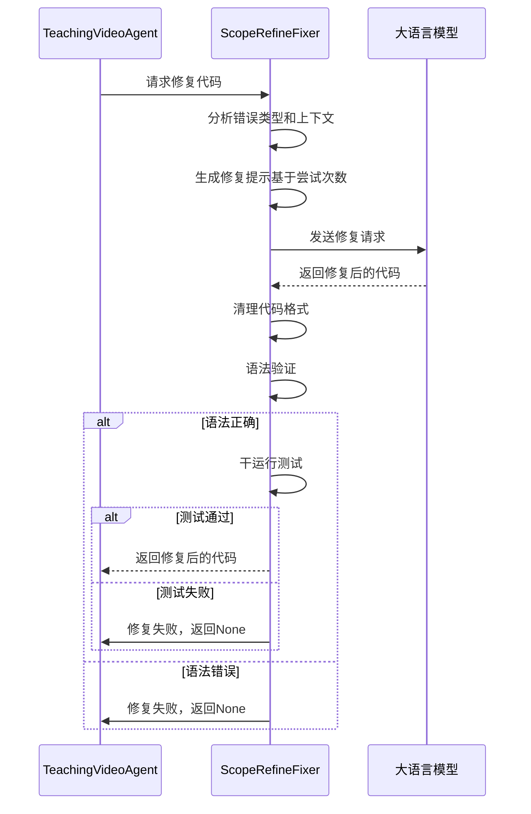

# 高级功能

<cite>
**本文档引用的文件**   
- [agent.py](file://src/agent.py)
- [gpt_request.py](file://src/gpt_request.py)
- [scope_refine.py](file://src/scope_refine.py)
- [external_assets.py](file://src/external_assets.py)
- [utils.py](file://src/utils.py)
</cite>

## 目录
1. [并行处理机制](#并行处理机制)
2. [资源缓存策略](#资源缓存策略)
3. [错误恢复流程](#错误恢复流程)
4. [性能调优技巧](#性能调优技巧)
5. [LLM调用参数优化](#llm调用参数优化)
6. [大规模部署策略](#大规模部署策略)

## 并行处理机制

系统通过多进程和线程池实现高效的批量渲染，以最大化利用计算资源。核心并行处理逻辑在`agent.py`中实现，通过`ProcessPoolExecutor`和`ThreadPoolExecutor`进行任务调度。

在`TeachingVideoAgent`类中，`render_all_sections`方法负责并行渲染所有视频片段。该方法将每个教学片段的渲染任务作为独立工作单元提交给进程池，从而实现真正的并行执行。每个工作单元包含完整的`TeachingVideoAgent`状态，确保进程间隔离。



**Diagram sources**
- [agent.py](file://src/agent.py#L596-L665)

**Section sources**
- [agent.py](file://src/agent.py#L596-L665)

## 资源缓存策略

系统通过`SmartSVGDownloader`类实现智能资源缓存机制，有效减少重复请求并提升加载速度。该机制在`external_assets.py`中定义，通过本地文件系统缓存已下载的SVG和PNG资源。

缓存策略的核心是`_check_cache`方法，它在下载新资源前首先检查本地缓存目录。如果资源已存在，则直接返回本地路径，避免重复下载。缓存目录结构为`assets/icon`，按资源名称存储。



**Diagram sources**
- [external_assets.py](file://src/external_assets.py#L17-L47)

**Section sources**
- [external_assets.py](file://src/external_assets.py#L10-L47)

## 错误恢复流程

系统实现了多层次的错误恢复机制，确保在Manim代码生成失败时能够自动重试和降级。核心逻辑在`scope_refine.py`中的`ScopeRefineFixer`类中实现。

错误恢复流程采用多阶段验证策略，根据重试次数调整修复策略。首次尝试进行聚焦修复，第二次尝试进行全面审查，第三次尝试则进行完全重写。这种渐进式策略提高了修复成功率。



**Diagram sources**
- [scope_refine.py](file://src/scope_refine.py#L518-L566)

**Section sources**
- [scope_refine.py](file://src/scope_refine.py#L518-L572)

## 性能调优技巧

系统提供了多种性能监控和优化建议，帮助用户了解系统运行状况并进行针对性优化。性能监控主要集中在渲染阶段的耗时统计和资源使用情况。

在`utils.py`中，`monitor_system_resources`函数提供了实时的系统资源监控，包括CPU和内存使用率。同时，`get_optimal_workers`函数根据CPU核心数动态计算最优的并行工作进程数，避免资源过度竞争。

```mermaid
flowchart TD
A[开始性能监控] --> B[获取CPU核心数]
B --> C[计算最优工作进程数]
C --> D[设置工作进程数为max(1, CPU核心数-1)]
D --> E{CPU核心数>16?}
E --> |是| F[限制工作进程数为16]
E --> |否| G[使用计算值]
F --> H[输出配置信息]
G --> H
H --> I[开始渲染任务]
I --> J[定期监控资源使用]
J --> K{资源使用过高?}
K --> |是| L[发出警告]
K --> |否| M[继续监控]
M --> N[任务完成]
```

**Diagram sources**
- [utils.py](file://src/utils.py#L53-L70)

**Section sources**
- [utils.py](file://src/utils.py#L53-L88)

## LLM调用参数优化

系统通过调整LLM调用参数来优化生成质量，主要参数包括最大令牌长度、重试次数和反馈轮数。这些参数在`RunConfig`数据类中定义，并通过命令行参数进行配置。

关键参数包括：
- `max_code_token_length`: 最大代码令牌长度，控制生成代码的复杂度
- `max_regenerate_tries`: 最大重新生成尝试次数，影响生成稳定性
- `feedback_rounds`: 反馈轮数，控制质量优化迭代次数
- `max_fix_bug_tries`: 最大修复bug尝试次数，影响错误恢复能力

这些参数的优化需要在生成质量、稳定性和成本之间进行权衡。例如，增加`feedback_rounds`可以提高视频质量，但也会显著增加API调用成本和生成时间。

**Section sources**
- [agent.py](file://src/agent.py#L44-L55)

## 大规模部署策略

系统支持大规模部署，通过批量处理和资源调度实现高效运行。核心部署策略在`run_Code2Video`函数中实现，支持并行和串行两种处理模式。

在并行模式下，知识点被分组为批次，每个批次在独立进程中处理。批次大小和最大工作进程数可通过参数配置，实现资源使用的精细控制。系统还实现了随机延迟机制，避免API调用过于密集。

资源调度策略包括：
- 动态工作进程数：根据CPU核心数自动调整
- 批量处理：将任务分组以提高效率
- 随机延迟：在批次间添加随机等待时间
- 错误隔离：单个任务失败不影响整体流程

成本控制策略包括：
- 令牌使用跟踪：精确记录每个任务的令牌消耗
- 失败重试限制：避免无限重试导致成本失控
- 并行度控制：平衡速度和资源消耗
- 缓存机制：减少重复的API调用和资源下载

**Section sources**
- [agent.py](file://src/agent.py#L760-L798)