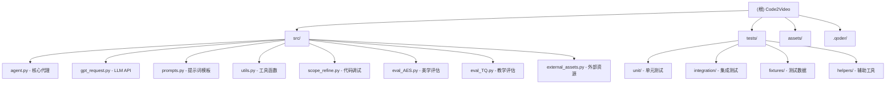

# Code2Video 项目文档

> 更新时间：2026-02-21 15:30:00

## 项目愿景

Code2Video 是一个 AI 驱动的教学视频生成系统，能够将知识主题自动转换为高质量的教学动画视频。系统使用大语言模型（LLM）来理解知识内容，生成教学大纲、故事板，并最终使用 Manim 动画框架渲染为精美的数学/科学教学视频。

## 架构总览



## 模块索引

| 模块 | 路径 | 职责 | 关键类/函数 |
|------|------|------|-------------|
| **核心代理** | `src/agent.py` | 视频生成主流程编排 | `TeachingVideoAgent`, `Section`, `RunConfig` |
| **LLM 请求** | `src/gpt_request.py` | 多API调用封装 | `request_claude`, `request_gemini`, `request_gemini_with_video` |
| **提示词** | `src/prompts.py` | 教学大纲/故事板/代码生成提示 | `get_prompt1_outline`, `get_prompt2_storyboard`, `get_prompt3_code` |
| **工具函数** | `src/utils.py` | 视频处理、资源监控 | `extract_answer_from_response`, `get_optimal_workers`, `stitch_videos` |
| **代码调试** | `src/scope_refine.py` | Manim 错误分析与修复 | `ManimCodeErrorAnalyzer`, `ScopeRefineFixer` |
| **美学评估** | `src/eval_AES.py` | 视频美学质量评估 | `VideoEvaluator`, `EvaluationResult` |
| **教学评估** | `src/eval_TQ.py` | 教学效果评估 | `SelectiveKnowledgeUnlearning`, `Question` |
| **外部资源** | `src/external_assets.py` | 图标/图片下载管理 | `SmartSVGDownloader`, `process_storyboard_with_assets` |
| **单元测试** | `tests/unit/` | 核心功能测试 | `test_agent.py`, `test_utils.py`, `test_eval_aes.py` |
| **集成测试** | `tests/integration/` | 端到端工作流测试 | `test_agent_workflow.py`, `test_evaluation_system.py` |

## 运行与开发

### 环境要求
- Python 3.13+
- Manim 0.19.0
- FFmpeg（视频处理）

### 依赖安装
```bash
pip install -r src/requirements.txt
```

### 运行单个视频生成
```bash
cd src
python -c "from agent import TeachingVideoAgent; agent = TeachingVideoAgent(0, '你的知识主题'); agent.GENERATE_VIDEO()"
```

### 运行测试
```bash
# 使用 pytest
python -m pytest tests/ -v

# 使用测试运行器
python tests/test_runner.py test
```

## 测试策略

项目采用分层测试架构：

1. **单元测试** (`tests/unit/`)：验证核心函数和类的正确性
   - `test_agent.py` - 核心代理功能测试
   - `test_utils.py` - 工具函数测试
   - `test_eval_aes.py` - 美学评估测试
   - `test_eval_tq.py` - 教学质量评估测试

2. **集成测试** (`tests/integration/`)：验证完整工作流
   - `test_agent_workflow.py` - 端到端视频生成流程
   - `test_evaluation_system.py` - 评估系统集成

3. **测试工具**：
   - `tests/conftest.py` - pytest 配置和共享 fixture
   - `tests/fixtures/sample_data.py` - 测试数据工厂
   - `tests/helpers/mock_objects.py` - Mock 对象
   - `tests/test_runner.py` - Python 测试运行器
   - `tests/report_generator.py` - 测试报告生成

## 编码规范

- 使用类型注解（`typing` 模块）
- 数据类使用 `@dataclass` 装饰器
- 错误处理使用重试机制（指数退避）
- 异步/并行处理使用 `concurrent.futures`
- 日志记录使用 `logging` 模块

## AI 使用指引

### 核心工作流
1. **大纲生成**：使用 LLM 根据知识主题生成教学大纲
2. **故事板设计**：将大纲转换为可视化故事板
3. **代码生成**：使用 LLM 生成 Manim 动画代码
4. **代码调试**：自动修复 Manim 代码错误
5. **视频渲染**：使用 Manim 渲染视频片段
6. **视频合成**：合并所有片段为最终视频
7. **质量评估**：使用多模态 LLM 评估视频质量

### 支持的 LLM API
- Claude (claude-4-opus)
- Gemini (gemini-2.5-pro)
- GPT-4o, GPT-4.1, GPT-5, O4-mini

## 变更记录

### 2026-02-21 15:30 - 文档覆盖率提升
- 完成所有核心模块文档（8个src模块 + 测试框架）
- 添加详细API文档和使用示例
- 更新Mermaid结构图
- **文档覆盖率：~95%**

### 2026-02-21 - 初始化
- 创建 Code2Video 项目 AI 上下文文档
- 完成项目结构扫描和模块识别
- 建立测试套件文档（单元测试 + 集成测试）
- 识别核心模块：agent.py, gpt_request.py, prompts.py, eval_AES.py, eval_TQ.py

---

*本文档由 AI 自动生成，基于项目当前代码结构。*
