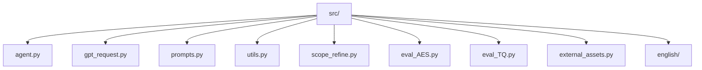
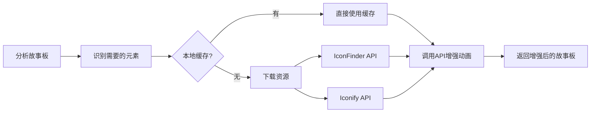

# 核心代理模块 (agent.py)

> [根目录](../CLAUDE.md) > **src**

## 模块概览

`src/` 目录包含 Code2Video 项目的所有核心业务逻辑模块：



---

## 模块索引

| 模块 | 职责 | 关键类/函数 |
|------|------|-------------|
| [agent.py](#agentpy-核心代理) | 视频生成主流程编排 | `TeachingVideoAgent`, `Section`, `RunConfig` |
| [gpt_request.py](#gpt_requestpy-多api调用) | 多LLM API调用封装 | `request_claude`, `request_gemini`, `request_gemini_with_video` |
| [prompts.py](#promptspy-提示词模板) | 教学大纲/故事板/代码生成提示 | `get_prompt1_outline`, `get_prompt2_storyboard` |
| [utils.py](#utilspy-工具函数) | 视频处理、资源监控 | `extract_answer_from_response`, `get_optimal_workers` |
| [scope_refine.py](#scope_refinepy-代码调试) | Manim 错误分析与修复 | `ManimCodeErrorAnalyzer`, `ScopeRefineFixer` |
| [eval_AES.py](#eval_aespy-美学评估) | 视频美学质量评估 | `VideoEvaluator`, `EvaluationResult` |
| [eval_TQ.py](#eval_tqpy-教学评估) | 教学效果评估 | `SelectiveKnowledgeUnlearning`, `Question` |
| [external_assets.py](#external_assetspy-外部资源) | 外部资源下载与管理 | `SmartSVGDownloader`, `process_storyboard_with_assets` |
| [english/](#english-英语教学) | 英语语法教学视频生成 | `EnglishTeachingVideoAgent`, `GrammarPoint` |

## 入口与启动

### 核心类：TeachingVideoAgent

```python
from agent import TeachingVideoAgent

# 初始化代理
agent = TeachingVideoAgent(
    idx=0,
    knowledge_point="欧拉公式 e^ix = cos(x) + i*sin(x)",
    folder="CASES",
    cfg=RunConfig()
)

# 生成完整视频
agent.GENERATE_VIDEO()
```

### 主要方法

| 方法 | 职责 |
|------|------|
| `generate_outline()` | 生成教学大纲 |
| `generate_storyboard()` | 创建故事板 |
| `generate_section_code()` | 生成单章节 Manim 代码 |
| `debug_and_fix_code()` | 调试并修复代码错误 |
| `render_all_sections()` | 渲染所有视频片段 |
| `merge_videos()` | 合并视频片段 |
| `get_mllm_feedback()` | 获取多模态 LLM 反馈 |
| `optimize_with_feedback()` | 根据反馈优化视频 |
| `GENERATE_VIDEO()` | 主入口：执行完整流程 |

## 数据模型

### Section（章节）
```python
@dataclass
class Section:
    id: str                    # 章节ID
    title: str                 # 章节标题
    lecture_lines: List[str]   # 讲解文本
    animations: List[str]      # 动画描述
```

### TeachingOutline（教学大纲）
```python
@dataclass
class TeachingOutline:
    topic: str                 # 主题
    target_audience: str      # 目标受众
    sections: List[Dict]       # 章节列表
```

### VideoFeedback（视频反馈）
```python
@dataclass
class VideoFeedback:
    section_id: str
    video_path: str
    has_issues: bool
    suggested_improvements: List[str]
    raw_response: Optional[str]
```

### RunConfig（运行配置）
```python
@dataclass
class RunConfig:
    use_feedback: bool = True
    use_assets: bool = True
    api: Callable = None
    feedback_rounds: int = 2
    iconfinder_api_key: str = ""
    max_code_token_length: int = 10000
    max_fix_bug_tries: int = 10
    max_regenerate_tries: int = 10
    max_feedback_gen_code_tries: int = 3
    max_mllm_fix_bugs_tries: int = 3
```

## 关键依赖

- **gpt_request**: LLM API 调用
- **prompts**: 提示词模板
- **utils**: 工具函数（视频处理、路径处理）
- **scope_refine**: Manim 代码错误分析
- **external_assets**: 外部资源处理
- **manim**: 动画渲染
- **moviepy**: 视频合成

## 代码调试模块 (scope_refine.py)

> [根目录](../../CLAUDE.md) > [src](./CLAUDE.md) > **scope_refine**

### 模块职责

`scope_refine.py` 是 Code2Video 项目的智能代码调试模块，负责分析和修复 Manim 代码错误。它包含三个核心组件：错误分析器、修复器和网格位置管理器。

### 核心类

#### 1. ManimCodeErrorAnalyzer - Manim 代码错误分析器

智能分析 Manim 代码错误并准确定位问题。

```python
from scope_refine import ManimCodeErrorAnalyzer

analyzer = ManimCodeErrorAnalyzer()
error_info = analyzer.analyze_error(code, error_msg)
```

**支持的错误类型：**
| 错误类型 | 分析方法 |
|---------|---------|
| NameError | `_analyze_name_error()` - 识别未定义变量 |
| AttributeError | `_analyze_attribute_error()` - 分析对象属性错误 |
| TypeError | `_analyze_type_error()` - 分析类型错误 |
| ValueError | `_analyze_value_error()` - 分析值错误 |
| ImportError | `_analyze_import_error()` - 分析导入错误 |
| SyntaxError | `_analyze_syntax_error()` - 分析语法错误 |
| IndentationError | `_analyze_indentation_error()` - 分析缩进错误 |

**返回的错误信息结构：**
```python
{
    "error_type": str,           # 错误类型
    "line_number": int,          # 行号
    "column": int,               # 列号
    "problematic_code": str,     # 问题代码
    "context_lines": List[str],  # 上下文行
    "suggested_fix": str,        # 建议修复方案
    "fix_scope": str,            # 修复范围: single_line/function/section
    "relevant_code_block": str,  # 相关代码块
}
```

#### 2. ScopeRefineFixer - 作用域修复器

智能修复代码错误，支持本地修复和完整重写。

```python
from scope_refine import ScopeRefineFixer

fixer = ScopeRefineFixer(
    gpt_request_func=gpt_request,
    MAX_CODE_TOKEN_LENGTH=10000
)

fixed_code = fixer.fix_code_smart(section_id, code, error_msg, output_dir)
```

**主要方法：**

| 方法 | 职责 |
|------|------|
| `classify_error()` | 分类错误并提供修复建议 |
| `extract_error_context()` | 提取错误上下文信息 |
| `validate_code_syntax()` | 验证代码语法正确性 |
| `dry_run_test()` | 执行干运行测试（不渲染视频） |
| `fix_code_smart()` | 智能修复：优先本地修复，失败则完整重写 |
| `fix_code_with_multi_stage_validation()` | 多阶段验证修复 |

**修复策略（按尝试次数）：**
- **Attempt 1 (focused_fix)**: 仅修复特定错误，保持原代码结构
- **Attempt 2 (comprehensive_review)**: 全面审查，检查所有 API 兼容性
- **Attempt 3 (complete_rewrite)**: 完全重写，使用更简单稳健的方法

#### 3. GridPositionExtractor - 网格位置提取器

从 Manim 代码中提取网格位置信息。

```python
from scope_refine import GridPositionExtractor

extractor = GridPositionExtractor()
positions = extractor.extract_grid_positions(code)
table = extractor.generate_position_table(positions)
```

**支持的方法：**
- `place_at_grid(obj, position, scale_factor)` - 放置到单个网格
- `place_in_area(obj, start_pos, end_pos)` - 放置到区域

**网格系统：** A-F (列) × 1-6 (行)

#### 4. GridCodeModifier - 网格代码修改器

根据反馈修改网格位置代码。

```python
from scope_refine import GridCodeModifier

modifier = GridCodeModifier(original_code)
modified_code = modifier.apply_grid_modifications(modifications)
```

### 数据模型

#### GridPosition（网格位置）
```python
@dataclass
class GridPosition:
    object_name: str           # 对象名称
    method: str               # 方法: 'place_at_grid' 或 'place_in_area'
    position: str             # 位置: 'B2' 或 'A1-C3'
    scale_factor: Optional[float]  # 缩放因子
    line_number: int          # 行号
    original_code: str        # 原始代码
```

### 工作流程

```
错误发生 → ManimCodeErrorAnalyzer 分析
           ↓
        ScopeRefineFixer 决策
           ↓
    ┌─────┴─────┐
    ↓           ↓
本地修复     完整重写
    ↓           ↓
语法验证   多阶段验证
    ↓           ↓
干运行测试  (最多3次)
    ↓
修复成功 / 失败
```

## gpt_request.py - 多API调用

> [根目录](../CLAUDE.md) > [src](./CLAUDE.md) > **gpt_request**

### 模块职责

`gpt_request.py` 是 Code2Video 项目的多LLM API调用封装模块，支持Claude、Gemini、GPT系列等多种大语言模型，并提供重试机制和Token统计功能。

### 核心函数

#### 1. 文本API调用

| 函数 | 模型 | 用途 |
|------|------|------|
| `request_claude()` | claude-4-opus | 通用文本生成 |
| `request_claude_token()` | claude-4-opus | 带Token统计 |
| `request_gemini()` | gemini-2.5-pro | 通用文本生成 |
| `request_gemini_token()` | gemini-2.5-pro | 带Token统计 |
| `request_gpt4o()` | gpt-4o | 通用文本生成 |
| `request_gpt4o_token()` | gpt-4o | 带Token统计 |
| `request_gpt41()` | gpt-4.1 | GPT-4.1模型 |
| `request_gpt5()` | gpt-5 | GPT-5模型 |
| `request_o4mini()` | o4-mini | 推理模型 |

#### 2. 多模态API调用

```python
# 视频+文本多模态调用
response = request_gemini_with_video(
    prompt="请评估这个教学视频",
    video_path="/path/to/video.mp4",
    max_tokens=10000
)

# 视频+图像+文本多模态调用
response = request_gemini_video_img(
    prompt="请比较参考图和视频内容",
    video_path="/path/to/video.mp4",
    image_path="/path/to/image.png"
)
```

#### 3. 通用API接口

```python
# 统一的通用接口
from gpt_request import request_api

response = request_api(
    prompt="你的问题",
    model="gpt-4o-mini",  # 自动选择模型
    max_tokens=2000,
    temperature=0.7
)
```

### 通用配置函数

```python
# 从环境变量或配置文件读取配置
base_url = cfg("claude", "base_url")
api_key = cfg("claude", "api_key")

# 生成日志ID
log_id = generate_log_id()  # 返回: "tkb1234567890"
```

### 重试机制

所有API函数都内置**指数退避+抖动**重试机制：

```python
delay = (2**retry_count) * 0.1 + (random.random() * 0.1)
time.sleep(delay)
```

---

## prompts.py - 提示词模板

> [根目录](../CLAUDE.md) > [src](./CLAUDE.md) > **prompts**

### 模块职责

`prompts.py` 提供用于生成教学视频内容的各种提示词模板，涵盖从大纲生成到代码生成的完整流程。

### 提示词函数列表

| 函数 | 用途 | 返回格式 |
|------|------|---------|
| `get_prompt1_outline()` | 生成教学大纲 | JSON |
| `get_prompt2_storyboard()` | 生成故事板 | JSON |
| `get_prompt3_code()` | 生成Manim代码 | Python |
| `get_prompt4_feedback()` | 获取MLLM反馈 | JSON |
| `get_prompt5_debug()` | 调试和修复代码 | Python |
| `get_prompt6_assets()` | 外部资源建议 | JSON |
| `get_prompt_download_assets()` | 下载资源分析 | JSON |
| `get_prompt_place_assets()` | 资源放置指导 | JSON |

### 使用示例

```python
from prompts import get_prompt1_outline, get_prompt2_storyboard, get_prompt3_code

# 1. 生成大纲
outline_prompt = get_prompt1_outline(
    topic="微积分基础",
    target_audience="大学生"
)

# 2. 生成故事板
storyboard_prompt = get_prompt2_storyboard(
    topic="微积分基础",
    sections=[...]
)

# 3. 生成代码
code_prompt = get_prompt3_code(
    section={"id": "1", "title": "导数", ...},
    base_class="Scene",
    regenerate_note=""
)
```

---

## utils.py - 工具函数

> [根目录](../CLAUDE.md) > [src](./CLAUDE.md) > **utils**

### 模块职责

`utils.py` 提供项目常用的工具函数，包括视频处理、路径处理、资源监控等。

### 核心函数

#### 1. 视频处理

```python
# 使用FFmpeg拼接多个视频
from utils import stitch_videos

stitch_videos(
    video_files=["video1.mp4", "video2.mp4"],
    output_path="final_output.mp4"
)
```

#### 2. 资源监控

```python
# 获取最优并行工作数
from utils import get_optimal_workers

workers = get_optimal_workers()  # 根据CPU核心数自动计算

# 监控系统资源
from utils import monitor_system_resources

monitor_system_resources()
# 输出: 📊 Resource usage: CPU 45.2% | Memory 62.1%
```

#### 3. 代码处理

```python
# 提取JSON从Markdown
from utils import extract_json_from_markdown

json_str = extract_json_from_markdown("```json {...} ```")

# 提取API响应内容
content = extract_answer_from_response(response)

# 修复PNG路径
fixed_code = fix_png_path(code_str, assets_dir)

# 替换基类
new_code = replace_base_class(code, "class NewScene(ThreeDScene):")
```

#### 4. 路径处理

```python
# 知识主题转安全文件名
safe_name = topic_to_safe_name("欧拉公式 e^ix = cos(x) + i*sin(x)")
# 返回: "欧拉公式_eix_cosx_isinx"

# 获取输出目录
output_dir = get_output_dir(idx=0, knowledge_point="主题", base_dir="CASES")
# 返回: Path("CASES/0-主题")

# 构建评估视频列表
video_list = eva_video_list(knowledge_points=[...], base_dir="CASES")
```

---

## eval_AES.py - 美学评估

> [根目录](../CLAUDE.md) > [src](./CLAUDE.md) > **eval_AES**

### 模块职责

`eval_AES.py` 提供视频美学质量评估功能，使用多模态LLM（Gemini）从多个维度评估教学视频的质量。

### 核心类：VideoEvaluator

```python
from eval_AES import VideoEvaluator
from gpt_request import request_gemini_with_video

evaluator = VideoEvaluator(request_gemini_with_video)

# 评估单个视频
result = evaluator.evaluate_video(
    video_path="/path/to/video.mp4",
    knowledge_point="导数的定义"
)
```

### 评估维度

| 维度 | 权重 | 描述 |
|------|------|------|
| element_layout | 20% | 元素布局合理性 |
| attractiveness | 20% | 视觉吸引力 |
| logic_flow | 20% | 逻辑流程清晰度 |
| accuracy_depth | 20% | 知识准确性与深度 |
| visual_consistency | 20% | 视觉一致性 |

### 数据模型

```python
@dataclass
class EvaluationResult:
    element_layout: float        # 元素布局分数
    attractiveness: float        # 吸引力分数
    logic_flow: float           # 逻辑流程分数
    accuracy_depth: float       # 准确性深度分数
    visual_consistency: float   # 视觉一致性分数
    overall_score: float        # 总分 (满分100)
    detailed_feedback: str      # 详细反馈
    knowledge_point: str        # 知识主题
```

### 批量评估

```python
# 并行批量评估
video_list = [
    {"path": "video1.mp4", "knowledge_point": "导数"},
    {"path": "video2.mp4", "knowledge_point": "积分"}
]

results = evaluator.evaluate_video_batch(
    video_list=video_list,
    max_workers=3,
    use_parallel=True
)

# 生成评估报告
report = evaluator.generate_evaluation_report(results, output_path="report.md")
```

---

## eval_TQ.py - 教学评估

> [根目录](../CLAUDE.md) > [src](./CLAUDE.md) > **eval_TQ**

### 模块职责

`eval_TQ.py` 实现选择性知识遗忘(SKU)评估框架，通过测试评估教学视频的学习效果。

### 核心类：SelectiveKnowledgeUnlearning

```python
from eval_TQ import SelectiveKnowledgeUnlearning, load_questions_from_json

sku = SelectiveKnowledgeUnlearning(mllm_api_function=text_api)

# 评估教学视频
result = sku.evaluate_educational_video(
    concept="导数",
    questions=questions,
    video_api_fn=video_api
)
```

### 评估流程

```
┌─────────────────┐
│  Step 1: 基线   │  测试未学习前的知识水平
└────────┬────────┘
         ↓
┌─────────────────┐
│ Step 2: 遗忘   │  触发LLM的"知识遗忘"
└────────┬────────┘
         ↓
┌─────────────────┐
│ Step 3: 视频学习│  观看教学视频后
└────────┬────────┘
         ↓
    计算学习增益
```

### 数据模型

```python
@dataclass
class Question:
    question: str           # 问题文本
    options: List[str]      # 选项列表
    correct_answer: str     # 正确答案
    difficulty: str         # 难度: easy/medium/hard

@dataclass
class EvaluationResult:
    concept: str            # 概念/知识点
    pre_unlearning_score: float   # 学习前分数
    post_unlearning_score: float  # 遗忘后分数
    post_video_score: float       # 视频学习后分数
    unlearning_success: bool       # 遗忘是否成功
    learning_gain: float          # 学习增益
```

### 统计分析

```python
# 生成评估报告（含统计显著性分析）
report = format_evaluation_report(results)
# 输出包括:
# - 各概念详细结果
# - 学习增益分布 (μ, σ)
# - t检验结果 (t, p值)
# - 效应量 (Cohen's d)
# - 95%置信区间
```

---

## external_assets.py - 外部资源

> [根目录](../CLAUDE.md) > [src](./CLAUDE.md) > **external_assets**

### 模块职责

`external_assets.py` 提供外部资源（图标、图片）下载与管理功能，支持IconFinder和Iconify等资源库。

### 核心类：SmartSVGDownloader

```python
from external_assets import SmartSVGDownloader, process_storyboard_with_assets

downloader = SmartSVGDownloader(
    assets_dir="./assets/icon",
    api_function=request_gpt41_token,
    iconfinder_api_key="your_api_key"
)

# 处理故事板并下载资源
enhanced_storyboard = downloader.process_storyboard(storyboard)
```

### 资源下载流程



### 支持的资源格式

- **PNG**: 通过IconFinder下载
- **SVG**: 通过Iconify下载

### 缓存机制

```python
# 自动检查本地缓存
cached = downloader._check_cache("robot")
# 如果 assets/robot.png 存在，直接返回路径
```

## 测试

对应测试文件：`tests/unit/test_agent.py`

---

## english - 英语教学

> [根目录](../CLAUDE.md) > [src](./CLAUDE.md) > **english**

### 模块职责

`english/` 子模块专门用于生成英语语法教学视频，继承自主模块并针对英语教学场景进行了优化。

### 模块结构

```
english/
├── __init__.py          # 模块初始化
├── agent.py            # 英语教学代理
├── models.py           # 数据模型
├── prompts.py          # 英语教学提示词
└── templates.py        # 语法动画模板
```

### 核心类

#### EnglishTeachingVideoAgent

继承自 `TeachingVideoAgent`，专门用于生成英语语法教学视频。

```python
from src.english.agent import EnglishTeachingVideoAgent, create_english_grammar_video

# 方式 1：直接创建
agent = EnglishTeachingVideoAgent(
    idx=0,
    grammar_topic="Present Perfect Tense",
    target_audience="ESL students",
    cfg=RunConfig()
)
agent.generate_video()

# 方式 2：便捷函数
agent = create_english_grammar_video(
    grammar_topic="Present Perfect Tense",
    target_audience="ESL students",
    api_func=request_claude
)
```

### 数据模型

```python
from english.models import GrammarSection, GrammarPoint, GrammarTopic, EnglishSentence

# 语法点
point = GrammarPoint(
    id="1",
    title="Subject-Verb Agreement",
    rule="Subject and verb must agree in number",
    examples=["She goes to school.", "They play football."]
)

# 语法章节
section = GrammarSection(
    id="1",
    title="Introduction",
    lecture_lines=["Today we learn Present Perfect"],
    animations=["Show timeline"]
)
```

### 英语专用提示词

```python
from english.prompts import (
    get_english_grammar_outline,
    get_english_grammar_storyboard,
    get_english_grammar_code,
)

# 生成英语语法大纲
prompt = get_english_grammar_outline(
    grammar_topic="Present Perfect Tense",
    target_audience="ESL students"
)
```

### 语法动画模板

```python
from english.templates import GrammarAnimationTemplates, COMMON_GRAMMAR_TEMPLATES

# 使用预置模板
template = COMMON_GRAMMAR_TEMPLATES["passive_voice"]

# 或使用通用模板
code = GrammarAnimationTemplates.sentence_structure_template(
    sentence="She eats apples",
    components={"subject": "She", "verb": "eats", "object": "apples"}
)
```

### 支持的语法类型

| 语法 | 模板 |
|------|------|
| 一般现在时 | `present_simple` |
| 一般过去时 | `past_simple` |
| 现在完成时 | `present_perfect` |
| 被动语态 | `passive_voice` |
| 比较级/最高级 | `comparative` |

### 颜色编码规范

英语语法动画使用统一的颜色编码：

- **蓝色 (BLUE)**: 主语 (Subject)
- **绿色 (GREEN)**: 动词 (Verb)
- **黄色 (YELLOW)**: 宾语 (Object)
- **紫色 (PURPLE)**: 修饰语 (Modifier)

---

*最后更新：2026-02-21 15:30*


<claude-mem-context>
# Recent Activity

<!-- This section is auto-generated by claude-mem. Edit content outside the tags. -->

### Feb 21, 2026

| ID | Time | T | Title | Read |
|----|------|---|-------|------|
| #5529 | 5:41 PM | 🔵 | External asset processing entry point identified | ~288 |
| #5500 | 5:32 PM | 🔴 | Fixed parameter name mismatch in get_prompt_download_assets call | ~241 |
</claude-mem-context>